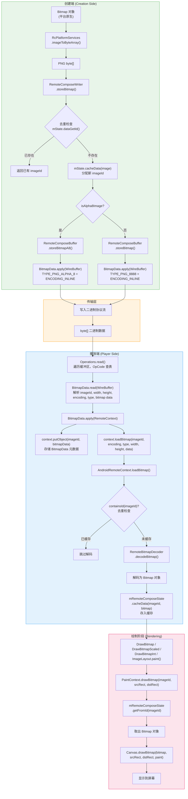
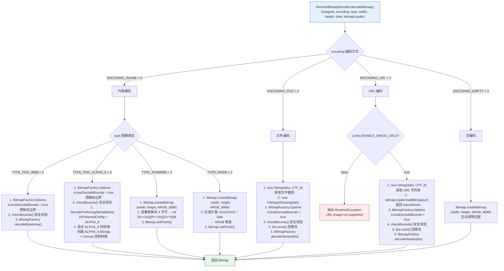
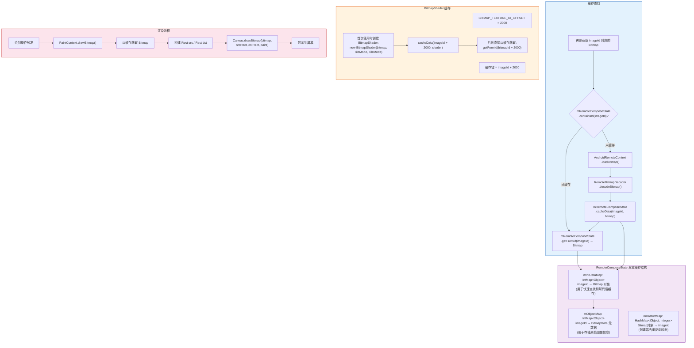

# Remote Compose Player 图像资源流程文档

## 概述

本文档详细描述了 Remote Compose Player 从 ByteArray 中检索图像资源并显示到屏幕上的完整端到端流程。整个生命周期涵盖四个核心阶段：

1. **编码写入阶段**：创建端将平台 Bitmap 对象编码为 PNG/RAW 字节数组，通过 `BitmapData` 操作写入二进制协议流。
2. **协议解析阶段**：播放端从二进制流中读取 `BitmapData` 操作，解析出图像元数据（ID、尺寸、编码方式、类型）和原始字节数据。
3. **解码缓存阶段**：根据编码方式和图像类型，将字节数组解码为 Android `Bitmap` 对象，并存入 `RemoteComposeState` 双重缓存。
4. **渲染显示阶段**：绘制操作通过 `PaintContext` 从缓存中取出 Bitmap，调用 Canvas API 绘制到屏幕。

---

## 2. 总体数据流图



---

## 3. 解码决策流程图



---

## 4. 缓存与渲染流程图



---

## 5. 各阶段详细文字说明

### 5.1 编码写入阶段

#### 操作码与协议

`BitmapData` 的操作码为 `Operations.DATA_BITMAP`（OpCode = **101**），属于数据操作类。在二进制协议中，图像数据以如下字段布局写入：

| 字段序号 | 类型 | 字段名 | 说明 |
|---------|------|--------|------|
| 1 | INT | imageId | 图像的唯一标识符 |
| 2 | INT | widthAndType | 高 16 位为 type，低 16 位为 width |
| 3 | INT | heightAndEncoding | 高 16 位为 encoding，低 16 位为 height |
| 4 | BYTE_ARRAY | bitmap | 编码后的图像字节数据 |

其中 `widthAndType` 和 `heightAndEncoding` 的编码方式为：

```java
int w = (((int) type) << 16) | width;   // type 占高16位，width 占低16位
int h = (((int) encoding) << 16) | height; // encoding 占高16位，height 占低16位
```

#### 编码方式常量表

| 常量名 | 值 | 说明 |
|--------|---|------|
| `ENCODING_INLINE` | 0 | 内联编码，图像数据直接嵌入协议流（默认） |
| `ENCODING_URL` | 1 | URL 引用，data 字段存储 UTF-8 编码的 URL 字符串 |
| `ENCODING_FILE` | 2 | 文件引用，data 字段存储 UTF-8 编码的文件路径 |
| `ENCODING_EMPTY` | 3 | 空位图，不携带数据，仅分配指定尺寸的空白 Bitmap |

#### 图像类型常量表

| 常量名 | 值 | 说明 |
|--------|---|------|
| `TYPE_PNG_8888` | 0 | PNG 格式，解码为 ARGB_8888（默认） |
| `TYPE_PNG` | 1 | PNG 格式（通用） |
| `TYPE_RAW8` | 2 | 原始 8 位灰度数据，每像素 1 字节 |
| `TYPE_RAW8888` | 3 | 原始 ARGB_8888 数据，每像素 4 字节 |
| `TYPE_PNG_ALPHA_8` | 4 | PNG 格式，但解码为 ALPHA_8 配置 |

#### 创建端写入流程

创建端通过 `RemoteComposeWriter.storeBitmap()` 将平台 Bitmap 写入协议流，流程如下：

```java
// RemoteComposeWriter.storeBitmap()
public int storeBitmap(@NonNull Object image) {
    // 1. 去重检查：如果同一 Bitmap 对象已写入，直接返回已有 imageId
    int imageId = mState.dataGetId(image);
    if (imageId == -1) {
        // 2. 分配新的 imageId 并缓存映射
        imageId = mState.cacheData(image);
        // 3. 通过平台服务将 Bitmap 编码为 PNG byte[]
        byte[] data = mPlatform.imageToByteArray(image);
        short imageWidth = (short) mPlatform.getImageWidth(image);
        short imageHeight = (short) mPlatform.getImageHeight(image);
        // 4. 根据 Alpha8 标志选择不同的写入方式
        if (mPlatform.isAlpha8Image(image)) {
            mBuffer.storeBitmapA8(imageId, imageWidth, imageHeight, data);
        } else {
            mBuffer.storeBitmap(imageId, imageWidth, imageHeight, data);
        }
    }
    return imageId;
}
```

`RcPlatformServices` 是平台服务接口，提供以下图像相关方法：

- `imageToByteArray(Object image)`：将平台 Bitmap 转换为 PNG 字节数组
- `getImageWidth(Object image)`：获取图像宽度
- `getImageHeight(Object image)`：获取图像高度
- `isAlpha8Image(Object image)`：判断图像是否为 ALPHA_8 格式

`RemoteComposeBuffer` 中的写入方法最终调用 `BitmapData.apply(WireBuffer, ...)` 将数据写入二进制流：

```java
// RemoteComposeBuffer.storeBitmap() — 普通图像
public int storeBitmap(int imageId, int imageWidth, int imageHeight, byte[] data) {
    BitmapData.apply(mBuffer, imageId, imageWidth, imageHeight, data);
    return imageId;
}

// RemoteComposeBuffer.storeBitmapA8() — Alpha8 图像
public int storeBitmapA8(int imageId, int imageWidth, int imageHeight, byte[] data) {
    BitmapData.apply(mBuffer, imageId,
        BitmapData.TYPE_PNG_ALPHA_8, (short) imageWidth,
        BitmapData.ENCODING_INLINE, (short) imageHeight, data);
    return imageId;
}

// RemoteComposeBuffer.storeBitmapUrl() — URL 引用图像
public int storeBitmapUrl(int imageId, String url, int width, int height) {
    BitmapData.apply(mBuffer, imageId,
        BitmapData.TYPE_PNG, (short) width,
        BitmapData.ENCODING_URL, (short) height,
        url.getBytes(StandardCharsets.UTF_8));
    return imageId;
}
```

---

### 5.2 协议解析阶段

#### Operations.read() 读取机制

播放端通过 `Operations.read()` 遍历二进制缓冲区，根据 OpCode 查找对应的静态读取函数。`BitmapData` 的 OpCode 为 101，注册的读取函数为 `BitmapData::read`：

```java
// Operations.java 中的注册
map.put(DATA_BITMAP, BitmapData::read);  // DATA_BITMAP = 101
```

#### BitmapData.read() 解析逻辑

```java
public static void read(@NonNull WireBuffer buffer, @NonNull List<Operation> operations) {
    int imageId = buffer.readId();
    int width = buffer.readInt();
    int height = buffer.readInt();

    // 解析 type：若 width > 0xffff，高 16 位为 type；否则默认 TYPE_PNG_8888
    int type;
    if (width > 0xffff) {
        type = width >> 16;
        width = width & 0xffff;
    } else {
        type = TYPE_PNG_8888;
    }

    // 解析 encoding：若 height > 0xffff，高 16 位为 encoding；否则默认 ENCODING_INLINE
    int encoding;
    if (height > 0xffff) {
        encoding = height >> 16;
        height = height & 0xffff;
    } else {
        encoding = ENCODING_INLINE;
    }

    // 安全校验...
    // 读取图像字节数据
    byte[] bitmap = buffer.readBuffer();

    BitmapData bitmapData = new BitmapData(imageId, width, height, bitmap);
    bitmapData.mType = (short) type;
    bitmapData.mEncoding = (short) encoding;
    operations.add(bitmapData);
}
```

#### 安全校验

协议解析阶段包含以下安全检查：

1. **尺寸合法性检查**：宽度和高度必须在 `[1, MAX_IMAGE_DIMENSION]` 范围内（`MAX_IMAGE_DIMENSION` 默认为 8000）
   ```java
   if (width < 1 || height < 1
           || height > Limits.MAX_IMAGE_DIMENSION
           || width > Limits.MAX_IMAGE_DIMENSION) {
       throw new RuntimeException("Dimension of image is invalid " + width + "x" + height);
   }
   ```

2. **URL 开关检查**：如果 `Limits.ENABLE_IMAGE_URLS` 为 `false`，则不允许使用 `ENCODING_URL` 编码
   ```java
   if (!Limits.ENABLE_IMAGE_URLS) {
       if (ENCODING_URL == encoding) {
           throw new RuntimeException("URL image not supported [" + imageId + "]");
       }
   }
   ```

---

### 5.3 解码缓存阶段

#### BitmapData.apply(RemoteContext)

解析完成后，`BitmapData` 操作被应用到 `RemoteContext`，执行两个关键步骤：

```java
@Override
public void apply(@NonNull RemoteContext context) {
    // 1. 存储 BitmapData 元数据到 mObjectMap
    context.putObject(mImageId, this);
    // 2. 触发图像解码和缓存
    context.loadBitmap(mImageId, mEncoding, mType, mImageWidth, mImageHeight, mBitmap);
}
```

- `putObject(imageId, this)` 将 `BitmapData` 元数据对象存入 `RemoteComposeState.mObjectMap`，后续 `ImageAttribute` 等操作可通过 `getObject(imageId)` 获取图像的宽高信息。
- `loadBitmap(...)` 触发实际的解码和缓存流程。

#### AndroidRemoteContext.loadBitmap()

```java
@Override
public void loadBitmap(int imageId, short encoding, short type,
                       int width, int height, byte @NonNull [] data) {
    // 去重检查：如果 imageId 已有缓存，跳过解码
    if (!mRemoteComposeState.containsId(imageId)) {
        Bitmap image = RemoteBitmapDecoder.decodeBitmap(
                imageId, encoding, type, width, height, data, mBitmapLoader);
        if (image != null) {
            mRemoteComposeState.cacheData(imageId, image);
        }
    }
}
```

关键设计：**去重检查**确保同一 `imageId` 只解码一次。如果文档被重复应用（如动画重播），已缓存的 Bitmap 不会重复解码。

#### RemoteBitmapDecoder 详细解码逻辑

`RemoteBitmapDecoder.decodeBitmap()` 是核心解码入口，根据 `encoding × type` 组合选择不同的解码策略：

| encoding | type | 解码方式 |
|----------|------|---------|
| `ENCODING_INLINE` (0) | `TYPE_PNG_8888` (0) | `BitmapFactory.decodeByteArray()` + bounds check |
| `ENCODING_INLINE` (0) | `TYPE_PNG_ALPHA_8` (4) | `BitmapFactory` with `ALPHA_8` config + 格式转换 |
| `ENCODING_INLINE` (0) | `TYPE_RAW8888` (3) | `Bitmap.createBitmap()` + 逐像素 `setPixels()` |
| `ENCODING_INLINE` (0) | `TYPE_RAW8` (2) | 灰度扩展 `0x1010101 * byte` → ARGB |
| `ENCODING_FILE` (2) | — | `FileInputStream` + `BitmapFactory.decodeStream()` |
| `ENCODING_URL` (1) | — | `BitmapLoader.loadBitmap(url)` + `BitmapFactory.decodeStream()` |
| `ENCODING_EMPTY` (3) | — | `Bitmap.createBitmap()` 空白位图 |

**TYPE_PNG_8888 解码流程**：

```java
// 安全预检：仅解析边界，不解码像素
BitmapFactory.Options opts = new BitmapFactory.Options();
opts.inJustDecodeBounds = true;
BitmapFactory.decodeByteArray(data, 0, data.length, opts);
checkBounds(opts, width, height); // 确保实际尺寸不超过声明值

// 实际解码
image = BitmapFactory.decodeByteArray(data, 0, data.length);
```

**TYPE_PNG_ALPHA_8 解码流程**：

```java
// 预检同上...

// 优先以 ALPHA_8 配置解码
image = decodePreferringAlpha8(data); // inPreferredConfig = ALPHA_8

// 若解码结果非 ALPHA_8，手动转换
if (!image.getConfig().equals(Bitmap.Config.ALPHA_8)) {
    Bitmap alpha8Bitmap = Bitmap.createBitmap(
            image.getWidth(), image.getHeight(), Bitmap.Config.ALPHA_8);
    Canvas canvas = new Canvas(alpha8Bitmap);
    Paint paint = new Paint();
    paint.setXfermode(new PorterDuffXfermode(PorterDuff.Mode.SRC));
    canvas.drawBitmap(image, 0, 0, paint);
    image.recycle();
    image = alpha8Bitmap;
}
```

**TYPE_RAW8888 解码流程**：

```java
image = Bitmap.createBitmap(width, height, Bitmap.Config.ARGB_8888);
int[] idata = new int[data.length / 4];
for (int i = 0; i < idata.length; i++) {
    int p = i * 4;
    idata[i] = (data[p] << 24) | (data[p + 1] << 16) | (data[p + 2] << 8) | data[p + 3];
}
image.setPixels(idata, 0, width, 0, 0, width, height);
```

**TYPE_RAW8 解码流程**：

```java
image = Bitmap.createBitmap(width, height, Bitmap.Config.ARGB_8888);
int[] bdata = new int[data.length];
for (int i = 0; i < bdata.length; i++) {
    bdata[i] = 0x1010101 * data[i]; // 灰度扩展：R=G=B=A=原始值
}
image.setPixels(bdata, 0, width, 0, 0, width, height);
```

#### 安全校验：checkBounds()

`checkBounds()` 确保解码后的实际图像尺寸不超过协议中声明的尺寸，防止恶意文档通过声明小尺寸来绕过尺寸限制：

```java
private static void checkBounds(BitmapFactory.Options opts, int maxWidth, int maxHeight) {
    if (opts.outWidth > maxWidth || opts.outHeight > maxHeight) {
        throw new RuntimeException(
                "dimensions don't match " + opts.outWidth + "x" + opts.outHeight
                        + " vs " + maxWidth + "x" + maxHeight);
    }
}
```

对于 `ENCODING_FILE` 和 `ENCODING_URL`，使用 `BufferedInputStream.mark()` / `reset()` 实现两遍读取：第一遍仅解析边界，第二遍实际解码。

#### RemoteComposeState 双重缓存

`RemoteComposeState` 维护两个与图像相关的缓存映射：

| 缓存字段 | 类型 | 用途 |
|----------|------|------|
| `mIntDataMap` | `IntMap<Object>` | imageId → Bitmap 对象（解码后的像素数据） |
| `mObjectMap` | `IntMap<Object>` | imageId → BitmapData 元数据（宽高、编码等） |

- `mIntDataMap` 通过 `cacheData(imageId, bitmap)` 和 `getFromId(imageId)` 操作，用于绘制时快速获取 Bitmap。
- `mObjectMap` 通过 `updateObject(imageId, value)` 和 `getObject(imageId)` 操作，用于 `ImageAttribute` 等操作获取图像元信息。
- `mDataIntMap`（`HashMap<Object, Integer>`）是创建端的反向映射，用于 `storeBitmap()` 的去重检查。

#### BitmapShader 缓存

当 Bitmap 被用作 Shader 纹理时，`AndroidPaintContext` 会缓存 `BitmapShader` 对象，避免重复创建：

```java
// 缓存键 = bitmapId + BITMAP_TEXTURE_ID_OFFSET (2000)
BitmapShader shader = (BitmapShader) mContext.mRemoteComposeState
        .getFromId(bitmapId + BITMAP_TEXTURE_ID_OFFSET);
if (shader != null) {
    mPaint.setShader(shader);
    return;
}
// 首次使用，创建并缓存
Bitmap bitmap = (Bitmap) mContext.mRemoteComposeState.getFromId(bitmapId);
shader = new BitmapShader(bitmap,
        Shader.TileMode.values()[tileX],
        Shader.TileMode.values()[tileY]);
// ... 设置 filterMode, maxAnisotropy ...
mContext.mRemoteComposeState.cacheData(bitmapId + BITMAP_TEXTURE_ID_OFFSET, shader);
```

---

### 5.4 渲染显示阶段

#### Canvas 绘制操作

Remote Compose 协议定义了三种 Bitmap 绘制操作和一种图像布局组件：

**DRAW_BITMAP（OpCode = 44）— DrawBitmap**

简单缩放绘制，支持动态表达式坐标。将整个 Bitmap 绘制到指定的矩形区域：

```java
// DrawBitmap.paint()
@Override
public void paint(@NonNull PaintContext context) {
    context.drawBitmap(
            getId(mId, context), mOutputLeft, mOutputTop, mOutputRight, mOutputBottom);
}
```

字段布局：`imageId(INT)`, `left(FLOAT)`, `top(FLOAT)`, `right(FLOAT)`, `bottom(FLOAT)`, `descriptionId(INT)`

坐标值支持动态表达式（NaN 编码），通过 `updateVariables()` 在每帧从 `RemoteContext` 获取最新值。

**DRAW_BITMAP_INT（OpCode = 66）— DrawBitmapInt**

源/目标矩形绘制，使用整数坐标。支持从 Bitmap 的局部区域绘制到目标区域：

```java
// DrawBitmapInt.paint()
@Override
public void paint(@NonNull PaintContext context) {
    context.drawBitmap(getId(mImageId, context),
            mSrcLeft, mSrcTop, mSrcRight, mSrcBottom,
            mDstLeft, mDstTop, mDstRight, mDstBottom,
            mContentDescId);
}
```

字段布局：`imageId(INT)`, `srcLeft(INT)`, `srcTop(INT)`, `srcRight(INT)`, `srcBottom(INT)`, `dstLeft(INT)`, `dstTop(INT)`, `dstRight(INT)`, `dstBottom(INT)`, `cdId(INT)`

**DRAW_BITMAP_SCALED（OpCode = 149）— DrawBitmapScaled**

支持 8 种缩放类型的绘制操作，通过 `ImageScaling` 计算最终的目标矩形：

```java
// DrawBitmapScaled.paint()
@Override
public void paint(@NonNull PaintContext context) {
    mScaling.setup(mOutSrcLeft, mOutSrcTop, mOutSrcRight, mOutSrcBottom,
            mOutDstLeft, mOutDstTop, mOutDstRight, mOutDstBottom,
            mScaleType, mOutScaleFactor);
    context.save();
    context.clipRect(mOutDstLeft, mOutDstTop, mOutDstRight, mOutDstBottom);
    context.drawBitmap(getId(mImageId, context),
            (int) mOutSrcLeft, (int) mOutSrcTop, (int) mOutSrcRight, (int) mOutSrcBottom,
            (int) mScaling.mFinalDstLeft, (int) mScaling.mFinalDstTop,
            (int) mScaling.mFinalDstRight, (int) mScaling.mFinalDstBottom,
            mContentDescId);
    context.restore();
}
```

8 种缩放类型（定义在 `ImageScaling` 中）：

| 常量 | 值 | 说明 |
|------|---|------|
| `SCALE_NONE` | 0 | 不缩放，按原始尺寸绘制 |
| `SCALE_INSIDE` | 1 | 等比缩放，完整显示在目标区域内 |
| `SCALE_FILL_WIDTH` | 2 | 填充宽度，高度等比缩放 |
| `SCALE_FILL_HEIGHT` | 3 | 填充高度，宽度等比缩放 |
| `SCALE_FIT` | 4 | 等比缩放适配，类似 FIT_CENTER |
| `SCALE_CROP` | 5 | 等比缩放裁剪，填满目标区域 |
| `SCALE_FILL_BOUNDS` | 6 | 拉伸填满目标区域（可能变形） |
| `SCALE_FIXED_SCALE` | 7 | 按 scaleFactor 固定比例缩放 |

#### Layout 组件：LAYOUT_IMAGE（OpCode = 234）— ImageLayout

声明式图像组件，集成在布局系统中，支持 Padding、Modifier、Alpha 透明度等：

```java
// ImageLayout.paintingComponent()
@Override
public void paintingComponent(@NonNull PaintContext context) {
    context.save();
    context.translate(mX, mY);
    mComponentModifiers.paint(context);
    // ... 处理 padding ...
    context.clipRect(0f, 0f, w, h);

    BitmapData bitmapData = (BitmapData) context.getContext().getObject(mBitmapId);
    if (bitmapData != null) {
        mScaling.setup(0f, 0f, bitmapData.getWidth(), bitmapData.getHeight(),
                0f, 0f, w, h, mScaleType, 1f);
        // 根据 alpha 值选择绘制方式
        if (mOutAlpha == 1f) {
            context.drawBitmap(mBitmapId, ...);
        } else {
            // 设置 Paint 颜色为黑色 + alpha，应用到 Bitmap 绘制
            mPaint.reset();
            mPaint.setColor(0f, 0f, 0f, mOutAlpha);
            context.applyPaint(mPaint);
            context.drawBitmap(mBitmapId, ...);
        }
    }
    context.restore();
}
```

字段布局：`componentId(INT)`, `animationId(INT)`, `bitmapId(INT)`, `scaleType(INT)`, `alpha(FLOAT)`

`ImageLayout` 还实现了 `computeWrapSize()`，根据 `BitmapData` 的宽高计算组件的包裹尺寸。

#### PaintContext 实现

**AndroidPaintContext**（Android 原生 Canvas）：

```java
// AndroidPaintContext.drawBitmap() — 带 src/dst 矩形
@Override
public void drawBitmap(int imageId, int srcLeft, int srcTop, int srcRight, int srcBottom,
                       int dstLeft, int dstTop, int dstRight, int dstBottom, int cdId) {
    AndroidRemoteContext androidContext = (AndroidRemoteContext) mContext;
    if (androidContext.mRemoteComposeState.containsId(imageId)) {
        Bitmap bitmap = (Bitmap) androidContext.mRemoteComposeState.getFromId(imageId);
        mCanvas.drawBitmap(bitmap,
                new Rect(srcLeft, srcTop, srcRight, srcBottom),
                new Rect(dstLeft, dstTop, dstRight, dstBottom),
                mPaint);
    }
}

// AndroidPaintContext.drawBitmap() — 简单缩放
@Override
public void drawBitmap(int id, float left, float top, float right, float bottom) {
    AndroidRemoteContext androidContext = (AndroidRemoteContext) mContext;
    if (androidContext.mRemoteComposeState.containsId(id)) {
        Bitmap bitmap = (Bitmap) androidContext.mRemoteComposeState.getFromId(id);
        Rect src = new Rect(0, 0, bitmap.getWidth(), bitmap.getHeight());
        RectF dst = new RectF(left, top, right, bottom);
        mCanvas.drawBitmap(bitmap, src, dst, mPaint);
    }
}
```

**ComposePaintContext**（Compose Canvas）：

```kotlin
// ComposePaintContext.drawBitmap() — 带 src/dst 矩形
override fun drawBitmap(imageId: Int, srcLeft: Int, srcTop: Int, srcRight: Int,
                        srcBottom: Int, dstLeft: Int, dstTop: Int, dstRight: Int,
                        dstBottom: Int, cdId: Int) {
    val androidContext = mContext as ComposeRemoteContext
    if (androidContext.mRemoteComposeState.containsId(imageId)) {
        val bitmap = androidContext.mRemoteComposeState.getFromId(imageId) as Bitmap?
        bitmap?.let {
            val src = Rect(srcLeft, srcTop, srcRight, srcBottom)
            val dst = Rect(dstLeft, dstTop, dstRight, dstBottom)
            val nativePaint = paint.asFrameworkPaint()
            nativeCanvas().drawBitmap(it, src, dst, nativePaint)
        }
    }
}

// ComposePaintContext.drawBitmap() — 简单缩放
override fun drawBitmap(id: Int, left: Float, top: Float, right: Float, bottom: Float) {
    val androidContext = mContext as ComposeRemoteContext
    if (androidContext.mRemoteComposeState.containsId(id)) {
        val bitmap = androidContext.mRemoteComposeState.getFromId(id) as Bitmap?
        val src = Rect(0, 0, bitmap!!.width, bitmap.height)
        val dst = RectF(left, top, right, bottom)
        val nativePaint = paint.asFrameworkPaint()
        nativeCanvas().drawBitmap(bitmap, src, dst, nativePaint)
    }
}
```

#### 辅助操作

**ATTRIBUTE_IMAGE（OpCode = 171）— ImageAttribute**

图像属性提取操作，可从 `BitmapData` 元数据中提取宽度或高度，存入浮点变量：

| 属性类型 | 值 | 说明 |
|----------|---|------|
| `IMAGE_WIDTH` | 0 | 提取图像宽度 |
| `IMAGE_HEIGHT` | 1 | 提取图像高度 |

```java
// ImageAttribute.paint()
@Override
public void paint(@NonNull PaintContext context) {
    BitmapData bitmapData = (BitmapData) context.getContext().getObject(mImageId);
    switch (mType) {
        case IMAGE_WIDTH:
            context.getContext().loadFloat(mId, bitmapData.getWidth());
            break;
        case IMAGE_HEIGHT:
            context.getContext().loadFloat(mId, bitmapData.getHeight());
            break;
    }
}
```

**DRAW_TO_BITMAP（OpCode = 190）— DrawToBitmap**

离屏渲染操作，将后续绘制操作重定向到指定 Bitmap，而非主 Canvas：

```java
// DrawToBitmap.paint()
@Override
public void paint(@NonNull PaintContext context) {
    context.drawToBitmap(getId(mBitmapId, context), mMode, mColor);
}
```

`bitmapId = 0` 时恢复到主 Canvas 绘制。`MODE_NO_INITIALIZE = 1` 表示不清空 Bitmap 内容。

**Shader 纹理**

Bitmap 可作为 `BitmapShader` 纹理使用，通过 `PaintBundle.setTextureShader()` 设置。缓存键为 `bitmapId + BITMAP_TEXTURE_ID_OFFSET`（偏移 2000），首次使用时创建 `BitmapShader` 并缓存，后续直接复用。

---

## 6. 关键类和文件索引表

| 阶段 | 类 | 路径 |
|------|-----|------|
| 协议定义 | Operations.java | remote-core/src/main/java/androidx/compose/remote/core/Operations.java |
| 图像数据操作 | BitmapData.java | remote-core/src/main/java/androidx/compose/remote/core/operations/BitmapData.java |
| 图像属性 | ImageAttribute.java | remote-core/src/main/java/androidx/compose/remote/core/operations/ImageAttribute.java |
| 绘制-简单 | DrawBitmap.java | remote-core/src/main/java/androidx/compose/remote/core/operations/DrawBitmap.java |
| 绘制-整数坐标 | DrawBitmapInt.java | remote-core/src/main/java/androidx/compose/remote/core/operations/DrawBitmapInt.java |
| 绘制-缩放 | DrawBitmapScaled.java | remote-core/src/main/java/androidx/compose/remote/core/operations/DrawBitmapScaled.java |
| 绘制到位图 | DrawToBitmap.java | remote-core/src/main/java/androidx/compose/remote/core/operations/DrawToBitmap.java |
| 图像布局组件 | ImageLayout.java | remote-core/src/main/java/androidx/compose/remote/core/operations/layout/managers/ImageLayout.java |
| 缩放算法 | ImageScaling.java | remote-core/src/main/java/androidx/compose/remote/core/operations/utilities/ImageScaling.java |
| 缓冲区写入 | RemoteComposeBuffer.java | remote-core/src/main/java/androidx/compose/remote/core/RemoteComposeBuffer.java |
| 状态缓存 | RemoteComposeState.java | remote-core/src/main/java/androidx/compose/remote/core/RemoteComposeState.java |
| 抽象上下文 | RemoteContext.java | remote-core/src/main/java/androidx/compose/remote/core/RemoteContext.java |
| 平台服务接口 | RcPlatformServices.java | remote-core/src/main/java/androidx/compose/remote/core/RcPlatformServices.java |
| 安全限制常量 | Limits.java | remote-core/src/main/java/androidx/compose/remote/core/Limits.java |
| Android上下文 | AndroidRemoteContext.java | remote-player-core/src/main/java/androidx/compose/remote/player/core/platform/AndroidRemoteContext.java |
| 图像解码器 | RemoteBitmapDecoder.java | remote-player-core/src/main/java/androidx/compose/remote/player/core/platform/RemoteBitmapDecoder.java |
| URL加载接口 | BitmapLoader.java | remote-player-core/src/main/java/androidx/compose/remote/player/core/platform/BitmapLoader.java |
| URL加载实现 | AndroidBitmapLoader.java | remote-player-core/src/main/java/androidx/compose/remote/player/core/platform/AndroidBitmapLoader.java |
| Android绘制上下文 | AndroidPaintContext.java | remote-player-core/src/main/java/androidx/compose/remote/player/core/platform/AndroidPaintContext.java |
| Compose绘制上下文 | ComposePaintContext.kt | remote-player-compose/src/main/java/androidx/compose/remote/player/compose/context/ComposePaintContext.kt |
| 创建端写入器 | RemoteComposeWriter.java | remote-creation-core/src/main/java/androidx/compose/remote/creation/RemoteComposeWriter.java |
