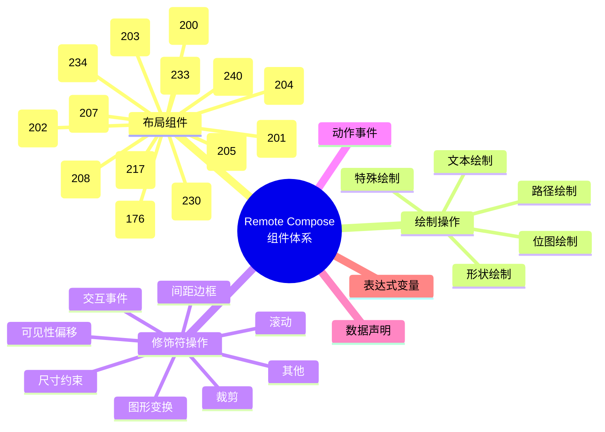

# Remote Compose 组件参考文档

## 目录

- [1. 概述](#1-概述)
- [2. 布局组件](#2-布局组件)
- [3. 绘制操作](#3-绘制操作)
- [4. 修饰符操作](#4-修饰符操作)
- [5. 动作/事件操作](#5-动作事件操作)
- [6. 数据/资源声明操作](#6-数据资源声明操作)
- [7. 表达式/变量操作](#7-表达式变量操作)
- [8. 矩阵/变换操作](#8-矩阵变换操作)
- [9. 裁剪/画笔操作](#9-裁剪画笔操作)
- [10. 协议/文档级操作](#10-协议文档级操作)
- [11. 高级/实验性操作](#11-高级实验性操作)
- [12. 创建 API 速查](#12-创建-api-速查)
- [13. 关键文件索引](#13-关键文件索引)

---

## 1. 概述

Remote Compose 采用三层架构设计，将协议定义、核心实现与创建 API 清晰分离：

- **协议层（OpCode）**：在 `Operations.java` 中定义的二进制协议操作码，每个操作对应唯一的整数标识，用于线格式序列化与反序列化。
- **核心层（Core Operations）**：位于 `remote-core` 模块中的实现类，负责协议的读写、布局计算与绘制逻辑。
- **创建层（Creation API）**：位于 `remote-creation` 模块中的 DSL/Composable API，为开发者提供声明式的 UI 构建方式。

### 组件分类体系

---

## 2. 布局组件

布局组件是 Remote Compose UI 树的核心节点，每个组件对应一个 `ComponentStart` 操作，通过类型字段区分不同的布局方式。

| 组件名 | OpCode | 实现类 | 关键属性 | 功能描述 | Compose API |
|--------|--------|--------|---------|---------|------------|
| LAYOUT_ROOT | 200 | RootLayoutComponent | componentId, width, height, animationId | 文档根布局容器，所有组件的顶层父节点 | `root {}` |
| LAYOUT_CONTENT | 201 | LayoutComponentContent | componentId, width, height | 通用内容容器 | - |
| LAYOUT_BOX | 202 | BoxLayout | horizontal(CENTER/START/END), vertical(CENTER/TOP/BOTTOM) | 堆叠布局容器，子组件层叠排列 | RemoteBox |
| LAYOUT_ROW | 203 | RowLayout | horizontal(START/CENTER/END/SPACE_EVENLY/SPACE_BETWEEN/SPACE_AROUND), vertical(TOP/CENTER/BOTTOM) | 水平布局 | RemoteRow |
| LAYOUT_COLUMN | 204 | ColumnLayout | horizontal(START/CENTER/END), vertical(TOP/CENTER/BOTTOM/SPACE_EVENLY/SPACE_BETWEEN/SPACE_AROUND) | 垂直布局 | RemoteColumn |
| LAYOUT_CANVAS | 205 | CanvasLayout | 继承自BoxLayout | 画布布局，支持绘制操作和嵌套组件 | RemoteCanvas |
| LAYOUT_CANVAS_CONTENT | 207 | CanvasContent | componentId, width, height | 画布内容容器 | - |
| LAYOUT_TEXT | 208 | TextLayout | textId, fontSize, fontWeight, fontStyle, fontFamily, textAlign, overflow, maxLines, autosize, minFontSize, maxFontSize, underline, strikethrough, letterSpacing, lineHeightMultiplier, color, colorId, fontAxis | 文本显示组件 | RemoteText |
| LAYOUT_STATE | 217 | StateLayout | stateCount, stateId | 状态布局，根据状态切换显示不同子组件 | RemoteStateLayout |
| LAYOUT_COLLAPSIBLE_ROW | 230 | CollapsibleRowLayout | 继承自RowLayout，增加collapsiblePriority | 可折叠水平行 | RemoteCollapsibleRow |
| LAYOUT_COLLAPSIBLE_COLUMN | 233 | CollapsibleColumnLayout | 继承自ColumnLayout，增加collapsiblePriority | 可折叠垂直列 | RemoteCollapsibleColumn |
| LAYOUT_IMAGE | 234 | ImageLayout | imageId, scaleType, alpha | 图片显示组件 | RemoteImage |
| LAYOUT_FIT_BOX | 176 | FitBoxLayout | horizontal(START/CENTER/END), vertical(TOP/CENTER/BOTTOM), contentWidth, contentHeight | 自适应盒子，按指定内容尺寸适配 | FitBox |
| LAYOUT_FLOW | 240 | FlowLayout | 继承自RowLayout | 流式换行布局（实验性） | RemoteFlowRow |

### ComponentStart 类型常量

每个布局组件通过 `ComponentStart` 操作的 `type` 字段标识其类型：

| 常量名 | 值 | 说明 |
|--------|-----|------|
| DEFAULT | 0 | 默认类型 |
| ROOT_LAYOUT | 1 | 根布局 |
| LAYOUT | 2 | 通用布局 |
| LAYOUT_CONTENT | 3 | 内容布局 |
| SCROLL_CONTENT | 4 | 滚动内容 |
| BUTTON | 5 | 按钮（保留） |
| CHECKBOX | 6 | 复选框（保留） |
| TEXT | 7 | 文本组件 |
| CURVED_TEXT | 8 | 弧形文本（保留） |
| STATE_HOST | 9 | 状态宿主 |
| CUSTOM | 10 | 自定义组件 |
| LOTTIE | 11 | Lottie动画（保留） |
| IMAGE | 12 | 图片组件 |
| STATE_BOX_CONTENT | 13 | 状态盒子内容 |
| LAYOUT_BOX | 14 | 盒子布局 |
| LAYOUT_ROW | 15 | 行布局 |
| LAYOUT_COLUMN | 16 | 列布局 |

---

## 3. 绘制操作

绘制操作用于在画布（Canvas）上渲染图形、文本和位图等内容。

### 3.1 形状绘制

| 操作名 | OpCode | 实现类 | 功能描述 |
|--------|--------|--------|---------|
| DRAW_RECT | 42 | DrawRect | 绘制矩形 |
| DRAW_ROUND_RECT | 51 | DrawRoundRect | 绘制圆角矩形 |
| DRAW_CIRCLE | 46 | DrawCircle | 绘制圆形 |
| DRAW_OVAL | 56 | DrawOval | 绘制椭圆 |
| DRAW_LINE | 47 | DrawLine | 绘制直线 |
| DRAW_ARC | 152 | DrawArc | 绘制弧形 |
| DRAW_SECTOR | 52 | DrawSector | 绘制扇形 |

### 3.2 文本绘制

| 操作名 | OpCode | 实现类 | 功能描述 |
|--------|--------|--------|---------|
| DRAW_TEXT_RUN | 43 | DrawText | 绘制文本 |
| DRAW_TEXT_ANCHOR | 133 | DrawTextAnchored | 绘制锚点对齐文本，支持精确的文本定位与对齐 |
| DRAW_TEXT_ON_PATH | 53 | DrawTextOnPath | 沿路径绘制文本 |
| DRAW_BITMAP_FONT_TEXT_RUN | 48 | DrawBitmapFontText | 绘制位图字体文本 |
| DRAW_BITMAP_FONT_TEXT_RUN_ON_PATH | 49 | DrawBitmapFontTextOnPath | 沿路径绘制位图字体文本 |
| DRAW_BITMAP_TEXT_ANCHORED | 184 | DrawBitmapTextAnchored | 绘制锚点对齐位图字体文本 |

### 3.3 位图绘制

| 操作名 | OpCode | 实现类 | 功能描述 |
|--------|--------|--------|---------|
| DRAW_BITMAP | 44 | DrawBitmap | 绘制位图 |
| DRAW_BITMAP_INT | 66 | DrawBitmapInt | 绘制位图（整数坐标） |
| DRAW_BITMAP_SCALED | 149 | DrawBitmapScaled | 绘制缩放位图，支持8种缩放类型 |

### 3.4 路径绘制

| 操作名 | OpCode | 实现类 | 功能描述 |
|--------|--------|--------|---------|
| DRAW_PATH | 124 | DrawPath | 绘制路径 |
| DRAW_TWEEN_PATH | 125 | DrawTweenPath | 绘制补间动画路径，在两条路径之间进行插值 |

### 3.5 特殊绘制

| 操作名 | OpCode | 实现类 | 功能描述 |
|--------|--------|--------|---------|
| DRAW_CONTENT | 139 | DrawContent | 绘制内容引用，将其他组件的绘制结果嵌入当前位置 |
| DRAW_TO_BITMAP | 190 | DrawToBitmap | 将绘制操作渲染到位图，用于缓存和复用 |

---

## 4. 修饰符操作

修饰符操作用于修改组件的外观、布局行为和交互方式。修饰符按链式顺序应用，顺序影响最终效果。

### 4.1 尺寸约束

| 修饰符名 | OpCode | 实现类 | 关键参数 | 功能描述 |
|----------|--------|--------|---------|---------|
| MODIFIER_WIDTH | 16 | WidthModifierOperation | FILL/EXACT/WRAP/WEIGHT | 设置宽度模式与值 |
| MODIFIER_HEIGHT | 67 | HeightModifierOperation | FILL/EXACT/WRAP | 设置高度模式与值 |
| MODIFIER_WIDTH_IN | 231 | WidthInModifierOperation | min, max | 宽度约束范围 |
| MODIFIER_HEIGHT_IN | 232 | HeightInModifierOperation | min, max | 高度约束范围 |

### 4.2 间距与边框

| 修饰符名 | OpCode | 实现类 | 关键参数 | 功能描述 |
|----------|--------|--------|---------|---------|
| MODIFIER_PADDING | 58 | PaddingModifierOperation | left, top, right, bottom | 内边距 |
| MODIFIER_BACKGROUND | 55 | BackgroundModifierOperation | 颜色/颜色ID, 圆角形状 | 背景色，支持静态颜色和动态颜色表达式 |
| MODIFIER_BORDER | 107 | BorderModifierOperation | 宽度, 圆角, 颜色, 形状 | 边框，支持静态和动态颜色 |

### 4.3 裁剪

| 修饰符名 | OpCode | 实现类 | 关键参数 | 功能描述 |
|----------|--------|--------|---------|---------|
| MODIFIER_CLIP_RECT | 108 | ClipRectModifierOperation | - | 裁剪为矩形 |
| MODIFIER_ROUNDED_CLIP_RECT | 54 | RoundedClipRectModifierOperation | - | 裁剪为圆角矩形 |

### 4.4 交互事件

| 修饰符名 | OpCode | 实现类 | 关键参数 | 功能描述 |
|----------|--------|--------|---------|---------|
| MODIFIER_CLICK | 59 | ClickModifierOperation | - | 点击事件处理 |
| MODIFIER_MULTI_CLICK | 83 | MultiClickModifier | - | 多击事件处理（实验性） |
| MODIFIER_TOUCH_DOWN | 219 | TouchDownModifierOperation | - | 触摸按下事件 |
| MODIFIER_TOUCH_UP | 220 | TouchUpModifierOperation | - | 触摸抬起事件 |
| MODIFIER_TOUCH_CANCEL | 225 | TouchCancelModifierOperation | - | 触摸取消事件 |
| MODIFIER_RIPPLE | 229 | RippleModifierOperation | - | 水波纹点击反馈效果 |

### 4.5 可见性与偏移

| 修饰符名 | OpCode | 实现类 | 关键参数 | 功能描述 |
|----------|--------|--------|---------|---------|
| MODIFIER_VISIBILITY | 211 | ComponentVisibilityOperation | VISIBLE/INVISIBLE/GONE | 可见性控制，支持动态表达式 |
| MODIFIER_OFFSET | 221 | OffsetModifierOperation | x, y | 位置偏移 |
| MODIFIER_ZINDEX | 223 | ZIndexModifierOperation | zIndex | Z轴层级控制 |

### 4.6 图形变换

| 修饰符名 | OpCode | 实现类 | 关键参数 | 功能描述 |
|----------|--------|--------|---------|---------|
| MODIFIER_GRAPHICS_LAYER | 224 | GraphicsLayerModifierOperation | scaleX/Y, rotationX/Y/Z, translationX/Y, alpha, shadowElevation, shape, clip, renderEffect | 图形层变换，支持缩放、旋转、平移、透明度、阴影等 |

### 4.7 滚动与动画

| 修饰符名 | OpCode | 实现类 | 关键参数 | 功能描述 |
|----------|--------|--------|---------|---------|
| MODIFIER_SCROLL | 226 | ScrollModifierOperation | 垂直/水平 | 滚动支持，支持位置追踪 |
| MODIFIER_MARQUEE | 228 | MarqueeModifierOperation | - | 跑马灯文本滚动效果 |

### 4.8 其他

| 修饰符名 | OpCode | 实现类 | 关键参数 | 功能描述 |
|----------|--------|--------|---------|---------|
| MODIFIER_ALIGN_BY | 237 | AlignByModifierOperation | - | 基线对齐（实验性） |
| MODIFIER_COLLAPSIBLE_PRIORITY | 235 | CollapsiblePriorityModifierOperation | priority | 可折叠优先级，空间不足时按优先级折叠 |
| MODIFIER_DRAW_CONTENT | 174 | DrawContentOperation | - | 绘制内容修饰符 |
| MODIFIER_DIMENSION_CONSTRAINTS | 243 | DimensionConstraintsModifierOperation | - | 维度约束（实验性） |
| LAYOUT_COMPUTE | 238 | LayoutComputeOperation | computeMeasure/computePosition | 计算型布局，支持通过表达式动态计算测量与位置（实验性） |

---

## 5. 动作/事件操作

动作操作定义了组件与宿主应用之间的交互机制，包括宿主回调与值变更通知。

| 操作名 | OpCode | 实现类 | 功能描述 |
|--------|--------|--------|---------|
| HOST_ACTION | 209 | HostActionOperation | 宿主动作，向宿主应用发送动作通知 |
| HOST_METADATA_ACTION | 216 | HostActionMetadataOperation | 宿主动作元数据，携带附加信息的宿主动作 |
| HOST_NAMED_ACTION | 210 | HostNamedActionOperation | 命名宿主动作，通过字符串标识符指定动作类型 |
| RUN_ACTION | 236 | RunActionOperation | 运行动作，触发指定操作的执行 |
| VALUE_INTEGER_CHANGE_ACTION | 212 | ValueIntegerChangeActionOperation | 整数值变更动作，当整数值改变时触发 |
| VALUE_INTEGER_EXPRESSION_CHANGE_ACTION | 218 | ValueIntegerExpressionChangeActionOperation | 整数表达式变更动作，当整数表达式结果改变时触发 |
| VALUE_STRING_CHANGE_ACTION | 213 | ValueStringChangeActionOperation | 字符串值变更动作，当字符串值改变时触发 |
| VALUE_FLOAT_CHANGE_ACTION | 222 | ValueFloatChangeActionOperation | 浮点值变更动作，当浮点值改变时触发 |
| VALUE_FLOAT_EXPRESSION_CHANGE_ACTION | 227 | ValueFloatExpressionChangeActionOperation | 浮点表达式变更动作，当浮点表达式结果改变时触发 |

---

## 6. 数据/资源声明操作

数据声明操作用于在文档中定义可被后续操作引用的资源，如位图、文本、着色器等。

| 操作名 | OpCode | 实现类 | 功能描述 |
|--------|--------|--------|---------|
| DATA_BITMAP | 101 | BitmapData | 位图数据声明，将位图资源注册到文档 |
| DATA_BITMAP_FONT | 167 | BitmapFontData | 位图字体数据声明，定义自定义位图字体 |
| DATA_TEXT | 102 | TextData | 文本数据声明，注册字符串资源 |
| DATA_SHADER | 45 | ShaderData | 着色器数据声明，定义渐变等着色效果 |
| DATA_PATH | 123 | PathData | 路径数据声明，定义矢量路径 |
| DATA_FLOAT | 80 | FloatConstant | 浮点常量声明 |
| DATA_INT | 140 | IntegerConstant | 整数常量声明 |
| DATA_BOOLEAN | 143 | BooleanConstant | 布尔常量声明 |
| DATA_LONG | 148 | LongConstant | 长整型常量声明 |
| DATA_FONT | 189 | FontData | 字体数据声明，注册自定义字体 |
| FLOAT_LIST | 147 | DataListFloat | 浮点列表数据，存储浮点数组 |
| DYNAMIC_FLOAT_LIST | 197 | DataDynamicListFloat | 动态浮点列表，支持运行时更新 |
| ID_MAP | 145 | DataMapIds | ID映射数据，键值对映射表 |
| ID_LIST | 146 | DataListIds | ID列表数据，有序ID集合 |

---

## 7. 表达式/变量操作

表达式系统是 Remote Compose 实现动态行为的核心机制，支持浮点运算、颜色计算、路径生成、文本处理等。

### 7.1 浮点表达式

| 操作名 | OpCode | 实现类 | 功能描述 |
|--------|--------|--------|---------|
| ANIMATED_FLOAT | 81 | FloatExpression | 浮点表达式，使用逆波兰表示法（RPN）编写，支持数学运算、动画插值和系统变量引用 |

### 7.2 颜色表达式

| 操作名 | OpCode | 实现类 | 功能描述 |
|--------|--------|--------|---------|
| COLOR_EXPRESSIONS | 134 | ColorExpression | 颜色表达式，基于浮点表达式动态计算颜色 |
| COLOR_CONSTANT | 138 | ColorConstant | 颜色常量，定义静态ARGB颜色 |
| COLOR_THEME | 196 | ColorTheme | 主题颜色，支持亮色/暗色模式适配 |

### 7.3 路径表达式

| 操作名 | OpCode | 实现类 | 功能描述 |
|--------|--------|--------|---------|
| PATH_EXPRESSION | 193 | PathExpression | 路径表达式，通过算法生成矢量路径 |
| PATH_CREATE | 159 | PathCreate | 路径创建，初始化新路径 |
| PATH_ADD | 160 | PathAppend | 路径追加，向现有路径添加子路径 |
| PATH_TWEEN | 158 | PathTween | 路径补间，在两条路径之间进行插值动画 |
| PATH_COMBINE | 175 | PathCombine | 路径组合，对两条路径执行布尔运算 |

### 7.4 文本表达式

| 操作名 | OpCode | 实现类 | 功能描述 |
|--------|--------|--------|---------|
| TEXT_FROM_FLOAT | 135 | TextFromFloat | 浮点转文本，将浮点数格式化为字符串 |
| TEXT_MERGE | 136 | TextMerge | 文本合并，拼接多个文本段 |
| TEXT_LOOKUP | 151 | TextLookup | 文本查找，通过浮点索引在文本列表中查找 |
| TEXT_LOOKUP_INT | 153 | TextLookupInt | 整数文本查找，通过整数索引在文本列表中查找 |
| TEXT_MEASURE | 155 | TextMeasure | 文本测量，获取文本的宽度等度量信息 |
| TEXT_LENGTH | 156 | TextLength | 文本长度，获取文本字符数 |
| TEXT_SUBTEXT | 182 | TextSubtext | 子文本，截取文本的一部分 |
| TEXT_TRANSFORM | 199 | TextTransform | 文本变换，对文本执行大小写等转换 |

### 7.5 整数表达式

| 操作名 | OpCode | 实现类 | 功能描述 |
|--------|--------|--------|---------|
| INTEGER_EXPRESSION | 144 | IntegerExpression | 整数表达式，使用RPN编写整数运算逻辑 |

### 7.6 变量与函数

| 操作名 | OpCode | 实现类 | 功能描述 |
|--------|--------|--------|---------|
| NAMED_VARIABLE | 137 | NamedVariable | 命名变量，通过字符串名称引用的可变值 |
| TOUCH_EXPRESSION | 157 | TouchExpression | 触摸表达式，提供触摸位置等交互数据 |
| FUNCTION_DEFINE | 168 | FloatFunctionDefine | 函数定义，声明可复用的浮点函数 |
| FUNCTION_CALL | 166 | FloatFunctionCall | 函数调用，执行已定义的浮点函数 |

---

## 8. 矩阵/变换操作

矩阵操作用于对画布坐标系进行仿射变换，影响后续所有绘制操作。

| 操作名 | OpCode | 实现类 | 功能描述 |
|--------|--------|--------|---------|
| MATRIX_SAVE | 130 | MatrixSave | 保存当前矩阵状态到栈 |
| MATRIX_RESTORE | 131 | MatrixRestore | 从栈恢复之前保存的矩阵状态 |
| MATRIX_SET | 132 | （内联处理） | 直接设置矩阵为指定值 |
| MATRIX_SCALE | 126 | MatrixScale | 矩阵缩放变换 |
| MATRIX_TRANSLATE | 127 | MatrixTranslate | 矩阵平移变换 |
| MATRIX_SKEW | 128 | MatrixSkew | 矩阵倾斜变换 |
| MATRIX_ROTATE | 129 | MatrixRotate | 矩阵旋转变换 |
| MATRIX_FROM_PATH | 181 | MatrixFromPath | 从路径获取矩阵，沿路径某点获取变换矩阵 |
| MATRIX_CONSTANT | 186 | MatrixConstant | 矩阵常量，预定义的变换矩阵 |
| MATRIX_EXPRESSION | 187 | MatrixExpression | 矩阵表达式，通过表达式动态计算矩阵 |
| MATRIX_VECTOR_MATH | 188 | MatrixVectorMath | 矩阵向量运算，支持向量点乘、叉乘等 |

---

## 9. 裁剪/画笔操作

裁剪操作限制后续绘制区域，画笔操作设置绘制样式。

| 操作名 | OpCode | 实现类 | 功能描述 |
|--------|--------|--------|---------|
| CLIP_PATH | 38 | ClipPath | 裁剪到路径，后续绘制仅在路径区域内可见 |
| CLIP_RECT | 39 | ClipRect | 裁剪到矩形，后续绘制仅在矩形区域内可见 |
| PAINT_VALUES | 40 | PaintData | 画笔属性设置，包括颜色、描边宽度、样式等 |

---

## 10. 协议/文档级操作

协议级操作定义文档的元数据、主题、无障碍等全局信息。

| 操作名 | OpCode | 实现类 | 功能描述 |
|--------|--------|--------|---------|
| HEADER | 0 | Header | 文档头信息，包含版本、尺寸等元数据 |
| THEME | 63 | Theme | 主题定义，设置文档级颜色主题 |
| CLICK_AREA | 64 | ClickArea | 点击区域定义 |
| ROOT_CONTENT_BEHAVIOR | 65 | RootContentBehavior | 根内容行为（已弃用） |
| ROOT_CONTENT_DESCRIPTION | 103 | RootContentDescription | 根内容描述，用于无障碍 |
| ACCESSIBILITY_SEMANTICS | 250 | CoreSemantics | 无障碍语义，为组件提供语义信息 |
| ATTRIBUTE_TEXT | 170 | TextAttribute | 文本属性 |
| ATTRIBUTE_IMAGE | 171 | ImageAttribute | 图片属性 |
| ATTRIBUTE_TIME | 172 | TimeAttribute | 时间属性 |
| ATTRIBUTE_COLOR | 180 | ColorAttribute | 颜色属性 |
| COMPONENT_VALUE | 150 | ComponentValue | 组件尺寸/位置值引用，获取组件的宽度、高度等 |
| ANIMATION_SPEC | 14 | AnimationSpec | 动画规格，定义动画的时长、缓动曲线等 |
| LOOP_START | 215 | LoopOperation | 循环操作，重复执行子操作列表 |
| TEXT_STYLE | 242 | TextStyle | 文本样式定义 |
| DEBUG_MESSAGE | 179 | DebugMessage | 调试消息，用于开发时输出调试信息 |
| REM | 185 | Rem | 注释，不影响文档执行 |
| ID_LOOKUP | 192 | IdLookup | ID查找，通过ID查找数据 |
| DATA_MAP_LOOKUP | 154 | DataMapLookup | 数据映射查找，在映射表中查找值 |
| UPDATE_DYNAMIC_FLOAT_LIST | 198 | UpdateDynamicFloatList | 更新动态浮点列表 |
| HAPTIC_FEEDBACK | 177 | HapticFeedback | 触觉反馈，触发设备振动 |
| WAKE_IN | 191 | WakeIn | 定时唤醒，在指定时间后重新激活文档 |
| SKIP | 241 | Skip | 跳过操作，跳过指定字节数 |
| CONDITIONAL_OPERATIONS | 178 | ConditionalOperations | 条件操作，根据条件选择执行不同的操作分支 |
| CANVAS_OPERATIONS | 173 | CanvasOperations | 画布操作集，封装一组画布操作 |
| REFERENCED_OPERATIONS | 142 | ReferencedOperations | 引用操作集，定义可复用的操作序列（实验性） |
| INCLUDE_REFERENCED_OPERATIONS | 245 | IncludeReferencedOperations | 包含引用操作，执行已定义的引用操作集（实验性） |

---

## 11. 高级/实验性操作

这些操作提供粒子系统、宏定义等高级功能，部分属于实验性特性，需启用实验性配置文件。

### 粒子系统

| 操作名 | OpCode | 实现类 | 功能描述 |
|--------|--------|--------|---------|
| PARTICLE_DEFINE | 161 | ParticlesCreate | 粒子系统定义，初始化粒子参数 |
| PARTICLE_PROCESS | 162 | （在ParticlesCreate中处理） | 粒子处理，更新粒子状态 |
| PARTICLE_LOOP | 163 | ParticlesLoop | 粒子循环，批量处理粒子更新 |
| PARTICLE_COMPARE | 194 | ParticlesCompare | 粒子比较，用于粒子排序等 |

### 脉冲系统

| 操作名 | OpCode | 实现类 | 功能描述 |
|--------|--------|--------|---------|
| IMPULSE_START | 164 | ImpulseOperation | 脉冲开始，触发脉冲动画 |
| IMPULSE_PROCESS | 165 | ImpulseProcess | 脉冲处理，更新脉冲状态 |

### 宏系统（Loom 模式）

| 操作名 | OpCode | 实现类 | 功能描述 |
|--------|--------|--------|---------|
| MACRO_DEFINE | 246 | PatternDefine | 宏定义，定义可参数化的操作模板 |
| MACRO_CALL | 247 | PatternInflation | 宏调用，实例化已定义的宏 |
| MACRO_ARGUMENT | 248 | PatternArgument | 宏参数，传递参数给宏 |
| MACRO_BLOCK | 249 | PatternBlock | 宏代码块，定义宏内的操作序列 |
| MACRO_FOR_EACH | 244 | PatternForEach | 宏循环，对列表中的每个元素执行宏 |

### 其他

| 操作名 | OpCode | 实现类 | 功能描述 |
|--------|--------|--------|---------|
| LOAD_BITMAP | 4 | （内联处理） | 加载位图，从外部源加载位图数据 |

---

## 12. 创建 API 速查

### 12.1 过程式 API（RemoteComposeContext / RemoteComposeContextAndroid）

过程式 API 使用 Kotlin DSL 风格，通过 `RemoteComposeContextAndroid` 构建文档。

| DSL 方法 | 对应组件 | OpCode |
|----------|---------|--------|
| `root {}` | RootLayoutComponent | 200 |
| `column(modifier, horizontal, vertical) {}` | ColumnLayout | 204 |
| `collapsibleColumn(modifier, horizontal, vertical) {}` | CollapsibleColumnLayout | 233 |
| `row(modifier, horizontal, vertical) {}` | RowLayout | 203 |
| `collapsibleRow(modifier, horizontal, vertical) {}` | CollapsibleRowLayout | 230 |
| `box(modifier, horizontal, vertical) {}` | BoxLayout | 202 |
| `fitBox(modifier, ...) {}` | FitBoxLayout | 176 |
| `flow(modifier, horizontal, vertical) {}` | FlowLayout | 240 |
| `canvas(modifier) {}` | CanvasLayout | 205 |
| `text(text, modifier, fontSize, ...)` | TextLayout | 208 |
| `textComponent(textId, ...)` | TextLayout | 208 |
| `image(modifier, imageId, scaleType, alpha)` | ImageLayout | 234 |
| `stateLayout(modifier, count) {}` | StateLayout | 217 |

### 12.2 Compose 风格 API（@RemoteComposable）

Compose 风格 API 使用 `@RemoteComposable` 注解，提供与 Jetpack Compose 一致的开发体验。

| 组件 | 对应底层组件 | OpCode |
|------|------------|--------|
| RemoteBox | BoxLayout | 202 |
| RemoteColumn | ColumnLayout | 204 |
| RemoteRow | RowLayout | 203 |
| RemoteText | TextLayout | 208 |
| RemoteCanvas / RemoteCanvas0 | CanvasLayout | 205 |
| RemoteImage | ImageLayout | 234 |
| FitBox | FitBoxLayout | 176 |
| RemoteCollapsibleColumn | CollapsibleColumnLayout | 233 |
| RemoteCollapsibleRow | CollapsibleRowLayout | 230 |
| RemoteStateLayout | StateLayout | 217 |
| RemoteFlowRow | FlowLayout | 240 |
| RemoteSpacer | BoxLayout（带weight） | 202 |

---

## 13. 关键文件索引

### remote-core（核心协议层）

| 文件 | 路径 |
|------|------|
| Operations.java | `remote-core/src/main/java/androidx/compose/remote/core/Operations.java` |
| Component.java | `remote-core/src/main/java/androidx/compose/remote/core/operations/layout/Component.java` |
| LayoutComponent.java | `remote-core/src/main/java/androidx/compose/remote/core/operations/layout/LayoutComponent.java` |
| LayoutManager.java | `remote-core/src/main/java/androidx/compose/remote/core/operations/layout/managers/LayoutManager.java` |
| ComponentStart.java | `remote-core/src/main/java/androidx/compose/remote/core/operations/layout/ComponentStart.java` |
| 布局管理器目录 | `remote-core/src/main/java/androidx/compose/remote/core/operations/layout/managers/` |
| 修饰符目录 | `remote-core/src/main/java/androidx/compose/remote/core/operations/layout/modifiers/` |

### remote-player-core（Android 播放端）

| 文件 | 路径 |
|------|------|
| AndroidRemoteContext.java | `remote-player-core/src/main/java/androidx/compose/remote/player/core/platform/AndroidRemoteContext.java` |
| AndroidPaintContext.java | `remote-player-core/src/main/java/androidx/compose/remote/player/core/platform/AndroidPaintContext.java` |

### remote-player-compose（Compose 播放端）

| 文件 | 路径 |
|------|------|
| ComposePaintContext.kt | `remote-player-compose/src/main/java/androidx/compose/remote/player/compose/context/ComposePaintContext.kt` |
| ComposeRemoteContext.kt | `remote-player-compose/src/main/java/androidx/compose/remote/player/compose/context/ComposeRemoteContext.kt` |

### remote-creation-core（创建端核心）

| 文件 | 路径 |
|------|------|
| RemoteComposeWriter.java | `remote-creation-core/src/main/java/androidx/compose/remote/creation/RemoteComposeWriter.java` |
| RemoteComposeContext.kt | `remote-creation-core/src/main/java/androidx/compose/remote/creation/RemoteComposeContext.kt` |

### remote-creation-compose（Compose 风格创建 API）

| 文件 | 路径 |
|------|------|
| Compose组件目录 | `remote-creation-compose/src/main/java/androidx/compose/remote/creation/compose/layout/` |

### 文档目录

| 文件 | 路径 |
|------|------|
| 组件指南 | `remote-creation/doc/guides/` |
