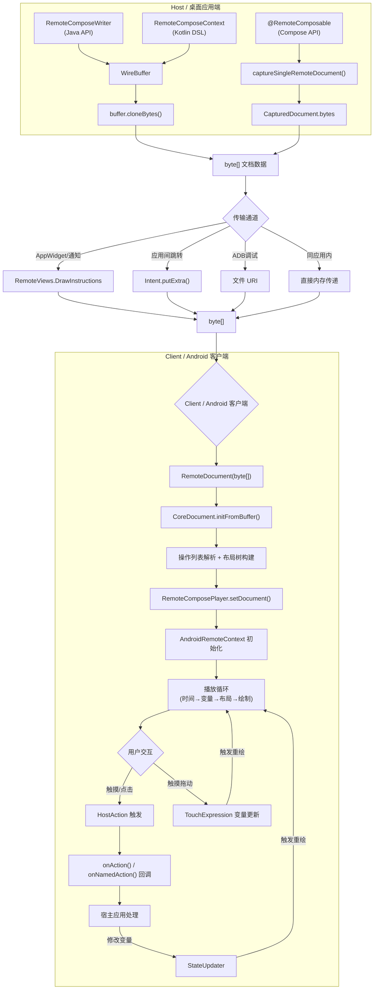
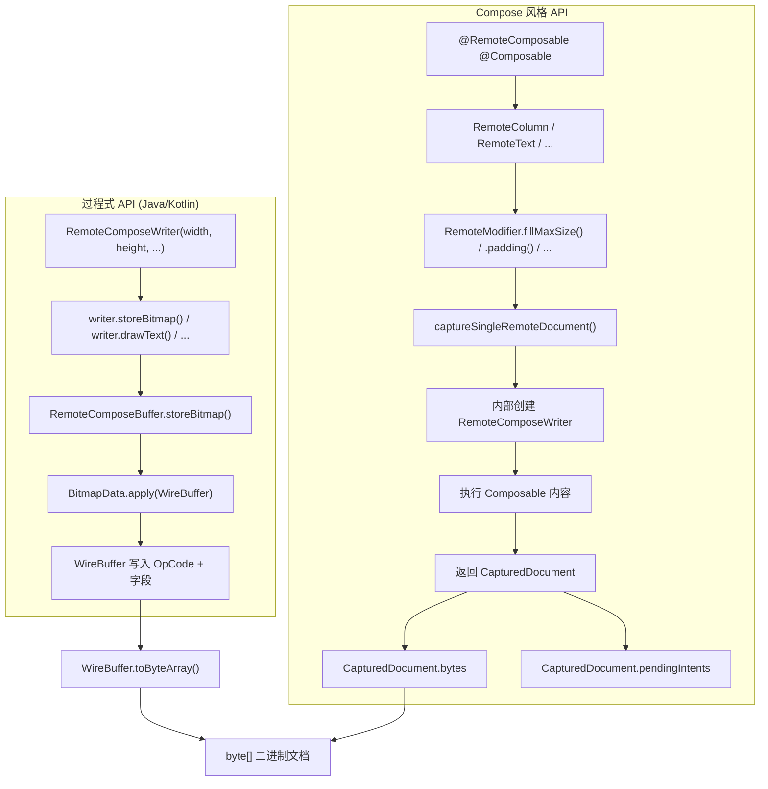
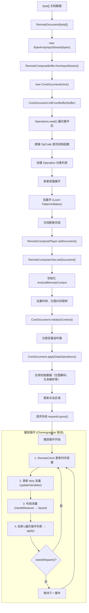
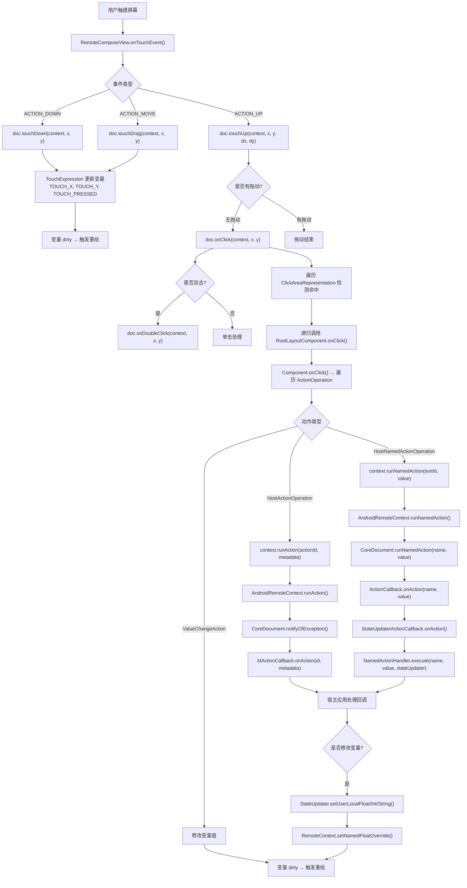
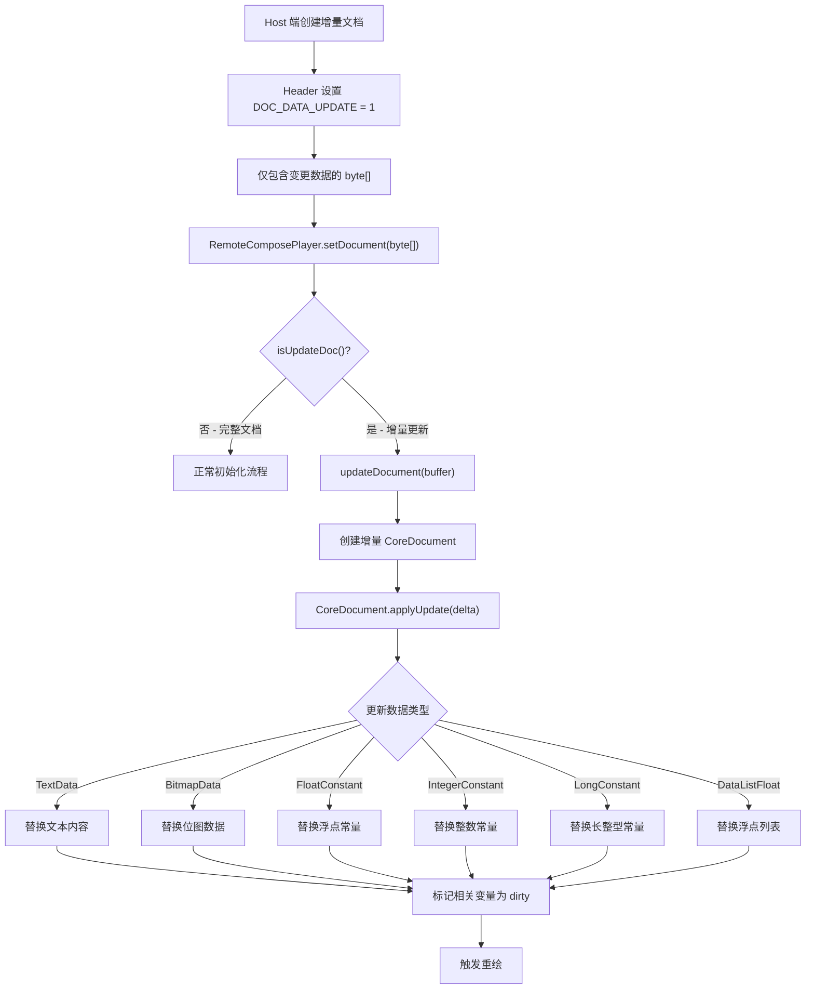

# Remote Compose 客户端与桌面应用交互框架流程文档

## 目录

- [1. 概述](#1-概述)
- [2. 总体架构流程图](#2-总体架构流程图)
- [3. 文档创建与序列化流程](#3-文档创建与序列化流程)
- [4. 传输通道详解](#4-传输通道详解)
  - [4.1 RemoteViews.DrawInstructions（AppWidget/通知场景）](#41-remoteviewsdrawinstructionsappwidget通知场景)
  - [4.2 Intent 传递（应用间跳转场景）](#42-intent-传递应用间跳转场景)
  - [4.3 文件 URI（ADB 调试场景）](#43-文件-uriadb-调试场景)
  - [4.4 直接内存传递（同应用 Compose 预览）](#44-直接内存传递同应用-compose-预览)
- [5. 客户端解码与渲染初始化流程](#5-客户端解码与渲染初始化流程)
- [6. 用户交互事件流程](#6-用户交互事件流程)
- [7. 增量更新机制流程](#7-增量更新机制流程)
- [8. 动态状态/变量同步机制](#8-动态状态变量同步机制)
  - [8.1 命名变量覆盖（StateUpdater）](#81-命名变量覆盖stateupdater)
  - [8.2 系统变量（由播放器自动提供）](#82-系统变量由播放器自动提供)
  - [8.3 表达式引擎本地求值](#83-表达式引擎本地求值)
- [9. 关键类与文件索引](#9-关键类与文件索引)

---

## 1. 概述

Remote Compose 的交互架构核心设计理念是：**单向文档传输 + 本地渲染 + 回调交互**。

关键特性：

- **无内置传输层**：框架本身不包含网络传输实现（无 WebSocket/gRPC/Socket），文档以 `byte[]` 为核心数据载体，传输方式由集成方自行决定
- **本地渲染**：客户端接收 byte[] 后，在本地完成全部解码、布局和渲染，不依赖服务端实时参与
- **回调交互**：用户交互通过 HostAction 回调机制回传给宿主应用，由宿主应用决定处理方式

这种设计使得 Remote Compose 天然适配 Android 的多种跨进程通信场景（AppWidget、通知、应用间跳转等），同时保持客户端的独立渲染能力，即使宿主应用不可达，已渲染的内容仍可正常展示和交互。

---

## 2. 总体架构流程图



上图展示了 Remote Compose 从文档创建到客户端渲染的完整数据流。核心路径为：

1. **Host 端**通过三种 API 之一创建文档，序列化为 `byte[]`
2. **传输层**由集成方选择，框架仅提供 `byte[]` 作为数据载体
3. **Client 端**接收 `byte[]` 后，通过 `RemoteDocument` 解码，构建操作列表和布局树
4. **播放循环**由 Choreographer 驱动，持续更新时间变量、求值表达式、布局测量和绘制
5. **用户交互**通过 HostAction 回调回传宿主应用，宿主应用可通过 StateUpdater 修改变量触发重绘

---

## 3. 文档创建与序列化流程

Remote Compose 提供两种文档创建路径：**过程式 API** 和 **Compose 风格 API**。



### 过程式 API（Java/Kotlin）

过程式 API 通过 `RemoteComposeWriter` 直接向 `WireBuffer` 写入操作码和数据：

1. 创建 `RemoteComposeWriter` 实例，指定文档宽度、高度和密度
2. 调用 writer 的方法（如 `drawText()`、`storeBitmap()`）发出绘制指令
3. 每个方法内部将操作码和参数写入 `WireBuffer`
4. 最终通过 `WireBuffer.toByteArray()` 获取二进制文档

**关键类：**

| 类 | 路径 | 职责 |
|---|---|---|
| RemoteComposeWriter | `remote-creation-core/.../RemoteComposeWriter.java` | Java 高级 API，提供绘制、布局、数据定义等方法 |
| RemoteComposeContext | `remote-creation-core/.../RemoteComposeContext.kt` | Kotlin DSL 包装器，在 Writer 之上提供更惯用的 API |
| WireBuffer | `remote-core/.../WireBuffer.java` | 线格式写入缓冲区，负责 OpCode 和字段的序列化 |

### Compose 风格 API

Compose 风格 API 允许使用 `@RemoteComposable` 注解的 Composable 函数来声明式定义 UI：

1. 使用 `@RemoteComposable @Composable` 注解定义可组合函数
2. 在函数内使用 `RemoteColumn`、`RemoteText` 等 Remote Compose 组件
3. 通过 `captureSingleRemoteDocument()` 捕获 Composable 内容
4. 返回 `CapturedDocument` 对象，包含 `bytes`（二进制文档）和 `pendingIntents`（待处理的 PendingIntent 列表）

**关键类：**

| 类 | 路径 | 职责 |
|---|---|---|
| captureSingleRemoteDocument | `remote-creation-compose/.../capture/CaptureRemoteDocument.kt` | Compose 文档捕获入口函数 |
| CapturedDocument | `remote-creation-compose/.../capture/CapturedDocument.kt` | 捕获结果，包含 bytes 和 pendingIntents |
| rememberRemoteDocument | `remote-creation-compose/.../capture/RemoteComposeCapture.kt` | 同应用内捕获+播放的 Composable 记忆状态 |

---

## 4. 传输通道详解

Remote Compose 框架本身不包含传输层实现，`byte[]` 是核心数据载体。以下是四种典型传输场景。

### 4.1 RemoteViews.DrawInstructions（AppWidget/通知场景）

这是 Remote Compose 的**核心传输通道**，利用 Android 15 引入的 `RemoteViews.DrawInstructions` API。该 API 允许将自定义绘制指令嵌入 RemoteViews，由系统进程中的 Remote Compose 运行时执行渲染。

```kotlin
// RCWidget 方式
val capturedDoc = captureSingleRemoteDocument(context, displayInfo, profile) {
    // @RemoteComposable 内容
}
val instructions = RemoteViews.DrawInstructions.Builder(listOf(capturedDoc.bytes))
val remoteViews = RemoteViews(instructions.build())
appWidgetManager.updateAppWidget(widgetId, remoteViews)
```

**工作原理：**

1. Host 端通过 `captureSingleRemoteDocument()` 捕获 `@RemoteComposable` 内容为 `byte[]`
2. 将 `byte[]` 传入 `RemoteViews.DrawInstructions.Builder` 构建绘制指令
3. 系统进程接收 `RemoteViews`，识别 DrawInstructions 中的 Remote Compose 文档
4. 系统进程中的 Remote Compose 运行时解码并渲染文档

**关键类：**

| 类 | 路径 | 职责 |
|---|---|---|
| RCWidget | `remote-creation-compose/.../widgets/RCWidget.kt` | Compose 风格 AppWidget 集成 |
| ProceduralRCWidget | `remote-creation-compose/.../widgets/ProceduralRCWidget.kt` | 过程式 AppWidget 集成 |
| AbstractRCWidget | `remote-creation-compose/.../widgets/AbstractRCWidget.kt` | AppWidget 抽象基类 |
| RemoteComposeWidget | `remote-creation-compose/.../widgets/RemoteComposeWidget.kt` | Remote Compose Widget 实现 |

### 4.2 Intent 传递（应用间跳转场景）

通过 Android 的 Intent 机制在应用间传递文档数据：

```kotlin
// 发送端
val intent = Intent(Intent.ACTION_VIEW)
intent.putExtra("RC_DOC_DATA", documentBytes)
intent.type = "application/remote-compose-doc"
startActivity(intent)

// 接收端
val bytes = intent.getByteArrayExtra("RC_DOC_DATA")
val remoteDoc = RemoteDocument(bytes)
```

**适用场景：** 从一个应用跳转到另一个应用展示 Remote Compose 内容，如从设置应用跳转到壁纸预览。

**注意事项：** Intent 传递有数据大小限制（通常约 1MB），大文档应考虑使用 ContentProvider 或文件 URI 方式。

### 4.3 文件 URI（ADB 调试场景）

通过文件 URI 传递文档，适用于 ADB 调试和文件共享场景：

```bash
# 通过 ADB 推送文档并启动查看
adb push doc.rc /storage/self/primary/Download/
adb shell am start -a android.intent.action.VIEW \
  -d file:///storage/self/primary/Download/doc.rc \
  -t application/remote-compose-doc
```

**适用场景：** 开发调试、设计预览、从文件系统加载文档。

### 4.4 直接内存传递（同应用 Compose 预览）

在同一应用内，可以直接在内存中捕获和播放文档，无需序列化/反序列化开销：

```kotlin
// rememberRemoteDocument - 同一应用内捕获+播放
val docState = rememberRemoteDocument {
    RemoteText("Hello", fontSize = 38.sp)
}
// docState.value 即为 CoreDocument，可直接传给 RemoteDocumentPlayer

// 或使用 RemoteDocumentPlayer Composable
RemoteDocumentPlayer(
    document = docState.value,
    documentWidth = width,
    documentHeight = height,
)
```

**适用场景：** 应用内预览、实时编辑器、设计工具中的实时渲染。

---

## 5. 客户端解码与渲染初始化流程



### 关键步骤详解

#### 5.1 RemoteDocument 构造

`RemoteDocument` 是客户端的公共 API 入口，接收 `byte[]` 并初始化文档：

```java
// RemoteDocument 构造函数内部流程
public RemoteDocument(byte[] inputStream) {
    this(new ByteArrayInputStream(inputStream), RemoteClock.SYSTEM);
}

public RemoteDocument(InputStream inputStream, RemoteClock clock) {
    mDocument = new CoreDocument(clock);
    RemoteComposeBuffer buffer = RemoteComposeBuffer.fromInputStream(inputStream);
    mDocument.initFromBuffer(buffer);
}
```

核心步骤：
1. 将 `byte[]` 包装为 `ByteArrayInputStream`
2. 通过 `RemoteComposeBuffer.fromInputStream()` 创建二进制读取缓冲区
3. 创建 `CoreDocument` 实例并调用 `initFromBuffer()` 解析文档

#### 5.2 CoreDocument.initFromBuffer 解析

`initFromBuffer()` 是文档解析的核心方法，负责将二进制数据重建为操作列表和布局树：

1. **操作列表解析**：`Operations.read()` 遍历缓冲区，根据 OpCode 在 `DefaultVersionMap` 中查找对应的读取函数，实例化 `Operation` 对象
2. **嵌套容器展开**：`COMPONENT_START` 和 `CONTAINER_END` 操作重建 UI 层级结构
3. **宏展开**：`LoomManager` 处理模式膨胀（PatternInflation），将宏定义展开为实际操作
4. **变量注册**：依赖动态值的操作在 `RemoteContext` 中注册为监听器

#### 5.3 RemoteComposeView 初始化

`RemoteComposeView` 是实际的 Android View，负责渲染和交互：

1. **AndroidRemoteContext 初始化**：设置时钟、密度、位图内存限制等运行时参数
2. **CoreDocument.initializeContext()**：注册变量监听器，建立表达式依赖关系
3. **applyDataOperations()**：应用初始数据，包括位图解码、文本解析等
4. **更新点击区域**：计算可交互区域
5. **requestLayout()**：请求首次布局

#### 5.4 播放循环

播放循环由 `Choreographer` 驱动，每帧执行以下阶段：

1. **时间更新**：`RemoteClock` 更新全局时间变量（`ANIMATION_TIME`、`CONTINUOUS_SEC` 等）
2. **变量解析**：`RemoteContext` 对 dirty 的动态表达式进行 RPN 求值
3. **布局测量**：如果组件或变量标记为 dirty，`LayoutCompute` 计算新的几何信息
4. **绘制**：遍历操作列表，每个操作调用 `apply(RemoteContext)`，使用解析后的坐标和当前 Paint 状态绘制
5. **重绘判断**：如果 `needsRepaint()` 返回 true，继续下一帧；否则等待下一个事件触发

**关键类：**

| 类 | 路径 | 职责 |
|---|---|---|
| RemoteDocument | `remote-player-core/.../RemoteDocument.java` | 公共 API，从 byte[] 创建文档 |
| CoreDocument | `remote-core/.../CoreDocument.java` | 文档核心表示，持有操作列表、变量、布局树 |
| RemoteComposePlayer | `remote-player-view/.../RemoteComposePlayer.java` | 主入口 FrameLayout，协调播放、计时、输入和渲染 |
| RemoteComposeView | `remote-player-view/.../platform/RemoteComposeView.java` | 内部渲染 View，处理绘制和触摸事件 |
| AndroidRemoteContext | `remote-player-core/.../platform/AndroidRemoteContext.java` | Android 平台 RemoteContext 实现 |

---

## 6. 用户交互事件流程



### HostAction 机制详解

Remote Compose 的交互回调分为两种类型：

#### ID 动作（HostActionOperation）

通过整数 ID 标识的动作，适用于简单的点击响应场景：

- **触发方式**：`HostActionOperation.runAction()` → `context.runAction(actionId, "")`
- **回调接口**：`CoreDocument.IdActionCallback.onAction(id, metadata)`
- **注册方式**：`CoreDocument.addIdActionListener(callback)`

内部流程：
1. `AndroidRemoteContext.runAction(id, metadata)` 调用 `CoreDocument.performClick()`
2. `performClick()` 调用 `notifyOfException(id, metadata)`
3. 遍历所有 `IdActionCallback`，调用 `onAction(id, metadata)`

#### 命名动作（HostNamedActionOperation）

通过字符串名称标识的动作，支持携带类型化参数值：

- **触发方式**：`HostNamedActionOperation.runAction()` → `context.runNamedAction(textId, value)`
- **回调接口**：`CoreDocument.ActionCallback.onAction(name, value)`
- **注册方式**：`CoreDocument.addActionCallback(callback)`

支持的动作值类型：

| 类型常量 | 值 | 说明 |
|---|---|---|
| FLOAT_TYPE | 0 | 浮点数值 |
| INT_TYPE | 1 | 整数值 |
| STRING_TYPE | 2 | 字符串值 |
| FLOAT_ARRAY_TYPE | 3 | 浮点数组 |
| NONE_TYPE | -1 | 无参数 |

内部流程：
1. `AndroidRemoteContext.runNamedAction(id, value)` 将 textId 解析为文本名称
2. 调用 `CoreDocument.runNamedAction(name, value)`
3. 遍历所有 `ActionCallback`，调用 `onAction(name, value)`
4. `StateUpdaterActionCallback` 将调用转发给 `NamedActionHandler.execute(name, value, stateUpdater)`

#### StateUpdater 变量修改

宿主应用在回调中可通过 `StateUpdater` 修改变量值，触发重绘：

```kotlin
// Compose 播放端
RemoteDocumentPlayer(
    document = coreDocument,
    documentWidth = width,
    documentHeight = height,
    onAction = { actionId, metadata ->
        // 处理 ID 动作
    },
    onNamedAction = { name, value, stateUpdater ->
        // 处理命名动作，可通过 stateUpdater 修改变量
        stateUpdater.setUserLocalFloat("counter", newValue)
    },
)

// View 播放端
player.addIdActionListener { id, metadata ->
    // 处理 ID 动作
}
```

**关键类：**

| 类 | 路径 | 职责 |
|---|---|---|
| RemoteComposeView | `remote-player-view/.../platform/RemoteComposeView.java` | 处理触摸事件分发 |
| CoreDocument | `remote-core/.../CoreDocument.java` | 管理点击区域、动作回调和触摸监听器 |
| HostActionOperation | `remote-core/.../operations/layout/modifiers/HostActionOperation.java` | ID 动作操作，触发 `context.runAction()` |
| HostNamedActionOperation | `remote-core/.../operations/layout/modifiers/HostNamedActionOperation.java` | 命名动作操作，触发 `context.runNamedAction()` |
| NamedActionHandler | `remote-player-core/.../action/NamedActionHandler.java` | 命名动作处理器接口 |
| StateUpdater | `remote-player-core/.../state/StateUpdater.java` | 状态更新接口，修改变量值 |
| StateUpdaterImpl | `remote-player-core/.../state/StateUpdaterImpl.java` | StateUpdater 实现 |
| StateUpdaterActionCallback | `remote-player-core/.../action/StateUpdaterActionCallback.java` | 连接 ActionCallback 和 StateUpdater |

---

## 7. 增量更新机制流程

Remote Compose 支持增量更新，允许仅发送变更数据而非完整文档，减少带宽消耗。



### 增量更新详解

#### 标识增量文档

增量文档通过 Header 中的 `DOC_DATA_UPDATE` 字段标识：

```java
// Header.java 中的定义
public static final short DOC_DATA_UPDATE = 12;

// 解析时设置标记
document.setUpdateDoc(getInt(DOC_DATA_UPDATE, 0) != 0);
```

#### 合并策略

`CoreDocument.applyUpdate(delta)` 的合并策略为**按 ID 匹配替换**：

1. 遍历当前文档的所有操作，按类型建立 ID → 操作的映射表
2. 遍历增量文档的操作，按 ID 查找当前文档中的对应操作
3. 找到匹配项后，调用 `update()` 替换数据内容
4. 调用 `markDirty()` 标记为脏数据，触发依赖该数据的表达式重新求值

```java
// CoreDocument.applyUpdate() 核心逻辑
public void applyUpdate(@NonNull CoreDocument delta) {
    // 1. 构建当前文档的 ID 映射表
    HashMap<Integer, TextData> txtData = new HashMap<>();
    HashMap<Integer, BitmapData> imgData = new HashMap<>();
    HashMap<Integer, FloatConstant> fltData = new HashMap<>();
    HashMap<Integer, IntegerConstant> intData = new HashMap<>();
    HashMap<Integer, LongConstant> longData = new HashMap<>();
    HashMap<Integer, DataListFloat> floatListData = new HashMap<>();

    // 2. 遍历增量文档，匹配并替换
    recursiveTraverse(delta.mOperations, (op) -> {
        if (op instanceof TextData) {
            TextData t = (TextData) op;
            TextData txtInDoc = txtData.get(t.mTextId);
            if (txtInDoc != null) {
                txtInDoc.update(t);
                txtInDoc.markDirty();
            }
        }
        // ... 其他类型类似处理
    });
}
```

#### 支持的更新类型

| 数据类型 | 操作类 | 说明 |
|---|---|---|
| 文本 | TextData | 替换文本字符串内容 |
| 位图 | BitmapData | 替换位图像素数据 |
| 浮点常量 | FloatConstant | 替换浮点数值 |
| 整数常量 | IntegerConstant | 替换整数值 |
| 长整型常量 | LongConstant | 替换长整型值 |
| 浮点列表 | DataListFloat | 替换浮点数组数据 |

#### 优势

- **减少带宽**：仅发送变更数据，无需重新传输完整文档
- **快速更新**：客户端无需重新解析整个文档，仅替换对应 ID 的数据
- **平滑过渡**：更新后自动触发 dirty 标记，依赖表达式自动重新求值，实现平滑过渡

---

## 8. 动态状态/变量同步机制

### 8.1 命名变量覆盖（StateUpdater）

客户端可以通过 `StateUpdater` 覆盖文档中定义的命名变量，实现宿主应用对文档状态的动态控制：

```kotlin
stateUpdater.setUserLocalFloat("temperature", 25.5f)
stateUpdater.setUserLocalInt("count", 42)
stateUpdater.setUserLocalString("label", "Updated")
stateUpdater.setUserLocalColor("bgColor", Color.Red)
stateUpdater.setUserLocalBitmap("icon", newBitmap)
```

#### 内部机制

每个 `setUserLocal*` 方法内部都会添加 `USER:` 前缀后调用 `RemoteContext` 的覆盖方法：

| StateUpdater 方法 | 内部调用 |
|---|---|
| `setUserLocalFloat(name, value)` | `RemoteContext.setNamedFloatOverride("USER:" + name, value)` |
| `setUserLocalInt(name, value)` | `RemoteContext.setNamedIntegerOverride("USER:" + name, value)` |
| `setUserLocalString(name, value)` | `RemoteContext.setNamedStringOverride("USER:" + name, value)` |
| `setUserLocalColor(name, value)` | `RemoteContext.setNamedColorOverride("USER:" + name, value)` |
| `setUserLocalBitmap(name, value)` | `RemoteContext.setNamedDataOverride("USER:" + name, value)` |

**关键特性：**

- **覆盖优先级**：用户覆盖值优先于文档定义的值
- **自动传播**：修改变量后，所有依赖该变量的表达式自动标记为 dirty
- **触发重绘**：dirty 变量在下一帧播放循环中重新求值，触发重绘

### 8.2 系统变量（由播放器自动提供）

Remote Compose 播放器自动提供以下系统变量，文档中的表达式可以直接引用：

| 变量名 | 类型 | 说明 |
|--------|------|------|
| WINDOW_WIDTH | Float | 窗口宽度 |
| WINDOW_HEIGHT | Float | 窗口高度 |
| ANIMATION_TIME | Float | 动画时间（秒） |
| ANIMATION_DELTA_TIME | Float | 帧间隔时间 |
| CONTINUOUS_SEC | Float | 连续时间 |
| TOUCH_X | Float | 触摸 X 坐标 |
| TOUCH_Y | Float | 触摸 Y 坐标 |
| TOUCH_PRESSED | Float | 触摸按下状态（0.0/1.0） |
| ACCELEROMETER_X | Float | 加速度计 X 轴 |
| ACCELEROMETER_Y | Float | 加速度计 Y 轴 |
| ACCELEROMETER_Z | Float | 加速度计 Z 轴 |
| DENSITY | Float | 屏幕密度 |

这些变量由播放器在每帧自动更新，文档中的表达式可以依赖它们实现动画、响应式布局和交互效果。

### 8.3 表达式引擎本地求值

Remote Compose 的表达式引擎允许在客户端本地进行数学计算和逻辑运算，无需与服务端通信：

- **FloatExpression（OpCode 81）**：RPN（逆波兰表示法）表达式，在客户端本地求值
- **依赖追踪**：每个表达式跟踪其依赖的变量，当变量变化时自动标记为 dirty
- **自动求值**：播放循环中自动对 dirty 表达式重新求值
- **丰富运算**：支持算术、三角、逻辑、条件等多种运算

**支持的运算符：**

| 类型 | 运算符 |
|---|---|
| 算术 | `ADD`, `SUB`, `MUL`, `DIV`, `MOD`, `POW` |
| 三角 | `SIN`, `COS`, `TAN`, `ASIN`, `ACOS`, `ATAN`, `ATAN2` |
| 逻辑 | `EQ`, `NEQ`, `GT`, `GE`, `LT`, `LE`, `AND`, `OR`, `IFELSE` |
| 特殊 | `ABS`, `MIN`, `MAX`, `CLAMP`, `RAND`, `PINGPONG`, `SQUARE`, `SQRT` |
| 系统 | `VAR1`, `VAR2`（用于循环和路径表达式） |

**示例：** `(A + B) * 2` 编码为 `[A_ID, B_ID, ADD, 2.0, MUL]`

这种设计使得动画和交互逻辑完全在客户端执行，无需持续的网络连接，保证了流畅的用户体验。

---

## 9. 关键类与文件索引

### remote-core（协议与引擎层）

| 类 | 路径 | 职责 |
|---|---|---|
| CoreDocument | `remote-core/src/main/java/androidx/compose/remote/core/CoreDocument.java` | 文档核心表示，持有操作列表、变量、布局树 |
| RemoteContext | `remote-core/src/main/java/androidx/compose/remote/core/RemoteContext.java` | 运行时上下文，变量值、时钟、变换矩阵 |
| RemoteComposeBuffer | `remote-core/src/main/java/androidx/compose/remote/core/RemoteComposeBuffer.java` | 二进制缓冲区读写 |
| WireBuffer | `remote-core/src/main/java/androidx/compose/remote/core/WireBuffer.java` | 线格式写入缓冲区 |
| Operations | `remote-core/src/main/java/androidx/compose/remote/core/Operations.java` | 操作码映射表 |
| HostActionOperation | `remote-core/src/main/java/androidx/compose/remote/core/operations/layout/modifiers/HostActionOperation.java` | ID 动作操作 |
| HostNamedActionOperation | `remote-core/src/main/java/androidx/compose/remote/core/operations/layout/modifiers/HostNamedActionOperation.java` | 命名动作操作 |
| Header | `remote-core/src/main/java/androidx/compose/remote/core/operations/Header.java` | 文档头部，包含 DOC_DATA_UPDATE 标记 |

### remote-creation-core（创建 API 层）

| 类 | 路径 | 职责 |
|---|---|---|
| RemoteComposeWriter | `remote-creation-core/src/main/java/androidx/compose/remote/creation/RemoteComposeWriter.java` | Java 高级 API |
| RemoteComposeContext | `remote-creation-core/src/main/java/androidx/compose/remote/creation/RemoteComposeContext.kt` | Kotlin DSL 包装器 |

### remote-creation-compose（Compose 创建 API）

| 类 | 路径 | 职责 |
|---|---|---|
| captureSingleRemoteDocument | `remote-creation-compose/src/main/java/androidx/compose/remote/creation/compose/capture/CaptureRemoteDocument.kt` | Compose 文档捕获 |
| CapturedDocument | `remote-creation-compose/src/main/java/androidx/compose/remote/creation/compose/capture/CapturedDocument.kt` | 捕获结果（bytes + pendingIntents） |
| rememberRemoteDocument | `remote-creation-compose/src/main/java/androidx/compose/remote/creation/compose/capture/RemoteComposeCapture.kt` | 同应用内捕获+播放 |
| RCWidget | `remote-creation-compose/src/main/java/androidx/compose/remote/creation/compose/widgets/RCWidget.kt` | AppWidget 集成 |
| ProceduralRCWidget | `remote-creation-compose/src/main/java/androidx/compose/remote/creation/compose/widgets/ProceduralRCWidget.kt` | 过程式 AppWidget |
| AbstractRCWidget | `remote-creation-compose/src/main/java/androidx/compose/remote/creation/compose/widgets/AbstractRCWidget.kt` | AppWidget 抽象基类 |
| RemoteComposeWidget | `remote-creation-compose/src/main/java/androidx/compose/remote/creation/compose/widgets/RemoteComposeWidget.kt` | Remote Compose Widget 实现 |

### remote-player-core（播放器核心层）

| 类 | 路径 | 职责 |
|---|---|---|
| RemoteDocument | `remote-player-core/src/main/java/androidx/compose/remote/player/core/RemoteDocument.java` | 公共 API，从 byte[] 创建文档 |
| AndroidRemoteContext | `remote-player-core/src/main/java/androidx/compose/remote/player/core/platform/AndroidRemoteContext.java` | Android 平台 RemoteContext 实现 |
| NamedActionHandler | `remote-player-core/src/main/java/androidx/compose/remote/player/core/action/NamedActionHandler.java` | 命名动作处理器接口 |
| StateUpdaterActionCallback | `remote-player-core/src/main/java/androidx/compose/remote/player/core/action/StateUpdaterActionCallback.java` | 连接 ActionCallback 和 StateUpdater |
| StateUpdater | `remote-player-core/src/main/java/androidx/compose/remote/player/core/state/StateUpdater.java` | 状态更新接口 |
| StateUpdaterImpl | `remote-player-core/src/main/java/androidx/compose/remote/player/core/state/StateUpdaterImpl.java` | StateUpdater 实现 |

### remote-player-view（Android View 渲染层）

| 类 | 路径 | 职责 |
|---|---|---|
| RemoteComposePlayer | `remote-player-view/src/main/java/androidx/compose/remote/player/view/RemoteComposePlayer.java` | 主入口 FrameLayout |
| RemoteComposeView | `remote-player-view/src/main/java/androidx/compose/remote/player/view/platform/RemoteComposeView.java` | 内部渲染 View |

### remote-player-compose（Compose 渲染层）

| 类 | 路径 | 职责 |
|---|---|---|
| RemoteDocumentPlayer | `remote-player-compose/src/main/java/androidx/compose/remote/player/compose/RemoteDocumentPlayer.kt` | Composable 播放器 API |
