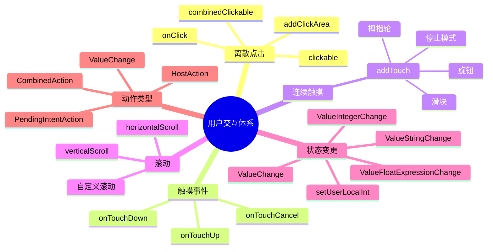

# Remote Compose 用户交互逻辑示例文档

## 目录

- [1. 概述](#1-概述)
- [2. Click 交互示例](#2-click-交互示例)
- [3. HostAction 交互示例](#3-hostaction-交互示例)
- [4. Touch 事件修饰符示例](#4-touch-事件修饰符示例)
- [5. addTouch 连续触摸交互示例](#5-addtouch-连续触摸交互示例)
- [6. Scroll 滚动交互示例](#6-scroll-滚动交互示例)
- [7. State/Variable 变更交互示例](#7-statevariable-变更交互示例)
- [8. Action 体系参考](#8-action-体系参考)
- [9. 无 Demo 示例的交互 API](#9-无-demo-示例的交互-api)
- [10. 示例统计总览](#10-示例统计总览)

***

## 1. 概述

Remote Compose 的用户交互体系分为三大类别：

1. **离散点击交互**：onClick、clickable、combinedClickable、addClickArea
2. **触摸事件交互**：onTouchDown、onTouchUp、onTouchCancel
3. **连续触摸交互**：addTouch（滑块、旋钮、拇指轮等）

动作类型分为四种：

- **HostAction**：向宿主应用发送命名动作，宿主通过 `onNamedAction` 回调接收
- **ValueChange**：直接更新远程状态变量，在 Player 端执行，零延迟
- **PendingIntentAction**：发送 Android PendingIntent
- **CombinedAction**：组合多个动作顺序执行



***

## 2. Click 交互示例

### 2.1 DemoModifierOnClick — 原子级 onClick

- **文件**: `integration-tests/player-view-demos/.../examples/components/DemoModifierOnClick.kt`
- **API 风格**: 过程式 DSL
- **交互逻辑**: 点击红色方块，通过 `ValueIntegerChange` 将整型状态从 0 切换为 1

```kotlin
val stateId = addInteger(0).toInt()
val toggleAction = ValueIntegerChange(stateId, 1)
box(Modifier.size(200).background(Color.RED).onClick(toggleAction)) {
    text("Tap Me", color = Color.WHITE)
}
```

### 2.2 RcClicksDemo — 综合点击交互

- **文件**: `integration-tests/player-view-demos/.../examples/RcClicks.kt`
- **API 风格**: 过程式 DSL
- **交互逻辑**: 展示三种点击交互（单击/长按/双击），每种有独立计数器，重置按钮同时触发多个动作

```kotlin
val clickCount = addNamedFloat("clickCount", 0f)
val longPressCount = addNamedFloat("longPressCount", 0f)
val doubleTapCount = addNamedFloat("doubleTapCount", 0f)

// 单击
column(Modifier.fillMaxWidth().background(Color.LTGRAY).padding(20f)
    .onClick(ValueFloatExpressionChange(
        Utils.idFromNan(clickCount),
        Utils.idFromNan((this.rf(clickCount) + 1f).toFloat())))) {
    text(string = "Single Click Me")
}

// 长按
column(Modifier.fillMaxWidth().background(Color.LTGRAY).padding(20f)
    .onLongClick(ValueFloatExpressionChange(
        Utils.idFromNan(longPressCount),
        Utils.idFromNan((this.rf(longPressCount) + 1f).toFloat())))) {
    text(string = "Long Press Me")
}

// 双击
column(Modifier.fillMaxWidth().background(Color.LTGRAY).padding(20f)
    .onDoubleClick(ValueFloatExpressionChange(
        Utils.idFromNan(doubleTapCount),
        Utils.idFromNan((this.rf(doubleTapCount) + 1f).toFloat())))) {
    text(string = "Double Tap Me")
}

// 重置按钮 - 一次触发多个动作
column(Modifier.fillMaxWidth().background(Color.RED).padding(10f)
    .onClick(
        ValueFloatExpressionChange(Utils.idFromNan(clickCount), Utils.idFromNan((rf(0f).toFloat()))),
        ValueFloatExpressionChange(Utils.idFromNan(longPressCount), Utils.idFromNan((rf(0f).toFloat()))),
        ValueFloatExpressionChange(Utils.idFromNan(doubleTapCount), Utils.idFromNan((rf(0f).toFloat()))))) {
    text("Reset All", color = Color.WHITE)
}
```

### 2.3 SimpleClick.clickDemo1 — Java 旧式 onClick + onTouchDown

- **文件**: `integration-tests/player-view-demos/.../examples/old/SimpleClick.java`
- **API 风格**: Java 旧式 API
- **交互逻辑**: 黄色方块使用 `onTouchDown` 触发 `HostAction(567)`，红色方块使用 `onClick` 触发 `HostAction(568)`

```java
Action action = new HostAction(567);
Action action2 = new HostAction(568);
rc.box(new RecordingModifier().background(Color.YELLOW).onTouchDown(action), ...);
rc.box(new RecordingModifier().background(Color.RED).onClick(action2), ...);
```

### 2.4 SimpleClick.clickDemo2 — addClickArea API

- **文件**: 同上
- **API 风格**: Java 旧式 API
- **交互逻辑**: 在画布上定义矩形点击区域，点击后触发 `HostAction(567)`

```java
rc.addClickArea(567, "This click area", x, y, x + w, y + h, "bob");
```

### 2.5 ClickableDemo — Compose 风格 clickable

- **文件**: `integration-tests/demos/.../modifier/ClickableDemo.kt`
- **API 风格**: Compose 风格 (@RemoteComposable)
- **交互逻辑**: 点击灰色方块，通过 `ValueChange` 将计数器加 1

```kotlin
val clickCounter = rememberMutableRemoteInt(0)
val onClickAction = ValueChange(clickCounter, clickCounter + 1)
RemoteBox(
    modifier = RemoteModifier.size(width = 200.rdp, height = 100.rdp)
        .background(RemoteColor(Color.LightGray))
        .clickable(onClickAction)
) { RemoteText("Tap me!") }
```

### 2.6 CombinedClickableDemo — 组合点击

- **文件**: `integration-tests/demos/.../modifier/CombinedClickableDemo.kt`
- **API 风格**: Compose 风格
- **交互逻辑**: 使用 `combinedClickable` 同时处理单击、长按、双击，每种手势有独立计数器

```kotlin
val onClickAction = ValueChange(clickCounter, clickCounter + 1)
val onLongClickAction = ValueChange(longClickCounter, longClickCounter + 1)
val onDoubleClickAction = ValueChange(doubleClickCounter, doubleClickCounter + 1)
RemoteBox(
    modifier = RemoteModifier.size(width = 200.rdp, height = 100.rdp)
        .combinedClickable(
            onClick = onClickAction,
            onLongClick = onLongClickAction,
            onDoubleClick = onDoubleClickAction)
)
```

### 2.7 dslDemo — 新 DSL onClick + setValue

- **文件**: `integration-tests/player-view-demos/.../dsl/RcDslDemo.kt`
- **API 风格**: 新 Kotlin DSL
- **交互逻辑**: 使用 `onClick` 修饰符，点击后通过 `setValue` 修改变量值

```kotlin
Box(modifier = Modifier.size(200f, 100f).background(0xFFFF0000).padding(10f).onClick {
    setValue(count, 1f)
    setValue(textVar, "Button Clicked!")
})
```

### 2.8 BasicProceduralDemos.simple3 — Java addClickArea

- **文件**: `integration-tests/player-view-demos/.../examples/old/BasicProceduralDemos.java`
- **API 风格**: Java 旧式 API
- **交互逻辑**: 在画布上添加覆盖整个 300x300 区域的点击区域

```java
rcDoc.addClickArea(232, "foo", 0, 0, 300, 300, "bar");
```

### 2.9 baseClock — 过程式 addClickArea

- **文件**: `integration-tests/player-view-demos/.../examples/old/SimpleDocs.kt`
- **API 风格**: 过程式 DSL
- **交互逻辑**: 在时钟表盘上添加点击区域

```kotlin
addClickArea(567, "clock face", 0f, 0f, 600f, 600f, "1234")
```

***

## 3. HostAction 交互示例

### 3.1 GesturePropagationDemo — HostAction vs ValueChange 对比

- **文件**: `integration-tests/demos/.../integration/GesturePropagationDemo.kt`
- **API 风格**: Compose 风格
- **交互逻辑**: 红色方块使用 `hostAction` 将事件传递给宿主应用（通过 `onNamedAction` 回调），绿色方块使用 `ValueChange` 在文档内部更新状态。同时展示 `clickable` 和 `combinedClickable` 两种修饰符。

```kotlin
// HostAction 方式 - 事件传递给宿主
RemoteBox(
    modifier = RemoteModifier.size(80.rdp)
        .background(RemoteColor(Color.Red))
        .clickable(hostAction(remoteComposeClick.rs))
) { RemoteText("HostAction.") }

// ValueChange 方式 - 文档内部状态变更
RemoteBox(
    modifier = RemoteModifier.size(80.rdp)
        .background(RemoteColor(Color.Green))
        .clickable(ValueChange(clickCount, clickCount + 1))
) { RemoteText("ValueChange.") }

// combinedClickable + HostAction
RemoteBox(
    modifier = RemoteModifier.size(80.rdp)
        .background(RemoteColor(Color.Red))
        .combinedClickable(
            onClick = hostAction(remoteComposeClick.rs),
            onDoubleClick = hostAction(remoteComposeDoubleClick.rs),
            onLongClick = hostAction(remoteComposeLongClick.rs))
) { RemoteText("HostAction.") }

// 宿主端回调处理
RemoteDemo(
    onNamedAction = { name, _, _ ->
        when (name) {
            remoteComposeClick -> remoteComposeClickCounter++
            remoteComposeDoubleClick -> remoteComposeDoubleClickCounter++
            remoteComposeLongClick -> remoteComposeLongClickCounter++
        }
    }
) { ... }
```

### 3.2 RcTicker.refreshIcon — onTouchDown + HostAction

- **文件**: `integration-tests/player-view-demos/.../examples/RcTicker.kt`
- **API 风格**: 过程式 DSL
- **交互逻辑**: 刷新图标使用 `onTouchDown` 触发 `HostAction(567, textCreateId("refresh"))`，将点击事件传递给宿主应用

```kotlin
val action = HostAction(567, textCreateId("refresh"))
canvas(Modifier.size(size).onTouchDown(action)) {
    val path = refreshPath()
    scale(size / 960f, size / 960f)
    painter.setColorId(color.textColorId).commit()
    drawPath(path)
}
```

### 3.3 SimpleClick.clickDemo1 — HostAction ID 动作

（已在 2.3 节描述，此处引用）

***

## 4. Touch 事件修饰符示例

### 4.1 DemoModifierOnTouchDown — onTouchDown

- **文件**: `integration-tests/player-view-demos/.../examples/components/DemoModifierOnTouchDown.kt`
- **API 风格**: 过程式 DSL
- **交互逻辑**: 按下蓝色方块时，通过 `ValueIntegerChange` 将状态设为 2

```kotlin
val stateId = addInteger(0).toInt()
val action = ValueIntegerChange(stateId, 2)
box(Modifier.size(200).background(Color.BLUE).onTouchDown(action)) {
    text("Press Down", color = Color.WHITE)
}
```

### 4.2 DemoModifierOnTouchUp — onTouchUp

- **文件**: `integration-tests/player-view-demos/.../examples/components/DemoModifierOnTouchUp.kt`
- **API 风格**: 过程式 DSL
- **交互逻辑**: 手指抬起时，通过 `ValueIntegerChange` 将状态设为 3

```kotlin
val stateId = addInteger(0).toInt()
val action = ValueIntegerChange(stateId, 3)
box(Modifier.size(200).background(Color.GREEN).onTouchUp(action)) {
    text("Release Up", color = Color.WHITE)
}
```

### 4.3 DemoModifierOnTouchCancel — onTouchCancel

- **文件**: `integration-tests/player-view-demos/.../examples/components/DemoModifierOnTouchCancel.kt`
- **API 风格**: 过程式 DSL
- **交互逻辑**: 触摸被中断时，通过 `ValueIntegerChange` 将状态设为 4

```kotlin
val stateId = addInteger(0).toInt()
val action = ValueIntegerChange(stateId, 4)
box(Modifier.size(200).background(Color.DKGRAY).onTouchCancel(action)) {
    text("Touch Cancel", color = Color.WHITE)
}
```

### 4.4 TouchActionDemo — Compose 风格 onTouchDown + onTouchUp

- **文件**: `integration-tests/demos/.../modifier/TouchActionDemo.kt`
- **API 风格**: Compose 风格
- **交互逻辑**: 分别有按下计数器和抬起计数器

```kotlin
val downCounter = rememberMutableRemoteInt(0)
val upCounter = rememberMutableRemoteInt(0)
val onDownAction = ValueChange(downCounter, downCounter + 1)
val onUpAction = ValueChange(upCounter, upCounter + 1)
RemoteBox(
    modifier = RemoteModifier.size(width = 200.rdp, height = 100.rdp)
        .background(RemoteColor(Color.LightGray))
        .onTouchDown(onDownAction)
        .onTouchUp(onUpAction)
)
```

***

## 5. addTouch 连续触摸交互示例

### 5.1 demoTouch1 — 水平滑块

- **文件**: `integration-tests/player-view-demos/.../examples/DemoTouch.kt`
- **API 风格**: 过程式 DSL（底层 addTouch API）
- **交互逻辑**: 触摸位置映射到 X 轴坐标，使用 `STOP_INSTANTLY` 模式（松手即停）

```kotlin
val pos = rcDoc.addTouch(
    cx, left, right,
    RemoteComposeWriter.STOP_INSTANTLY.toInt(), 0f, 0, null, null,
    RemoteContext.FLOAT_TOUCH_POS_X, 1f, AnimatedFloatExpression.MUL)
```

### 5.2 demoTouch2 — 垂直滑块

- **文件**: 同上
- **交互逻辑**: 触摸位置映射到 Y 轴坐标，使用 `STOP_GENTLY` 模式（惯性减速）

```kotlin
val pos = rcDoc.addTouch(
    cy, top, bottom,
    RemoteComposeWriter.STOP_GENTLY.toInt(), 0f, 4, null, null,
    RemoteContext.FLOAT_TOUCH_POS_Y)
```

### 5.3 demoTouch3 — 旋转旋钮

- **文件**: 同上
- **交互逻辑**: 使用 `ATAN2` 表达式将触摸坐标映射为角度值，支持多种停止模式

```kotlin
val pos = rcDoc.addTouch(
    180f, 30f, 330f, mode, 0f, 4, spec, null,
    tx, cx, AnimatedFloatExpression.SUB,    // touchX - centerX
    ty, cy, AnimatedFloatExpression.SUB,    // touchY - centerY
    AnimatedFloatExpression.ATAN2,           // arctan2
    -180 / 3.141f, AnimatedFloatExpression.MUL,  // 转角度
    360f, AnimatedFloatExpression.ADD,
    360f, AnimatedFloatExpression.MOD)
rcDoc.rotate(pos, cx, cy)  // 用触摸值旋转指示器
```

### 5.4 七种停止模式

- **文件**: 同上
- **交互逻辑**: 7 个函数分别演示 addTouch 的 7 种停止模式

| 函数                           | 停止模式                    | 说明      |
| ---------------------------- | ----------------------- | ------- |
| `touchStopGently()`          | STOP\_GENTLY            | 惯性减速    |
| `touchStopEnds()`            | STOP\_ENDS              | 吸附到两端   |
| `touchStopInstantly()`       | STOP\_INSTANTLY         | 松手即停    |
| `touchStopNotchesEven()`     | STOP\_NOTCHES\_EVEN     | 均匀刻度吸附  |
| `touchStopNotchesPercents()` | STOP\_NOTCHES\_PERCENTS | 百分比刻度吸附 |
| `touchStopNotchesAbsolute()` | STOP\_NOTCHES\_ABSOLUTE | 绝对值刻度吸附 |
| `touchStopAbsolutePos()`     | STOP\_ABSOLUTE\_POS     | 跳转到触摸位置 |

### 5.5 demoTouchWrap — 环形旋钮 + 自定义缓动

- **文件**: 同上
- **交互逻辑**: 支持值环绕（NaN 作为 min），并使用自定义 easing 缓动

```kotlin
val pos = rcDoc.addTouch(
    180f, Float.NaN, 360f, mode, 0f, 4, spec,
    rcDoc.easing(5f, 0.2f, 1f), ...)
```

### 5.6 demoTouchThumbWheel1 — 单拇指轮

- **文件**: 同上
- **交互逻辑**: 使用 `addTouch` + `startLoop` 创建拇指轮选择器，触摸 Y 位置映射为旋转角度

```kotlin
val touch = rcDoc.addTouch(
    0f, Float.NaN, 360f,
    RemoteComposeWriter.STOP_NOTCHES_EVEN.toInt(), 0f, 4,
    floatArrayOf(10f), rcDoc.easing(10f, 2f, 60f),
    RemoteContext.FLOAT_TOUCH_POS_Y, 0.2f, AnimatedFloatExpression.MUL)
```

### 5.7 demoTouchThumbWheel2 — 双拇指轮联动

- **文件**: 同上
- **交互逻辑**: 两个滚轮并排，左侧滚轮选择触觉反馈类型，右侧滚轮的 notch 数量由左侧滚轮的值决定（通过 `ID_REFERENCE` 引用）

```kotlin
val touch = rcDoc.addTouch(
    0f, Float.NaN, 360f,
    RemoteComposeWriter.STOP_NOTCHES_EVEN.toInt(), 0f,
    clickIdRef or RemoteComposeWriter.ID_REFERENCE, ...)
```

### 5.8 simpleJavaAnim — 触摸驱动缩放动画

- **文件**: 同上
- **交互逻辑**: 触摸 X 位置映射为 0-1 的值，驱动椭圆的水平缩放和颜色变化

```kotlin
val pos = rcDoc.addTouch(
    0f, Float.NaN, 1f,
    RemoteComposeWriter.STOP_INSTANTLY.toInt(), 0f, 0, null, null,
    RemoteContext.FLOAT_TOUCH_POS_X,
    rcDoc.ComponentWidth().toFloat(), Rc.FloatExpression.DIV)
val anim = rcDoc.rf(pos) * 2f - 1f
```

### 5.9 DemoFlick.flickTest — Flick 滑动

- **文件**: `integration-tests/player-view-demos/.../examples/old/DemoFlick.java`
- **API 风格**: Java 旧式 API
- **交互逻辑**: Flick 滑动交互，使用 `STOP_NOTCHES_EVEN` 模式，5 个刻度位置

```java
float yPos = rc.addTouch(top, top, bottom,
    TouchExpression.STOP_NOTCHES_EVEN, 0f, 0,
    new float[]{clicks}, null,
    RemoteContext.FLOAT_TOUCH_POS_Y, 1, MUL);
```

### 5.10 HapticDemo.demoHaptic1 — 触觉反馈

- **文件**: `integration-tests/player-view-demos/.../examples/old/HapticDemo.java`
- **API 风格**: Java 旧式 API
- **交互逻辑**: 使用 `addTouch` 追踪触摸位置，通过 `impulse` + `performHaptic(8)` 在触摸时触发触觉反馈

```java
float tx = rc.addTouch(0, 0, w, STOP_ABSOLUTE_POS, 0, 0, null, null,
    RemoteContext.FLOAT_TOUCH_POS_X);
float ty = rc.addTouch(0, 0, w, STOP_ABSOLUTE_POS, 0, 0, null, null,
    RemoteContext.FLOAT_TOUCH_POS_Y);
rc.impulse(0.1f, event);
rc.performHaptic(8);
rc.impulseProcess();
rc.drawCircle(tx, ty, 60);
```

### 5.11 ImpulseDemo — 触摸驱动粒子动画

- **文件**: `integration-tests/player-view-demos/.../examples/ImpulseDemo.java` 和 `.../examples/old/ImpulseDemo.java`
- **API 风格**: Java 旧式 API
- **交互逻辑**: 使用 `addTouch` 追踪触摸位置，结合 `impulse` + `createParticles` + `particlesLoop` 创建触摸触发的粒子动画（气球 balloonDemo、爱心 heartsDemo、五彩纸屑 confettiDemo）。触摸速度 `FLOAT_TOUCH_VEL_X/Y` 也被用于粒子初始速度。

```java
float ty = rcDoc.addTouch(cy, 0, FLOAT_WINDOW_HEIGHT,
    RemoteComposeWriter.STOP_ABSOLUTE_POS, 0, 0, null, null,
    new float[]{RemoteContext.FLOAT_TOUCH_POS_Y});
float tx = rcDoc.addTouch(cx, 0, FLOAT_WINDOW_WIDTH,
    RemoteComposeWriter.STOP_ABSOLUTE_POS, 0, 0, null, null,
    new float[]{RemoteContext.FLOAT_TOUCH_POS_X});
float event = RemoteContext.FLOAT_TOUCH_EVENT_TIME;
// 粒子使用触摸速度
{RAND, SQRT, RAND, SQRT, SUB, 10f, MUL,
 RemoteContext.FLOAT_TOUCH_VEL_X, ADD}
```

***

## 6. Scroll 滚动交互示例

### 6.1 DemoModifierHorizontalScroll — 水平滚动

- **文件**: `integration-tests/player-view-demos/.../examples/components/DemoModifierHorizontalScroll.kt`
- **API 风格**: 过程式 DSL
- **交互逻辑**: 20 个红色方块的行可以水平滚动

```kotlin
row(Modifier.fillMaxSize().horizontalScroll().background(Color.LTGRAY)) {
    for (i in 1..20) {
        box(Modifier.size(100).margin(5).background(Color.RED)) { text("$i") }
    }
}
```

### 6.2 DemoModifierVerticalScroll — 垂直滚动

- **文件**: `integration-tests/player-view-demos/.../examples/components/DemoModifierVerticalScroll.kt`
- **API 风格**: 过程式 DSL
- **交互逻辑**: 20 个文本项的列可以垂直滚动

```kotlin
column(Modifier.fillMaxSize().verticalScroll().background(Color.LTGRAY)) {
    for (i in 1..20) { text("Item $i") }
}
```

### 6.3 RcScrollview — DSL 风格垂直滚动

- **文件**: `integration-tests/player-view-demos/.../examples/RcScrollview.kt`
- **API 风格**: 过程式 DSL
- **交互逻辑**: 使用 `verticalScroll` 修饰符，包含多种 `fillParentMax` 变体

```kotlin
column(Modifier.fillMaxSize().background(Color.DKGRAY).verticalScroll(), ...)
```

### 6.4 ScrollViewDemo — Compose 风格滚动 + graphicsLayer

- **文件**: `integration-tests/player-view-demos/.../examples/ScrollView.kt`
- **API 风格**: Compose 风格
- **交互逻辑**: 使用 `rememberRemoteScrollState` 跟踪滚动位置，滚动位置驱动日历卡片的缩放和旋转效果

```kotlin
val scrollState = rememberRemoteScrollState(evenNotches = numElements)
RemoteColumn(
    modifier = RemoteModifier.fillMaxWidth().height(h2)
        .clip(RemoteRectangleShape)
        .verticalScroll(scrollState)
) {
    for (i in 0 until numElements) {
        val scale = 0.8f.rf + (1.rf - abs(scrollState.positionState - (height * i.toFloat())) / height) * 0.2f
        val rotation = (abs(scrollState.positionState - (height * i.toFloat())) / height) * 40f
        CanvasCalendarMonth(modifier = RemoteModifier.graphicsLayer(
            scaleX = scale, scaleY = scale, rotationX = rotation) ...)
    }
}
```

### 6.5 RcTicker.MyScroll — 自定义滚动条

- **文件**: `integration-tests/player-view-demos/.../examples/RcTicker.kt`
- **API 风格**: 过程式 DSL
- **交互逻辑**: 使用 `verticalScroll` 创建可滚动内容，并在 Canvas 上绘制自定义滚动条，滚动条透明度根据触摸时间动态变化

```kotlin
val position = rf(0f)
column(Modifier.fillMaxSize().componentId(4343).verticalScroll(position.toFloat())) { ... }
scrollbar1(color.stockNameId, position, sHeight)
```

### 6.6 RcDslTicker.MyScroll — DSL 风格自定义滚动条

- **文件**: `integration-tests/player-view-demos/.../dsl/RcDslTicker.kt`
- **API 风格**: 新 Kotlin DSL
- **交互逻辑**: 使用新 DSL 风格的 `verticalScroll`，带有自定义滚动条

```kotlin
val position = 0f.rf
Column(modifier = Modifier.fillMaxSize().componentId(4343).verticalScroll(position)) { ... }
Canvas(modifier = Modifier.fillMaxSize()) { Scrollbar(...) }
```

### 6.7 CustomScroller — 自定义滚动修饰符

- **文件**: `integration-tests/player-view-demos/.../examples/old/CustomScroller.java`
- **API 风格**: Java 旧式 API
- **交互逻辑**: 实现自定义 `RecordingModifier.Element`，内部使用 `ScrollModifierOperation` + `addTouchExpression` + `STOP_NOTCHES_EVEN` 创建带刻度的滚动行为

```java
ScrollModifierOperation.apply(writer.getBuffer().getBuffer(), direction, scrollPosition, max, notchMax);
writer.getBuffer().addTouchExpression(
    Utils.idFromNan(touchPosition), 0f, Float.NaN,
    notches + 1, 0f, 3,
    new float[]{touchExpressionDirection, max, DIV, notches + 1, MUL, -1, MUL},
    TouchExpression.STOP_NOTCHES_EVEN,
    new float[]{notches + 1},
    writer.easing(0.5f, 10f, 0.1f));
```

***

## 7. State/Variable 变更交互示例

### 7.1 RcSimpleSwitchDemo — 开关切换

- **文件**: `integration-tests/player-view-demos/.../examples/RcSimpleSwitchDemo.kt`
- **API 风格**: 过程式 DSL
- **交互逻辑**: 使用 `integerExpression` 计算切换表达式 `(checked + 1) % 2`，通过 `ValueIntegerExpressionChange` 在点击时切换开关状态，使用 `stateLayout` 根据状态显示不同的 UI

```kotlin
val toggleExpr = integerExpression(checked, 1L, Rc.IntegerExpression.L_ADD, 2, Rc.IntegerExpression.L_MOD)
val toggleAction = ValueIntegerExpressionChange(checked, toggleExpr)
box(Modifier.padding(4f).onClick(toggleAction)) {
    stateLayout(Modifier, checked.toInt()) {
        // OFF state -> 灰色开关
        // ON state -> 蓝色开关
    }
}
```

### 7.2 SwitchWidget — Compose 风格开关

- **文件**: `integration-tests/player-view-demos/.../examples/SwitchWidget.kt`
- **API 风格**: Compose 风格
- **交互逻辑**: 使用 `clickable` + `ValueChange` 切换 `MutableRemoteEnum` 状态，`RemoteStateLayout` 根据枚举值显示不同的开关外观

```kotlin
val modifier = RemoteModifier.clickable(
    ValueChange(remoteState = value.remoteInt, updatedValue = (value.remoteInt + 1) % 2))
RemoteStateLayout(modifier = RemoteModifier.wrapContentSize(), state = value) { state ->
    when (state) {
        Off -> SwitchWidgetOffState(modifier = modifierSize)
        On -> SwitchWidgetOnState(modifier = modifierSize)
    }
}
```

### 7.3 RcSwitchWidgetDemo — DSL 风格开关 + Macro

- **文件**: `integration-tests/player-view-demos/.../examples/RcSwitchWidgetDemo.kt`
- **API 风格**: 过程式 DSL + Macro
- **交互逻辑**: 使用 Macro 定义可复用的开关组件，在 Macro 内部使用 `ValueIntegerExpressionChange` 实现切换逻辑

```kotlin
val toggleExpr = integerExpression(stateId, 1L, Rc.IntegerExpression.L_ADD, 2, Rc.IntegerExpression.L_MOD)
val toggleAction = ValueIntegerExpressionChange(stateId, toggleExpr)
box(Modifier.width(80f).height(37f).padding(4f).onClick(toggleAction)) {
    stateLayout(Modifier.fillMaxSize(), stateParam) { ... }
}
```

### 7.4 RcMacroDemo — Macro 按钮 + ValueStringChange

- **文件**: `integration-tests/player-view-demos/.../examples/RcMacroDemo.kt`
- **API 风格**: 过程式 DSL + Macro
- **交互逻辑**: 使用 `ValueStringChange` 在点击按钮时更新文本内容

```kotlin
// 非 Macro 版本
box(Modifier.padding(16).clip(...).background(...).padding(24)
    .onClick(ValueStringChange(id, "Test $data")))

// Macro 版本
definePattern("GlimmerButton", ...) {
    box(Modifier.padding(16).clip(...).background(...).padding(24)
        .onClick(ValueStringChange(textTargetId, clickDataParam)))
}
```

### 7.5 RcMacroLocalDemo — Macro-Local 独立计数器

- **文件**: `integration-tests/player-view-demos/.../examples/RcMacroLocalDemo.kt`
- **API 风格**: 过程式 DSL + Macro
- **交互逻辑**: 使用 Macro-Local ID (0x4000-0x4FFF 范围)，每个 Macro 实例有独立的内部计数器状态

```kotlin
val localCounterIntId = 0x4000  // Macro-Local 范围
val nextValueExprId = floatExpression(floatId(localCounterIntId), 1f, AnimatedFloatExpression.ADD)
column(Modifier.fillMaxWidth().padding(10f).clip(...).background(Color.LTGRAY).padding(20f)
    .onClick(ValueFloatExpressionChange(localCounterIntId, Utils.idFromNan(nextValueExprId))))
```

### 7.6 RemoteStateLayoutSimpleDemo — 宿主端驱动状态

- **文件**: `integration-tests/demos/.../layout/RemoteStateLayoutDemos.kt`
- **API 风格**: Compose 风格
- **交互逻辑**: 宿主端通过下拉菜单选择状态，然后通过 `player.setUserLocalInt(stateId, selectedState)` 将状态传递给文档

```kotlin
RemoteDemo(update = { player -> player.setUserLocalInt(stateId, selectedState) }) {
    val remoteState = rememberNamedRemoteInt(stateId, states[0])
    RemoteStateLayout(state = remoteState, states = states) { state ->
        val color = when (state) { 0 -> Color.Red; 1 -> Color.Green; 2 -> Color.Blue }
        RemoteBox(modifier = RemoteModifier.size(RemoteDp(100.dp)).background(RemoteColor(color)))
    }
}
```

### 7.7 RemoteBoxAlignmentsDemo — 宿主端驱动对齐

- **文件**: `integration-tests/demos/.../layout/RemoteBoxDemos.kt`
- **API 风格**: Compose 风格
- **交互逻辑**: 宿主端选择对齐方式，通过 `setUserLocalInt` 传递给文档

```kotlin
RemoteDemo(update = { player -> player.setUserLocalInt(ALIGNMENT_ID, selectedAlignment) }) {
    val currentState = rememberNamedRemoteInt(ALIGNMENT_ID, alignments[0].first)
    RemoteStateLayout(state = currentState, states = alignments.map { it.first }.toIntArray()) { state ->
        RemoteBox(contentAlignment = alignments[state].second) { ... }
    }
}
```

***

## 8. Action 体系参考

### 8.1 HostAction

**创建侧定义**:

```kotlin
// Compose 风格
hostAction(name = RemoteString("my_action"))
hostAction(name = RemoteString("my_action"), value = RemoteFloat(3.14f))
hostAction(name = RemoteString("my_action"), value = RemoteInt(42))
hostAction(name = RemoteString("my_action"), value = RemoteString("hello"))

// 过程式 DSL
HostAction(567)                    // ID 动作
HostAction(567, metadataId)        // 带元数据的 ID 动作
HostAction("action_name")          // 命名动作
HostAction("action_name", type, valueId)  // 带值的命名动作
```

**播放侧处理**:

```kotlin
// Compose 方式
RemoteDocumentPlayer(
    onAction = { actionId, metadata -> /* 处理 ID 动作 */ },
    onNamedAction = { name, value, stateUpdater -> /* 处理命名动作 */ },
)

// View 方式
player.addIdActionListener { id, metadata -> /* 处理 */ }
```

### 8.2 ValueChange

```kotlin
// Compose 风格
ValueChange(remoteState = clickCounter, updatedValue = clickCounter + 1)
ValueChange(remoteState = value.remoteInt, updatedValue = (value.remoteInt + 1) % 2)

// 过程式 DSL
ValueIntegerChange(stateId, 1)
ValueFloatExpressionChange(clickCount, Utils.idFromNan((rf(clickCount) + 1f).toFloat()))
ValueIntegerExpressionChange(checked, toggleExpr)
ValueStringChange(id, "New Text")
```

### 8.3 PendingIntentAction

```kotlin
@Composable
fun pendingIntentAction(pendingIntent: PendingIntent): Action
```

### 8.4 CombinedAction

```kotlin
// 组合多个动作顺序执行
combinedAction(action1, action2, action3)

// 示例：重置多个计数器
.onClick(
    combinedAction(
        ValueFloatExpressionChange(clickCount, rf(0f)),
        ValueFloatExpressionChange(longPressCount, rf(0f)),
        ValueFloatExpressionChange(doubleTapCount, rf(0f))))
```

### 8.5 RcActionScope — DSL 动作作用域

```kotlin
interface RcActionScope {
    fun setValue(variable: RcFloat, value: Float)
    fun setValue(variable: RcInteger, value: Int)
    fun setValue(variable: RcText, value: String)
    fun setValue(variable: RcFloat, expression: RcFloat)
    fun setValue(variable: RcInteger, expression: RcInteger)
    fun setValue(variable: RcBool, value: Boolean)
    fun setValue(variable: RcBool, expression: RcBool)
    fun hostAction(name: String)
}

// 使用示例
onClick {
    setValue(count, 1f)
    setValue(textVar, "Button Clicked!")
    hostAction("my_action")
}
```

***

## 9. 无 Demo 示例的交互 API

以下交互 API 已在协议层实现，但在 demo 代码中没有实际使用示例：

| API                | OpCode | 说明     | 替代方案                                          |
| ------------------ | ------ | ------ | --------------------------------------------- |
| RippleModifier     | 229    | 涟漪点击效果 | 无 demo，API 可用：`RemoteModifier.rippleEffect()` |
| MultiClickModifier | 83     | 多击事件   | 通过 `combinedClickable(onDoubleClick=...)` 替代  |
| MarqueeModifier    | 228    | 跑马灯效果  | 无 demo，API 可用：`RemoteModifier.marquee()`      |

***

## 10. 示例统计总览

| 交互类型              | 示例数量   | 关键 API                                                                                                    |
| ----------------- | ------ | --------------------------------------------------------------------------------------------------------- |
| Click             | 9      | `.onClick()`, `.clickable()`, `.combinedClickable()`, `addClickArea()`                                    |
| HostAction        | 3      | `HostAction()`, `hostAction()`, `onNamedAction`                                                           |
| Touch 事件修饰符       | 4      | `.onTouchDown()`, `.onTouchUp()`, `.onTouchCancel()`                                                      |
| addTouch 连续触摸     | 12     | `addTouch()`, STOP 模式, ATAN2 映射, 触觉反馈, 粒子动画                                                               |
| Scroll            | 7      | `.verticalScroll()`, `.horizontalScroll()`, `rememberRemoteScrollState()`                                 |
| State/Variable 变更 | 7      | `ValueChange`, `ValueIntegerChange`, `ValueFloatExpressionChange`, `ValueStringChange`, `setUserLocalInt` |
| **总计**            | **42** | <br />                                                                                                    |

