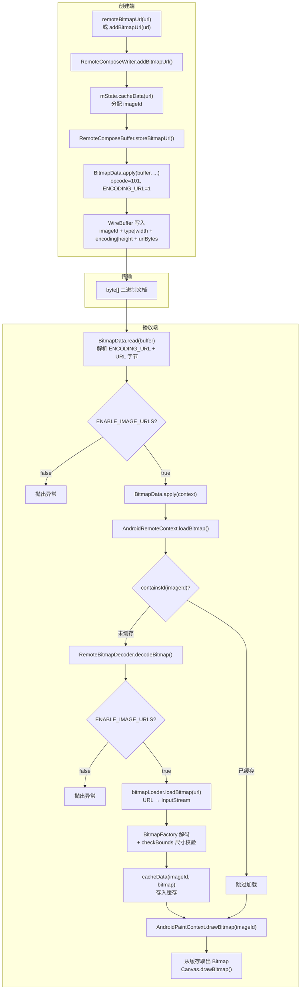
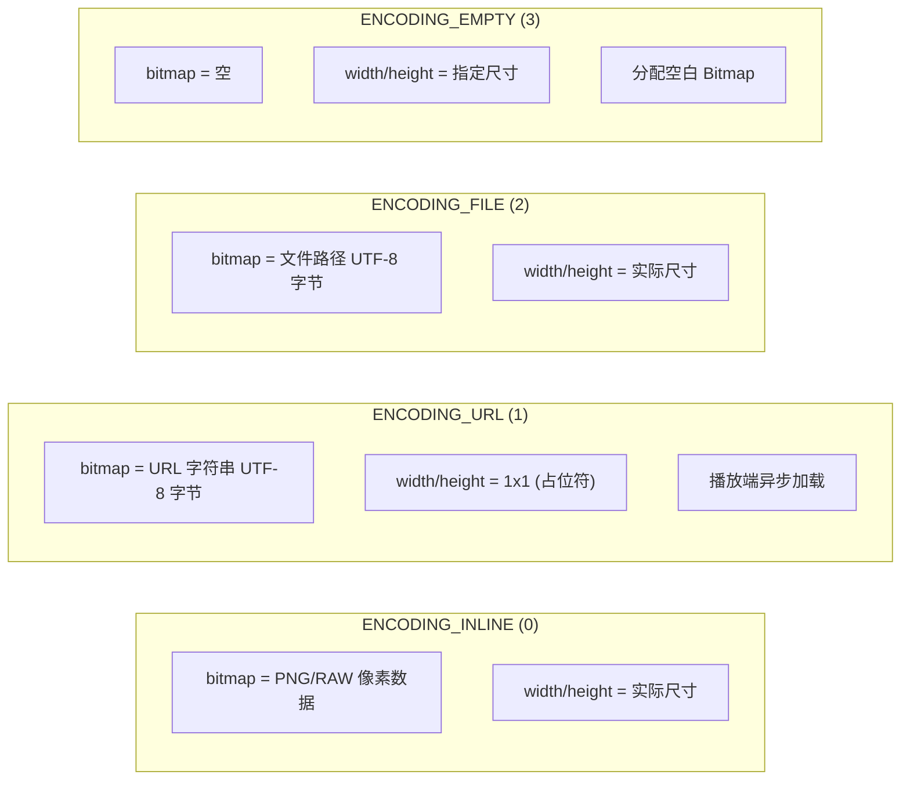

# Remote Compose Image URL 流程文档

## 1. 概述

Remote Compose 支持通过 URL 引用图像，而非将图像数据内嵌到文档中。这在以下场景中特别有用：
- 图像较大，内嵌会增加文档体积
- 图像需要动态更新（URL 指向的内容可变）
- 图像由 CDN 分发，需要按需加载

Image URL 流程跨越 3 个模块：

| 模块 | 职责 |
|---|---|
| `remote-core` | 定义 BitmapData 协议格式（4 种编码方式） |
| `remote-creation-core` / `remote-creation-compose` | 创建端 API，将 URL 写入二进制文档 |
| `remote-player-core` / `remote-player-view` | 播放端，从 URL 加载图像并显示 |

---

## 2. 创建端 — 写入 RC 文件

### 2.1 Kotlin DSL API

**文件**：`remote-creation-core/.../dsl/RcScope.kt`

```kotlin
/** 注册位图 URL 资源，返回其引用 */
public fun remoteBitmapUrl(url: String): RcImage

/** 注册命名位图 URL 资源，返回其引用 */
public fun remoteNamedBitmapUrl(name: String, url: String): RcImage
```

**实现**（`RcScopeImp.kt`）：
```kotlin
override fun remoteBitmapUrl(url: String): RcImage = RcImage(writer.addBitmapUrl(url))
override fun remoteNamedBitmapUrl(name: String, url: String): RcImage =
    RcImage(writer.addNamedBitmapUrl(name, url))
```

### 2.2 Java Writer API

**文件**：`remote-creation-core/.../RemoteComposeWriter.java`

```java
/** 添加位图 URL，返回 imageId */
public int addBitmapUrl(@NonNull String url, int width, int height) {
    int imageId = mState.dataGetId(url);     // 去重检查
    if (imageId == -1) {
        imageId = mState.cacheData(url);      // 分配 imageId
        mBuffer.storeBitmapUrl(imageId, url, width, height);  // 写入缓冲区
    }
    return imageId;
}

/** 添加位图 URL（默认宽高 1x1） */
public int addBitmapUrl(@NonNull String url) {
    return addBitmapUrl(url, 1, 1);
}

/** 添加命名位图 URL */
public int addNamedBitmapUrl(@NonNull String name, @NonNull String url) {
    int id = addBitmapUrl(url);
    mBuffer.setNamedVariable(id, name, NamedVariable.IMAGE_TYPE);
    return id;
}
```

### 2.3 Compose 状态 API

**文件**：`remote-creation-compose/.../state/RemoteBitmap.kt`

```kotlin
@Composable
public fun rememberNamedRemoteBitmap(
    name: String,
    url: String,
    domain: RemoteState.Domain = RemoteState.Domain.User,
): RemoteBitmap {
    return rememberNamedState(name, domain) {
        MutableRemoteBitmap(...) { creationState ->
            creationState.document.addNamedBitmapUrl(domain.prefixed(name), url)
        }
    }
}
```

### 2.4 序列化流程

```
Kotlin DSL: remoteBitmapUrl(url)
  → RemoteComposeWriter.addBitmapUrl(url)
    → mState.dataGetId(url)          // 去重：相同 URL 返回已有 ID
    → mState.cacheData(url)          // 分配新 imageId
    → RemoteComposeBuffer.storeBitmapUrl(imageId, url, width, height)
      → BitmapData.apply(mBuffer, imageId, TYPE_PNG, width, ENCODING_URL, height, url.getBytes(UTF_8))
        → buffer.start(101)          // opcode DATA_BITMAP
        → buffer.writeInt(imageId)
        → buffer.writeInt((TYPE_PNG << 16) | width)
        → buffer.writeInt((ENCODING_URL << 16) | height)
        → buffer.writeBuffer(url.getBytes(UTF_8))
```

### 2.5 BitmapData 线路格式

**操作码**：`Operations.DATA_BITMAP` = **101**

**4 种编码方式**：

| 常量 | 值 | 说明 |
|---|---|---|
| `ENCODING_INLINE` | 0 | 图像数据内嵌（PNG/RAW 字节） |
| `ENCODING_URL` | 1 | URL 引用，bitmap 字段存储 URL 字符串的 UTF-8 字节 |
| `ENCODING_FILE` | 2 | 文件路径引用 |
| `ENCODING_EMPTY` | 3 | 空位图，仅分配指定尺寸的空白 Bitmap |

**5 种图像类型**：

| 常量 | 值 | 说明 |
|---|---|---|
| `TYPE_PNG_8888` | 0 | PNG → ARGB_8888（默认，INLINE 模式） |
| `TYPE_PNG` | 1 | PNG 通用（URL 模式使用此类型） |
| `TYPE_RAW8` | 2 | 原始 8 位灰度 |
| `TYPE_RAW8888` | 3 | 原始 ARGB_8888 |
| `TYPE_PNG_ALPHA_8` | 4 | PNG → ALPHA_8 |

**线路字段**：

| 字段 | 类型 | 说明 |
|---|---|---|
| opcode | byte | 101 (DATA_BITMAP) |
| imageId | int | 图像唯一标识符 |
| widthAndType | int | 高 16 位 = type，低 16 位 = width |
| heightAndEncoding | int | 高 16 位 = encoding，低 16 位 = height |
| bitmap | byte[] | 编码数据（URL 模式为 UTF-8 字符串字节） |

**URL 模式示例**：`addBitmapUrl("https://example.com/image.png")`

| 字段 | 值 | 说明 |
|---|---|---|
| imageId | 如 42 | 由 cacheData 分配 |
| widthAndType | `0x00010001` | TYPE_PNG=1, width=1 |
| heightAndEncoding | `0x00010001` | ENCODING_URL=1, height=1 |
| bitmap | `"https://example.com/image.png"` 的 UTF-8 字节 | URL 字符串 |

**注意**：URL 模式下宽高默认为 1x1（占位符），播放端从 URL 加载后获取真实尺寸。

---

## 3. 播放端 — 桌面显示

### 3.1 文档解析

**文件**：`remote-core/.../operations/BitmapData.java`

`BitmapData.read()` 从 WireBuffer 读取二进制数据：
1. 读取 `imageId`
2. 读取 `widthAndType`，检测 `width > 0xffff` 则高 16 位为 type，否则 type 默认 `TYPE_PNG_8888`
3. 读取 `heightAndEncoding`，检测 `height > 0xffff` 则高 16 位为 encoding，否则 encoding 默认 `ENCODING_INLINE`
4. 读取 `byte[] bitmap` 数据
5. **安全检查**：若 `ENABLE_IMAGE_URLS == false` 且 `encoding == ENCODING_URL`，抛出异常

### 3.2 操作执行

`BitmapData.apply(RemoteContext context)` 执行两步：
```java
context.putObject(mImageId, this);  // 存储 BitmapData 对象
context.loadBitmap(mImageId, mEncoding, mType, mImageWidth, mImageHeight, mBitmap);  // 触发加载
```

`RemoteContext.loadBitmap()` 是抽象方法，由平台子类实现。

### 3.3 Android 平台实现

**文件**：`remote-player-core/.../platform/AndroidRemoteContext.java`

```java
public void loadBitmap(int imageId, short encoding, short type,
                       int width, int height, byte[] data) {
    if (!mRemoteComposeState.containsId(imageId)) {  // 去重检查
        Bitmap image = RemoteBitmapDecoder.decodeBitmap(
                imageId, encoding, type, width, height, data, mBitmapLoader);
        if (image != null) {
            mRemoteComposeState.cacheData(imageId, image);  // 缓存
        }
    }
}
```

### 3.4 RemoteBitmapDecoder — 核心解码

**文件**：`remote-player-core/.../platform/RemoteBitmapDecoder.java`

URL 模式解码流程：
```java
case BitmapData.ENCODING_URL: {
    if (!Limits.ENABLE_IMAGE_URLS) {           // 第二道安全门控
        throw new RuntimeException("URL image not supported");
    }
    try (InputStream is = bitmapLoader.loadBitmap(
            new String(data, StandardCharsets.UTF_8))) {  // URL → InputStream
        BufferedInputStream bis = new BufferedInputStream(is);
        if (CHECK_DATA_SIZE) {
            bis.mark(MAX_IMAGE_HEADER_BUFFER_SIZE);
            BitmapFactory.Options opts = new BitmapFactory.Options();
            opts.inJustDecodeBounds = true;
            BitmapFactory.decodeStream(bis, null, opts);
            checkBounds(opts, width, height);   // 尺寸校验
            bis.reset();
        }
        image = BitmapFactory.decodeStream(bis);  // 实际解码
    }
    break;
}
```

### 3.5 BitmapLoader 接口

**文件**：`remote-player-core/.../platform/BitmapLoader.java`

```java
public interface BitmapLoader {
    InputStream loadBitmap(String url) throws IOException;
    
    BitmapLoader UNSUPPORTED = url -> {
        throw new IOException("BitmapLoader not supported");
    };
}
```

**默认实现** — `AndroidBitmapLoader`：
```java
public InputStream loadBitmap(String url) throws IOException {
    return java.net.URI.create(url).toURL().openStream();
}
```

### 3.6 自定义 BitmapLoader 注入

**View 层**（`RemoteComposePlayer`）：
```java
public void setBitmapLoader(@NonNull BitmapLoader bitmapLoader) {
    ((AndroidRemoteContext) mRemoteContext).setBitmapLoader(bitmapLoader);
}
```

### 3.7 绘制时使用

**文件**：`remote-player-core/.../platform/AndroidPaintContext.java`

```java
public void drawBitmap(int imageId, ...) {
    AndroidRemoteContext ctx = (AndroidRemoteContext) mContext;
    if (ctx.mRemoteComposeState.containsId(imageId)) {
        Bitmap bitmap = (Bitmap) ctx.mRemoteComposeState.getFromId(imageId);
        mCanvas.drawBitmap(bitmap, src, dst, mPaint);
    }
    // 如果缓存中没有（URL 加载失败），静默跳过
}
```

---

## 4. 安全机制

### 4.1 双层 ENABLE_IMAGE_URLS 门控

| 阶段 | 位置 | 行为 |
|---|---|---|
| 解析阶段 | `BitmapData.read()` | `ENABLE_IMAGE_URLS == false` 时抛异常，文档无法加载 |
| 解码阶段 | `RemoteBitmapDecoder.decodeBitmap()` | `ENABLE_IMAGE_URLS == false` 时抛异常，图像无法解码 |

当前 `Limits.ENABLE_IMAGE_URLS` 默认值为 `true`。

### 4.2 尺寸校验防恶意文档

`RemoteBitmapDecoder.checkBounds()` 验证实际图像尺寸不超过文档声明的 width/height，防止"声明小尺寸、实际返回大图"的攻击。

### 4.3 全局限制

| 常量 | 值 | 说明 |
|---|---|---|
| `MAX_IMAGE_DIMENSION` | 8000 | 图片最大尺寸 |
| `MAX_BITMAP_MEMORY` | 20MB | 单播放器位图内存上限 |

---

## 5. 缓存机制

| 特性 | 说明 |
|---|---|
| 存储结构 | `RemoteComposeState.IntMap<Object> mIntDataMap`，以 imageId 为键 |
| 缓存写入 | `cacheData(imageId, bitmap)` — 双向映射 |
| 缓存查询 | `containsId(imageId)` 检查，`getFromId(imageId)` 获取 |
| 去重策略 | `loadBitmap()` 中先检查 `containsId()`，已缓存则跳过 |
| 淘汰机制 | 无 LRU/淘汰，缓存持续存在直到文档/上下文销毁 |
| URL 缓存 | 无内置 HTTP 缓存，每次加载同一 URL 都重新请求 |

---

## 6. 完整流程图

### 6.1 端到端流程



### 6.2 BitmapData 编码格式对比



---

## 7. 使用方法与最佳实践

### 7.1 Kotlin DSL 创建 URL 图像

```kotlin
val buffer = createRcBuffer(profile) {
    // 注册 URL 图像
    val imageUrl = remoteBitmapUrl("https://example.com/photo.png")

    // 注册命名 URL 图像（可被宿主端覆盖）
    val namedImage = remoteNamedBitmapUrl("avatar", "https://example.com/avatar.png")

    // 使用图像
    drawBitmap(imageUrl, 0f, 0f, 100f, 100f, painter)
}
```

### 7.2 Java Writer 创建 URL 图像

```java
RemoteComposeWriter writer = profile.create(displayInfo, null);
int imageId = writer.addBitmapUrl("https://example.com/photo.png");
writer.drawBitmap(imageId, 0, 0, 100, 100, painter.commit());
```

### 7.3 Compose 声明式创建

```kotlin
@RemoteComposable
@Composable
fun RemoteAvatar(url: String) {
    val bitmap = rememberNamedRemoteBitmap("avatar", url)
    RemoteImage(
        bitmap = bitmap,
        contentScale = RcContentScale.Crop,
        modifier = RemoteModifier.size(48.rdp)
    )
}
```

### 7.4 播放端自定义 BitmapLoader

```kotlin
// 注入带缓存和异步的 BitmapLoader
val player = RemoteComposePlayer(context)
player.setBitmapLoader(object : BitmapLoader {
    private val cache = LruCache<String, Bitmap>(10 * 1024 * 1024) // 10MB

    override fun loadBitmap(url: String): InputStream {
        // 1. 检查内存缓存
        cache.get(url)?.let { bitmap ->
            val bos = ByteArrayOutputStream()
            bitmap.compress(Bitmap.CompressFormat.PNG, 100, bos)
            return ByteArrayInputStream(bos.toByteArray())
        }

        // 2. 使用 OkHttp 下载（支持缓存控制）
        val client = OkHttpClient.Builder()
            .cache(Cache(cacheDir, 50 * 1024 * 1024))
            .build()
        val request = Request.Builder().url(url).build()
        val response = client.newCall(request).execute()
        return response.body!!.byteStream()
    }
})
```

### 7.5 最佳实践

| 场景 | 建议 |
|---|---|
| 小图标 (< 10KB) | 使用 `ENCODING_INLINE` 内嵌，避免额外网络请求 |
| 大图片 | 使用 `ENCODING_URL`，减少文档体积 |
| 动态更新图像 | 使用 `remoteNamedBitmapUrl()`，宿主端可通过名称覆盖 |
| 安全敏感环境 | 设置 `Limits.ENABLE_IMAGE_URLS = false` 禁用 URL 加载 |
| 生产环境 | 注入自定义 BitmapLoader，支持异步加载 + HTTP 缓存 + 错误处理 |
| 预加载 | 使用 `RemotePreparedDocument` 在显示前预加载所有图像 |

### 7.6 注意事项

1. **默认实现是同步阻塞的**：`AndroidBitmapLoader` 直接调用 `URL.openStream()`，在主线程上执行网络 I/O，可能导致 ANR。生产环境务必注入异步实现。

2. **无内置 HTTP 缓存**：默认实现没有缓存层，每次加载同一 URL 都重新请求网络。

3. **加载失败静默跳过**：如果 URL 图像加载失败（网络错误、404 等），绘制时缓存中没有该 ID，会静默跳过，不会显示占位图。

4. **宽高为占位符**：URL 模式下宽高默认 1x1，布局计算时不会考虑图像的实际尺寸。如果需要布局感知，应在创建时传入正确的宽高。
