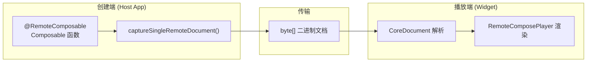

# Remote Compose Widget 开发使用指南

## 1. 概述

### 1.1 Remote Compose vs AppWidget 原生

| 特性    | AppWidget 原生                | Remote Compose               |
| ----- | --------------------------- | ---------------------------- |
| 布局方式  | XML RemoteViews             | Kotlin Composable DSL        |
| 动态更新  | AlarmManager/WorkManager 驱动 | 播放端本地动画 + 表达式                |
| 自定义绘制 | 不支持                         | RemoteCanvas 完整 2D 绘图        |
| 状态切换  | setViewVisibility()         | RemoteStateLayout 即时切换       |
| 尺寸自适应 | 多套 XML 布局                   | CollapsibleColumn/Row 按优先级折叠 |
| 交互    | PendingIntent               | HostAction + ValueChange     |
| 动画    | 不支持                         | animateFloat + 路径动画          |

**核心理念**：AppWidget 是"快照式"的——每次更新都是完整的 RemoteViews 替换；Remote Compose 是"文档式"的——创建端生成包含状态和表达式的文档，播放端根据状态变化即时响应，动画和时间驱动完全在播放端本地运行。

### 1.2 架构概览



***

## 2. 快速开始

### 2.1 最小 Widget 示例

```kotlin
@RemoteComposable
@Composable
fun MyWidget() {
    RemoteColumn(
        modifier = RemoteModifier
            .fillMaxWidth()
            .padding(16.rdp)
            .background(Color.White)
            .clip(RemoteRoundedCornerShape(16.rdp)),
        verticalArrangement = RemoteArrangement.spacedBy(8.rdp),
        horizontalAlignment = RemoteAlignment.CenterHorizontally,
    ) {
        RemoteText(
            text = "Hello Widget",
            fontSize = 24.rsp,
            fontWeight = FontWeight.Bold,
        )
        RemoteText(
            text = "Powered by Remote Compose",
            fontSize = 14.rsp,
            color = Color.Gray,
        )
    }
}
```

### 2.2 捕获并传输到 Widget

```kotlin
// 在 Service 中捕获文档
val capturedDoc = captureSingleRemoteDocument(
    creationDisplayInfo = RemoteCreationDisplayInfo(
        width = widgetWidth,
        height = widgetHeight,
        densityDpi = densityDpi
    )
) {
    MyWidget()
}

// 获取二进制数据
val bytes = capturedDoc.bytes

// 传输到 Widget 端播放
// (通过 SharedPreferences / File / ContentProvider 等)
```

### 2.3 Widget 端播放

```xml
<!-- Widget layout XML -->
<androidx.compose.remote.player.view.RemoteComposePlayer
    android:id="@+id/remote_player"
    android:layout_width="match_parent"
    android:layout_height="match_parent" />
```

```kotlin
// 在 AppWidgetProvider 或 Activity 中
val player = findViewById<RemoteComposePlayer>(R.id.remote_player)
player.displayDocument(bytes)
```

***

## 3. 布局组件详解

### 3.1 RemoteBox — 叠加容器

对应 `FrameLayout`，子元素相对于父容器边缘定位。

```kotlin
@RemoteComposable
@Composable
fun RemoteBox(
    modifier: RemoteModifier = RemoteModifier,
    contentAlignment: RemoteAlignment = RemoteAlignment.TopStart,
    content: @Composable () -> Unit,
)
```

**Widget 示例**：背景图 + 叠加文字

```kotlin
@RemoteComposable
@Composable
fun ImageWithOverlay() {
    RemoteBox(
        modifier = RemoteModifier
            .fillMaxWidth()
            .height(120.rdp),
        contentAlignment = RemoteAlignment.BottomStart,
    ) {
        // 底层：背景图
        RemoteImage(
            remoteBitmap = rememberNamedRemoteBitmap("bg", "https://example.com/bg.png"),
            contentDescription = null,
            contentScale = ContentScale.Crop,
            modifier = RemoteModifier.fillMaxSize(),
        )
        // 上层：半透明遮罩 + 文字
        RemoteBox(
            modifier = RemoteModifier
                .fillMaxWidth()
                .background(Color.Black.copy(alpha = 0.5f))
                .padding(12.rdp)
        ) {
            RemoteText("Weather", color = Color.White, fontSize = 18.rsp)
        }
    }
}
```

### 3.2 RemoteColumn — 垂直布局

对应 `LinearLayout(vertical)`。

```kotlin
@RemoteComposable
@Composable
fun RemoteColumn(
    modifier: RemoteModifier = RemoteModifier,
    verticalArrangement: RemoteArrangement.Vertical = RemoteArrangement.Top,
    horizontalAlignment: RemoteAlignment.Horizontal = RemoteAlignment.Start,
    content: @Composable RemoteColumnScope.() -> Unit,
)
```

**关键特性**：

- `RemoteModifier.weight()` — 弹性高度权重
- `RemoteArrangement.spacedBy()` — 统一间距
- `horizontalAlignment` — 子元素水平对齐

**Widget 示例**：垂直信息卡片

```kotlin
@RemoteComposable
@Composable
fun InfoCard() {
    RemoteColumn(
        modifier = RemoteModifier
            .fillMaxWidth()
            .padding(16.rdp)
            .background(Color.White, RemoteRoundedCornerShape(12.rdp))
            .padding(16.rdp),
        verticalArrangement = RemoteArrangement.spacedBy(8.rdp),
    ) {
        RemoteText("Title", fontSize = 20.rsp, fontWeight = FontWeight.Bold)
        RemoteText("Description text here", fontSize = 14.rsp, color = Color.Gray)
        RemoteSpacer(modifier = RemoteModifier.weight(1f))  // 弹性间隔
        RemoteText("Footer", fontSize = 12.rsp, color = Color.LightGray)
    }
}
```

### 3.3 RemoteRow — 水平布局

对应 `LinearLayout(horizontal)`。

```kotlin
@RemoteComposable
@Composable
fun RemoteRow(
    modifier: RemoteModifier = RemoteModifier,
    horizontalArrangement: RemoteArrangement.Horizontal = RemoteArrangement.Start,
    verticalAlignment: RemoteAlignment.Vertical = RemoteAlignment.Top,
    content: @Composable RemoteRowScope.() -> Unit,
)
```

**Widget 示例**：图标 + 文字行

```kotlin
@RemoteComposable
@Composable
fun WeatherRow(icon: RemoteBitmap, temp: String) {
    RemoteRow(
        modifier = RemoteModifier.fillMaxWidth(),
        horizontalArrangement = RemoteArrangement.SpaceBetween,
        verticalAlignment = RemoteAlignment.CenterVertically,
    ) {
        RemoteRow(
            verticalAlignment = RemoteAlignment.CenterVertically,
            horizontalArrangement = RemoteArrangement.spacedBy(8.rdp),
        ) {
            RemoteImage(icon, contentDescription = null, modifier = RemoteModifier.size(32.rdp))
            RemoteText(temp, fontSize = 32.rsp, fontWeight = FontWeight.Bold)
        }
        RemoteText("Sunny", fontSize = 16.rsp, color = Color.Gray)
    }
}
```

### 3.4 RemoteFlowRow — 流式布局

AppWidget 原生没有对应组件，自动换行排列。

```kotlin
@RemoteComposable
@Composable
fun RemoteFlowRow(
    modifier: RemoteModifier = RemoteModifier,
    horizontalArrangement: RemoteArrangement.Horizontal = RemoteArrangement.Start,
    verticalArrangement: RemoteArrangement.Vertical = RemoteArrangement.Top,
    maxItemsInEachRow: Int = Int.MAX_VALUE,
    maxLines: Int = Int.MAX_VALUE,
    content: @Composable () -> Unit,
)
```

**Widget 示例**：标签流

```kotlin
@RemoteComposable
@Composable
fun TagFlow(tags: List<String>) {
    RemoteFlowRow(
        horizontalArrangement = RemoteArrangement.spacedBy(4.rdp),
        verticalArrangement = RemoteArrangement.spacedBy(4.rdp),
    ) {
        tags.forEach { tag ->
            RemoteBox(
                modifier = RemoteModifier
                    .background(Color.Blue.copy(alpha = 0.1f), RemoteRoundedCornerShape(4.rdp))
                    .padding(horizontal = 8.rdp, vertical = 4.rdp)
            ) {
                RemoteText(tag, fontSize = 12.rsp, color = Color.Blue)
            }
        }
    }
}
```

### 3.5 RemoteCollapsibleColumn/Row — 可折叠布局

**Remote Compose 独有能力**，非常适合 Widget 在不同尺寸下自适应显示。

```kotlin
@RemoteComposable
@Composable
fun RemoteCollapsibleColumn(
    modifier: RemoteModifier = RemoteModifier,
    horizontalAlignment: RemoteAlignment.Horizontal = RemoteAlignment.Start,
    verticalArrangement: RemoteArrangement.Vertical = RemoteArrangement.Top,
    content: @Composable RemoteCollapsibleColumnScope.() -> Unit,
)
```

**关键**：`RemoteModifier.priority(Float)` — 数值越低越先被折叠。

**Widget 示例**：自适应天气卡片

```kotlin
@RemoteComposable
@Composable
fun AdaptiveWeatherCard() {
    RemoteCollapsibleColumn(
        modifier = RemoteModifier.fillMaxWidth().padding(16.rdp),
        horizontalAlignment = RemoteAlignment.CenterHorizontally,
    ) {
        // 必须显示 — 最高优先级
        RemoteText("25°C", fontSize = 48.rsp, fontWeight = FontWeight.Bold,
            modifier = RemoteModifier.priority(100f))

        // 重要信息 — 中等优先级
        RemoteText("Sunny", fontSize = 18.rsp,
            modifier = RemoteModifier.priority(50f))

        // 详细信息 — 低优先级，空间不足时折叠
        RemoteRow(
            horizontalArrangement = RemoteArrangement.spacedBy(16.rdp),
            modifier = RemoteModifier.priority(10f),
        ) {
            RemoteText("H: 28°", fontSize = 14.rsp, color = Color.Gray)
            RemoteText("L: 18°", fontSize = 14.rsp, color = Color.Gray)
        }

        // 附加信息 — 最低优先级
        RemoteText("Humidity: 45%", fontSize = 12.rsp, color = Color.LightGray,
            modifier = RemoteModifier.priority(1f))
    }
}
```

### 3.6 RemoteStateLayout — 状态切换布局

**核心优势**：单文档多状态，播放端即时切换，无需重新创建 Widget。

```kotlin
// 基于 Enum
@RemoteComposable
@Composable
fun <T : Enum<T>> RemoteStateLayout(
    state: RemoteEnum<T>,
    modifier: RemoteModifier = RemoteModifier,
    content: @Composable (T) -> Unit,
)

// 基于 Boolean
@RemoteComposable
@Composable
fun RemoteStateLayout(
    state: RemoteBoolean,
    modifier: RemoteModifier = RemoteModifier,
    content: @Composable (Boolean) -> Unit,
)
```

**Widget 示例**：开关状态切换

```kotlin
@RemoteComposable
@Composable
fun ToggleWidget() {
    val isOn = rememberNamedRemoteBoolean("is_on", false)

    RemoteStateLayout(state = isOn) { on ->
        RemoteBox(
            modifier = RemoteModifier
                .size(180.rdp)
                .background(if (on) Color.Green else Color.Gray, RemoteRoundedCornerShape(16.rdp))
                .clickable(ValueChange(isOn, if (on) 0 else 1)),
            contentAlignment = RemoteAlignment.Center,
        ) {
            RemoteText(
                text = if (on) "ON" else "OFF",
                fontSize = 32.rsp,
                fontWeight = FontWeight.Bold,
                color = Color.White,
            )
        }
    }
}
```

### 3.7 RemoteText — 文本组件

```kotlin
@RemoteComposable
@Composable
fun RemoteText(
    text: String,  // 或 RemoteString（动态文本）
    modifier: RemoteModifier = RemoteModifier,
    color: RemoteColor = RemoteColor(Color.Black),
    fontSize: RemoteTextUnit? = null,
    fontWeight: FontWeight? = null,
    textAlign: TextAlign = TextAlign.Unspecified,
    overflow: TextOverflow = TextOverflow.Clip,
    maxLines: Int = Int.MAX_VALUE,
    style: RemoteTextStyle = RemoteTextStyle.Default,
)
```

**Widget 特殊能力**：

- `minFontSize` / `maxFontSize` — 字号自适应范围
- `overflow = TextOverflow.Ellipsis` — 省略号截断
- `RemoteString` — 动态文本（来自状态）
- `fontVariationSettings` — 可变字体轴

**动态文本示例**：

```kotlin
@RemoteComposable
@Composable
fun DynamicText() {
    val temperature = rememberNamedRemoteFloat("temp", 25f)
    RemoteText(
        text = temperature.toRemoteString(before = "", after = "°C"),
        fontSize = 48.rsp,
        fontWeight = FontWeight.Bold,
    )
}
```

### 3.8 RemoteImage — 图片组件

```kotlin
@RemoteComposable
@Composable
fun RemoteImage(
    remoteBitmap: RemoteBitmap,
    contentDescription: RemoteString?,
    modifier: RemoteModifier = RemoteModifier,
    contentScale: ContentScale = ContentScale.Fit,
    alpha: RemoteFloat = DefaultAlpha.rf,
)
```

**ContentScale 选项**：`Fit`、`Crop`、`None`、`Inside`、`FillWidth`、`FillHeight`、`FillBounds`

**URL 图片示例**：

```kotlin
@RemoteComposable
@Composable
fun RemoteWeatherIcon(url: String) {
    val bitmap = rememberNamedRemoteBitmap("weather_icon", url)
    RemoteImage(
        remoteBitmap = bitmap,
        contentDescription = "Weather icon",
        contentScale = ContentScale.Fit,
        modifier = RemoteModifier.size(48.rdp),
    )
}
```

### 3.9 RemoteCanvas — 自定义绘制

AppWidget 原生不支持自定义绘制，这是 Remote Compose 的核心优势。

```kotlin
@RemoteComposable
@Composable
fun RemoteCanvas(
    modifier: RemoteModifier = RemoteModifier,
    content: RemoteDrawScope.() -> Unit,
)
```

**Widget 示例**：进度环

```kotlin
@RemoteComposable
@Composable
fun ProgressRing(progress: RemoteFloat) {
    RemoteCanvas(
        modifier = RemoteModifier.size(100.rdp)
    ) {
        // 背景圆环
        usePaint(RemotePaint().apply {
            style = PaintingStyle.Stroke
            strokeWidth = 8.rf
            color = Color.LightGray
        }) {
            drawCircle(center = center, radius = (size.minDimension - 8.rf) / 2.rf)
        }
        // 进度圆弧
        usePaint(RemotePaint().apply {
            style = PaintingStyle.Stroke
            strokeWidth = 8.rf
            strokeCap = StrokeCap.Round
            color = Color.Blue
        }) {
            drawArc(
                startAngle = -90f,
                sweepAngle = progress * 360f,
                useCenter = false,
                topLeft = RemoteOffset(4.rf, 4.rf),
                size = RemoteSize(size.width - 8.rf, size.height - 8.rf),
            )
        }
    }
}
```

### 3.10 RemoteSpacer — 间距

```kotlin
@RemoteComposable
@Composable
fun RemoteSpacer(modifier: RemoteModifier = RemoteModifier)

// 用法
RemoteSpacer(modifier = RemoteModifier.height(16.rdp))  // 固定间距
RemoteSpacer(modifier = RemoteModifier.weight(1f))       // 弹性间距
```

***

## 4. 修饰符系统

### 4.1 常用修饰符速查表

| 修饰符 | API                                                           | 说明               |
| --- | ------------------------------------------------------------- | ---------------- |
| 内边距 | `.padding(16.rdp)` / `.padding(horizontal, vertical)`         | 支持 RemoteDp 动态值  |
| 背景  | `.background(Color.White)` / `.background(brush)`             | 纯色/渐变/画师         |
| 边框  | `.border(1.rdp, Color.Gray, RemoteRoundedCornerShape(8.rdp))` | 支持形状             |
| 裁剪  | `.clip(RemoteRoundedCornerShape(12.rdp))`                     | 圆角/圆形/矩形         |
| 点击  | `.clickable(action)`                                          | 支持 Action 组合     |
| 尺寸  | `.size(48.rdp)` / `.width()` / `.height()`                    | 固定尺寸             |
| 填满  | `.fillMaxWidth()` / `.fillMaxSize()`                          | 弹性尺寸             |
| 透明度 | `.alpha(0.5f)`                                                | 支持 RemoteFloat   |
| 缩放  | `.scale(1.2f)`                                                | 支持 RemoteFloat   |
| 旋转  | `.rotate(45f)`                                                | 支持 RemoteFloat   |
| 权重  | `.weight(1f)`                                                 | 仅在 Column/Row 内  |
| 优先级 | `.priority(10f)`                                              | 仅在 Collapsible 内 |
| 可见性 | `.visibility(remoteInt)`                                      | 0=不可见, 非0=可见     |
| 语义  | `.semantics { contentDescription = "..." }`                   | 无障碍              |
| 滚动  | `.verticalScroll(state)`                                      | 垂直/水平滚动          |
| 动画  | `.animationSpec(1)`                                           | 尺寸变化动画           |
| 跑马灯 | `.basicMarquee()`                                             | 文字滚动             |

### 4.2 动态值修饰符

修饰符参数支持 `RemoteFloat`/`RemoteColor`/`RemoteDp`，实现播放端动态变化：

```kotlin
@RemoteComposable
@Composable
fun DynamicModifier() {
    val progress = rememberNamedRemoteFloat("progress", 0f)
    val bgColor = rememberNamedRemoteColor("bg_color", Color.White)

    RemoteBox(
        modifier = RemoteModifier
            .fillMaxWidth()
            .height(48.rdp)
            .background(bgColor)           // 动态背景色
            .alpha(progress)               // 动态透明度
            .padding(progress * 16.rf)     // 动态内边距
    )
}
```

***

## 5. 状态与交互

### 5.1 远程状态类型

| 类型              | 创建方式                                                                                | 用途    |
| --------------- | ----------------------------------------------------------------------------------- | ----- |
| `RemoteFloat`   | `rememberMutableRemoteFloat(0f)` / `rememberNamedRemoteFloat("name", 0f)`           | 数值、动画 |
| `RemoteInt`     | `rememberMutableRemoteInt(0)` / `rememberNamedRemoteInt("name", 0)`                 | 索引、计数 |
| `RemoteBoolean` | `rememberMutableRemoteBoolean(false)` / `rememberNamedRemoteBoolean("name", false)` | 开关、状态 |
| `RemoteString`  | `rememberMutableRemoteString("")` / `rememberNamedRemoteString("name", "")`         | 文本    |
| `RemoteColor`   | `rememberNamedRemoteColor("name", Color.Red)`                                       | 颜色    |
| `RemoteEnum<T>` | `rememberNamedRemoteEnum("name", MyEnum.A)`                                         | 枚举状态  |

**命名 vs 匿名**：

- 命名状态（`rememberNamed*`）可被宿主端通过名称覆盖值
- 匿名状态（`rememberMutable*`）仅在文档内部使用

### 5.2 Action 体系

| Action | API                                | 说明        |
| ------ | ---------------------------------- | --------- |
| 值变更    | `ValueChange(state, newValue)`     | 点击时更新远程状态 |
| 宿主动作   | `hostAction("action_name")`        | 通知宿主端执行动作 |
| 组合动作   | `combinedAction(action1, action2)` | 顺序执行多个动作  |

**交互示例**：

```kotlin
@RemoteComposable
@Composable
fun CounterWidget() {
    val count = rememberNamedRemoteInt("count", 0)

    RemoteColumn(
        horizontalAlignment = RemoteAlignment.CenterHorizontally,
        verticalArrangement = RemoteArrangement.spacedBy(8.rdp),
    ) {
        RemoteText(
            text = count.toRemoteString(),
            fontSize = 48.rsp,
            fontWeight = FontWeight.Bold,
        )
        RemoteRow(
            horizontalArrangement = RemoteArrangement.spacedBy(16.rdp),
        ) {
            RemoteBox(
                modifier = RemoteModifier
                    .background(Color.Red, RemoteRoundedCornerShape(8.rdp))
                    .padding(horizontal = 24.rdp, vertical = 8.rdp)
                    .clickable(ValueChange(count, count - 1))
            ) {
                RemoteText("-1", color = Color.White, fontSize = 18.rsp)
            }
            RemoteBox(
                modifier = RemoteModifier
                    .background(Color.Green, RemoteRoundedCornerShape(8.rdp))
                    .padding(horizontal = 24.rdp, vertical = 8.rdp)
                    .clickable(ValueChange(count, count + 1))
            ) {
                RemoteText("+1", color = Color.White, fontSize = 18.rsp)
            }
        }
    }
}
```

### 5.3 RemoteStateLayout 状态切换

```kotlin
enum class LoadingState { LOADING, SUCCESS, ERROR }

@RemoteComposable
@Composable
fun LoadingStateWidget() {
    val state = rememberNamedRemoteEnum("loading_state", LoadingState.LOADING)

    RemoteStateLayout(state = state) { currentState ->
        when (currentState) {
            LoadingState.LOADING -> {
                RemoteBox(
                    modifier = RemoteModifier.fillMaxSize(),
                    contentAlignment = RemoteAlignment.Center,
                ) {
                    RemoteText("Loading...", fontSize = 16.rsp, color = Color.Gray)
                }
            }
            LoadingState.SUCCESS -> {
                RemoteColumn(horizontalAlignment = RemoteAlignment.CenterHorizontally) {
                    RemoteText("Data loaded!", fontSize = 20.rsp, color = Color.Green)
                }
            }
            LoadingState.ERROR -> {
                RemoteColumn(horizontalAlignment = RemoteAlignment.CenterHorizontally) {
                    RemoteText("Error", fontSize = 20.rsp, color = Color.Red)
                    RemoteBox(
                        modifier = RemoteModifier
                            .background(Color.Red.copy(alpha = 0.1f), RemoteRoundedCornerShape(8.rdp))
                            .padding(16.rdp)
                            .clickable(hostAction("retry"))
                    ) {
                        RemoteText("Retry", color = Color.Red)
                    }
                }
            }
        }
    }
}
```

***

## 6. 动画与时间

### 6.1 播放端动画

Remote Compose 的动画在播放端本地运行，无需服务端驱动。

```kotlin
@RemoteComposable
@Composable
fun AnimatedWidget() {
    RemoteCanvas(modifier = RemoteModifier.fillMaxSize()) {
        // 创建动画浮点值
        val anim = remote.animateFloat(
            rf = 0f.rf,
            duration = 2000f,
            type = 0,  // 循环
            spec = 0,  // CUBIC_STANDARD
        )

        // 使用动画值驱动绘制
        usePaint(RemotePaint().apply {
            color = Color.Blue
            style = PaintingStyle.Fill
        }) {
            drawCircle(
                center = center,
                radius = anim * size.minDimension / 2.rf,
            )
        }
    }
}
```

### 6.2 时间驱动 — 时钟 Widget

```kotlin
@RemoteComposable
@Composable
fun ClockWidget() {
    RemoteCanvas(modifier = RemoteModifier.fillMaxSize()) {
        val time = remote.time
        val hours = time.Hour()
        val minutes = time.Minutes()
        val seconds = time.Seconds()

        val cx = size.width / 2.rf
        val cy = size.height / 2.rf
        val radius = size.minDimension / 2.rf - 8.rf

        // 表盘
        usePaint(RemotePaint().apply {
            color = Color.White
            style = PaintingStyle.Fill
        }) {
            drawCircle(center = RemoteOffset(cx, cy), radius = radius)
        }

        // 时针
        val hourAngle = (hours + minutes / 60f) / 12f * 360f - 90f
        usePaint(RemotePaint().apply {
            color = Color.Black
            style = PaintingStyle.Stroke
            strokeWidth = 4.rf
            strokeCap = StrokeCap.Round
        }) {
            // 使用 rotate 变换绘制指针
            rotate(hourAngle, pivot = RemoteOffset(cx, cy)) {
                drawLine(
                    start = RemoteOffset(cx, cy),
                    end = RemoteOffset(cx + radius * 0.5f, cy),
                )
            }
        }

        // 分针
        val minuteAngle = (minutes + seconds / 60f) / 60f * 360f - 90f
        usePaint(RemotePaint().apply {
            color = Color.DarkGray
            style = PaintingStyle.Stroke
            strokeWidth = 2.rf
            strokeCap = StrokeCap.Round
        }) {
            rotate(minuteAngle, pivot = RemoteOffset(cx, cy)) {
                drawLine(
                    start = RemoteOffset(cx, cy),
                    end = RemoteOffset(cx + radius * 0.7f, cy),
                )
            }
        }

        // 秒针
        val secondAngle = seconds / 60f * 360f - 90f
        usePaint(RemotePaint().apply {
            color = Color.Red
            style = PaintingStyle.Stroke
            strokeWidth = 1.rf
        }) {
            rotate(secondAngle, pivot = RemoteOffset(cx, cy)) {
                drawLine(
                    start = RemoteOffset(cx, cy),
                    end = RemoteOffset(cx + radius * 0.85f, cy),
                )
            }
        }
    }
}
```

***

## 7. Widget Profile 约束

### 7.1 V6 Widget 限制

| 限制                | 说明                                            |
| ----------------- | --------------------------------------------- |
| 禁止自定义字体           | `addFont()` 直接抛异常                             |
| 禁止 matrixFromPath | 不支持路径矩阵                                       |
| alpha 不能为 NaN     | `image()` 和 `startTextComponent()` 中校验        |
| fontSize 不能为 NaN  | 文本组件中校验                                       |
| 浮点表达式操作码验证        | `validateOps()` 确保操作码在 API Level 范围内          |
| 主题颜色特殊处理          | `android.textColorPrimary/Secondary` 被替换为动画颜色 |

### 7.2 V6 根内容行为

- 滚动：NONE（不可滚动）
- 对齐：CENTER
- 缩放：SCALE\_FILL\_BOUNDS

### 7.3 Wear Widget 白名单

Wear Widget 有显式操作白名单，涵盖布局、修饰符、画布、文本、数据、动画、路径、矩阵、动作操作。排除了 `CORE_TEXT`（暂时禁用）。

### 7.4 选择 Profile

```kotlin
// AndroidX 最新版（无限制）
val profile = RcPlatformProfiles.ANDROIDX

// Widget V6（有限制）
val profile = RcPlatformProfiles.WIDGETS_V6

// Widget V7
val profile = RcPlatformProfiles.WIDGETS_V7

// Wear Widget
val profile = RcPlatformProfiles.WEAR_WIDGETS
```

***

## 8. 完整示例

### 8.1 天气 Widget

```kotlin
@RemoteComposable
@Composable
fun WeatherWidget(
    cityName: String,
    temperature: Float,
    condition: String,
    iconUrl: String,
    high: Int,
    low: Int,
) {
    RemoteBox(
        modifier = RemoteModifier
            .fillMaxSize()
            .background(
                RemoteLinearGradient(
                    colors = listOf(Color(0xFF4A90D9), Color(0xFF74B9FF)),
                    startX = 0.rf, startY = 0.rf,
                    endX = 0.rf, endY = 1.rf,
                ),
                RemoteRoundedCornerShape(24.rdp),
            )
            .padding(20.rdp),
    ) {
        RemoteCollapsibleColumn(
            horizontalAlignment = RemoteAlignment.CenterHorizontally,
            verticalArrangement = RemoteArrangement.spacedBy(8.rdp),
        ) {
            // 城市名 — 高优先级
            RemoteText(
                text = cityName,
                fontSize = 18.rsp,
                color = Color.White,
                modifier = RemoteModifier.priority(100f),
            )

            // 温度 + 图标 — 高优先级
            RemoteRow(
                verticalAlignment = RemoteAlignment.CenterVertically,
                horizontalArrangement = RemoteArrangement.spacedBy(12.rdp),
                modifier = RemoteModifier.priority(90f),
            ) {
                val temp = rememberNamedRemoteFloat("temp", temperature)
                RemoteText(
                    text = temp.toRemoteString(after = "°"),
                    fontSize = 56.rsp,
                    fontWeight = FontWeight.Bold,
                    color = Color.White,
                )
                val icon = rememberNamedRemoteBitmap("icon", iconUrl)
                RemoteImage(
                    remoteBitmap = icon,
                    contentDescription = condition,
                    modifier = RemoteModifier.size(64.rdp),
                )
            }

            // 天气状况 — 中等优先级
            RemoteText(
                text = condition,
                fontSize = 16.rsp,
                color = Color.White.copy(alpha = 0.8f),
                modifier = RemoteModifier.priority(50f),
            )

            // 高低温 — 低优先级
            RemoteRow(
                horizontalArrangement = RemoteArrangement.spacedBy(16.rdp),
                modifier = RemoteModifier.priority(10f),
            ) {
                RemoteText("H: ${high}°", fontSize = 14.rsp, color = Color.White.copy(alpha = 0.7f))
                RemoteText("L: ${low}°", fontSize = 14.rsp, color = Color.White.copy(alpha = 0.7f))
            }
        }
    }
}
```

### 8.2 时钟 Widget（完整版）

```kotlin
@RemoteComposable
@Composable
fun ClockWidget() {
    RemoteBox(
        modifier = RemoteModifier
            .fillMaxSize()
            .background(Color(0xFF1A1A2E), RemoteRoundedCornerShape(24.rdp)),
        contentAlignment = RemoteAlignment.Center,
    ) {
        RemoteCanvas(modifier = RemoteModifier.fillMaxSize()) {
            val time = remote.time
            val hours = time.Hour()
            val minutes = time.Minutes()
            val seconds = time.Seconds()

            val cx = size.width / 2.rf
            val cy = size.height / 2.rf
            val r = size.minDimension / 2.rf - 16.rf

            // 表盘背景
            usePaint(RemotePaint().apply {
                color = Color(0xFF16213E)
                style = PaintingStyle.Fill
            }) {
                drawCircle(center = RemoteOffset(cx, cy), radius = r)
            }

            // 刻度
            usePaint(RemotePaint().apply {
                color = Color.White.copy(alpha = 0.3f)
                style = PaintingStyle.Stroke
                strokeWidth = 1.rf
            }) {
                loop(0, 12, 1) {
                    val angle = it / 12f * 360f - 90f
                    rotate(angle, pivot = RemoteOffset(cx, cy)) {
                        drawLine(
                            start = RemoteOffset(cx + r * 0.85f, cy),
                            end = RemoteOffset(cx + r * 0.95f, cy),
                        )
                    }
                }
            }

            // 时针
            val hourAngle = (hours + minutes / 60f) / 12f * 360f - 90f
            usePaint(RemotePaint().apply {
                color = Color.White
                style = PaintingStyle.Stroke
                strokeWidth = 4.rf
                strokeCap = StrokeCap.Round
            }) {
                rotate(hourAngle, pivot = RemoteOffset(cx, cy)) {
                    drawLine(
                        start = RemoteOffset(cx, cy),
                        end = RemoteOffset(cx + r * 0.5f, cy),
                    )
                }
            }

            // 分针
            val minAngle = (minutes + seconds / 60f) / 60f * 360f - 90f
            usePaint(RemotePaint().apply {
                color = Color.White.copy(alpha = 0.8f)
                style = PaintingStyle.Stroke
                strokeWidth = 2.rf
                strokeCap = StrokeCap.Round
            }) {
                rotate(minAngle, pivot = RemoteOffset(cx, cy)) {
                    drawLine(
                        start = RemoteOffset(cx, cy),
                        end = RemoteOffset(cx + r * 0.7f, cy),
                    )
                }
            }

            // 秒针
            val secAngle = seconds / 60f * 360f - 90f
            usePaint(RemotePaint().apply {
                color = Color(0xFFE94560)
                style = PaintingStyle.Stroke
                strokeWidth = 1.rf
            }) {
                rotate(secAngle, pivot = RemoteOffset(cx, cy)) {
                    drawLine(
                        start = RemoteOffset(cx - r * 0.1f, cy),
                        end = RemoteOffset(cx + r * 0.85f, cy),
                    )
                }
            }

            // 中心点
            usePaint(RemotePaint().apply {
                color = Color(0xFFE94560)
                style = PaintingStyle.Fill
            }) {
                drawCircle(center = RemoteOffset(cx, cy), radius = 4.rf)
            }
        }
    }
}
```

***

## 9. 最佳实践与注意事项

### 9.1 最佳实践

| 场景    | 建议                                                           |
| ----- | ------------------------------------------------------------ |
| 尺寸自适应 | 使用 `RemoteCollapsibleColumn/Row` + `priority()` 而非多套布局       |
| 状态切换  | 使用 `RemoteStateLayout` 而非多个文档                                |
| 动画    | 使用 `remote.animateFloat()` 在播放端运行动画，避免频繁更新文档                 |
| 时钟    | 使用 `remote.time.*` 获取播放端时间，无需 AlarmManager                   |
| 图片    | 小图标用 `ENCODING_INLINE`，大图用 `rememberNamedRemoteBitmap(url=)` |
| 间距    | 使用 `RemoteArrangement.spacedBy()` 统一管理，避免逐个设置 padding        |
| 交互    | 使用 `ValueChange` 更新状态，使用 `hostAction` 通知宿主端                  |
| 无障碍   | 为所有可点击元素添加 `.semantics { contentDescription = ... }`         |

### 9.2 注意事项

1. **密度相关值在创建端转换**：`fontSize`、`letterSpacing` 等使用 `.rsp`（密度相关），在创建端根据本地密度转换为像素。确保创建端的密度与 Widget 目标设备匹配。
2. **URL 图片是同步加载的**：默认 `AndroidBitmapLoader` 在主线程执行网络 I/O，生产环境应注入异步实现。
3. **表达式数组限制**：`RemoteFloat` 表达式最大 30 个元素，复杂表达式会被自动拆分为引用。
4. **V6 Profile 限制**：禁止自定义字体、alpha/fontSize 不能为 NaN、浮点表达式操作码受限。
5. **所有状态的子树都会被录制**：`RemoteStateLayout` 中所有状态的 UI 都会写入文档，不要为每个状态定义完全不同的复杂布局。
6. **RTL 支持**：`RemoteAlignment.Start/End` 和 `RemoteArrangement` 会根据布局方向自动翻转，使用 `RemoteAbsoluteAlignment` 可避免翻转。
7. **命名状态可被覆盖**：宿主端可通过 `overrideFloat()`/`overrideInt()` 等方法覆盖命名状态的值，这是 Widget 动态更新的主要机制。
8. **Widget 更新频率**：虽然动画在播放端运行，但文档本身（状态值）的更新仍受 Widget 更新机制限制。使用 `ValueChange` 实现的交互在播放端即时响应，无需重新创建文档。

