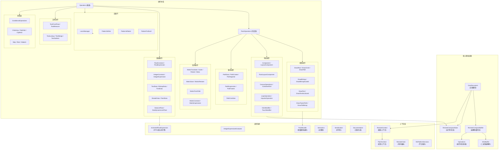
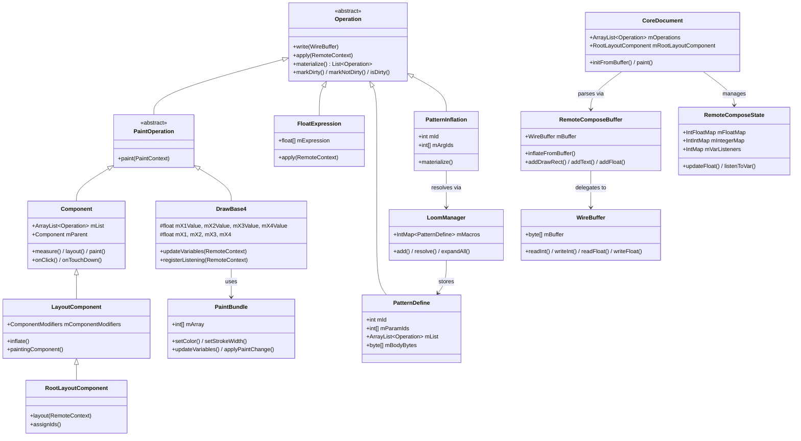
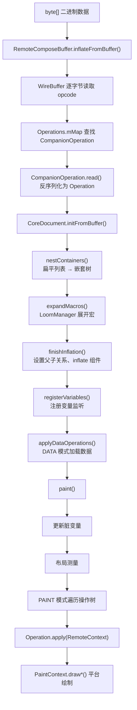
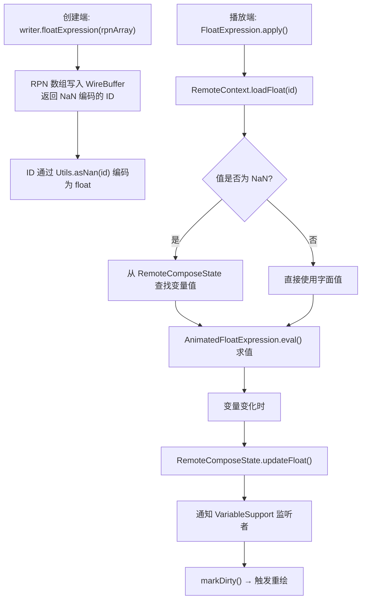
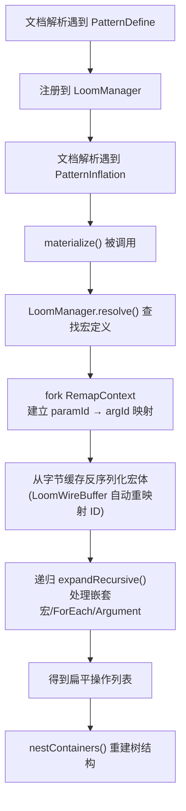
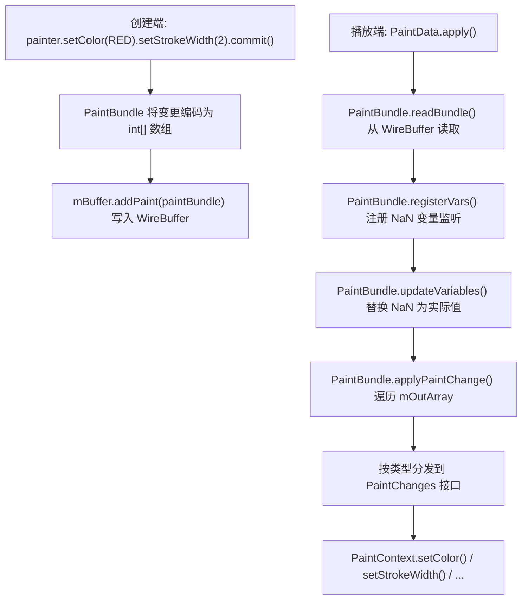
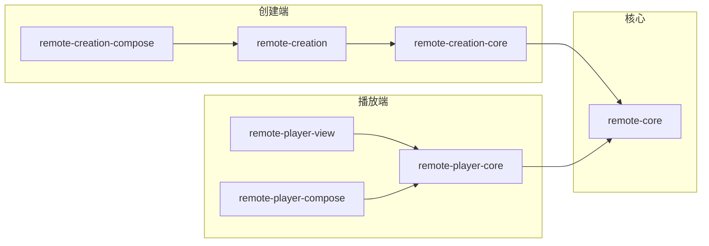

# remote-core 模块软件架构文档

## 1. 模块概览

### 1.1 定位

`remote-core` 是整个 Remote Compose 项目的**最底层核心引擎**，纯 Java 库，无 Android 依赖。它定义了二进制协议规范、操作码注册表、文档模型、表达式引擎、布局系统和宏展开系统等核心基础设施。所有其他模块都直接或间接依赖此模块。

### 1.2 模块依赖关系

```
remote-core (平台无关核心引擎)
    ↑ 依赖
remote-creation-core (创建端核心)
    ↑ 依赖
remote-creation (Android/JVM 平台适配)
    ↑ 依赖
remote-creation-compose (Compose 声明式 API)

remote-core
    ↑ 依赖
remote-player-core (播放端核心)
    ↑ 依赖
remote-player-view / remote-player-compose (播放端 UI)
```

### 1.3 构建配置

| 配置项 | 值 |
|---|---|
| 类型 | `PUBLISHED_LIBRARY`（纯 Java 库） |
| 描述 | "Java core for RemoteCompose document player" |
| 核心依赖 | `jspecify`、`androidx.annotation:annotation:1.9.1` |
| 无 Android 依赖 | 纯 JVM 库 |

---

## 2. 分层架构图



---

## 3. 包结构与职责

### 3.1 包总览

| 包 | 职责 | 文件数 |
|---|---|---|
| 根包 | 核心基础设施（文档模型、缓冲区、状态、上下文） | ~25 |
| `operations` | 顶层操作（绘制、数据、路径、矩阵、文本、颜色、控制流） | ~80 |
| `operations/layout` | 布局系统（组件、修饰符、事件处理、滚动） | ~25 |
| `operations/loom` | 宏展开系统（Pattern 定义/调用/迭代） | ~10 |
| `operations/matrix` | 矩阵操作（常量、表达式、向量运算） | 3 |
| `operations/paint` | 画笔系统（PaintBundle、路径效果） | 6 |
| `operations/utilities` | 工具类（RPN 引擎、哈希表、路径生成器） | ~15 |
| `semantics` | 无障碍语义 | 5 |
| `serialize` | 序列化框架 | 3 |
| `types` | 基本类型常量 | 3 |
| `documentation` | 文档生成系统 | 6 |

### 3.2 核心文件清单

```
remote-core/src/main/java/androidx/compose/remote/core/
├── CoreDocument.java                    # 文档模型（操作树 + 状态）
├── RemoteComposeBuffer.java             # 编解码缓冲区
├── WireBuffer.java                      # 底层二进制编解码
├── Operations.java                      # 操作码注册表（100+ 操作码）
├── RemoteComposeState.java              # 运行时变量状态
├── RemoteContext.java                   # 播放上下文（抽象）
├── PaintContext.java                    # 绘制上下文（抽象）
├── RemoteClock.java / SystemClock.java / CalendarSystemClock.java
├── RcPlatformServices.java              # 平台服务接口
├── RcProfiles.java                      # Profile 位掩码常量
├── Operation.java                       # 操作基类
├── CompanionOperation.java              # 静态工厂接口
├── DocumentedCompanion.java             # 文档化工厂
├── RecordingRemoteComposeBuffer.java    # 全局优化缓冲区
├── RemotePathBase.java                  # 路径构建工具
├── VariableSupport.java                 # 变量监听接口
├── VariableProvider.java                # 变量提供者接口
├── Limits.java                          # 安全限制常量
├── Utils.java                           # NaN 编解码工具
└── operations/
    ├── DrawRect / DrawCircle / DrawPath / DrawBitmap / DrawText ...
    ├── FloatConstant / FloatExpression / IntegerExpression ...
    ├── PathData / PathCreate / PathExpression / PathTween ...
    ├── MatrixTranslate / MatrixScale / MatrixRotate ...
    ├── TextFromFloat / TextMeasure / TextMerge ...
    ├── ConditionalOperations / ClickArea / ClipPath ...
    ├── layout/
    │   ├── Component / LayoutComponent / RootLayoutComponent
    │   ├── ClickModifierOperation / TouchDown/Up/CancelModifierOperation
    │   ├── LoopOperation / ImpulseOperation / ScrollDelegate
    │   └── CanvasOperations / Container / ContainerEnd
    ├── loom/
    │   ├── LoomManager / PatternDefine / PatternInflation
    │   ├── PatternForEach / PatternBlock / PatternArgument
    │   └── ExpansionContext / RemapContext / LoomWireBuffer
    ├── matrix/
    │   └── MatrixConstant / MatrixExpression / MatrixVectorMath
    ├── paint/
    │   └── PaintBundle / PaintChanges / PaintPathEffects / Painter
    └── utilities/
        ├── AnimatedFloatExpression / IntegerExpressionEvaluator
        ├── IntFloatMap / IntIntMap / IntMap / NanMap
        └── PathGenerator / ColorUtils / ImageScaling
```

---

## 4. 核心类详解

### 4.1 CoreDocument — 文档模型

**文件**：`CoreDocument.java`
**设计模式**：解释器 + 观察者 + 脏标记

整个文档的运行时表示，包含操作树和状态。

**关键字段**：
- `mOperations: ArrayList<Operation>` — 解析后的操作树
- `mRootLayoutComponent: RootLayoutComponent` — 根布局组件
- `mHeader: Header` — 文档头部
- `mRemoteComposeState: RemoteComposeState` — 运行时状态
- `mVersion: Version` — 语义版本号（当前 1.1.0）
- `DOCUMENT_API_LEVEL = 8`

**核心方法**：
- `initFromBuffer()` — 从二进制缓冲区解析操作，构建嵌套容器树，展开宏
- `nestContainers()` — 扁平操作列表 → 嵌套树结构
- `paint()` — 更新变量 → 布局 → 遍历操作树执行绘制
- `applyUpdate()` — 增量更新文档数据

**数据流**：`initFromBuffer()` → `nestContainers()` → `expandMacros()` → `finishInflation()` → `registerVariables()` → `applyDataOperations()` → `paint()`

---

### 4.2 RemoteComposeBuffer — 编解码缓冲区

**文件**：`RemoteComposeBuffer.java`
**设计模式**：命令 + 工厂方法

编码/解码 RemoteCompose 操作的抽象缓冲区。

**写入端**：约 100+ 个 `add*` 方法（`addDrawRect()`、`addText()`、`addFloat()` 等），每个调用对应 Operation 的静态 `apply()` 方法写入 WireBuffer。

**读取端**：`inflateFromBuffer()` — 从 WireBuffer 逐字节读取操作码，查找 `CompanionOperation`，调用其 `read()` 方法反序列化为 Operation 对象。

---

### 4.3 WireBuffer — 底层二进制编解码

**文件**：`WireBuffer.java`

底层二进制缓冲区，提供类型化的读写方法。

**读取**：`readByte()`、`readShort()`、`readInt()`、`readLong()`、`readFloat()`、`readDouble()`、`readUTF8()`、`readId()`、`readNanId()`

**写入**：`writeByte()`、`writeShort()`、`writeInt()`、`writeLong()`、`writeFloat()`、`writeDouble()`、`writeUTF8()`

**特性**：大端序编码、自动扩容、版本校验（写入操作码时检查有效性）

---

### 4.4 Operations — 操作码注册表

**文件**：`Operations.java`
**设计模式**：注册表

将 opcode 映射到 CompanionOperation（读取器），约 100+ 个操作码。

**操作码分组**：

| 分组 | 范围 | 示例 |
|---|---|---|
| 协议 | 0-9 | HEADER=0, EXTENDED_OPCODE=255 |
| 绘制 | 40-60 | DRAW_RECT=42, DRAW_CIRCLE=46, DRAW_PATH=124 |
| 数据 | 80-110 | DATA_FLOAT=80, DATA_TEXT=102, DATA_BITMAP=101 |
| 布局 | 200-220 | LAYOUT_ROOT=200, LAYOUT_BOX=202, LAYOUT_COLUMN=204 |
| 修饰符 | 55-70 | MODIFIER_PADDING=58, MODIFIER_BACKGROUND=55 |
| 宏 | 246-250 | MACRO_DEFINE=246, MACRO_CALL=247 |

**版本化映射**：V6 和 V7+ 使用不同的映射表，V7+ 支持 Profile 组合。

---

### 4.5 RemoteComposeState — 运行时状态

**文件**：`RemoteComposeState.java`
**设计模式**：观察者 + 缓存

管理文档的运行时变量状态。

**核心字段**：
- `mFloatMap: IntFloatMap` — float 变量缓存
- `mIntegerMap: IntIntMap` — integer 变量缓存
- `mColorMap: IntIntMap` — 颜色变量缓存
- `mIntDataMap: IntMap<Object>` — 通用对象缓存
- `mVarListeners: IntMap<ArrayList<VariableSupport>>` — 变量监听器

**核心方法**：
- `cacheData()/cacheFloat()/cacheInteger()` — 缓存值并生成 ID
- `updateFloat()/updateInteger()/updateColor()` — 更新值并触发监听器
- `overrideFloat()/overrideInteger()/overrideColor()` — 强制覆盖值
- `listenToVar()` — 注册变量变化监听

---

### 4.6 RemoteContext — 播放上下文

**文件**：`RemoteContext.java`
**设计模式**：模板方法

抽象播放上下文，定义约 35 个预定义变量 ID：

| 分组 | ID 范围 | 示例 |
|---|---|---|
| 时间 | 1-4, 30-35 | CONTINUOUS_SEC=1, TIME_IN_SEC=2, YEAR=35 |
| 窗口 | 5-6 | WINDOW_WIDTH=5, WINDOW_HEIGHT=6 |
| 触摸 | 13-16 | TOUCH_POS_X=13, TOUCH_POS_Y=14 |
| 传感器 | 17-22 | ACCELERATION_X/Y/Z, GYRO_ROT_X/Y/Z |
| 系统 | 7-12, 23-29 | DENSITY=27, ANIMATION_TIME=30 |

**抽象方法**（平台必须实现）：`loadBitmap()`、`loadText()`、`getText()`、`loadFloat()`、`getFloat()`、`loadInteger()`、`getInteger()`、`getColor()`、`addClickArea()` 等

---

### 4.7 Operation — 操作基类

**文件**：`Operation.java`
**设计模式**：命令 + 解释器

所有操作的基类，核心方法：
- `write(WireBuffer)` — 序列化到二进制缓冲区
- `apply(RemoteContext)` — 执行操作
- `materialize()` — 宏展开期间物化到结果列表
- `markDirty()/markNotDirty()/isDirty()` — 脏标记管理

**Companion 静态工厂模式**：每个操作类都有：
- `static void read(WireBuffer, List<Operation>)` — 反序列化入口
- `static void apply(WireBuffer, ...)` — 序列化入口
- `static void documentation(DocumentationBuilder)` — 文档生成
- `static int id()` — 操作码
- `static String name()` — 操作名称

---

### 4.8 布局系统

#### Component（组合模式）

布局树节点的核心基类，同时实现 `Container`、`Measurable`、`VariableProvider`：
- 维护 `mList`(子操作)、`mParent`(父组件)、位置/尺寸
- **可见性系统**：GONE/VISIBLE/INVISIBLE + 运行时覆盖
- **测量与布局**：`measure()` 返回固定尺寸；`layout()` 支持动画过渡
- **绘制**：`paintingComponent()` → save/translate → 遍历子操作
- **事件分发**：反向遍历子列表（顶层优先）

#### LayoutComponent（带修饰符）

继承 `Component`，是实际布局系统的核心：
- **修饰符系统**：Padding/Width/Height/ZIndex/GraphicsLayer/Scroll
- **inflate()**：将子操作分类为内容/修饰符/数据/子组件
- **绘制流程**：GraphicsLayer → modifiers.layout() → modifiers.paint() → translate(padding+scroll) → 子组件

#### RootLayoutComponent（根组件）

整个文档的布局入口，`layout()` 创建 MeasurePass 执行测量和布局。

---

### 4.9 绘制系统

**DrawBase 体系**（按参数数量泛型化）：

| 基类 | 参数数 | 示例操作 |
|---|---|---|
| `DrawBase2` | 2 | MatrixTranslate |
| `DrawBase3` | 3 | DrawCircle |
| `DrawBase4` | 4 | DrawRect, DrawOval, DrawLine |
| `DrawBase6` | 6 | DrawArc, DrawSector, DrawRoundRect |

**核心机制**：每个参数维护两套字段（`mX1Value`/`mX1`），`mX1Value` 保存原始值（可能是 NaN-ID），`mX1` 保存解析后的实际值。

**绘制操作分类**：

| 分类 | 操作 | 说明 |
|---|---|---|
| 形状 | DrawRect, DrawCircle, DrawOval, DrawArc, DrawSector, DrawLine, DrawRoundRect | 基本几何图形 |
| 路径 | DrawPath, DrawTweenPath | 按 ID 引用路径 |
| 位图 | DrawBitmap, DrawBitmapInt, DrawBitmapScaled, DrawToBitmap | 多种位图绘制模式 |
| 文本 | DrawText, DrawTextAnchored, DrawTextOnPath, DrawTextOnCircle | 多种文本定位 |
| 位图字体 | DrawBitmapFontText, DrawBitmapFontTextOnPath, DrawBitmapTextAnchored | 位图字体 |
| 特殊 | DrawContent | 触发组件递归绘制 |

---

### 4.10 PaintBundle — 增量画笔编码

**文件**：`operations/paint/PaintBundle.java`
**设计模式**：增量编码

将画笔属性的增量变更编码为紧凑的 `int[]` 数组。每个条目：低 16 位为属性类型，高 16 位为内联参数。

**26 种属性**：TextSize, Color/ColorId, StrokeWidth/Miter/Cap/Join, Style, Shader, Alpha, BlendMode, Gradient(Linear/Radial/Sweep), ColorFilter, Typeface, FilterBitmap, PathEffect, Texture, FontAxis, ShaderMatrix

**变量支持**：float 类型的属性值可使用 NaN 编码引用变量 ID；`updateVariables()` 将 NaN 引用替换为实际值。

---

### 4.11 AnimatedFloatExpression — RPN 表达式引擎

**文件**：`operations/utilities/AnimatedFloatExpression.java`

将数学表达式编码为 `float[]`，使用 NaN 编码操作符。

**79 个操作符**：ADD/SUB/MUL/DIV/MOD/MIN/MAX/POW/SQRT/ABS/SIN/COS/TAN/ASIN/ACOS/ATAN/ATAN2/MAD/IFELSE/CLAMP/LERP/SMOOTH_STEP/PINGPONG/CUBIC/NOISE_FROM/STEP/RAND/A_DEREF/A_MAX/A_MIN/A_SUM/A_AVG/A_LEN/A_SPLINE 等

**求值**：`eval()` 遍历表达式数组，普通 float 入栈，NaN 编码的操作符执行对应运算。

**NaN 编码**：`asNan(id)` 将整数 ID 编码为 NaN 浮点数，`fromNaN()` 解码。

---

### 4.12 Loom 宏展开系统

**文件**：`operations/loom/`

宏展开引擎，允许定义可复用的模式模板，支持参数化实例化。

**核心类**：

| 类 | 职责 |
|---|---|
| `LoomManager` | 宏注册中心，维护 ID→PatternDefine 映射 |
| `PatternDefine` | 宏定义（参数 ID + 操作体 + 字节缓存） |
| `PatternInflation` | 宏调用（实参 ID + 展开逻辑） |
| `PatternBlock` | 操作块参数（高阶函数风格） |
| `PatternArgument` | 参数占位符 |
| `PatternForEach` | 集合迭代展开 |
| `ExpansionContext` | 展开上下文（递归展开 + safeMode） |
| `RemapContext` | ID 重映射（三层 ID 体系） |
| `LoomWireBuffer` | 重映射线缓冲区（装饰器模式） |

**三层 ID 体系**：
- Tier 1: 系统全局 ID (0-41)，永不重映射
- Tier 2: 宏局部 ID (0x4000-0x4FFF)，展开时唯一化
- 常规 ID：展开时也需唯一化

**展开流程**：PatternDefine 注册 → PatternInflation.materialize() → fork RemapContext → 从字节缓存反序列化（LoomWireBuffer 自动重映射 ID）→ 递归展开嵌套宏

---

### 4.13 路径系统

路径编码使用 NaN 编码的命令标记：MOVE(10), LINE(11), QUADRATIC(12), CONIC(13), CUBIC(14), CLOSE(15), DONE(16)

| 操作 | 说明 |
|---|---|
| `PathData` | 完整静态路径定义 |
| `PathCreate` + `PathAppend` | 增量构建动态路径 |
| `PathExpression` | RPN 表达式生成路径（参数化曲线） |
| `PathTween` | 两路径间插值 |
| `PathCombine` | 布尔运算组合（DIFFERENCE/INTERSECT/UNION/XOR） |

---

### 4.14 其他子系统

| 子系统 | 核心类 | 说明 |
|---|---|---|
| 矩阵 | MatrixConstant, MatrixExpression, MatrixVectorMath | 常量/表达式矩阵 + 向量运算 |
| 文本 | TextFromFloat, TextMeasure, TextMerge, TextSubtext, TextLookup | 文本处理管线 |
| 颜色 | ColorConstant, ColorAttribute, ColorExpression, ColorTheme | 颜色定义与主题 |
| 语义 | CoreSemantics, AccessibleComponent, AccessibilityModifier | 无障碍（Role 枚举对齐 Compose） |
| 序列化 | MapSerializer, Serializable, SerializeTags | 调试/JSON 输出 |
| 文档 | DocumentationBuilder, DocumentedOperation, OperationField | 操作文档自动生成 |
| 粒子 | ParticlesCreate, ParticlesLoop, ParticlesCompare | 粒子系统 |
| 控制 | ConditionalOperations, ClickArea, ClipPath, ClipRect, Skip, WakeIn | 控制流与交互 |

---

## 5. 设计模式总结

| 模式 | 应用位置 | 说明 |
|---|---|---|
| **解释器** | Operation 对象构成 AST | `apply()` 执行解释 |
| **命令** | 每个 Operation | `write()` 序列化 + `apply()` 执行 |
| **观察者** | VariableSupport + RemoteComposeState | 变量变更通知 |
| **NaN-ID 变量绑定** | 所有动态参数 | IEEE 754 NaN 编码空间嵌入变量 ID |
| **Companion 静态工厂** | 每个操作类的 `read()`/`apply()` | 操作码到反序列化器的映射 |
| **组合** | Component | 既是叶子也是容器，形成布局树 |
| **策略** | RcPlatformServices, PaintContext, RemoteContext | 平台抽象 |
| **注册表** | Operations | opcode → CompanionOperation 映射 |
| **模板方法** | RemoteContext, PaintContext | 抽象类定义框架，平台子类实现 |
| **装饰器** | LoomWireBuffer 包装 WireBuffer | 注入 ID 重映射 |
| **增量编码** | PaintBundle | 只编码变化的画笔属性 |
| **脏标记优化** | Operation.isDirty() | 避免不必要的重绘 |
| **Profile 位掩码** | RcProfiles | 版本化功能控制 |
| **RPN 表达式** | AnimatedFloatExpression, IntegerExpressionEvaluator | 零分配高性能求值 |
| **Builder** | Painter (PaintBundle 封装) | 链式 API |

---

## 6. 接口与实现对应关系

| 接口/抽象类 | 实现类 | 说明 |
|---|---|---|
| `RemoteContext` | Android 端由 remote-player-core 实现 | 播放上下文 |
| `PaintContext` | Android 端由 remote-player-core 实现 | 绘制上下文 |
| `RcPlatformServices` | `AndroidxRcPlatformServices`、`JvmRcPlatformServices` | 平台服务 |
| `RemoteClock` | `SystemClock`、`CalendarSystemClock` | 时间抽象 |
| `Container` | `Component`、`CanvasOperations`、`ConditionalOperations` 等 | 可包含子操作 |
| `VariableSupport` | `DrawBase*`、`FloatExpression`、`PaintBundle` 等 | 变量监听 |
| `VariableProvider` | `FloatConstant`、`PathData`、`MatrixConstant` 等 | 变量定义 |
| `ScrollDelegate` | 由 Scroll 修饰符实现 | 滚动策略 |
| `PaintChanges` | 平台 PaintContext 实现 | 画笔属性变更回调 |
| `ArrayAccess` | `DataListFloat`、`DataDynamicListFloat` | 数组访问 |
| `CompanionOperation` | 每个操作类的静态 `read()` 方法引用 | 操作反序列化工厂 |

---

## 7. 类关系图



---

## 8. 数据流与生命周期

### 8.1 文档解析与渲染完整流程



### 8.2 NaN-ID 变量绑定流程



### 8.3 宏展开流程



### 8.4 PaintBundle 增量更新流程



---

## 9. 二进制协议概览

### 9.1 操作码编码

| 编码 | 说明 |
|---|---|
| 0-254 | 标准操作码 |
| 255 | 扩展操作码（后跟 2 字节扩展码） |

### 9.2 操作码分组

| 分组 | 范围 | 说明 |
|---|---|---|
| 协议控制 | 0-9 | HEADER, EXTENDED_OPCODE |
| 绘制操作 | 40-60 | DrawRect, DrawCircle, DrawPath 等 |
| 数据操作 | 80-110 | Float, Text, Bitmap, Font, Shader 等 |
| 修饰符 | 55-70 | Padding, Background, Border, Clip 等 |
| 布局操作 | 200-220 | Root, Box, Column, Row, Canvas 等 |
| 宏操作 | 246-250 | PatternDefine, PatternInflation 等 |

### 9.3 NaN 编码体系

```
ID 空间分区 (NanMap):
  0xxxxx: 系统全局变量 (0-41)
  1xxxxx: 普通变量
  2xxxxx: 数组/列表
  3xxxxx: 路径操作和浮点运算符

路径命令常量:
  MOVE=10, LINE=11, QUADRATIC=12, CONIC=13, CUBIC=14, CLOSE=15, DONE=16

RPN 操作符:
  OFFSET = 0x310000
  ADD/SUB/MUL/DIV/MOD/MIN/MAX/POW/SQRT/ABS/SIN/COS/...
  共 79 个操作符
```

### 9.4 Profile 位掩码

| Profile | 值 | 说明 |
|---|---|---|
| PROFILE_BASELINE | 0x0 | 基线配置 |
| PROFILE_EXPERIMENTAL | 0x1 | 实验性功能 |
| PROFILE_DEPRECATED | 0x2 | 已弃用操作 |
| PROFILE_OEM | 0x4 | OEM 特定 |
| PROFILE_LOW_POWER | 0x8 | 低功耗模式 |
| PROFILE_WIDGETS | 0x100 | 启动器小部件 |
| PROFILE_ANDROIDX | 0x200 | AndroidX 播放器 |
| PROFILE_ANDROID_NATIVE | 0x400 | Android 原生 |
| PROFILE_WEAR_WIDGETS | 0x800 | Wear 小部件 |

---

## 10. 使用方法

### 10.1 解析与播放文档

```java
// 从字节数组创建文档
RemoteComposeBuffer buffer = RemoteComposeBuffer.fromByteArray(bytes);
CoreDocument document = new CoreDocument();
document.initFromBuffer(buffer, remoteContext);

// 渲染
document.paint(remoteContext, width, height);
```

### 10.2 变量交互

```java
// 获取/设置变量值
float value = remoteContext.getFloat(variableId);
remoteContext.updateFloat(variableId, newValue);

// 覆盖变量（宿主应用控制）
remoteContext.overrideFloat(variableId, overrideValue);

// 监听变量变化
remoteComposeState.listenToVar(variableId, variableSupport);
```

### 10.3 增量更新

```java
// 更新文本
document.applyUpdate(CoreDocument.UpdateType.TEXT, textId, "new text");

// 更新浮点值
document.applyUpdate(CoreDocument.UpdateType.FLOAT, floatId, 3.14f);

// 更新位图
document.applyUpdate(CoreDocument.UpdateType.BITMAP, bitmapId, bitmapData);
```

### 10.4 安全限制

```java
// Limits 常量
Limits.MAX_OP_COUNT       // 20,000 每帧最大操作数
Limits.MAX_STATE_DATA     // 10,000 最大状态变量数
Limits.MAX_STRING_SIZE    // 4,000 UTF-8 最大字节数
Limits.MAX_IMAGE_DIMENSION // 8,000 图片最大尺寸
Limits.MAX_BITMAP_MEMORY  // 20MB 单播放器位图内存上限
Limits.MAX_EXPRESSION_SIZE // 32 RPN 表达式最大长度
```

---

## 11. 模块在整体架构中的位置



`remote-core` 在整体架构中是**最底层核心引擎**：
- **承上**：为创建端（remote-creation-core）提供 WireBuffer、RemoteComposeBuffer、Operations 等序列化基础设施
- **启下**：为播放端（remote-player-core）提供 CoreDocument、RemoteContext、PaintContext 等文档模型和渲染抽象
- **核心价值**：定义了整个 Remote Compose 的二进制协议规范、操作码体系、表达式引擎和布局系统，是所有其他模块的基石
