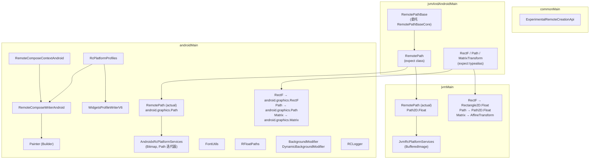
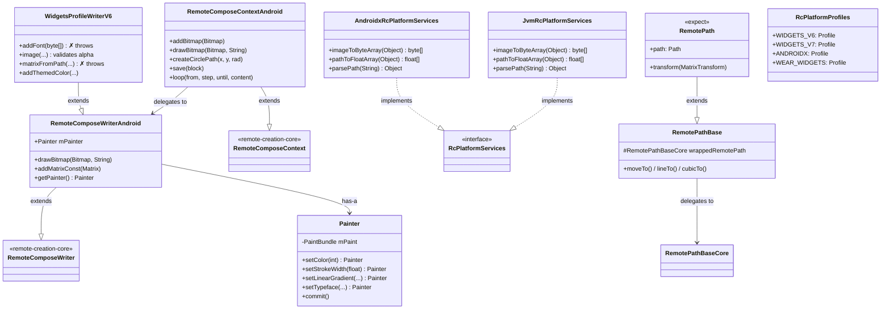
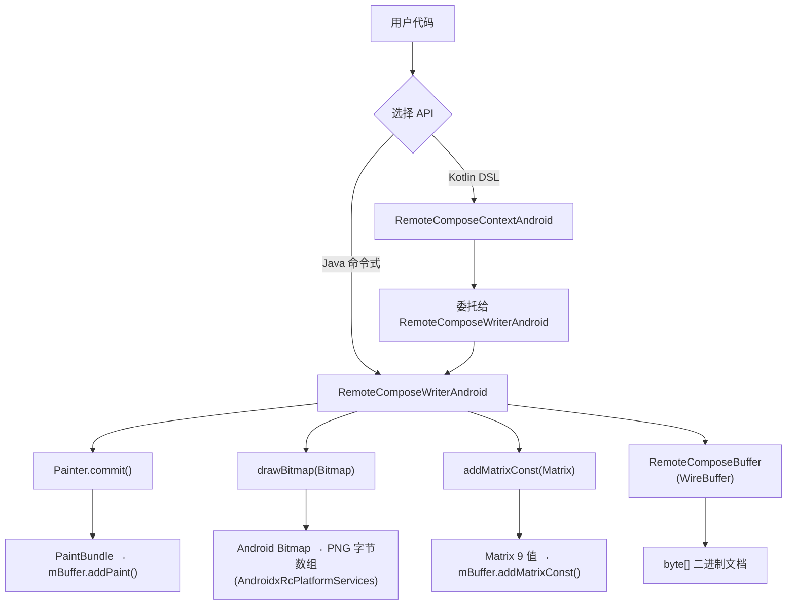
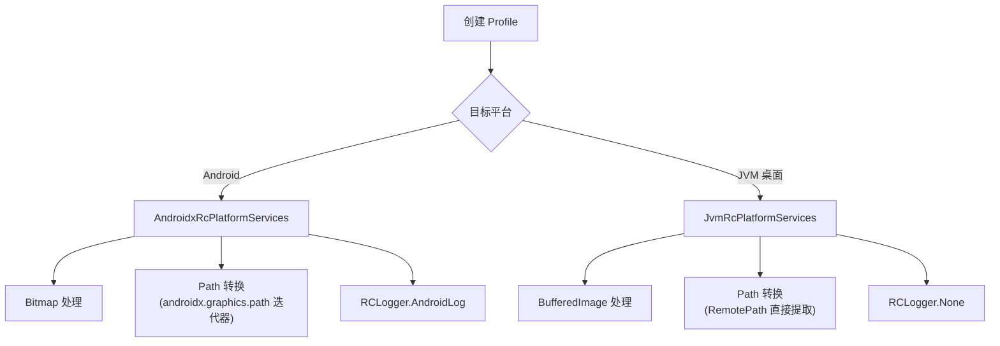
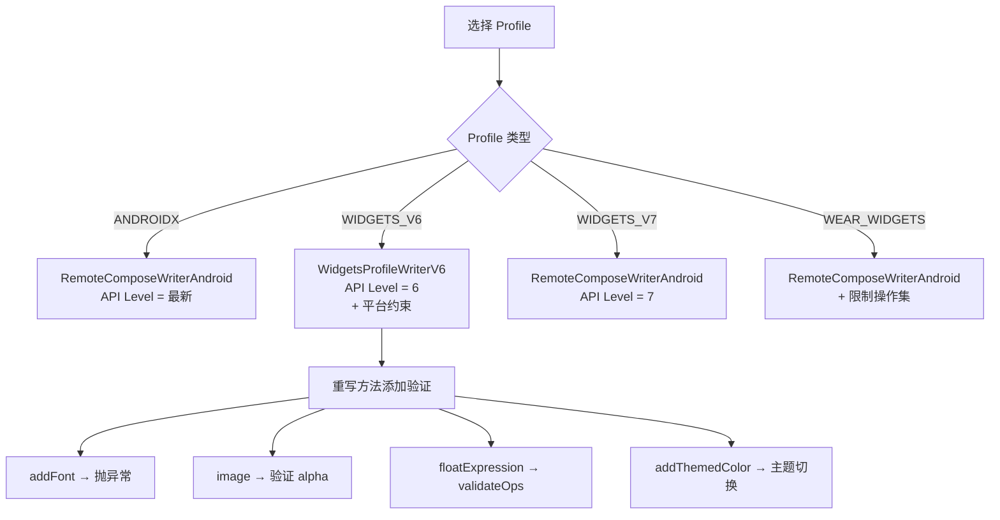
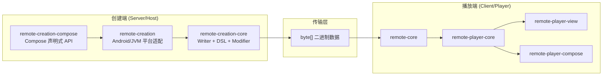

# remote-creation 模块软件架构文档

## 1. 模块概览

### 1.1 定位

`remote-creation` 是 `remote-creation-core` 的 **Android/JVM 平台特化层**，在核心抽象之上提供：
1. Android 原生类型适配（Bitmap、Path、Matrix、RectF、Typeface）
2. Android 特有的绘制能力（Painter、FontUtils）
3. 平台服务实现（AndroidxRcPlatformServices、JvmRcPlatformServices）
4. 版本化 Profile 系统（RcPlatformProfiles、WidgetsProfileWriterV6）
5. Kotlin DSL 增强（RemoteComposeContextAndroid、RFloatPaths）

### 1.2 Kotlin 多平台架构

```
commonMain
    ↓
jvmAndAndroidMain (JVM 和 Android 共享)
   ↙     ↘
jvmMain   androidMain
```

| 源集 | 目标平台 | 核心内容 |
|---|---|---|
| `commonMain` | 所有平台 | 实验性 API 注解 |
| `jvmAndAndroidMain` | JVM + Android | RemotePath（expect）、RemotePathBase |
| `jvmMain` | JVM 桌面 | RemotePath（actual）、JvmRcPlatformServices |
| `androidMain` | Android | RemotePath（actual）、Writer/Context Android 扩展、平台服务 |

### 1.3 模块依赖关系

```
remote-core (平台无关核心引擎)
    ↑ 依赖
remote-creation-core (创建端核心 — Writer、DSL、Modifier)
    ↑ 依赖
remote-creation (Android/JVM 平台适配)
    ↑ 依赖
remote-creation-compose (Compose 声明式创建 API)
```

### 1.4 构建配置

| 配置项 | 值 |
|---|---|
| 命名空间 | `androidx.compose.remote.creation` |
| 目标平台 | Android (minSdk 23, compileSdk 37) + JVM |
| 核心依赖 | `remote-core`、`remote-creation-core` |
| Android 额外依赖 | `androidx.graphics:graphics-path:1.1.0-rc01` |

---

## 2. 分层架构图



---

## 3. 源集结构与职责

### 3.1 文件清单

```
remote-creation/src/
├── commonMain/kotlin/
│   └── .../creation/
│       └── ExperimentalRemoteCreationApi.kt          # 实验性 API 注解
├── jvmAndAndroidMain/kotlin/
│   └── .../creation/
│       ├── RemotePath.kt                             # expect class + expect typealias
│       └── RemotePathBase.kt                         # 路径操作基类（委托模式）
├── jvmMain/kotlin/
│   └── .../creation/
│       ├── RemotePath.jvm.kt                         # actual 实现 (Path2D.Float)
│       └── JvmRcPlatformServices.jvm.kt              # JVM 平台服务
└── androidMain/
    ├── java/.../creation/
    │   ├── RemoteComposeWriterAndroid.java           # Android Writer 扩展
    │   ├── RemoteComposeContextAndroid.kt            # Android DSL 扩展
    │   ├── FontUtils.java                            # 字体工具
    │   ├── Painter.java                              # 画笔 Builder
    │   ├── RFloatPaths.kt                            # 动态路径工具
    │   ├── modifiers/
    │   │   ├── BackgroundModifier.java               # 静态背景修饰符
    │   │   └── DynamicBackgroundModifier.java        # 动态背景修饰符
    │   ├── platform/
    │   │   ├── AndroidxRcPlatformServices.kt          # Android 平台服务
    │   │   └── RCLogger.kt                            # 日志策略
    │   └── profile/
    │       ├── RcPlatformProfiles.java                # Profile 常量定义
    │       └── WidgetsProfileWriterV6.java            # V6 Widget Writer
    └── kotlin/.../creation/
        └── RemotePath.android.kt                      # actual 实现 (android.graphics.Path)
```

---

## 4. 核心类详解

### 4.1 commonMain

#### ExperimentalRemoteCreationApi

`@RequiresOptIn` 注解类，标记实验性 API。与 Compose 自身的 `@ExperimentalComposeUiApi` 一致。

---

### 4.2 jvmAndAndroidMain

#### RemotePath（expect 声明）

使用 `expect/actual` 机制声明平台差异类型和路径操作 API。

**expect typealias**：

| expect 声明 | Android actual | JVM actual |
|---|---|---|
| `RectF` | `android.graphics.RectF` | `Rectangle2D.Float` |
| `Path` | `android.graphics.Path` | `Path2D.Float` |
| `MatrixTransform` | `android.graphics.Matrix` | `AffineTransform` |

**expect class RemotePath**：声明完整的路径操作 API（moveTo、lineTo、cubicTo、quadTo、conicTo、close、rewind、isEmpty、createFloatArray、transform、addArc、arcTo）及路径命令常量（MOVE、LINE、QUADRATIC、CONIC、CUBIC、CLOSE、DONE）。

#### RemotePathBase

核心基类，使用**委托模式**包装 `remote-core` 中的 `RemotePathBaseCore`。所有路径操作方法均委托给 `wrappedRemotePath`。

`createCirclePath` 静态方法：使用贝塞尔曲线近似圆，利用 `AnimatedFloatExpression` 构建动态表达式参数。

---

### 4.3 jvmMain

#### RemotePath（JVM actual）

继承 `RemotePathBase`，`transform` 使用 `AffineTransform.transform()` 对路径数组中的坐标点进行变换。`path` 属性返回 `TODO()`（JVM 平台尚未实现 Path 生成）。

#### JvmRcPlatformServices

实现 `RcPlatformServices` 接口，面向 JVM 桌面环境：
- `imageToByteArray`：`BufferedImage` → PNG 字节数组
- `pathToFloatArray`：从 `RemotePath` 提取浮点数组
- `parsePath`：从路径数据字符串创建 `RemotePath`
- `log`：空实现

---

### 4.4 androidMain

#### RemoteComposeWriterAndroid

**继承**：`RemoteComposeWriter`

在基类基础上增加 Android 特有功能：
- `drawBitmap(Bitmap, String)`：Android Bitmap 直接绘制
- `addMatrixConst(android.graphics.Matrix)`：将 Android Matrix 的 9 个值写入文档
- `getPainter()`：返回关联的 Painter

#### RemoteComposeContextAndroid

**继承**：`RemoteComposeContext`

Kotlin DSL 增强，提供 Android 特有的便利方法：
- `addBitmap(Bitmap)`：添加 Android Bitmap
- `drawBitmap(Bitmap, String)`：绘制 Bitmap
- `createCirclePath(x, y, rad)`：创建圆形路径
- **Number 类型重载**：`drawRoundRect`、`drawRect`、`drawLine`、`rotate`、`scale` 等方法接受 `Number` 参数
- `save { ... }`：保存/恢复画布状态的 DSL 语法糖
- `loop(from, step, until, content)`：循环结构
- `createTextFromFloat(RFloat, ...)`：从浮点表达式创建文本
- `beginGlobal()/endGlobal()`：全局作用域
- `skip(type, value, content)`：条件跳过

#### Painter

Android 平台的画笔构建器，**Builder 模式**（所有 setter 返回 `this`）。

包装 `PaintBundle`（来自 `remote-core`），提供：
- 基础属性：`setAntiAlias`、`setColor`、`setAlpha`、`setStrokeWidth` 等
- 渐变着色器：`setLinearGradient`、`setRadialGradient`、`setSweepGradient`、`setTextureShader`
- 颜色滤镜：`setPorterDuffColorFilter`、`clearColorFilter`
- 混合模式：`setBlendMode(BlendMode)` — 将 Android `BlendMode` 映射为整数常量
- 字体/文本：`setTextSize`、`setTypeface`（多种重载）、`setFallbackTypeFace`、`setAxis`
- 路径效果：`setPathEffect`
- `commit()`：将 PaintBundle 写入 buffer 并重置

#### FontUtils

静态工具类，提供：
- `setFontOnPaint(Activity, Paint, fontId)`：从资源加载字体
- `createGlyphs(RemoteComposeWriter, String, Paint)`：为字符串创建 BitmapFont 字形
- `extractKerningTable(Glyph[], Paint)`：提取字距调整表

#### RFloatPaths

动态路径创建工具：
- `createDynamicCircle(writer, n, radius, cx, cy)`：创建动态圆形路径
- `createSquirclePath(rc, cx, cy, radius, cornerRadius)`：创建超椭圆路径
- RemotePath 的 Number 类型便利扩展

#### BackgroundModifier / DynamicBackgroundModifier

| 修饰符 | 持有字段 | write 行为 |
|---|---|---|
| `BackgroundModifier` | `Shader` + `int mColor` | `writer.addModifierBackground(mColor, 0)` |
| `DynamicBackgroundModifier` | `Shader` + `int mColorId` | `writer.addDynamicModifierBackground(mColorId, 0)` |

静态版持有颜色值，动态版持有颜色 ID 引用。

#### AndroidxRcPlatformServices

实现 `RcPlatformServices` 接口，面向 Android 平台：
- `imageToByteArray`：`Bitmap` → PNG 字节数组（自动处理 ALPHA_8 转换）
- `pathToFloatArray`：支持 `RcPathArrayCreator`、`RemotePath`、`android.graphics.Path` 三种输入
- `parsePath`：解析 SVG 风格路径字符串为 `android.graphics.Path`
- `androidPathToFloatArray`：使用 `androidx.graphics.path` 迭代器转换
- `log`：委托给 `RCLogger`

#### RCLogger

日志策略接口，两个实现：
- `RCLogger.None`：空实现，丢弃所有日志
- `RCLogger.AndroidLog`：使用 `android.util.Log` 输出

#### RcPlatformProfiles

静态常量容器，定义 5 种 Profile：

| Profile | API Level | Writer | 用途 |
|---|---|---|---|
| `WIDGETS_V6` | 6 | `WidgetsProfileWriterV6` | Baklava 小部件 |
| `WIDGETS_V7` | 7 | `RemoteComposeWriterAndroid` | 小部件 V7 |
| `ANDROIDX7/8/9` | 7/8/9 | `RemoteComposeWriterAndroid` | AndroidX |
| `ANDROIDX` | 最新 | `RemoteComposeWriterAndroid` | AndroidX 最新 |
| `WEAR_WIDGETS` | 最新 | `RemoteComposeWriterAndroid` | Wear OS 小部件 |

#### WidgetsProfileWriterV6

**继承**：`RemoteComposeWriterAndroid`

**设计模式**：模板方法 + 防御性编程 — 通过重写父类方法添加 V6 平台约束：
- `addFont(byte[])`：直接抛出异常（V6 不支持自定义字体）
- `image(...)`：验证 alpha 不能为 NaN
- `startTextComponent(...)`：验证 fontSize 不能为 NaN
- `matrixFromPath(...)`：直接抛出异常
- `floatExpression(...)`：调用 `validateOps` 验证操作合法性
- `addThemedColor(...)`：创建支持亮/暗主题的双色，使用 `Rc.System.sLightMode` 变量

---

## 5. 设计模式总结

| 模式 | 应用位置 | 说明 |
|---|---|---|
| **expect/actual** | `RemotePath`、`RectF`、`Path`、`MatrixTransform` | 跨平台类型映射 |
| **委托** | `RemotePathBase` → `RemotePathBaseCore` | 核心逻辑委托给 remote-core |
| **Builder** | `Painter` | 流式 API，所有 setter 返回 `this` |
| **策略** | `RcPlatformServices`（Android/JVM 两套实现）、`RCLogger` | 可替换的平台行为 |
| **工厂方法** | `RcPlatformProfiles` 中的 Writer 创建 lambda | 延迟创建对应版本的 Writer |
| **模板方法** | `WidgetsProfileWriterV6` 重写父类方法 | 添加平台约束和验证 |
| **装饰器** | `RemoteComposeContextAndroid` 包装 `RemoteComposeWriterAndroid` | 提供 Kotlin DSL 增强 |
| **静态/动态配对** | `BackgroundModifier` / `DynamicBackgroundModifier` | 静态值 vs 动态 ID 引用 |
| **适配器** | `AndroidxRcPlatformServices`、`JvmRcPlatformServices` | 平台 API → 核心接口 |

---

## 6. 接口与实现对应关系

| 接口/expect 声明 | Android 实现 | JVM 实现 |
|---|---|---|
| `RcPlatformServices` | `AndroidxRcPlatformServices` | `JvmRcPlatformServices` |
| `expect class RemotePath` | `RemotePath`（android.graphics.Path） | `RemotePath`（Path2D.Float） |
| `expect typealias RectF` | `android.graphics.RectF` | `Rectangle2D.Float` |
| `expect typealias Path` | `android.graphics.Path` | `Path2D.Float` |
| `expect typealias MatrixTransform` | `android.graphics.Matrix` | `AffineTransform` |
| `RCLogger` | `RCLogger.AndroidLog` | `RCLogger.None`（JVM 无日志） |
| `RecordingModifier.Element` | `BackgroundModifier` / `DynamicBackgroundModifier` | — |

**继承关系**：

| 基类 | 子类 | 说明 |
|---|---|---|
| `RemoteComposeWriter` | `RemoteComposeWriterAndroid` | Android 特有扩展 |
| `RemoteComposeWriterAndroid` | `WidgetsProfileWriterV6` | V6 平台约束 |
| `RemoteComposeContext` | `RemoteComposeContextAndroid` | Android DSL 增强 |
| `RemotePathBase` | `RemotePath`（各平台 actual） | 路径操作 |

---

## 7. 类关系图



---

## 8. 数据流与生命周期

### 8.1 Android 平台创建流程



### 8.2 平台服务选择流程



### 8.3 Profile 选择与 Writer 创建流程



---

## 9. 与 remote-creation-core 的关系

```mermaid
flowchart LR
    subgraph Core["remote-creation-core (平台无关)"]
        RCW["RemoteComposeWriter"]
        RCC["RemoteComposeContext"]
        RCP["RcPaint"]
        RM["RecordingModifier"]
    end

    subgraph Platform["remote-creation (平台特化)"]
        RCWA["RemoteComposeWriterAndroid<br/>+ drawBitmap(Bitmap)<br/>+ addMatrixConst(Matrix)"]
        RCCA["RemoteComposeContextAndroid<br/>+ Number 重载<br/>+ save/loop/skip DSL"]
        P["Painter<br/>(Android Paint → PaintBundle)"]
        BM["BackgroundModifier<br/>DynamicBackgroundModifier"]
        RPS["AndroidxRcPlatformServices<br/>JvmRcPlatformServices"]
        WPV6["WidgetsProfileWriterV6<br/>(V6 约束)"]
    end

    RCWA --|> RCW : extends
    RCCA --|> RCC : extends
    WPV6 --|> RCWA : extends
    P --> RCP : replaces (Android 版)
    BM --> RM : implements Element
    RPS -.-> RCW : provides platform services
```

**核心关系**：
- `remote-creation` 通过**继承扩展** `remote-creation-core` 的核心类
- `Painter` 是 `RcPaint` 的 Android 替代品，直接操作 `android.graphics.Paint` 和 `PaintBundle`
- `BackgroundModifier` / `DynamicBackgroundModifier` 是 `remote-creation-core` 修饰符系统的 Android 扩展
- 平台服务通过 `RcPlatformServices` 接口注入到 `Profile` 和 `Writer`

---

## 10. 使用方法

### 10.1 Java 命令式 API

```java
// 创建 Android Writer
RemoteComposeWriterAndroid writer = RcPlatformProfiles.ANDROIDX.create(
    new CreationDisplayInfo(400, 800, 320), null
);

// 使用 Painter 设置画笔
Painter painter = writer.getPainter();
painter.setColor(Color.RED)
       .setStrokeWidth(2f)
       .setStyle(Paint.Style.STROKE)
       .commit();

// 绘制
writer.drawRect(0, 0, 100, 100);

// 绘制 Android Bitmap
writer.drawBitmap(bitmap, "my_image");

// 获取结果
byte[] buffer = writer.buffer();
```

### 10.2 Kotlin DSL API

```kotlin
val context = RemoteComposeContextAndroid(400, 800, 320) {
    header(width, height, density)

    // 使用 Number 重载
    drawRect(0, 0, 100, 100, painter.setColor(Color.RED).commit())

    // save/restore DSL
    save {
        translate(50, 50)
        drawCircle(0, 0, 25)
    }

    // 循环
    loop(0, 1, 10) { index ->
        drawText(textId, index.toFloat() * 20, 0)
    }

    // 动态路径
    val circlePath = createCirclePath(50, 50, 25)
    drawPath(circlePath, painter.setColor(Color.BLUE).commit())
}

val bytes = context.buffer()
```

### 10.3 选择 Profile

```kotlin
// AndroidX 最新版
val profile = RcPlatformProfiles.ANDROIDX

// Widget V6（带约束）
val profile = RcPlatformProfiles.WIDGETS_V6

// Wear OS Widget
val profile = RcPlatformProfiles.WEAR_WIDGETS

// 使用 Profile 创建 Writer
val writer = profile.create(CreationDisplayInfo(400, 800, 320), null)
```

### 10.4 动态路径

```kotlin
// 动态圆形路径
val circlePath = createDynamicCircle(writer, n = 24, radius = 50.rf, cx = 100.rf, cy = 100.rf)

// 超椭圆路径
val squirclePath = createSquirclePath(rc, cx = 100, cy = 100, radius = 50, cornerRadius = 20)
```

### 10.5 主题颜色（V6 Widget）

```java
// WidgetsProfileWriterV6 自动处理主题
writer.addThemedColor(
    "lightColor", 0xFF000000,
    "darkColor", 0xFFFFFFFF
);
// 内部使用 Rc.System.sLightMode 变量实现主题切换
```

---

## 11. 模块在整体架构中的位置



`remote-creation` 在整体架构中是创建端的**平台适配层**：
- **承上**：为 `remote-creation-compose` 提供 Android 特化的 Writer 和平台服务
- **启下**：扩展 `remote-creation-core` 的核心类，添加 Android 原生类型支持和版本化 Profile
- **核心价值**：将平台无关的创建 API 适配到 Android/JVM 环境，提供原生类型互操作和版本约束
