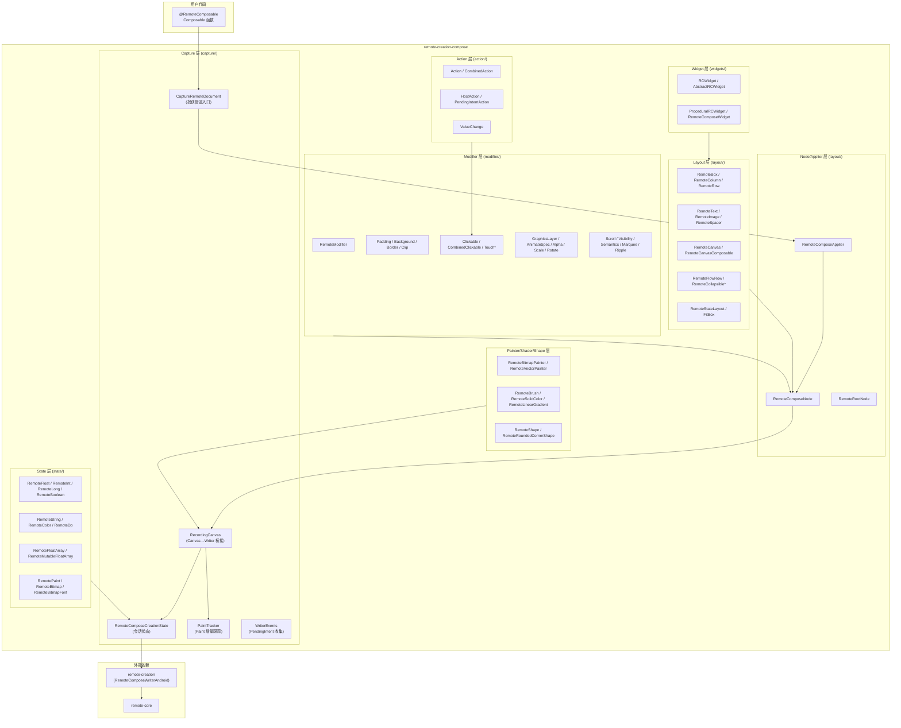
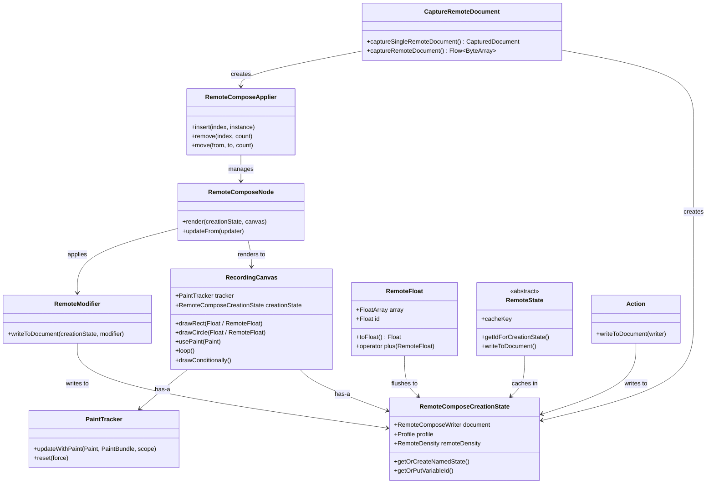
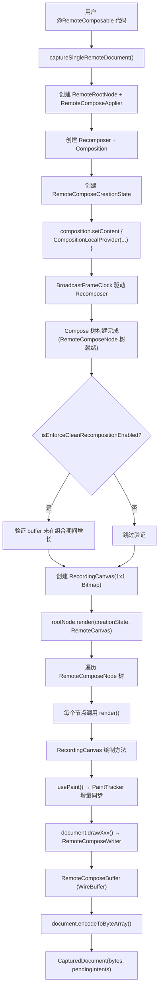
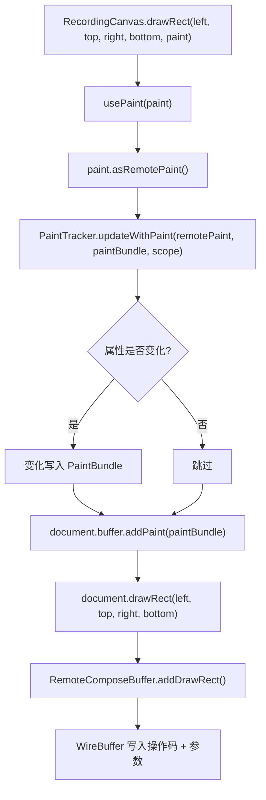
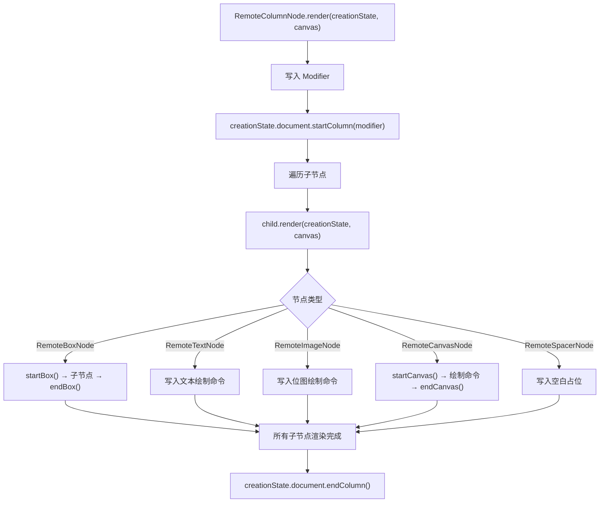
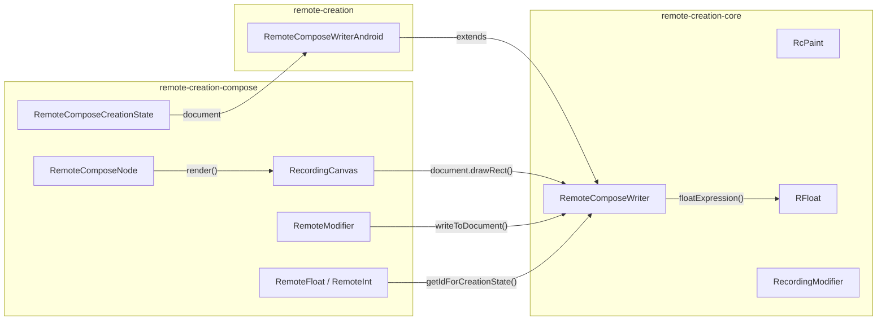
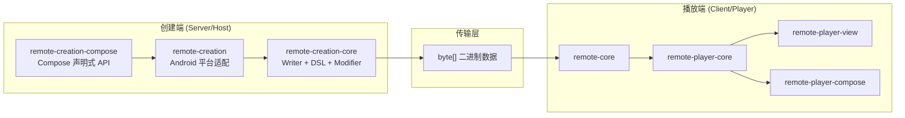

# remote-creation-compose 模块软件架构文档

## 1. 模块概览

### 1.1 定位

`remote-creation-compose` 是 Remote Compose 项目的**Compose 声明式创建 API 层**，将 `@RemoteComposable` Composable 树捕获为二进制文档。它提供了与 Jetpack Compose 完全一致的声明式 API，使开发者可以用编写 Compose UI 的方式创建远程文档。

### 1.2 核心架构：两阶段处理

| 阶段 | 说明 | 关键类 |
|---|---|---|
| **组合阶段** | Compose Runtime 构建 `RemoteComposeNode` 树 | `RemoteComposeApplier`、`RemoteComposeNode` |
| **渲染阶段** | 遍历节点树，通过 `RecordingCanvas` 写入二进制文档 | `RecordingCanvas`、`PaintTracker`、`RemoteComposeWriter` |

两阶段严格分离：`isEnforceCleanRecompositionEnabled` 标志确保组合阶段不会意外写入文档。

### 1.3 模块依赖关系

```
remote-core (平台无关核心引擎)
    ↑ 依赖
remote-creation-core (创建端核心 — Writer、DSL、Modifier)
    ↑ 依赖
remote-creation (Android 平台创建适配 — RemoteComposeWriterAndroid)
    ↑ 依赖
remote-creation-compose (Compose 声明式创建 API)
    ↑ 依赖
上层应用 (@RemoteComposable Composable)
```

### 1.4 构建配置

| 配置项 | 值 |
|---|---|
| 命名空间 | `androidx.compose.remote.creation.compose` |
| 类型 | `PUBLISHED_LIBRARY_ONLY_USED_BY_KOTLIN_CONSUMERS` |
| compileSdk / minSdk | 37 / 29 |
| 核心依赖 | `remote-core`、`remote-creation`、`remote-player-core`、`compose.ui:ui:1.11.0` |
| 图形依赖 | `graphics-path:1.1.0-rc01`、`graphics-shapes:1.1.0` |

---

## 2. 分层架构图



---

## 3. 包结构与职责

### 3.1 包总览

| 包 | 职责 | 文件数 |
|---|---|---|
| `capture` | 捕获管道核心（Compose 树 → 二进制文档） | 14 |
| `layout` | 布局组件（Box、Column、Row、Text 等）+ Applier/Node | 28 |
| `modifier` | Compose 风格修饰符 | 34 |
| `state` | 远程状态（RemoteFloat、RemoteInt 等） | 20 |
| `action` | 交互动作 | 5 |
| `painter` | 画笔（Bitmap、Vector、Color） | 4 |
| `shaders` | 着色器与渐变 | 6 |
| `shapes` | 形状 | 5 |
| `text` | 字体与文本样式 | 4 |
| `vector` | 矢量图 | 5 |
| `widgets` | Widget 系统 | 7 |
| `util` | 工具 | 1 |
| 根包 | 注解、功能开关 | 2 |

### 3.2 文件清单（核心文件）

```
remote-creation-compose/src/main/java/androidx/compose/remote/creation/compose/
├── ExperimentalRemoteCreationComposeApi.kt     # 实验性 API 注解
├── RemoteComposeCreationComposeFlags.kt        # 功能开关
├── capture/
│   ├── CaptureRemoteDocument.kt                # 捕获管道入口
│   ├── CapturedDocument.kt                     # 捕获结果
│   ├── RemoteComposeCapture.kt                 # rememberRemoteDocument()
│   ├── RecordingCanvas.kt                      # Canvas→Writer 桥接 (1344行)
│   ├── RemoteComposeCreationState.kt           # 会话状态管理
│   ├── RemoteCreationDisplayInfo.kt            # 显示信息
│   ├── RemoteDensity.kt                        # 远程密度
│   ├── PaintTracker.kt                         # Paint 增量跟踪
│   ├── WriterEvents.kt                         # PendingIntent 收集
│   ├── CustomComponentFactory.kt               # 自定义组件工厂
│   ├── LocalPlatform.kt                        # 平台服务注入
│   ├── RemoteComposePath.kt                    # 远程路径适配
│   ├── RemoteImageVector.kt                    # 远程矢量图
│   └── RemotePathParser.kt                     # 路径节点解析
├── layout/
│   ├── RemoteComposable.kt                     # @RemoteComposable 注解
│   ├── RemoteComposeApplier.kt                 # Compose 树 Applier
│   ├── RemoteComposeNode.kt                    # 节点基类
│   ├── RemoteBox.kt / RemoteColumn.kt / RemoteRow.kt
│   ├── RemoteText.kt / RemoteImage.kt / RemoteSpacer.kt
│   ├── RemoteCanvas.kt / RemoteCanvasComposable.kt
│   ├── RemoteFlowRow.kt / RemoteCollapsibleColumn.kt / RemoteCollapsibleRow.kt
│   ├── RemoteStateLayout.kt / FitBox.kt
│   └── ... (对齐、排列、内边距、大小等辅助类)
├── modifier/
│   ├── RemoteModifier.kt                       # 修饰符基类
│   ├── PaddingModifier.kt / BackgroundModifier.kt / BorderModifier.kt
│   ├── ClickableModifier.kt / CombinedClickableModifier.kt
│   ├── ClipModifier.kt / ScrollModifier.kt
│   ├── GraphicsLayerModifier.kt / AnimateSpecModifier.kt
│   ├── AlphaModifier.kt / ScaleModifier.kt / RotateModifier.kt
│   ├── VisibilityModifier.kt / SemanticsModifier.kt
│   └── ... (约 34 个修饰符)
├── state/
│   ├── RemoteState.kt / RemoteStateScope.kt / RemoteStateCacheKey.kt
│   ├── RemoteFloat.kt / RemoteInt.kt / RemoteLong.kt / RemoteBoolean.kt
│   ├── RemoteString.kt / RemoteColor.kt / RemoteDp.kt
│   ├── RemoteFloatArray.kt / RemoteMutableFloatArray.kt
│   ├── RemotePaint.kt / RemoteBitmap.kt / RemoteBitmapFont.kt
│   └── ... (约 20 个状态类)
├── action/
│   ├── Action.kt / CombinedAction.kt
│   ├── HostAction.kt / PendingIntentAction.kt
│   └── ValueChange.kt
├── painter/  (4 个文件)
├── shaders/  (6 个文件)
├── shapes/   (5 个文件)
├── text/     (4 个文件)
├── vector/   (5 个文件)
├── widgets/  (7 个文件)
└── util/     (1 个文件)
```

---

## 4. 核心类详解

### 4.1 Capture 包 — 捕获管道核心

#### CaptureRemoteDocument.kt

整个捕获管道的入口，定义了从 Compose 树到 RemoteCompose 文档的完整转换流程。

**关键函数**：
- `captureSingleRemoteDocument()`：单次捕获，返回 `CapturedDocument`
- `captureRemoteDocument()`：流式捕获，返回 `Flow<ByteArray>`

**捕获流程**：
1. 创建 `RemoteRootNode` + `RemoteComposeApplier`（Compose 树的 Applier）
2. 创建 `Recomposer` + `Composition`（Compose 运行时基础设施）
3. 创建 `RemoteComposeCreationState`（捕获会话状态）
4. `composition.setContent {}` 注入 `CompositionLocalProvider`
5. `BroadcastFrameClock` 驱动 Recomposer 直到 `State.Idle`
6. 安全检查：文档 buffer 未在组合期间增长
7. 创建 `RecordingCanvas(1x1 Bitmap)`
8. `rootNode.render(creationState, RemoteCanvas(recordingCanvas))` 触发渲染
9. 编码为 `ByteArray`，返回 `CapturedDocument`

#### RecordingCanvas.kt

**最核心的桥接类**（1344 行），继承 `android.graphics.Canvas`，实现 `RemoteStateScope`。

**核心机制**：
- 每个绘制方法都有 `Float`（静态值）和 `RemoteFloat`（动态表达式）两个版本
- 绘制前先调用 `usePaint()` 通过 `PaintTracker` 增量同步 Paint 状态
- 然后调用 `document.drawXxx()` 写入绘制命令

**关键方法分组**：

| 分组 | 方法 | 说明 |
|---|---|---|
| Paint 管理 | `usePaint(Paint)` / `forceSendingPaint()` | 增量 Paint 序列化 |
| 基本图形 | `drawRect` / `drawCircle` / `drawArc` / `drawLine` / `drawOval` / `drawRoundRect` | 双轨 API |
| 文本 | `drawText` / `drawTextRun` / `drawTextOnPath` / `drawAnchoredText` / `drawBitmapFontTextRun` | 多种文本绘制 |
| 位图 | `drawBitmap` / `drawScaledBitmap` | 支持多种位图来源 |
| 路径 | `drawPath` / `drawTweenPath` / `drawRoundedPolygon` / `drawRoundedPolygonMorph` | 路径与变形 |
| 变换 | `translate` / `scale` / `rotate` / `save` / `restore` | 双轨 API |
| 裁剪 | `clipRect` | 双轨 API |
| 高级 | `loop()` / `drawConditionally()` / `drawToOffscreenBitmap()` / `setMatrixFromPath()` | 循环/条件/离屏 |

#### RemoteComposeCreationState.kt

捕获会话状态管理器，实现 `RemoteStateScope`。

**核心字段**：
- `document: RemoteComposeWriter` — 核心写入器
- `profile: Profile` — 能力配置
- `remoteDensity: RemoteDensity` — 远程密度
- `animCache` / `expressionCache` / `intExpressionCache` — 多级缓存
- `remoteVariableToId` — 变量 ID 映射
- `namedState` — 命名状态

**CompositionLocal**：`LocalRemoteComposeCreationState` — 在 Compose 树中传递创建状态

#### PaintTracker.kt

Paint 增量跟踪器，使用脏标记模式只序列化变化的 Paint 属性。

**跟踪的属性**：color、strokeWidth、strokeCap、strokeJoin、style、textSize、typeface、blendMode、shader、colorFilter 等

---

### 4.2 Layout 包 — 布局组件

#### RemoteComposable.kt

`@RemoteComposable` 注解，标记可被捕获系统识别的 Composable 函数。

#### RemoteComposeApplier.kt

继承 `AbstractApplier<RemoteComposeNode>`，利用 Compose Runtime 的 Applier 机制管理节点树。支持 insert/remove/move/up/down 操作。

#### RemoteComposeNode.kt

所有远程节点的基类，核心方法：
- `render(creationState, canvas)` — 将节点语义写入文档
- `updateFrom(updater)` — 从 Compose Updater 接收属性更新

**节点子类**（每个布局组件对应一个）：

| 节点类 | 对应组件 | render 行为 |
|---|---|---|
| `RemoteBoxNode` | `RemoteBox` | `startBox()` → 子节点 → `endBox()` |
| `RemoteColumnNode` | `RemoteColumn` | `startColumn()` → 子节点 → `endColumn()` |
| `RemoteRowNode` | `RemoteRowNode` | `startRow()` → 子节点 → `endRow()` |
| `RemoteTextNode` | `RemoteText` | 写入文本绘制命令 |
| `RemoteImageNode` | `RemoteImage` | 写入位图绘制命令 |
| `RemoteCanvasNode` | `RemoteCanvas` | `startCanvas()` → 绘制命令 → `endCanvas()` |
| `RemoteSpacerNode` | `RemoteSpacer` | 写入空白占位 |

**统一模式**：节点工厂 + Updater 设置属性 + `render()` 写入文档

---

### 4.3 Modifier 包 — 修饰符

`RemoteModifier` 是核心基类，每个修饰符在 `writeToDocument()` 中将自身语义写入 `RemoteComposeWriter`。

**修饰符分类**：

| 分类 | 修饰符 | 数量 |
|---|---|---|
| 布局 | Padding、Size、Width、Height、WidthIn、HeightIn、Offset | 7 |
| 装饰 | Background、Border、Clip、Ripple、Marquee | 5 |
| 交互 | Clickable、CombinedClickable、TouchDown/Up/Cancel | 5 |
| 变换 | Alpha、Scale、Rotate、GraphicsLayer | 4 |
| 动画 | AnimateSpec | 1 |
| 滚动 | Scroll | 1 |
| 可见性 | Visibility | 1 |
| 语义 | Semantics | 1 |
| 绘制 | DrawWithContent | 1 |
| 宏 | Macro | 1 |
| 其他 | ZIndex、AlignByBaseline、CollapsiblePriority | 3 |

---

### 4.4 State 包 — 远程状态

所有远程状态类继承 `BaseRemoteState`，通过 `cacheKey` + `getIdForCreationState()` + `writeToDocument()` 三层机制实现缓存和写时分配。

**状态类型**：

| 类 | 封装类型 | 表达式编码 |
|---|---|---|
| `RemoteFloat` | 浮点值/表达式 | `FloatArray`（RPN） |
| `RemoteInt` | 整数值/表达式 | `LongArray` |
| `RemoteLong` | 长整型 | Long |
| `RemoteBoolean` | 布尔值 | 与 RemoteInt 共享编码 |
| `RemoteString` | 字符串 | 文本 ID |
| `RemoteColor` | 颜色 | 颜色 ID |
| `RemoteDp` | 密度无关像素 | RemoteFloat |
| `RemoteFloatArray` | 浮点数组 | 数组 ID |
| `RemoteMutableFloatArray` | 可变浮点数组 | 数组 ID |
| `RemotePaint` | 画笔 | PaintBundle |
| `RemoteBitmap` | 位图 | 位图 ID |
| `RemoteBitmapFont` | 位图字体 | 字体 ID |
| `RemoteColorFilter` | 颜色滤镜 | 滤镜 ID |
| `RemoteMatrix3x3` | 3x3 矩阵 | 矩阵 ID |
| `RemoteEnum` | 枚举 | 整数 ID |
| `RemoteTextUnit` | 文本单位 | RemoteFloat |

**RemoteFloat 优化**：支持常量折叠（字面值不创建表达式）和 Peephole 优化（如 `0 + x → x`、`x * 1 → x`）。

---

### 4.5 Action 包 — 交互动作

| 类 | 说明 |
|---|---|
| `Action` | 动作基类，`writeToDocument()` 序列化 |
| `CombinedAction` | 组合多个动作 |
| `HostAction` | 触发宿主端动作 |
| `PendingIntentAction` | 通过 PendingIntent 触发 Android Intent |
| `ValueChange` | 变量赋值（Float/Int/String/Color/Boolean） |

---

### 4.6 Painter/Shader/Shape/Text/Vector/Widget 包

| 包 | 核心类 | 说明 |
|---|---|---|
| `painter` | `RemoteBitmapPainter`、`RemoteVectorPainter`、`RemoteColorPainter` | 画笔适配 |
| `shaders` | `RemoteBrush`、`RemoteSolidColor`、`RemoteLinearGradient`、`RemoteRadialGradient`、`RemoteSweepGradient`、`RemoteBitmapShader` | 着色器与渐变 |
| `shapes` | `RemoteShape`、`RemoteRoundedCornerShape`、`RemoteCornerBasedShape` | 形状系统 |
| `text` | `RemoteFontFamily`、`RemoteFontScaleConverter`、`RemoteTextStyle` | 字体与文本样式 |
| `vector` | `RemoteVector`、`RemoteVectorPainter`、`RemotePathBuilder` | 矢量图 |
| `widgets` | `RCWidget`、`AbstractRCWidget`、`ProceduralRCWidget`、`RemoteComposeWidget` | Widget 系统 |

---

## 5. 设计模式总结

| 模式 | 应用位置 | 说明 |
|---|---|---|
| **Applier 模式** | `RemoteComposeApplier` + `RemoteRootNode` | 利用 Compose Runtime 构建自定义节点树 |
| **适配器** | `RecordingCanvas` | Canvas API → RemoteComposeWriter |
| **脏标记/增量编码** | `PaintTracker` | 只序列化变化的 Paint 属性 |
| **双轨 API** | `RecordingCanvas` 所有绘制方法 | Float(静态) + RemoteFloat(动态表达式) |
| **会话** | `RemoteComposeCreationState` | 管理单次捕获的所有状态和缓存 |
| **CompositionLocal 注入** | `LocalRemoteComposeCreationState` | 在 Compose 树中传递创建状态 |
| **虚拟显示** | 1x1 Bitmap Canvas | 无需真实显示即可捕获 |
| **快照隔离** | `Snapshot.withMutableSnapshot` | 渲染期间的状态一致性 |
| **Builder** | `RemoteImageVector.Builder` | 构建矢量图树 |
| **装饰器/委托** | `RemoteComposePath` | 在 Compose Path 上叠加远程能力 |
| **功能开关** | `RemoteComposeCreationComposeFlags` | 防护高风险重构 |
| **缓存模式** | `RemoteComposeCreationState` 多级缓存 | 变量 ID、表达式、数组去重 |
| **命令模式** | `Action` 及子类 | 交互动作封装为可序列化对象 |
| **空对象** | `NoRemoteCompose` | 无远程上下文时的默认实现 |
| **工厂** | `CustomComponentFactory` | 平台特定组件扩展 |

---

## 6. 接口与实现对应关系

| 接口/抽象类 | 实现 | 说明 |
|---|---|---|
| `AbstractApplier<RemoteComposeNode>` | `RemoteComposeApplier` | Compose 树 Applier |
| `RemoteComposeNode` | `RemoteBoxNode`、`RemoteColumnNode` 等 | 布局节点 |
| `RemoteStateScope` | `RemoteComposeCreationState`、`RecordingCanvas` | 远程状态访问 |
| `RemoteState<T>` | `RemoteFloat`、`RemoteInt` 等 16 个类 | 远程状态类型 |
| `Action` | `HostAction`、`PendingIntentAction`、`ValueChange` | 交互动作 |
| `RemotePainter` | `RemoteBitmapPainter`、`RemoteVectorPainter`、`RemoteColorPainter` | 画笔 |
| `RemoteBrush` | `RemoteSolidColor`、`RemoteLinearGradient` 等 | 着色器 |
| `RemoteShape` | `RemoteRoundedCornerShape` | 形状 |
| `RCWidget` | `AbstractRCWidget` → `ProceduralRCWidget`、`RemoteComposeWidget` | Widget |
| `CustomComponentFactory` | `EmptyCustomComponentFactory` | 自定义组件工厂 |

---

## 7. 类关系图



---

## 8. 数据流与生命周期

### 8.1 捕获管道完整流程



### 8.2 RecordingCanvas 绘制流程



### 8.3 Applier/Node 渲染流程



### 8.4 与 remote-creation-core 的关系



---

## 9. 使用方法

### 9.1 基本 Usage — 捕获文档

```kotlin
// 定义远程 Composable
@RemoteComposable
@Composable
fun MyRemoteContent() {
    RemoteColumn(
        modifier = RemoteModifier.fillMaxWidth().padding(16.rdp)
    ) {
        RemoteText("Hello World", fontSize = 16.rsp)
        RemoteBox(
            modifier = RemoteModifier
                .fillMaxWidth()
                .height(48.rdp)
                .background(Color.Blue)
                .clickable { /* action */ }
        ) {
            RemoteText("Click Me", color = Color.White)
        }
    }
}

// 捕获为二进制文档
val capturedDoc = captureSingleRemoteDocument(
    creationDisplayInfo = RemoteCreationDisplayInfo(400, 800, densityDpi)
) {
    MyRemoteContent()
}

// 获取字节数组
val bytes = capturedDoc.bytes
```

### 9.2 在 Compose 中使用 rememberRemoteDocument

```kotlin
@Composable
fun MyScreen() {
    val document = rememberRemoteDocument {
        MyRemoteContent()
    }

    // 使用 RemoteDocumentPlayer 播放
    if (document != null) {
        RemoteDocumentPlayer(
            document = document,
            documentWidth = 400,
            documentHeight = 800,
        )
    }
}
```

### 9.3 远程状态

```kotlin
@RemoteComposable
@Composable
fun AnimatedContent() {
    val progress = rememberRemoteFloat(0f)
    val color = rememberRemoteColor(Color.Red)

    RemoteBox(
        modifier = RemoteModifier
            .fillMaxWidth()
            .height(48.rdp)
            .background(color)
            .clickable {
                progress.setValue(1.0f)
                color.setValue(Color.Blue)
            }
    )
}
```

### 9.4 动态表达式

```kotlin
@RemoteComposable
@Composable
fun DynamicContent() {
    val time = animationTime()
    val angle = time * 2f
    val sinX = sin(angle)

    RemoteCanvas(
        modifier = RemoteModifier.fillMaxSize()
    ) {
        drawRect(
            color = Color.Red,
            topLeft = Offset(sinX * 100, 0f),
            size = Size(50f, 50f)
        )
    }
}
```

### 9.5 修饰符

```kotlin
RemoteModifier
    .fillMaxWidth()
    .padding(16.rdp)
    .background(Color.White)
    .border(1.rdp, Color.Gray, RemoteRoundedCornerShape(8.rdp))
    .clip(RemoteRoundedCornerShape(8.rdp))
    .clickable { /* onClick */ }
    .alpha(0.8f)
    .scale(1.2f)
    .rotate(45f)
    .animateSpec(animationId = 1)
```

### 9.6 Widget 系统

```kotlin
@RemoteComposable
@Composable
fun WidgetContent() {
    RemoteComposeWidget(
        widget = object : ProceduralRCWidget {
            override fun draw(canvas: RecordingCanvas) {
                canvas.drawRect(0f, 0f, 100f, 100f, paint)
            }
        },
        modifier = RemoteModifier.size(100.rdp)
    )
}
```

---

## 10. 模块在整体架构中的位置



`remote-creation-compose` 在整体架构中是创建端的**最高层 API**：
- **承上**：为开发者提供与 Jetpack Compose 一致的声明式 API
- **启下**：通过 `RecordingCanvas` 适配到 `RemoteComposeWriter`，最终序列化为二进制协议
- **核心价值**：让开发者用编写 Compose UI 的方式创建远程文档，无需学习底层二进制协议
