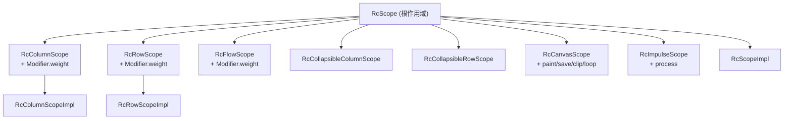
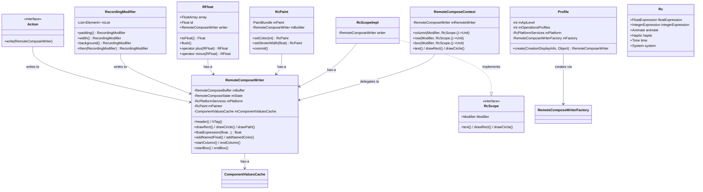
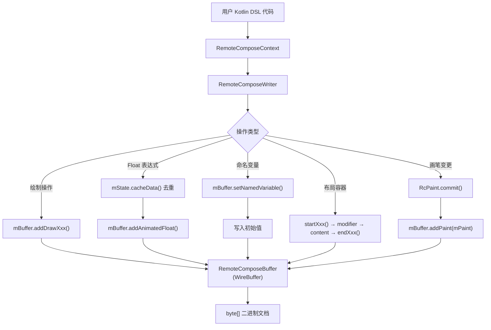
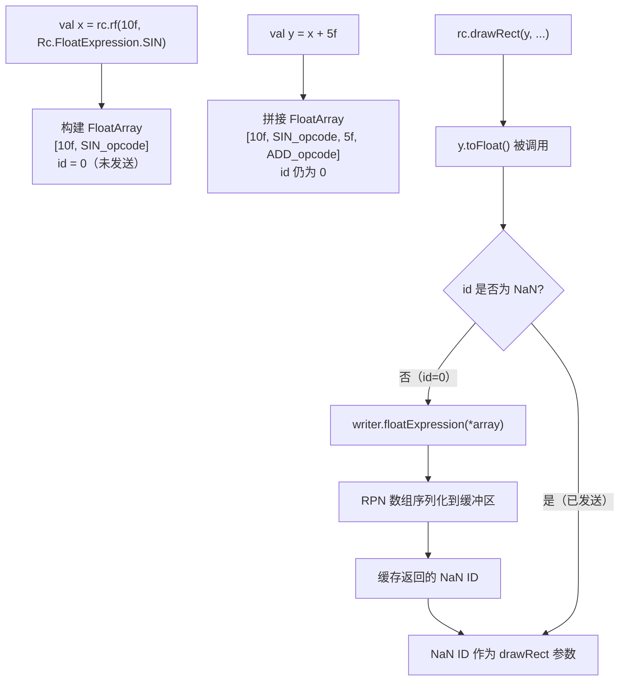
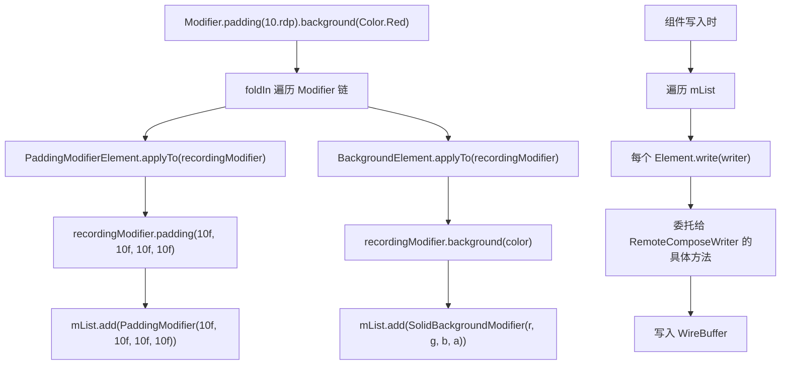
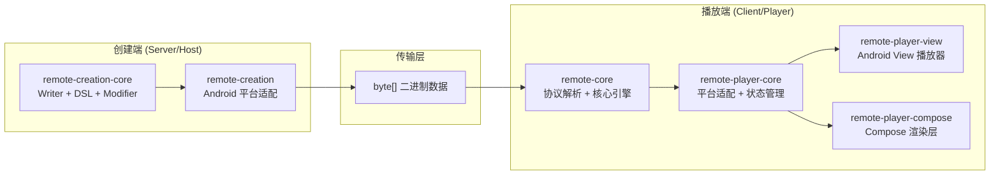

# remote-creation-core 模块软件架构文档

## 1. 模块概览

### 1.1 定位

`remote-creation-core` 是 Remote Compose 项目的**创建端核心引擎**，负责将高层 API 调用序列化为二进制协议。它提供了 Java 命令式 API（`RemoteComposeWriter`）和 Kotlin DSL（`RemoteComposeContext`）两种创建方式。

### 1.2 模块依赖关系

```
remote-core (平台无关核心引擎 — 协议定义、WireBuffer、状态管理)
    ↑ API 依赖
remote-creation-core (创建端核心 — Writer、DSL、Modifier、Action)
    ↑ 依赖
remote-creation (Android 平台创建适配)
```

### 1.3 构建配置

| 配置项 | 值 |
|---|---|
| 命名空间 | `androidx.compose.remote.creation` |
| 类型 | `PUBLISHED_LIBRARY`（纯 JVM 库，无 Android 依赖） |
| 核心 API 依赖 | `remote-core`（API 级） |
| 其他依赖 | `jspecify`、`androidx.annotation:annotation:1.8.1` |

### 1.4 数据流总览

```
用户 Kotlin DSL / Java API
        ↓
RemoteComposeContext (Kotlin DSL 层)
        ↓ 委托
RemoteComposeWriter (Java 核心层)
        ↓ ID 分配 & 去重
RemoteComposeState (缓存层)
        ↓ 序列化
RemoteComposeBuffer (二进制协议层)
        ↓ 编码
byte[] (最终二进制文档)
```

---

## 2. 分层架构图

```mermaid
graph TB
    subgraph User["用户代码"]
        KDSL["Kotlin DSL<br/>RemoteComposeContext"]
        JAPI["Java API<br/>RemoteComposeWriter"]
    end

    subgraph Module["remote-creation-core"]
        subgraph DSL["DSL 层 (dsl/)"]
            RCS["RcScope / RcScopeImpl"]
            MOD["Modifier (Kotlin)"]
            RF["RcFloat (RPN 表达式)"]
            RT["RcTypes (值类)"]
            RPS["RcPaintScope"]
            RAS["RcActionScope"]
            RSS["RcShaderScope"]
            RDC["RcDocCreator"]
        end

        subgraph Actions["Action 层 (actions/)"]
            ACT["Action 接口"]
            VFC["ValueFloatChange"]
            VFEC["ValueFloatExpressionChange"]
            VIC["ValueIntegerChange"]
            VIEC["ValueIntegerExpressionChange"]
            VSC["ValueStringChange"]
            HA["HostAction"]
        end

        subgraph Modifiers["Modifier 层 (modifiers/)"]
            RM["RecordingModifier"]
            LAY["布局: Padding/Width/Height/Offset"]
            DEC["装饰: Background/Border/Clip"]
            INT["交互: ClickAction/TouchAction/Scroll"]
            VIS["可见性: Visibility"]
            SEM["语义: Semantics"]
            GFX["图形: GraphicsLayer/AnimateSpec"]
            CAN["自定义: Canvas/DrawWithContent"]
            MAC["宏: MacroCall/MacroArgument"]
        end

        subgraph Profile["Profile 层 (profile/)"]
            PROF["Profile"]
            FACT["RemoteComposeWriterFactory"]
        end

        subgraph Core["核心层 (根包)"]
            RCW["RemoteComposeWriter"]
            RCP["RcPaint"]
            RCJ["Rc (常量注册表)"]
            CVC["ComponentValuesCache"]
            RCSH["RemoteComposeShader"]
            CDI["CreationDisplayInfo"]
        end
    end

    subgraph Dep["remote-core 依赖"]
        RCB["RemoteComposeBuffer"]
        RCS2["RemoteComposeState"]
        PB["PaintBundle"]
    end

    KDSL --> RCS
    JAPI --> RCW
    RCS --> RCW
    MOD --> RM
    RAS --> ACT
    RF --> RCW
    RPS --> RCP
    RSS --> RCSH

    RCW --> RCB
    RCW --> RCS2
    RCP --> PB
    RM --> RCW
    ACT --> RCW
    PROF --> FACT
    FACT --> RCW
```



---

## 3. 包结构与职责

### 3.1 包总览

| 包 | 职责 | 文件数 |
|---|---|---|
| 根包 | 核心写入引擎、画笔、常量、表达式、缓存 | 10 |
| `actions` | 交互动作定义与序列化 | 7 |
| `dsl` | Kotlin DSL 作用域、Modifier、类型系统 | 12 |
| `modifiers` | 修饰符系统（35 个具体修饰符） | 35 |
| `profile` | 能力配置与 Writer 工厂 | 2 |

### 3.2 文件清单

```
remote-creation-core/src/main/java/androidx/compose/remote/creation/
├── RemoteComposeWriter.java              # 核心写入引擎
├── RemoteComposeWriterInterface.java     # 内容块函数式接口
├── RemoteComposeContext.kt               # Kotlin DSL 入口
├── Rc.java                               # 常量注册表
├── RcPaint.java                          # 画笔状态管理器
├── RFloat.kt                             # 动态浮点表达式 (RPN)
├── Matrix.kt                             # 矩阵表达式封装
├── RemoteComposeShader.java              # 运行时着色器
├── RcFloatArgumentCallback.java          # RFloat 参数回调接口
├── CreationDisplayInfo.java              # 创建时显示信息
├── ComponentValueKeys.java               # 组件布局值键
├── ComponentValuesCache.java             # 组件值去重缓存
├── actions/
│   ├── Action.java                       # 动作接口
│   ├── HostAction.java                   # 宿主端动作
│   ├── ValueFloatChange.java             # 浮点变量赋值
│   ├── ValueFloatExpressionChange.java   # 浮点表达式赋值
│   ├── ValueIntegerChange.java           # 整数变量赋值
│   ├── ValueIntegerExpressionChange.java # 整数表达式赋值
│   └── ValueStringChange.java            # 字符串变量赋值
├── dsl/
│   ├── Modifier.kt                       # Kotlin Modifier 系统
│   ├── RcScope.kt                        # 根作用域接口
│   ├── RcScopeImp.kt                     # 根作用域实现
│   ├── RcActionScope.kt                  # 交互动作作用域
│   ├── RcPaintScope.kt                   # 画笔配置作用域
│   ├── RcShaderScope.kt                  # 着色器作用域
│   ├── RcFloat.kt                        # DSL RcFloat 扩展
│   ├── RcPath.kt                         # 路径 DSL
│   ├── RcPositioning.kt                  # 定位系统
│   ├── RcProfile.kt                      # Profile 封装
│   ├── RcDocCreator.kt                   # 文档创建入口
│   └── RcTypes.kt                        # 类型安全值类与枚举
├── modifiers/
│   ├── RecordingModifier.java            # 修饰符容器基类
│   ├── Shape.java / CircleShape.java / RectShape.java / RoundedRectShape.java
│   ├── PaddingModifier.java / OffsetModifier.java / ZIndexModifier.java
│   ├── WidthModifier.java / HeightModifier.java
│   ├── WidthInModifier.java / HeightInModifier.java
│   ├── SolidBackgroundModifier.java / DynamicSolidBackgroundModifier.java
│   ├── BorderModifier.java / DynamicBorderModifier.java
│   ├── ClipModifier.java / RippleModifier.java
│   ├── ClickActionModifier.java / TouchActionModifier.java
│   ├── ScrollModifier.java / VisibilityModifier.java
│   ├── SemanticsModifier.java / MarqueeModifier.java
│   ├── GraphicsLayerModifier.java / AnimateSpecModifier.java
│   ├── CanvasModifier.java / DrawWithContentModifier.java
│   ├── CollapsiblePriorityModifier.java / AlignByModifier.java
│   ├── ComponentLayoutComputeModifier.java / ComponentLayoutChanges.java / ComponentLayoutChangesWriter.java
│   ├── IncludeReferencedOperationsModifier.java
│   ├── MacroArgumentModifier.java / MacroCallModifier.java
│   └── UnsupportedModifier.java
└── profile/
    ├── Profile.java                       # 能力配置
    └── RemoteComposeWriterFactory.java    # Writer 工厂接口
```

---

## 4. 核心类详解

### 4.1 RemoteComposeWriter（核心写入引擎）

**文件**：`RemoteComposeWriter.java`
**设计模式**：Facade + Delegation

整个创建端的核心引擎，将高层 API 调用序列化为二进制协议。

**关键字段**：

| 字段 | 类型 | 说明 |
|---|---|---|
| `mBuffer` | `RemoteComposeBuffer` | 底层二进制缓冲区 |
| `mState` | `RemoteComposeState` | ID 分配和数据去重缓存 |
| `mPlatform` | `RcPlatformServices` | 平台服务抽象 |
| `mPainter` | `RcPaint` | 内置画笔对象 |
| `mComponentValuesCache` | `ComponentValuesCache` | 组件值缓存 |

**方法分组**：

| 分组 | 方法 | 说明 |
|---|---|---|
| 文档头 | `header()` / `hTag()` | 写入文档头（宽高、密度等） |
| 绘制操作 | `drawRect()` / `drawCircle()` / `drawArc()` / `drawPath()` / `drawBitmap()` 等 | 委托给 `mBuffer.addDrawXxx()` |
| Float 表达式 | `floatExpression(float...)` | RPN 表达式序列化，返回 NaN 编码 ID |
| 常量与变量 | `addFloatConstant()` / `reserveFloatVariable()` | 去重缓存 + ID 分配 |
| 命名变量 | `addNamedFloat()` / `addNamedColor()` / `addNamedString()` | 注册名称 + 写入初始值 |
| 布局容器 | `startColumn()/endColumn()` / `startBox()/endBox()` / `startCanvas()/endCanvas()` | start/end 配对模式 |
| 循环与条件 | `startLoop()/endLoop()` / `conditionalOperations()/endConditionalOperations()` | start/end 配对 |
| 路径操作 | `addPathData()` / `pathCreate()` / `pathAppend()` | 平台路径 → float 数组 |
| 矩阵变换 | `translate()` / `scale()` / `rotate()` / `skew()` / `save()` / `restore()` | 委托给 `mBuffer.addMatrixXxx()` |
| 引用操作 | `startReferencedOperations()/endReferencedOperations()` | 操作复用 |

**ID-as-NaN 编码**：用 NaN 浮点数的低有效位编码整数 ID，使得 float 表达式和 ID 可以在同一参数位置传递。

---

### 4.2 RemoteComposeContext（Kotlin DSL 入口）

**文件**：`RemoteComposeContext.kt`
**设计模式**：Builder DSL + Delegate

Kotlin DSL 的入口，提供惯用的 Kotlin API 来创建 RemoteCompose 文档。持有 `RemoteComposeWriter` 实例，所有方法直接转发。

**DSL 布局方法**：
```kotlin
rc.column(modifier) { /* RcScope 内容 */ }
rc.row(modifier) { /* RcScope 内容 */ }
rc.box(modifier) { /* RcScope 内容 */ }
rc.canvas(modifier) { /* RcCanvasScope 内容 */ }
rc.flow(modifier) { /* RcScope 内容 */ }
```

**表达式便捷方法**：
```kotlin
rc.Hour() / rc.Minutes() / rc.Seconds()
rc.animationTime() / rc.deltaTime()
rc.ComponentWidth() / rc.ComponentHeight()
rc.windowWidth() / rc.windowHeight()
```

---

### 4.3 RcPaint（画笔状态管理器）

**文件**：`RcPaint.java`
**设计模式**：Fluent Builder + State

封装 `PaintBundle`，提供链式 API 管理画笔状态。

**核心机制**：
- 所有 setter 返回 `this`，支持链式调用
- 画笔状态在 `PaintBundle` 中累积
- `commit()` 时一次性序列化到 `mBuffer.addPaint(mPaint)`，然后重置

**关键方法**：

| 分组 | 方法 | 说明 |
|---|---|---|
| 颜色 | `setColor(int)` / `setColorId(int)` / `setColor(RcColor)` | 支持直接值和 ID 引用 |
| 描边 | `setStrokeWidth(float/RcFloat)` / `setStrokeCap()` / `setStrokeJoin()` | RcFloat 支持动态表达式 |
| 渐变 | `setLinearGradient()` / `setRadialGradient()` / `setSweepGradient()` | 支持颜色 ID 掩码 |
| 文字 | `setTextSize(float/RcFloat)` / `setTypeface()` | RcFloat 支持动态表达式 |
| 高级 | `setShader()` / `setTextureShader()` / `setPathEffect()` / `setBlendMode()` | 着色器、路径效果、混合模式 |

---

### 4.4 RFloat（动态浮点表达式）

**文件**：`RFloat.kt`
**设计模式**：Lazy Evaluation + Expression Tree + Value Object

`RFloat` 是整个 DSL 中最核心的类型，封装了 RPN（逆波兰表示法）浮点表达式。

**关键属性**：

| 属性 | 类型 | 说明 |
|---|---|---|
| `array` | `FloatArray` | RPN 表达式指令序列 |
| `id` | `Float` | NaN 编码的 ID，0 表示尚未发送 |
| `writer` | `RemoteComposeWriter?` | 关联的写入器 |
| `animation` | `FloatArray?` | 可选的动画规范 |

**延迟求值机制**：
- `toFloat()`：如果 `id` 已是 NaN（已发送），直接返回；否则调用 `writer.floatExpression(*array)` 序列化到缓冲区，缓存返回的 NaN ID
- `flush()`：强制调用 `toFloat()` 立即序列化

**运算符重载**：`+`、`-`、`*`、`/`、`%`、`unaryMinus` — 均返回新 `RcFloat`，将操作数和运算码追加到 RPN 数组

**数学函数**（顶层函数）：
- 基本：`max`、`min`、`pow`、`sqrt`、`abs`、`ceil`、`floor`、`log`、`round`
- 三角：`sin`、`cos`、`tan`、`asin`、`acos`、`atan`、`atan2`
- 高级：`lerp`、`smoothStep`、`pingPong`、`clamp`、`cubic`、`hypot`、`noiseFrom`
- 数组：`arrayMax`、`arrayMin`、`arraySum`、`arrayAvg`、`arrayLength`、`arraySpline`

---

### 4.5 Rc（常量注册表）

**文件**：`Rc.java`
**设计模式**：Constant Registry + Facade

将分散在多个核心类中的常量集中到一个统一入口。

**主要内部类**：

| 内部类 | 说明 |
|---|---|
| `FloatExpression` | RPN 浮点运算操作码（50+ 个） |
| `IntegerExpression` | 整数运算操作码 |
| `Animate` | 缓动类型常量 |
| `ColorExpression` | 颜色插值模式 |
| `ImageScale` | 图像缩放模式 |
| `Haptic` | 触觉反馈常量（20 种） |
| `Time` | 时间变量常量 |
| `System` | 系统变量 |
| `Touch` | 触摸变量和停止模式 |
| `Sensor` | 传感器变量 |
| `Theme` | 主题模式 |
| `AndroidColors` | 195 个 Android 系统颜色 ID |

---

### 4.6 RcTypes（类型安全值类）

**文件**：`dsl/RcTypes.kt`
**设计模式**：Value Class（零开销内联类）

**值类**（`@JvmInline value class`）：

| 值类 | 封装 | 说明 |
|---|---|---|
| `RcText` | 资源 ID | 文本引用 |
| `RcImage` | 资源 ID | 图片引用 |
| `RcColor` | 资源 ID | 颜色引用 |
| `RcDp` | Float | 类型安全 dp 单位 |
| `RcPx` | Float | 类型安全 px 单位 |
| `RcSp` | Float | 类型安全 sp 单位 |
| `RcBool` | Int | 布尔变量引用 |
| `RcShader` | Int | 着色器引用 |
| `RcComponentId` | Int | 组件 ID |

**扩展属性**：`Int.rdp`、`Float.rdp`、`Int.rsp`、`Float.rsp` 等

**枚举类**（约 20 个）：`RcTextAlign`、`RcBlendMode`、`RcStrokeCap`、`RcAnimationCurve` 等

---

### 4.7 DSL 作用域体系

**文件**：`dsl/RcScope.kt` / `dsl/RcScopeImp.kt`
**设计模式**：Type-safe Builder + @DslMarker



所有作用域接口标注 `@RcDslMarker`（即 `@DslMarker`），防止嵌套 lambda 中意外调用外层作用域的方法。实现类持有 `RemoteComposeWriter` 引用，将 DSL 调用翻译为底层写入操作。

---

### 4.8 Action 系统

**文件**：`actions/`
**设计模式**：Command Pattern

所有动作均实现 `Action` 接口：

```java
public interface Action {
    void write(RemoteComposeWriter writer);
}
```

| 动作类 | 功能 | 关键字段 |
|---|---|---|
| `ValueFloatChange` | 设置浮点变量为字面值 | `mValueId`, `mValue(float)` |
| `ValueFloatExpressionChange` | 设置浮点变量为表达式引用 | `mValueId`, `mValue(int)` |
| `ValueIntegerChange` | 设置整数变量为字面值 | `mValueId`, `mValue(int)` |
| `ValueIntegerExpressionChange` | 设置整数变量为表达式引用 | `mValueId(long)`, `mValue(long)` |
| `ValueStringChange` | 设置文本变量 | `mValueId`, `mValue(String)` |
| `HostAction` | 触发宿主端动作 | `mActionId` 或 `mActionName` |

**与 DSL 的桥接**：`RcActionScopeImpl.build()` 将 DSL lambda 中收集的 `setValue`/`hostAction` 调用转换为 `List<Action>`。

---

### 4.9 Profile 系统

**文件**：`profile/Profile.java` / `profile/RemoteComposeWriterFactory.java`

**Profile**：封装文档的能力配置：
- `mApiLevel`：操作 API 级别
- `mOperationsProfiles`：操作配置位掩码
- `mPlatform`：平台服务实现
- `mFactory`：Writer 工厂

**RemoteComposeWriterFactory**：工厂接口，解耦 Profile 与具体 Writer 实现。

---

### 4.10 其他辅助类

| 类 | 说明 |
|---|---|
| `ComponentValuesCache` | 组件值的去重缓存（Cache-Aside 模式） |
| `ComponentValueKeys` | 组件布局值的键值容器 |
| `RemoteComposeShader` | 运行时着色器创建与管理（Builder + 去重） |
| `CreationDisplayInfo` | 创建时的显示属性信息（宽高、密度） |
| `RcFloatArgumentCallback` | 带 RFloat 参数的回调接口 |
| `Matrix` | 矩阵表达式的便捷封装 |

---

## 5. 设计模式总结

| 模式 | 应用位置 | 说明 |
|---|---|---|
| **Type-safe Builder** | `RcScope` 体系、`RcPaintScope`、`RcActionScope` | `@DslMarker` + 带接收者 lambda 实现编译期类型检查 |
| **Command** | `Action` 接口及实现类 | 将交互动作封装为可序列化对象 |
| **Facade** | `RemoteComposeWriter`、`Rc` | 统一入口，隐藏底层细节 |
| **Delegation** | `RemoteComposeContext` → `RemoteComposeWriter` | 所有 DSL 调用委托给 Writer |
| **Fluent Builder** | `RcPaint`、`RecordingModifier` | setter 返回 `this`，链式调用 |
| **State** | `RcPaint` + `PaintBundle` | 状态累积，`commit()` 时一次性序列化 |
| **Lazy Evaluation** | `RcFloat` | RPN 表达式在 `toFloat()` 时才序列化 |
| **Expression Tree** | `RcFloat` | 运算符重载构建 RPN 表达式树 |
| **Value Class** | `RcTypes` 中的 `RcText`、`RcDp` 等 | 零开销内联类，编译期区分类型 |
| **Cache-Aside** | `ComponentValuesCache`、`RemoteComposeState` | 先查缓存，未命中则分配、写入、缓存 |
| **Null Object** | `UnsupportedModifier` | `write()` 为空实现，避免 NPE |
| **Factory Method** | `RemoteComposeWriterFactory` | 允许 Profile 注入自定义 Writer |
| **Strategy** | `SupportedOperationsProvider` | 可替换的操作验证逻辑 |
| **Bridge** | DSL 接口 ↔ Writer/RcPaint/RecordingModifier | Impl 类桥接两层 |

---

## 6. 接口与实现对应关系

| 接口 | 实现 | 说明 |
|---|---|---|
| `RcScope` | `RcScopeImpl` | 根 DSL 作用域 |
| `RcColumnScope` | `RcColumnScopeImpl` | Column 作用域 |
| `RcRowScope` | `RcRowScopeImpl` | Row 作用域 |
| `RcCanvasScope` | `RcCanvasScopeImpl` | Canvas 作用域 |
| `RcPaintScope` | `RcPaintScopeImpl` | 画笔配置作用域 |
| `RcActionScope` | `RcActionScopeImpl` | 交互动作作用域 |
| `RcShaderScope` | `RcShaderScopeImpl` | 着色器作用域 |
| `Action` | `ValueFloatChange` 等 6 个类 | 交互动作 |
| `RecordingModifier.Element` | 35 个具体修饰符 | 修饰符序列化 |
| `Modifier.Element` | 40+ 个 Kotlin 扩展函数返回的对象 | Kotlin Modifier |
| `RemoteComposeWriterFactory` | 由 Profile 注入 | Writer 工厂 |
| `RemoteComposeWriterInterface` | Lambda/函数式接口 | 内容块 |

---

## 7. 类关系图



---

## 8. 数据流与生命周期

### 8.1 DSL → Writer → Buffer 完整数据流



### 8.2 RFloat 延迟求值流程



### 8.3 Modifier 序列化流程



### 8.4 Action 序列化流程

```mermaid
flowchart TD
    A["Modifier.onClick {<br/>  setValue(myVar, 1.0f)<br/>  hostAction(\"refresh\")<br/>}"] --> B["RcActionScopeImpl 收集动作"]
    B --> C["actionBuilders.add { writer -><br/>  ValueFloatChange(varId, 1.0f)<br/>}"]
    B --> D["actionBuilders.add { writer -><br/>  HostAction(actionName, ...)<br/>}"]

    E["ClickActionModifier.write(writer)"] --> F["writer.addClickModifierOperation()"]
    F --> G["遍历 actions"]
    G --> H["ValueFloatChange.write(writer)"]
    H --> I["writer.addValueFloatChangeActionOperation()"]
    G --> J["HostAction.write(writer)"]
    J --> K["writer.addActionOperation()"]
    G --> L["writer.addContainerEnd()"]
```

---

## 9. Modifier 系统架构

### 9.1 双层 Modifier 设计

```
Kotlin Modifier (dsl/Modifier.kt)
    ├── 不可变、有序的修饰符元素集合
    ├── 支持 then() 链式拼接
    ├── 40+ 个扩展函数
    └── applyTo(RecordingModifier) 桥接到旧版

RecordingModifier (modifiers/RecordingModifier.java)
    ├── 可变、列表式的修饰符容器
    ├── Builder 模式，所有方法返回 this
    ├── 35 个具体 Element 实现
    └── write(RemoteComposeWriter) 序列化到 WireBuffer
```

### 9.2 修饰符分类

| 分类 | 修饰符 | 数量 |
|---|---|---|
| **布局** | Padding、Width、Height、WidthIn、HeightIn、Offset、ZIndex、AlignBy、CollapsiblePriority | 9 |
| **装饰** | SolidBackground、DynamicSolidBackground、Border、DynamicBorder、Clip、Ripple、Marquee | 7 |
| **交互** | ClickAction、TouchAction、Scroll | 3 |
| **可见性** | Visibility | 1 |
| **语义** | Semantics | 1 |
| **图形** | GraphicsLayer、AnimateSpec | 2 |
| **自定义绘制** | Canvas、DrawWithContent | 2 |
| **布局计算** | ComponentLayoutCompute、ComponentLayoutChanges、ComponentLayoutChangesWriter | 3 |
| **宏与引用** | IncludeReferencedOperations、MacroArgument、MacroCall | 3 |
| **形状** | Shape、CircleShape、RectShape、RoundedRectShape | 4 |
| **特殊** | Unsupported | 1 |

### 9.3 序列化模式

| 模式 | 示例 | 特点 |
|---|---|---|
| **原子式** | PaddingModifier、OffsetModifier、ZIndexModifier | 单次 writer 调用 |
| **容器式** | ClickActionModifier、TouchActionModifier、CanvasModifier | 头部标记 + 子元素 + 尾部标记 |
| **条件式** | ClipModifier（instanceof Shape）、ScrollModifier | 根据类型/参数选择不同方法 |

### 9.4 静态与动态修饰符

| 静态版本 | 动态版本 | 区别 |
|---|---|---|
| `SolidBackgroundModifier` | `DynamicSolidBackgroundModifier` | 静态持有 RGBA 浮点值；动态持有 `int colorId` |
| `BorderModifier` | `DynamicBorderModifier` | 静态持有 `int mColor`；动态持有 `short mColorId` |

---

## 10. 使用方法

### 10.1 Kotlin DSL 创建文档

```kotlin
val buffer = createRcBuffer(profile) {
    // 设置文档头
    Modifier

    // 创建布局
    column(Modifier.fillMaxWidth().padding(16.rdp)) {
        // 文本
        text("Hello World", textSize = 16.rsp)

        // 动态表达式
        val progress = animationTime() % 1f
        drawRect(Color.Red, 0f, 0f, progress * ComponentWidth(), 4.rdp)

        // 交互
        box(Modifier.fillMaxWidth().height(48.rdp)
            .onClick {
                setValue(myVar, 1.0f)
                hostAction("refresh")
            }
        ) {
            text("Click Me")
        }
    }
}
```

### 10.2 Java 命令式创建文档

```java
RemoteComposeWriter writer = profile.create(displayInfo, null);
writer.header(width, height, density);
writer.startColumn(modifier);
    writer.text(textId, x, y, width, height, 0);
    writer.drawRect(0, 0, 100, 100, painter.setColor(Color.RED).commit());
writer.endColumn();
byte[] buffer = writer.buffer();
```

### 10.3 RcFloat 表达式

```kotlin
// 基本运算
val x = 10.rf + 5.rf * 2.rf  // RPN: [10, 5, 2, MUL, ADD]

// 数学函数
val angle = animationTime() * 2f
val sinX = sin(angle)
val cosX = cos(angle)

// 条件表达式
val color = ifThenElse(progress.gt(0.5f), redColor, blueColor)

// 数组操作
val values = floatArrayOf(1f, 2f, 3f, 4f, 5f)
val avg = arrayAvg(values)
```

### 10.4 画笔配置

```kotlin
// Kotlin DSL 方式
drawRect(paint = {
    color = Color.Red
    strokeWidth = 2.rdp
    style = RcPaintStyle.STROKE
})

// Java 方式
painter.setColor(Color.RED)
       .setStrokeWidth(2f)
       .setStyle(Paint.Style.STROKE)
painter.commit()
```

### 10.5 着色器

```kotlin
val shader = rc.createShader("""
    uniform float2 resolution;
    uniform shader texture;
    half4 main(float2 coord) {
        // AGSL 着色器代码
    }
""")

shader.uniform("resolution", width, height)
shader.textureUniform("texture", imageId)
shader.commit()
```

### 10.6 动画

```kotlin
// 使用动画表达式
val animatedValue = (animationTime() * 0.5f).anim(
    duration = 300,
    curve = RcAnimationCurve.CUBIC_STANDARD
)

// 使用动画规格修饰符
Modifier.animationSpec(
    animationId = 1,
    enterAnimation = RcAnimationCurve.CUBIC_STANDARD,
    exitAnimation = RcAnimationCurve.CUBIC_ACCELERATE
)
```

---

## 11. 模块在整体架构中的位置



`remote-creation-core` 在整体架构中是创建端的**核心引擎**：
- **承上**：为 `remote-creation`（Android 平台适配层）提供 Writer 和 DSL 能力
- **启下**：依赖 `remote-core` 的 `RemoteComposeBuffer`、`RemoteComposeState`、`PaintBundle` 等底层基础设施
- **核心价值**：将高层声明式 API 调用转化为紧凑的二进制协议，支持动态表达式、交互动作、修饰符系统等高级特性
