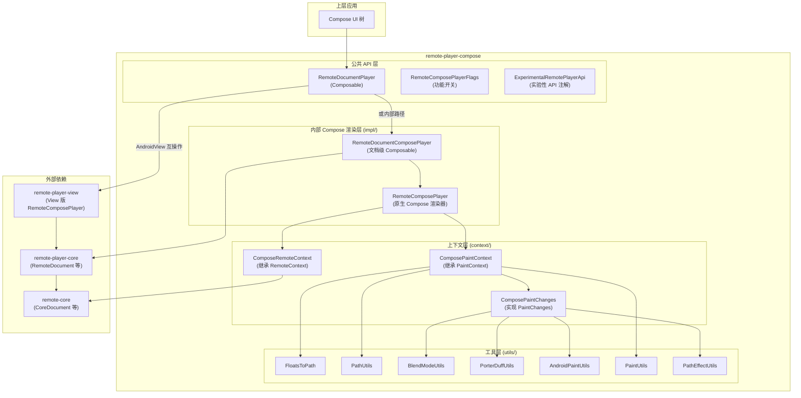
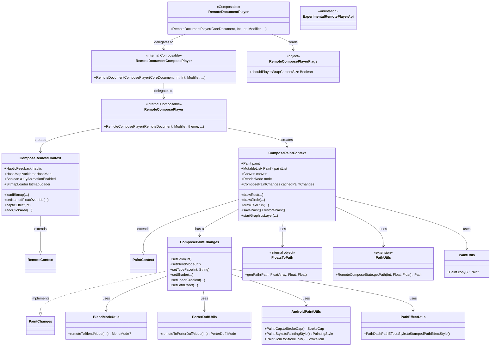
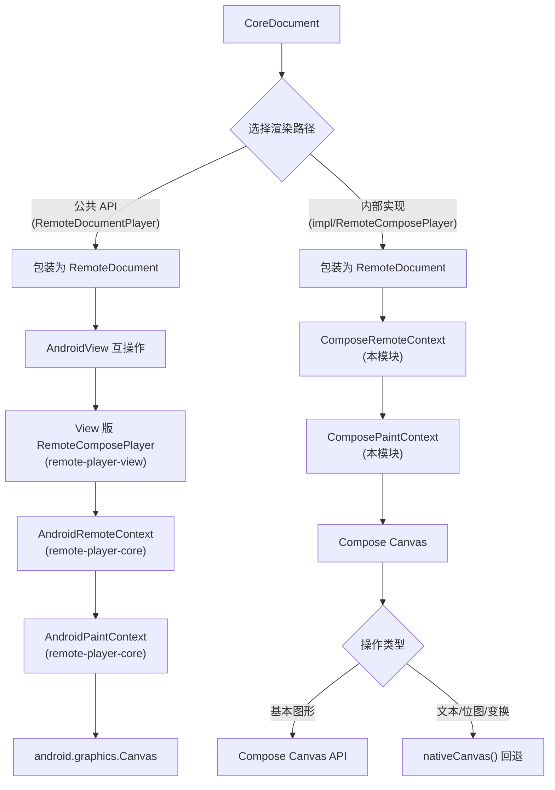
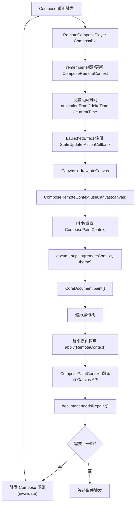
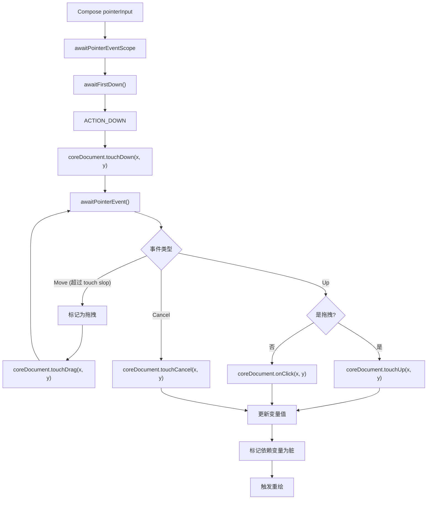
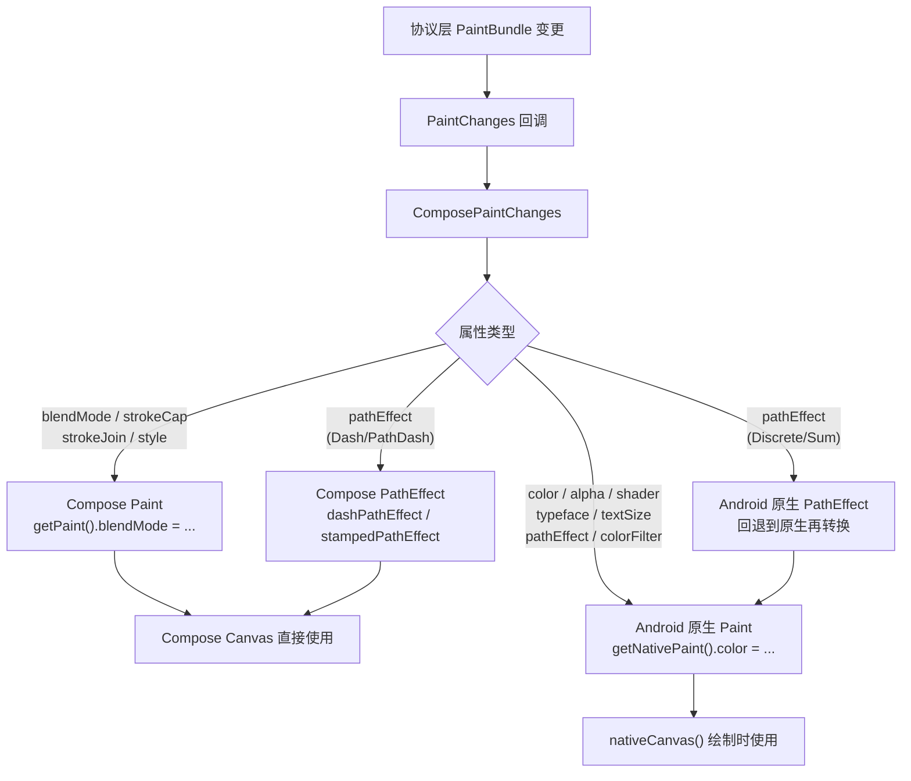
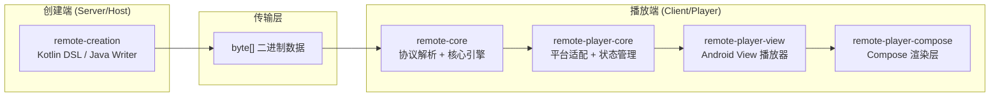

# remote-player-compose 模块软件架构文档

## 1. 模块概览

### 1.1 定位

`remote-player-compose` 是 Remote Compose 项目的 **Jetpack Compose 渲染层**，将远程文档（`CoreDocument`）通过 Compose 的 `Canvas` 绘制体系进行渲染，为 Compose-first 的应用提供原生集成点。

### 1.2 双轨并行状态

模块当前处于**双轨并行**状态：

| 路径 | 实现 | 功能完整度 |
|---|---|---|
| **公共 API**（`RemoteDocumentPlayer`） | 通过 `AndroidView` 互操作使用 View 版播放器 | 完整（无障碍、传感器、滚动等） |
| **内部实现**（`impl/RemoteComposePlayer`） | 纯 Compose 原生渲染路径 | 不完整（缺少无障碍、传感器、滚动） |

### 1.3 模块依赖关系

```
remote-core (平台无关核心引擎)
    ↓ 依赖
remote-player-core (Android 平台适配 + 状态管理)
    ↓ 依赖
remote-player-view (Android View 播放器)
    ↓ 依赖
remote-player-compose (Compose 渲染层)
```

### 1.4 构建配置

| 配置项 | 值 |
|---|---|
| 命名空间 | `androidx.compose.remote.player.compose` |
| minSdk | 29 |
| compileSdk | 37 |
| 类型 | `PUBLISHED_LIBRARY_ONLY_USED_BY_KOTLIN_CONSUMER` |
| 核心依赖 | `remote-core`、`remote-player-core`、`remote-player-view` |
| Compose 依赖 | Compose UI/Foundation 1.8.3、AppCompat 1.7.0、Activity-Compose 1.9.0 |

---

## 2. 分层架构图



---

## 3. 包结构与职责

### 3.1 包总览

| 包 | 职责 | 文件数 |
|---|---|---|
| 根包 | 公共 API 入口、功能开关、实验性注解 | 3 |
| `context` | Compose 上下文实现（RemoteContext、PaintContext、PaintChanges） | 3 |
| `impl` | 内部 Compose 渲染器实现 | 2 |
| `utils` | 类型转换与工具函数 | 7 |

### 3.2 文件清单

```
remote-player-compose/src/main/java/androidx/compose/remote/player/compose/
├── ExperimentalRemotePlayerApi.kt              # 实验性 API 注解
├── RemoteComposePlayerFlags.kt                 # 功能开关
├── RemoteDocumentPlayer.kt                     # 公共 API 入口 (Composable)
├── context/
│   ├── ComposePaintChanges.kt                  # Paint 属性变更处理器
│   ├── ComposePaintContext.kt                   # Compose 画布绘制上下文
│   └── ComposeRemoteContext.kt                  # Compose 运行时上下文
├── impl/
│   ├── RemoteComposePlayer.kt                  # 原生 Compose 渲染器
│   └── RemoteDocumentComposePlayer.kt          # 文档级 Composable
└── utils/
    ├── AndroidPaintUtils.kt                    # Paint 属性类型转换
    ├── BlendModeUtils.kt                       # 混合模式转换
    ├── FloatsToPath.kt                         # 浮点数组路径转换器
    ├── PaintUtils.kt                           # Paint 复制工具
    ├── PathEffectUtils.kt                      # 路径效果样式转换
    ├── PathUtils.kt                            # 路径获取扩展函数
    └── PorterDuffUtils.kt                      # PorterDuff 模式转换
```

---

## 4. 核心类详解

### 4.1 RemoteDocumentPlayer（公共 API 入口）

**文件**：`RemoteDocumentPlayer.kt`
**设计模式**：AndroidView 互操作 + Facade

模块唯一的公共 Composable 函数，当前通过 `AndroidView` 互操作将 View 版 `RemoteComposePlayer` 嵌入 Compose 树。

**关键签名**：
```kotlin
@Composable
public fun RemoteDocumentPlayer(
    document: CoreDocument,
    documentWidth: Int,
    documentHeight: Int,
    modifier: Modifier = Modifier,
    debugMode: Int = 0,
    init: (RemoteComposePlayer) -> Unit = {},
    update: (RemoteComposePlayer) -> Unit = {},
    onAction: (actionId: Int, value: String?) -> Unit = { _, _ -> },
    onNamedAction: (name: String, value: Any?, stateUpdater: StateUpdater) -> Unit = { _, _, _ -> },
    bitmapLoader: BitmapLoader? = null,
)
```

**核心行为**：
1. 检测暗色主题（`AppCompatDelegate` + `isSystemInDarkTheme()`）
2. 将 `CoreDocument` 包装为 `RemoteDocument`
3. 使用 `AndroidView` 互操作嵌入 View 版 `RemoteComposePlayer`
4. 注册 `FullyDrawnReporter` 报告首帧绘制
5. 根据 `RemoteComposePlayerFlags.shouldPlayerWrapContentSize` 选择修饰符

---

### 4.2 RemoteComposePlayer（原生 Compose 渲染器）

**文件**：`impl/RemoteComposePlayer.kt`
**可见性**：`internal`
**设计模式**：完全声明式 Composable

纯 Compose 原生渲染路径，使用 Compose `Canvas` + `drawIntoCanvas` 进行绘制。

**关键签名**：
```kotlin
@Composable
internal fun RemoteComposePlayer(
    document: RemoteDocument,
    modifier: Modifier = Modifier,
    theme: Int = -1,
    debugMode: Int = 0,
    clock: RemoteClock = SystemClock(),
    onNamedAction: (name: String, value: Any?, stateUpdater: StateUpdater) -> Unit = { _, _, _ -> },
    bitmapLoader: BitmapLoader? = null,
)
```

**核心行为**：
1. 创建并初始化 `ComposeRemoteContext`（设置动画、触觉反馈、位图加载器等）
2. 注册 `StateUpdaterActionCallback` + `NamedActionHandler` 处理命名动作
3. 使用 Compose `Canvas` + `drawIntoCanvas` 进行绘制
4. 通过 `pointerInput` 处理触摸事件
5. 每帧更新动画时间（`animationTime`、`deltaTime`、`currentTime`）
6. 设置 `ComposePaintContext` 并调用 `document.paint(remoteContext, theme)`

---

### 4.3 RemoteDocumentComposePlayer（文档级 Composable）

**文件**：`impl/RemoteDocumentComposePlayer.kt`
**可见性**：`internal`
**设计模式**：Facade/Adapter

将 `CoreDocument` 包装为 `RemoteDocument`，检测主题，委托给 `RemoteComposePlayer`。

**核心行为**：
1. 接收 `CoreDocument` + 尺寸参数
2. 检测暗色主题，计算 `playbackTheme`
3. 将 `CoreDocument` 包装为 `RemoteDocument`
4. 委托给 `RemoteComposePlayer`，附加 `Modifier.size(documentWidth.dp, documentHeight.dp)`

---

### 4.4 ComposeRemoteContext（Compose 上下文实现）

**文件**：`context/ComposeRemoteContext.kt`
**可见性**：`internal`
**设计模式**：Adapter + Strategy

继承 `RemoteContext`（来自 `remote-core`），为 Compose 环境提供运行时上下文。

**关键属性**：

| 属性 | 类型 | 说明 |
|---|---|---|
| `haptic` | `HapticFeedback` | Compose 触觉反馈（替代 View 版的 Vibrator） |
| `varNameHashMap` | `HashMap<String, VarName?>` | 变量名到 ID/类型的映射 |
| `a11yAnimationEnabled` | `Boolean` | 无障碍动画开关 |
| `bitmapLoader` | `BitmapLoader` | 位图加载策略 |

**核心方法分组**：

| 分组 | 方法 | 说明 |
|---|---|---|
| 数据加载 | `loadPathData`、`loadVariableName`、`loadColor`、`loadBitmap`、`loadText`、`loadFloat` 等 | 各种类型数据的加载与缓存 |
| 数据覆盖 | `setNamedColorOverride`、`setNamedStringOverride`、`setNamedFloatOverride` 等 | 按名称覆盖变量值 |
| 数据获取 | `getText`、`getFloat`、`getInteger`、`getLong`、`getColor`、`getShader` 等 | 从状态中读取数据 |
| 交互 | `addClickArea`、`runAction`、`runNamedAction`、`hapticEffect` | 点击区域、动作执行、触觉反馈 |
| 动画 | `isAnimationEnabled()` | 受 `a11yAnimationEnabled` 控制 |

**与 View 版的差异**：`hapticEffect()` 使用 Compose `HapticFeedback` 而非 Android View 的 `Vibrator` 服务。

---

### 4.5 ComposePaintContext（Compose 画布绘制上下文）

**文件**：`context/ComposePaintContext.kt`
**可见性**：`internal`
**设计模式**：Adapter + 双轨渲染

继承 `PaintContext`（来自 `remote-core`），将绘制操作翻译为 Compose `Canvas` API 调用。

**关键属性**：

| 属性 | 类型 | 说明 |
|---|---|---|
| `paint` | `Paint` | Compose `Paint` 对象 |
| `paintList` | `MutableList<Paint>` | Paint 栈（save/restore） |
| `canvas` | `Canvas` | Compose `Canvas` |
| `node` | `RenderNode?` | Android `RenderNode`（图形层） |
| `cachedPaintChanges` | `ComposePaintChanges` | Paint 变更委托 |

**双轨渲染策略**：

| 操作类型 | 渲染路径 | 说明 |
|---|---|---|
| 基本图形（rect、circle、line、oval 等） | Compose `Canvas` API | 直接使用 `drawRect`、`drawCircle` 等 |
| 文本绘制 | `nativeCanvas()` | 回退到 Android 原生 Canvas |
| 位图绘制 | `nativeCanvas()` | 回退到 Android 原生 Canvas |
| 带中心点的变换 | `nativeCanvas()` | 回退到 Android 原生 Canvas |
| 图形层 | Android `RenderNode` | 硬件加速的图形层 |

**核心方法分组**：

| 分组 | 方法 | 说明 |
|---|---|---|
| 基本图形 | `drawRect`、`drawRoundRect`、`drawCircle`、`drawOval`、`drawArc`、`drawSector`、`drawLine`、`drawPath`、`drawBitmap` | 基本图形绘制 |
| 文本 | `drawTextRun`、`drawTextOnPath`、`drawComplexText`、`getTextBounds`、`layoutComplexText` | 文本测量与绘制 |
| 路径操作 | `drawTweenPath`、`tweenPath`、`combinePath`、`matrixFromPath` | 路径插值与组合 |
| 变换 | `scale`、`translate`、`matrixScale`、`matrixTranslate`、`matrixSkew`、`matrixRotate` | Canvas 变换 |
| 裁剪 | `clipRect`、`clipPath`、`roundedClipRect` | 裁剪区域 |
| Paint 管理 | `savePaint`、`restorePaint`、`replacePaint`、`applyPaint`、`reset` | Paint 状态栈 |
| 图形层 | `startGraphicsLayer`、`setGraphicsLayer`、`endGraphicsLayer` | RenderNode 硬件加速 |
| 离屏渲染 | `drawToBitmap` | 切换到 Bitmap Canvas |

---

### 4.6 ComposePaintChanges（Paint 属性变更处理器）

**文件**：`context/ComposePaintChanges.kt`
**可见性**：`internal`
**设计模式**：双轨 Paint 操作

实现 `PaintChanges`（来自 `remote-core`），将协议层的 Paint 属性变更同时应用到 Compose `Paint` 和 Android 原生 `Paint`。

**双轨 Paint 操作**：

| 属性 | Compose Paint | Android 原生 Paint |
|---|---|---|
| `blendMode` | `getPaint().blendMode` | — |
| `strokeCap` | `getPaint().strokeCap` | — |
| `strokeJoin` | `getPaint().strokeJoin` | — |
| `style` | `getPaint().style` | — |
| `color` | — | `getNativePaint().color` |
| `alpha` | — | `getNativePaint().alpha` |
| `shader` | — | `getNativePaint().shader` |
| `typeface` | — | `getNativePaint().typeface` |
| `textSize` | — | `getNativePaint().textSize` |
| `pathEffect` | — | `getNativePaint().pathEffect` |
| `colorFilter` | — | `getNativePaint().colorFilter` |

**关键方法**：

| 分组 | 方法 | 说明 |
|---|---|---|
| 颜色/混合 | `setColor`、`setAlpha`、`setBlendMode`、`setColorFilter`、`clear` | 颜色与混合模式 |
| 描边 | `setStrokeWidth`、`setStrokeCap`、`setStrokeJoin`、`setStrokeMiter`、`setStyle` | 描边属性 |
| 字体 | `setTypeFace`（4 种内置 + 自定义）、`setFallbackTypeFace`、`setTextSize`、`setFontVariationAxes` | 字体设置 |
| 着色器 | `setShader`（RuntimeShader）、`setTextureShader`、`setLinearGradient`、`setRadialGradient`、`setSweepGradient`、`setShaderMatrix` | 着色器与渐变 |
| 路径效果 | `setPathEffect` — Dash、Discrete、PathDash、Sum、Compose | 路径效果 |
| 其他 | `setFilterBitmap`、`setAntiAlias`、`setImageFilterQuality` | 其他属性 |

---

### 4.7 工具类

#### FloatsToPath
**文件**：`utils/FloatsToPath.kt`
将 float 数组表示的路径数据转换为 Compose `Path`。支持 MOVE、LINE、QUADRATIC、CONIC（SDK 34+）、CUBIC、CLOSE、DONE。支持部分路径截取（`PathMeasure.getSegment()`）。

**与 remote-player-core 的关系**：`remote-player-core` 中有同名 `FloatsToPath`（操作 `android.graphics.Path`），本模块是 Compose `Path` 版本。

#### PathUtils
**文件**：`utils/PathUtils.kt`
`RemoteComposeState.getPath(id, start, end): Path` 扩展函数，从状态获取缓存的 Compose `Path`，若未缓存则通过 `FloatsToPath.genPath()` 生成并缓存。

#### BlendModeUtils
**文件**：`utils/BlendModeUtils.kt`
`remoteToBlendMode(mode: Int): BlendMode?` — `PaintBundle.BLEND_MODE_*` 常量 → Compose `BlendMode` 枚举（28 种模式）。

#### PorterDuffUtils
**文件**：`utils/PorterDuffUtils.kt`
`remoteToPorterDuffMode(mode: Int): PorterDuff.Mode` — 协议常量 → Android `PorterDuff.Mode`（18 种模式）。

#### AndroidPaintUtils
**文件**：`utils/AndroidPaintUtils.kt`
Android `Paint` 属性 → Compose 类型的转换：
- `Paint.Cap.toStrokeCap()` → Compose `StrokeCap`
- `Paint.Style.toPaintingStyle()` → Compose `PaintingStyle`（`FILL_AND_STROKE` 降级为 `Fill`）
- `Paint.Join.toStrokeJoin()` → Compose `StrokeJoin`

#### PaintUtils
**文件**：`utils/PaintUtils.kt`
`Paint.copy(): Paint` — 浅拷贝 Compose `Paint`，用于 `savePaint`/`restorePaint`。

#### PathEffectUtils
**文件**：`utils/PathEffectUtils.kt`
`PathDashPathEffect.Style.toStampedPathEffectStyle()` — Android 路径效果样式 → Compose `StampedPathEffectStyle`。

---

### 4.8 RemoteComposePlayerFlags（功能开关）

**文件**：`RemoteComposePlayerFlags.kt`
**设计模式**：Feature Flag

| 属性 | 默认值 | 说明 |
|---|---|---|
| `shouldPlayerWrapContentSize` | `false` | 控制 `RemoteDocumentPlayer` 是否使用 `wrapContentSize` 修饰符 |

---

### 4.9 ExperimentalRemotePlayerApi（实验性 API 注解）

**文件**：`ExperimentalRemotePlayerApi.kt`

`@RequiresOptIn` 注解类，标记实验性 API，与 Compose 自身的 `@ExperimentalComposeUiApi` 一致。

---

## 5. 设计模式总结

| 模式 | 应用位置 | 说明 |
|---|---|---|
| **双轨渲染策略** | `ComposePaintContext` | Compose Canvas API 优先，Android 原生 Canvas 回退 |
| **双轨 Paint 操作** | `ComposePaintChanges` | 同时操作 Compose Paint 和 Android 原生 Paint |
| **AndroidView 互操作** | `RemoteDocumentPlayer` | 通过 `AndroidView` 将 View 版播放器嵌入 Compose 树 |
| **Facade** | `RemoteDocumentComposePlayer` | 封装 CoreDocument → RemoteDocument 的转换和主题检测 |
| **Strategy** | `ComposeRemoteContext.hapticEffect()` | 使用 Compose `HapticFeedback` 替代 View 版的 Vibrator |
| **Adapter** | `ComposeRemoteContext`、`ComposePaintContext` | 将 `remote-core` 抽象接口适配到 Compose API |
| **Feature Flag** | `RemoteComposePlayerFlags` | 运行时开关，支持 R8 编译时优化 |
| **扩展函数 + 惰性缓存** | `PathUtils` | 为 `RemoteComposeState` 添加 Compose Path 支持 |
| **栈模式** | `ComposePaintContext.savePaint/restorePaint` | Paint 状态的 save/restore |

---

## 6. 接口与实现对应关系

| 接口（来源） | 实现（remote-player-compose） | 说明 |
|---|---|---|
| `RemoteContext`（remote-core） | `ComposeRemoteContext` | Compose 运行时上下文 |
| `PaintContext`（remote-core） | `ComposePaintContext` | Compose 画布绘制上下文 |
| `PaintChanges`（remote-core） | `ComposePaintChanges` | Paint 属性变更处理器 |

**对比 remote-player-view**：

| 接口（来源） | remote-player-view 实现 | remote-player-compose 实现 |
|---|---|---|
| `RemoteContext` | `AndroidRemoteContext`（remote-player-core） | `ComposeRemoteContext`（本模块） |
| `PaintContext` | `AndroidPaintContext`（remote-player-core） | `ComposePaintContext`（本模块） |
| `PaintChanges` | 匿名类（AndroidPaintContext 内部） | `ComposePaintChanges`（本模块） |

---

## 7. 类关系图



---

## 8. 数据流与生命周期

### 8.1 双轨渲染路径图



### 8.2 Compose 渲染循环流程图



### 8.3 触摸事件流程图



### 8.4 Paint 属性变更流程图



---

## 9. 与 remote-player-view 的核心差异对比

| 维度 | remote-player-view | remote-player-compose |
|---|---|---|
| **渲染基础** | Android `View` + `android.graphics.Canvas` | Compose `Canvas` + `drawIntoCanvas` |
| **核心类** | `RemoteComposePlayer` (FrameLayout 子类) | `RemoteComposePlayer` (Composable 函数) |
| **上下文** | `AndroidRemoteContext` (remote-player-core) | `ComposeRemoteContext` (本模块) |
| **Paint 上下文** | `AndroidPaintContext` (remote-player-core) | `ComposePaintContext` (本模块) |
| **Paint 变更** | 匿名类（AndroidPaintContext 内部） | `ComposePaintChanges`（双轨 Paint） |
| **触摸处理** | `onTouchEvent` (View 方法) | `pointerInput` + `awaitPointerEventScope` |
| **触觉反馈** | `HapticSupport` (Vibrator) | `HapticFeedback` (Compose) |
| **帧调度** | `Choreographer.postFrameCallback` | Compose 重组驱动 |
| **无障碍** | 完整（AccessibilityRegistrar + ExploreByTouchHelper） | **尚未实现** |
| **传感器** | `SensorSupport` (SensorManager) | **尚未实现** |
| **滚动** | 嵌套 ScrollView + EdgeEffect | **尚未实现** |
| **主题** | `ThemeSupport`（系统颜色映射） | `AppCompatDelegate` + `isSystemInDarkTheme()` |
| **预加载** | `RemotePreparedDocument` | **尚未实现** |
| **公共 API** | `RemoteComposePlayer` View | `RemoteDocumentPlayer` Composable |

---

## 10. 当前状态与待办事项

模块中存在多处 TODO 标记，反映其当前开发阶段：

| 待办项 | 位置 | 说明 |
|---|---|---|
| CONIC 路径 | `FloatsToPath.kt:73` | 仅 SDK 34+ 支持，通过 `AndroidPath.internalPath` 反射调用 |
| Discrete/Sum PathEffect | `ComposePaintChanges.kt:277, 289` | 暂时回退到 Android 原生实现再转换 |
| FallbackTypeFace | `ComposePaintChanges.kt:126` | 未实现 |
| Shader 缓存 | `ComposePaintChanges.kt:259` | 未实现 |
| Path 缓存 | `FloatsToPath.kt:43, 113` | `Path()` 和 `PathMeasure()` 应缓存 |
| FILL_AND_STROKE | `AndroidPaintUtils.kt:38` | 无 Compose 等价物，降级为 Fill |
| wrapContentSize | `RemoteComposePlayerFlags.kt:60` | 受 Feature Flag 保护，等待核心默认值变更 |

---

## 11. 测试架构

### 11.1 测试方法

| 测试方法 | 代表文件 | 特点 |
|---|---|---|
| **截图测试（绘制操作）** | DrawOperationsTest | 27 种绘制操作的像素级截图对比（MSSIM 阈值 0.999） |
| **截图测试（端到端）** | RemoteDocumentComposePlayerTest | 从 @RemoteComposable 创建文档 → 反序列化 → 播放 → 截图 |
| **截图测试（主题）** | ThemeTest | 20 个测试方法，覆盖暗色/亮色/未指定模式的所有组合 |
| **截图测试（时间）** | TimeTest | 固定时钟注入 + 时间表达式计算验证 |
| **状态断言** | RemoteStateTest | 命名变量 ID 唯一性验证（唯一非截图测试） |
| **尺寸测试** | PlayerSizeTest | shouldPlayerWrapContentSize 标志验证 |

### 11.2 测试工具

| 工具 | 说明 |
|---|---|
| `RemoteScreenshotTestRule` | 手动 setContent + verifyScreenshot |
| `RemoteDocScreenshotTestRule` | 一站式 runScreenshotTest(coreDocument, ...) |
| `MSSIMMatcher(threshold = 0.999)` | 像素级截图对比 |
| `CoreDocumentUtils.getCoreDocument()` | 通过 DSL 创建 CoreDocument |
| `SystemClock(Clock.fixed(...))` | 注入固定时钟确保测试确定性 |

### 11.3 测试限定

- 所有测试标注 `@SdkSuppress(minSdkVersion = 35, maxSdkVersion = 35)`，仅在 Android 15 上运行

---

## 12. 使用方法

### 12.1 基本 Usage（公共 API — AndroidView 互操作）

```kotlin
@Composable
fun MyScreen(document: CoreDocument) {
    RemoteDocumentPlayer(
        document = document,
        documentWidth = 400,
        documentHeight = 800,
        modifier = Modifier.fillMaxWidth(),
    )
}
```

### 12.2 带回调的 Usage

```kotlin
@Composable
fun MyScreen(document: CoreDocument) {
    RemoteDocumentPlayer(
        document = document,
        documentWidth = 400,
        documentHeight = 800,
        onAction = { actionId, value ->
            // 处理 ID 动作
        },
        onNamedAction = { name, value, stateUpdater ->
            // 处理命名动作
            when (name) {
                "onButtonClick" -> stateUpdater.setUserLocalFloat("progress", 1.0f)
            }
        },
        bitmapLoader = BitmapLoader { url ->
            // 自定义位图加载
            URL(url).openStream()
        },
    )
}
```

### 12.3 带 init/update 的 Usage

```kotlin
@Composable
fun MyScreen(document: CoreDocument) {
    RemoteDocumentPlayer(
        document = document,
        documentWidth = 400,
        documentHeight = 800,
        init = { player ->
            // 初始化时配置播放器
            player.setTheme(Theme.LIGHT)
            player.setMaxFps(60)
        },
        update = { player ->
            // 每次重组时更新配置
        },
    )
}
```

### 12.4 功能开关

```kotlin
// 在 Application 或 Activity 中设置
RemoteComposePlayerFlags.shouldPlayerWrapContentSize = true

// 然后使用 RemoteDocumentPlayer
RemoteDocumentPlayer(
    document = document,
    documentWidth = 400,
    documentHeight = 800,
)
```

### 12.5 调试模式

```kotlin
RemoteDocumentPlayer(
    document = document,
    documentWidth = 400,
    documentHeight = 800,
    debugMode = 1,  // 启用调试绘制（显示点击区域边框等）
)
```

---

## 13. 模块在整体架构中的位置



`remote-player-compose` 在整体架构中是播放端的 Compose 集成层：
- **当前**：通过 `AndroidView` 互操作复用 View 版播放器的完整功能
- **未来**：提供纯 Compose 原生渲染路径，脱离 View 体系
- **核心价值**：为 Compose-first 的应用提供声明式的文档播放 Composable，同时保持与 View 版的功能对等
