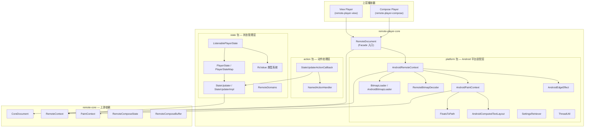
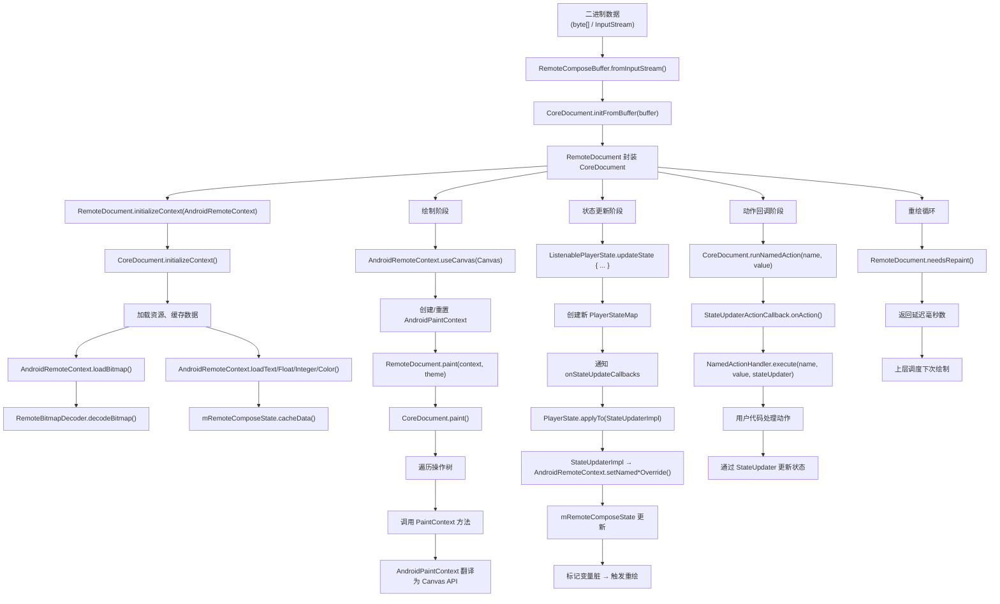
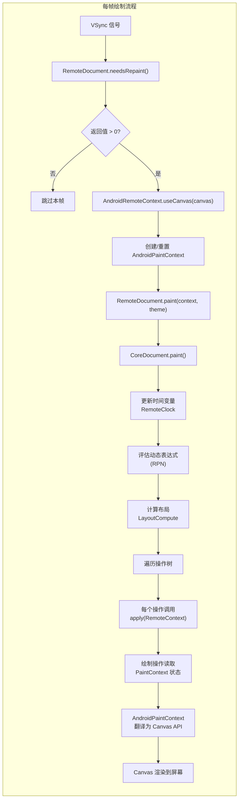
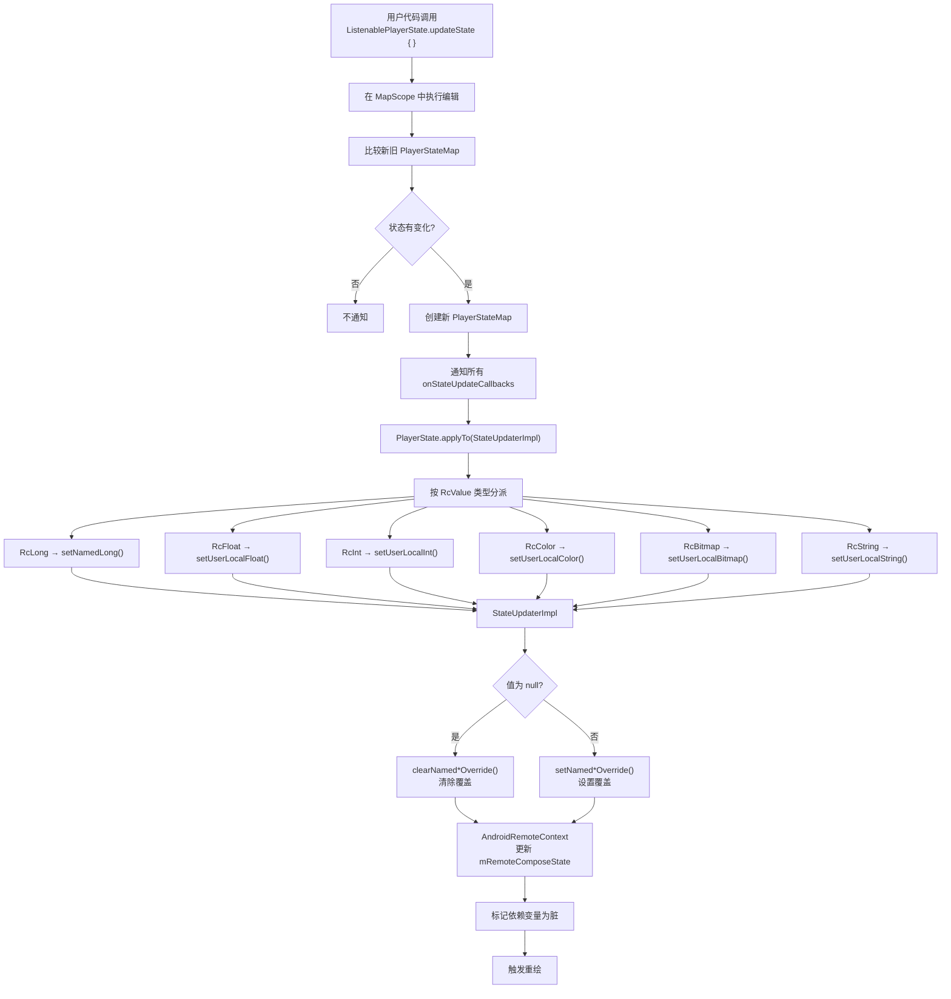
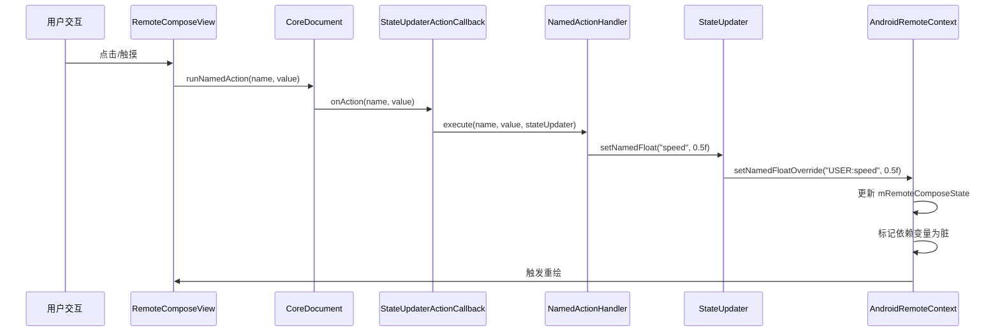
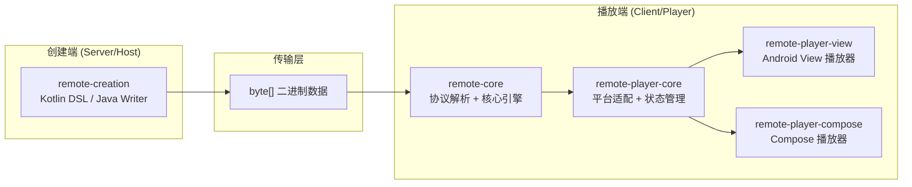

# remote-player-core 模块软件架构文档

## 1. 模块概览

### 1.1 定位

`remote-player-core` 是 Remote Compose 播放器的**核心共享库**，为不同 Android 播放器端（如 View 播放器、Compose 播放器）提供公共的平台适配层、状态管理和文档操作能力。

它依赖上游的 `remote-core` 模块（纯协议/核心引擎），并将核心引擎的抽象接口桥接到 Android 平台的具体实现。

### 1.2 模块依赖关系

```
remote-core (平台无关核心引擎)
    ↓ 依赖
remote-player-core (Android 平台适配 + 状态管理)
    ↓ 依赖
remote-player-view / remote-player-compose (上层播放器 UI)
```

### 1.3 构建配置

| 配置项 | 值 |
|---|---|
| 命名空间 | `androidx.compose.remote.player.core` |
| minSdk | 29 |
| compileSdk | 37 |
| 核心 API 依赖 | `androidx.annotation:annotation`、`org.jspecify:jspecify` |
| 实现依赖 | `remote-core`、`customview:1.2.0`、`androidx.core` |

---

## 2. 分层架构图



---

## 3. 包结构与职责

### 3.1 包总览

| 包 | 职责 | 文件数 |
|---|---|---|
| `action` | 命名动作的处理与回调桥接 | 2 |
| `platform` | Android 平台适配层（Canvas 绘制、Bitmap 解码、路径转换、线程工具等） | 10 |
| `state` | 播放器状态管理（类型系统、状态更新、域名空间） | 6 |
| 根包 | `RemoteDocument` — 文档的公共 API 入口 | 1 |

### 3.2 文件清单

```
remote-player-core/src/main/java/androidx/compose/remote/player/core/
├── RemoteDocument.java                    # 文档 Facade 入口
├── action/
│   ├── NamedActionHandler.java            # 命名动作处理接口
│   └── StateUpdaterActionCallback.java    # 动作回调适配器
├── platform/
│   ├── AndroidBitmapLoader.java           # URL 位图加载实现
│   ├── AndroidComputedTextLayout.java     # 文本布局适配
│   ├── AndroidEdgeEffect.java             # 滚动边缘效果适配
│   ├── AndroidPaintContext.java           # 绘制上下文 → Canvas
│   ├── AndroidRemoteContext.java          # 运行时上下文
│   ├── BitmapLoader.java                  # 位图加载策略接口
│   ├── FloatsToPath.java                  # 路径数据转换工具
│   ├── RemoteBitmapDecoder.java           # 安全位图解码器
│   ├── SettingsRetriever.java             # 系统设置查询
│   └── ThreadUtil.java                    # 线程工具
└── state/
    ├── ListenablePlayerState.kt           # 可监听播放器状态
    ├── PlayerState.kt                     # 播放器状态接口
    ├── RcValue.kt                         # 状态值类型系统
    ├── RemoteDomains.java                 # 变量命名空间
    ├── StateUpdater.java                  # 状态更新接口
    └── StateUpdaterImpl.java              # 状态更新实现
```

---

## 4. 核心类详解

### 4.1 RemoteDocument（外观入口）

**文件**：`RemoteDocument.java`
**设计模式**：Facade + Delegation

`RemoteDocument` 是整个模块对外的主入口，内部持有 `CoreDocument`（来自 `remote-core`），几乎所有方法都直接委托给内部文档对象。

**核心方法**：

| 方法 | 说明 |
|---|---|
| `RemoteDocument(byte[])` | 从字节数组创建文档 |
| `RemoteDocument(InputStream)` | 从输入流创建文档 |
| `RemoteDocument(CoreDocument)` | 从已有核心文档创建 |
| `initializeContext(RemoteContext)` | 初始化文档，加载资源/缓存 |
| `applyDataOperations(RemoteContext)` | 应用数据模式操作 |
| `paint(RemoteContext, int theme)` | 绘制文档 |
| `needsRepaint()` | 返回下次重绘延迟（ms），-1 表示不需要 |
| `canBeDisplayed(major, minor, capabilities)` | 版本兼容性检查 |
| `getNamedColors()` / `getThemedColors()` | 查询文档中的命名颜色资源 |
| `getNamedVariables(type)` | 查询文档中的命名变量 |
| `getComponent(id)` | 按 ID 获取组件 |
| `invalidate()` | 触发重新测量 |
| `isUpdateDoc()` | 判断是否为增量更新文档 |
| `useFeature(featureId)` | 查询特性使用情况 |

**内部创建流程**：
```
byte[]/InputStream → RemoteComposeBuffer.fromInputStream() → CoreDocument.initFromBuffer(buffer)
```

---

### 4.2 AndroidRemoteContext（运行时上下文）

**文件**：`AndroidRemoteContext.java`
**设计模式**：Adapter + Template Method

Remote Compose 在 Android 上的运行时上下文，管理状态、资源加载、变量覆盖、点击区域等。继承自 `remote-core` 的 `RemoteContext`。

**关键成员**：
- `EdgeEffectBuilder mEdgeEffectBuilder` — 滚动边缘效果工厂
- `BitmapLoader mBitmapLoader` — 位图加载策略
- `HashMap<String, ArrayList<VarName>> mVarNameHashMap` — 变量名到 ID/类型的映射

**方法分组**：

| 分组 | 方法 | 说明 |
|---|---|---|
| Canvas 管理 | `useCanvas(Canvas)` | 设置绘制目标，创建或重置 `AndroidPaintContext` |
| 边缘效果 | `createEdgeEffect(direction)` | 使用 `EdgeEffectBuilder` 创建 `AndroidEdgeEffect` |
| 变量名映射 | `loadVariableName()` / `getVariableId()` | 命名变量的注册与查找 |
| 变量覆盖 | `setNamedStringOverride()` / `setNamedFloatOverride()` 等 | 按名称覆盖变量值 |
| 数据加载 | `loadBitmap()` / `loadText()` / `loadFloat()` 等 | 各种类型数据的加载与缓存 |
| 交互 | `addClickArea()` / `addTouchListener()` / `runAction()` | 点击区域、触摸监听、动作执行 |
| 无障碍 | `setAccessibilityAnimationEnabled()` | 动画无障碍开关 |

---

### 4.3 AndroidPaintContext（绘制上下文）

**文件**：`AndroidPaintContext.java`
**设计模式**：Adapter + Template Method

整个绘制管线的核心，将 Remote Compose 的绘制操作翻译为 Android Canvas 调用。继承自 `remote-core` 的 `PaintContext`。

**关键成员**：
- `Paint mPaint` — 当前画笔状态
- `List<Paint> mPaintList` — 画笔栈（save/restore）
- `Canvas mCanvas` — 当前绘制目标
- `RenderNode mNode` — 图形层节点
- LRU 缓存：`mPathCache`、`mTypefaceCache`、`mFontBuilderCache`

**方法分组**：

| 分组 | 方法 | 说明 |
|---|---|---|
| Canvas 变换 | `save()` / `restore()` / `translate()` / `scale()` / `matrixRotate()` | 直接委托给 Canvas |
| 图形层 | `startGraphicsLayer()` / `setGraphicsLayer()` / `endGraphicsLayer()` | 使用 RenderNode 实现硬件加速 |
| 绘制原语 | `drawArc()` / `drawCircle()` / `drawLine()` / `drawPath()` / `drawRect()` 等 | 基本图形绘制 |
| 文本 | `drawTextRun()` / `drawComplexText()` / `layoutComplexText()` | 文本测量与绘制 |
| 画笔管理 | `savePaint()` / `restorePaint()` / `replacePaint()` / `applyPaint()` | 画笔状态栈 |
| 裁剪 | `clipRect()` / `roundedClipRect()` / `clipPath()` | 裁剪区域 |
| 路径操作 | `tweenPath()` / `combinePath()` / `drawTweenPath()` | 路径插值与组合 |

**画笔属性变更**（内部 `PaintChanges` 实现）：
- 字体：系统字体、自定义字体文件、字体变体轴
- 着色器：RuntimeShader（AGSL）、线性/径向/扫描渐变、位图纹理
- 混合模式：PorterDuff 和 BlendMode 双路径映射
- 路径效果：Dash、Discrete、PathDash、Sum、Compose

---

### 4.4 RcValue 类型系统

**文件**：`RcValue.kt`
**设计模式**：Value Object + Algebraic Data Type（代数数据类型）

使用 Kotlin sealed interface 实现类型安全的状态值系统：

```
RcValue (sealed interface)
  ├── RcInt(value: Int?)       — 整数，含 Null 单例
  ├── RcLong(value: Long?)     — 长整数，含 Null 单例
  ├── RcFloat(value: Float?)   — 浮点数，含 Null 单例
  ├── RcString(value: String?) — 字符串，含 Null 单例
  ├── RcBitmap(value: Bitmap?) — 位图，含 Null 单例
  └── RcColor(value: Int?)     — 颜色(@ColorInt)，含 Null 单例
```

每个子类型都是不可变值对象，实现了 `equals`/`hashCode`/`toString`。

---

### 4.5 PlayerState 与 ListenablePlayerState

**文件**：`PlayerState.kt` / `ListenablePlayerState.kt`
**设计模式**：Observer + Snapshot + DSL Builder

**PlayerState 接口**：
```kotlin
interface PlayerState {
    val values: Map<String, RcValue>
    fun updateState(edit: MapScope.() -> Unit)
}
```

**内部类**：
- `MapScope` — 提供可变视图，含 `setUserLocalValue(name, value)` 方法
- `PlayerStateMap` — 不可变状态快照，含 `empty()` 工厂方法

**ListenablePlayerState**：
- 持有 `PlayerStateMap`（不可变快照）
- 维护 `onStateUpdateCallbacks` 回调列表
- `updateState(edit)` — 在 MapScope 中执行编辑，如果结果与当前状态不同则创建新快照并通知回调
- `addOnUpdateCallback(callback)` — 注册回调并**立即执行一次**（初始通知）
- 所有公共方法强制主线程（`@MainThread` + `ThreadUtil.ensureMainThread()`）

**扩展函数** `PlayerState.applyTo(StateUpdater)`：
将当前状态按类型分派到 StateUpdater 的对应方法：
- `RcLong` → `setNamedLong()`
- `RcFloat` → `setUserLocalFloat()`
- `RcString` → `setUserLocalString()`
- `RcInt` → `setUserLocalInt()`
- `RcColor` → `setUserLocalColor()`
- `RcBitmap` → `setUserLocalBitmap()`

---

### 4.6 StateUpdater 与 StateUpdaterImpl

**文件**：`StateUpdater.java` / `StateUpdaterImpl.java`
**设计模式**：Strategy + Delegation + Domain-Prefixed Namespacing

**StateUpdater 接口**：
```java
public interface StateUpdater {
    void setNamedLong(String name, Long value);
    void setUserLocalFloat(String floatName, Float value);
    void setUserLocalInt(String integerName, Integer value);
    void setUserLocalColor(String name, Integer value);
    void setUserLocalBitmap(String name, Bitmap content);
    void setUserLocalString(String stringName, String value);

    static String getUserDomainString(String name) {
        return RemoteDomains.USER + ":" + name;
    }
}
```

**StateUpdaterImpl 实现逻辑**：
- 非 null 值：调用 `mRemoteContext.setNamed*Override(getUserDomainString(name), value)`
- null 值：调用 `mRemoteContext.clearNamed*Override(getUserDomainString(name))`（清除覆盖）

所有 `setUserLocal*` 方法在变量名前添加 `USER:` 前缀，实现命名空间隔离。

---

### 4.7 NamedActionHandler 与 StateUpdaterActionCallback

**文件**：`NamedActionHandler.java` / `StateUpdaterActionCallback.java`
**设计模式**：Strategy + Adapter

**NamedActionHandler 接口**：
```java
public interface NamedActionHandler {
    void execute(@NonNull String name, @Nullable Object value, @NonNull StateUpdater stateUpdater);
}
```

**StateUpdaterActionCallback**（抽象类）：
将 `CoreDocument.ActionCallback` 接口适配到 `StateUpdater` + `NamedActionHandler` 的组合：

```
CoreDocument 触发 ActionCallback.onAction()
    → StateUpdaterActionCallback.onAction()
    → NamedActionHandler.execute(name, value, stateUpdater)
```

---

### 4.8 BitmapLoader 与 AndroidBitmapLoader

**文件**：`BitmapLoader.java` / `AndroidBitmapLoader.java`
**设计模式**：Strategy + Null Object

**BitmapLoader 接口**：
```java
public interface BitmapLoader {
    @NonNull InputStream loadBitmap(@NonNull String url) throws IOException;
    @NonNull BitmapLoader UNSUPPORTED = url -> { throw new IOException("BitmapLoader not supported"); };
}
```

**AndroidBitmapLoader**：直接通过 `URI.create(url).toURL().openStream()` 加载，仅支持 URL 方式。

**Null Object**：`UNSUPPORTED` 默认实现，不支持时抛出异常。

---

### 4.9 RemoteBitmapDecoder

**文件**：`RemoteBitmapDecoder.java`
**设计模式**：Static Utility Class + Strategy（通过 BitmapLoader 参数）

**支持的编码格式**：

| 编码 | 类型 | 说明 |
|---|---|---|
| `ENCODING_INLINE` | `TYPE_PNG_8888` | 内联 PNG，解码为 ARGB_8888 |
| `ENCODING_INLINE` | `TYPE_PNG_ALPHA_8` | 内联 PNG，解码为 ALPHA_8 |
| `ENCODING_INLINE` | `TYPE_RAW8888` | 原始 RGBA 像素数据 |
| `ENCODING_INLINE` | `TYPE_RAW8` | 原始灰度数据 |
| `ENCODING_FILE` | — | 从文件路径加载 |
| `ENCODING_URL` | — | 通过 BitmapLoader 从 URL 加载 |
| `ENCODING_EMPTY` | — | 创建空 Bitmap |

**安全机制**：`checkBounds()` — 解码前先做 bounds-only pass，验证实际尺寸不超过声明的 width/height，防止恶意文档分配过大 Bitmap。

---

### 4.10 其他工具类

#### FloatsToPath
将 float 数组表示的路径数据转换为 `android.graphics.Path`。支持操作码：MOVE、LINE、QUADRATIC、CONIC（API 34+）、CUBIC、CLOSE、DONE。支持部分路径截取（`PathMeasure.getSegment()`）。

#### AndroidComputedTextLayout
将 Android `StaticLayout` 适配为 `RcPlatformServices.ComputedTextLayout` 接口。由 `AndroidPaintContext.layoutComplexText()` 创建，在 `drawComplexText()` 中被消费。

#### AndroidEdgeEffect
将 Android `EdgeEffect` 适配为 `ScrollingEdgeEffect` 接口。分为 `PRE_DRAW`（API 31+ RenderNode 拉伸）和 `POST_DRAW`（传统绘制）两个阶段。

#### SettingsRetriever
读取 `Settings.Global.ANIMATOR_DURATION_SCALE` 判断动画是否启用。

#### ThreadUtil
- `isMainThread()` — 判断当前是否主线程
- `ensureMainThread()` — 断言主线程，否则抛异常
- `runOnMainThread(Runnable)` — 主线程调度

---

## 5. 设计模式总结

| 模式 | 应用位置 | 说明 |
|---|---|---|
| **Facade** | `RemoteDocument` | 对 `CoreDocument` 的简化外观，提供统一 API |
| **Adapter** | `AndroidPaintContext`、`AndroidRemoteContext`、`AndroidComputedTextLayout`、`AndroidEdgeEffect`、`StateUpdaterActionCallback` | 将 `remote-core` 抽象接口适配到 Android API |
| **Strategy** | `BitmapLoader`、`NamedActionHandler` | 可替换的算法/行为，由调用方注入具体实现 |
| **Observer** | `ListenablePlayerState` | 状态变更通知，注册回调在状态变化时触发 |
| **Snapshot** | `PlayerStateMap`、`ListenablePlayerState` | 不可变状态快照，写时复制 |
| **Delegation** | `StateUpdaterImpl`、`RemoteDocument` | 委托给内部对象执行实际工作 |
| **Template Method** | `AndroidPaintContext`（继承 `PaintContext`） | 继承框架抽象类，实现平台特定行为 |
| **Value Object** | `RcValue` 系列 | 不可变值类型，线程安全 |
| **Algebraic Data Type** | `RcValue` sealed interface | Kotlin sealed interface 实现类型安全的状态值系统 |
| **Domain-Prefixed Namespacing** | `StateUpdater.getUserDomainString()` | `USER:name` 格式隔离命名空间 |
| **LRU Cache** | `AndroidPaintContext` 的路径/字体缓存 | `LinkedHashMap` + `removeEldestEntry` 有限容量缓存 |
| **Null Object** | `BitmapLoader.UNSUPPORTED` | 不支持时的默认行为，抛出异常 |

---

## 6. 接口与实现对应关系

| 接口（来源） | 实现（remote-player-core） | 说明 |
|---|---|---|
| `PaintContext`（remote-core） | `AndroidPaintContext` | 绘制上下文 → Android Canvas |
| `RemoteContext`（remote-core） | `AndroidRemoteContext` | 运行时上下文 → Android 平台 |
| `ComputedTextLayout`（remote-core） | `AndroidComputedTextLayout` | 文本布局 → StaticLayout |
| `ScrollingEdgeEffect`（remote-core） | `AndroidEdgeEffect` | 边缘效果 → EdgeEffect |
| `ActionCallback`（remote-core） | `StateUpdaterActionCallback`（抽象） | 动作回调适配 |
| `BitmapLoader`（本模块） | `AndroidBitmapLoader` | 位图加载策略 |
| `StateUpdater`（本模块） | `StateUpdaterImpl` | 状态写入桥接 |
| `PlayerState`（本模块） | `ListenablePlayerState` | 可监听状态 |

---

## 7. 类关系图

```mermaid
classDiagram
    class RemoteDocument {
        -CoreDocument mDocument
        +initializeContext(RemoteContext)
        +paint(RemoteContext, int)
        +needsRepaint() long
        +canBeDisplayed(int, int, int) boolean
        +getNamedColors() Map
        +getNamedVariables(int) Map
        +getComponent(int) Component
        +invalidate()
    }

    class AndroidRemoteContext {
        -EdgeEffectBuilder mEdgeEffectBuilder
        -BitmapLoader mBitmapLoader
        -HashMap mVarNameHashMap
        +useCanvas(Canvas) PaintContext
        +createEdgeEffect(int) ScrollingEdgeEffect
        +loadBitmap(int, int, int, int, int, byte[])
        +setNamedFloatOverride(String, Float)
        +clearNamedFloatOverride(String)
        +addClickArea(int, float, float, float, float)
        +runAction(String, Object)
    }

    class AndroidPaintContext {
        -Paint mPaint
        -List~Paint~ mPaintList
        -Canvas mCanvas
        -RenderNode mNode
        -LinkedHashMap mPathCache
        -LinkedHashMap mTypefaceCache
        +drawRect(float, float, float, float)
        +drawPath(Path, int)
        +drawTextRun(...)
        +save() / restore()
        +clipRect(float, float, float, float)
        +startGraphicsLayer(...)
    }

    class AndroidComputedTextLayout {
        -StaticLayout mStaticLayout
        -float mWidth
        -float mHeight
        -int mLineCount
    }

    class AndroidEdgeEffect {
        -EdgeEffect mEdgeEffect
        +pull(float, float)
        +release()
        +apply(PaintContext, Component, float, float)
    }

    class BitmapLoader {
        <<interface>>
        +loadBitmap(String) InputStream
    }

    class AndroidBitmapLoader {
        +loadBitmap(String) InputStream
    }

    class RemoteBitmapDecoder {
        <<utility>>
        +decodeBitmap(int, int, int, int, int, byte[], BitmapLoader)$ Bitmap
        -checkBitmapBounds(...)$ void
    }

    class FloatsToPath {
        <<utility>>
        +genPath(Path, float[], float, float)$ void
    }

    class NamedActionHandler {
        <<interface>>
        +execute(String, Object, StateUpdater)
    }

    class StateUpdaterActionCallback {
        <<abstract>>
        -StateUpdater mStateUpdater
        -NamedActionHandler mNamedActionHandler
        +onAction(String, Object)
    }

    class StateUpdater {
        <<interface>>
        +setNamedLong(String, Long)
        +setUserLocalFloat(String, Float)
        +setUserLocalInt(String, Integer)
        +setUserLocalColor(String, Integer)
        +setUserLocalBitmap(String, Bitmap)
        +setUserLocalString(String, String)
        +getUserDomainString(String)$ String
    }

    class StateUpdaterImpl {
        -RemoteContext mRemoteContext
    }

    class PlayerState {
        <<interface>>
        +values Map~String, RcValue~
        +updateState(Function1)
    }

    class ListenablePlayerState {
        -PlayerStateMap stateMap
        -List~Runnable~ onStateUpdateCallbacks
        +addOnUpdateCallback(Runnable)
        +removeOnUpdateCallback(Runnable)
    }

    class RcValue {
        <<sealed interface>>
    }

    class RcInt {
        +value Int?
    }
    class RcLong {
        +value Long?
    }
    class RcFloat {
        +value Float?
    }
    class RcString {
        +value String?
    }
    class RcBitmap {
        +value Bitmap?
    }
    class RcColor {
        +value Int?
    }

    class RemoteDomains {
        <<enum>>
        USER
        SYSTEM
    }

    RemoteDocument --> AndroidRemoteContext : uses
    AndroidRemoteContext --|> RemoteContext : extends
    AndroidRemoteContext --> BitmapLoader : has-a
    AndroidRemoteContext --> AndroidPaintContext : creates
    AndroidRemoteContext --> AndroidEdgeEffect : creates
    AndroidRemoteContext --> RemoteBitmapDecoder : uses
    AndroidPaintContext --|> PaintContext : extends
    AndroidPaintContext --> FloatsToPath : uses
    AndroidPaintContext --> AndroidComputedTextLayout : creates
    AndroidComputedTextLayout ..|> ComputedTextLayout : implements
    AndroidEdgeEffect ..|> ScrollingEdgeEffect : implements
    AndroidBitmapLoader ..|> BitmapLoader : implements
    StateUpdaterActionCallback ..|> ActionCallback : implements
    StateUpdaterActionCallback --> StateUpdater : has-a
    StateUpdaterActionCallback --> NamedActionHandler : has-a
    StateUpdaterImpl ..|> StateUpdater : implements
    StateUpdaterImpl --> RemoteContext : has-a
    ListenablePlayerState ..|> PlayerState : implements
    RcInt ..|> RcValue : implements
    RcLong ..|> RcValue : implements
    RcFloat ..|> RcValue : implements
    RcString ..|> RcValue : implements
    RcBitmap ..|> RcValue : implements
    RcColor ..|> RcValue : implements
```



---

## 8. 数据流与生命周期

### 8.1 完整数据流图



### 8.2 生命周期阶段说明

| 阶段 | 触发 | 核心操作 |
|---|---|---|
| **创建** | 传入二进制数据 | 解析协议 → 构建 CoreDocument → 封装为 RemoteDocument |
| **初始化** | 调用 `initializeContext()` | 加载资源（Bitmap/Text/Float 等）→ 缓存数据 |
| **绘制** | 调用 `paint()` | 设置 Canvas → 遍历操作树 → 翻译为 Canvas API |
| **状态更新** | 调用 `updateState()` | 创建新快照 → 通知回调 → 写入 RemoteContext → 标记脏 |
| **动作回调** | 用户交互触发 | ActionCallback → NamedActionHandler → 更新状态 |
| **重绘循环** | VSync 驱动 | `needsRepaint()` 返回延迟 → 调度下次绘制 |

---

## 9. 绘制管线流程图



---

## 10. 状态更新流程图



---

## 11. 动作回调流程图



---

## 12. 安全设计

### 12.1 位图尺寸校验

`RemoteBitmapDecoder.checkBounds()` 在实际解码前先做 bounds-only pass，验证实际尺寸不超过声明的 width/height，防止恶意文档分配超大 Bitmap 导致 OOM。

### 12.2 URL 图片开关

`Limits.ENABLE_IMAGE_URLS` 控制 URL 编码图片是否允许加载，默认关闭。

### 12.3 线程安全

- `ListenablePlayerState` 所有公共方法标注 `@MainThread`，内部使用 `ThreadUtil.ensureMainThread()` 强制主线程
- `ThreadUtil` 提供线程断言和主线程调度能力

### 12.4 API 限制

所有公共类标注 `@RestrictTo(LIBRARY_GROUP)`，表明这是库内部 API，不对外暴露。

### 12.5 平台版本适配

代码中大量使用 `Build.VERSION.SDK_INT` 检查，某些功能仅在特定 API 级别以上可用：
- `RenderNode` 图形层（API 29+）
- `Shader.TileMode.DECAL`（API 31+）
- `Path.conicTo`（API 34+）
- `StaticLayout.getLineBottom(line, true)`（API 33+）

---

## 13. 使用方法

### 13.1 创建 RemoteDocument

```java
// 从字节数组创建
byte[] data = ...; // 从网络或文件获取
RemoteDocument document = new RemoteDocument(data);

// 从输入流创建
InputStream stream = ...;
RemoteDocument document = new RemoteDocument(stream);
```

### 13.2 初始化 AndroidRemoteContext

```java
// 创建上下文，可自定义 BitmapLoader
AndroidRemoteContext context = new AndroidRemoteContext();

// 或使用自定义 BitmapLoader
BitmapLoader customLoader = url -> {
    // 自定义加载逻辑
    return new URL(url).openStream();
};
AndroidRemoteContext context = new AndroidRemoteContext(customLoader);

// 初始化文档
document.initializeContext(context);
```

### 13.3 绘制流程

```java
// 在 View.onDraw() 或 Compose 绘制回调中
@Override
protected void onDraw(Canvas canvas) {
    // 1. 设置 Canvas
    context.useCanvas(canvas);

    // 2. 绘制文档
    document.paint(context, theme);

    // 3. 检查是否需要重绘
    long delay = document.needsRepaint();
    if (delay >= 0) {
        postInvalidateDelayed(delay);
    }
}
```

### 13.4 状态管理与监听

```kotlin
// 创建可监听状态
val playerState = ListenablePlayerState()

// 注册状态变更回调
playerState.addOnUpdateCallback {
    // 状态已更新，可读取最新值
    val currentValue = playerState.values["myVar"]
}

// 更新状态
playerState.updateState {
    setUserLocalValue("speed", RcFloat(0.5f))
    setUserLocalValue("label", RcString("Hello"))
    setUserLocalValue("count", RcInt(42))
}

// 将状态应用到 RemoteContext
val stateUpdater = StateUpdaterImpl(remoteContext)
playerState.applyTo(stateUpdater)
```

### 13.5 动作处理

```java
// 创建动作回调
StateUpdaterActionCallback callback = new StateUpdaterActionCallback(stateUpdater, name -> {
    @Override
    public void execute(@NonNull String name, @Nullable Object value,
                        @NonNull StateUpdater stateUpdater) {
        switch (name) {
            case "onButtonClick":
                stateUpdater.setUserLocalFloat("progress", 1.0f);
                break;
            case "onToggle":
                stateUpdater.setUserLocalInt("toggleState", (Integer) value);
                break;
        }
    }
});

// 注册到文档
document.setActionCallback(callback);
```

### 13.6 变量覆盖

```java
// 直接通过 AndroidRemoteContext 覆盖变量
context.setNamedFloatOverride("USER:speed", 0.8f);
context.setNamedStringOverride("USER:title", "New Title");
context.setNamedColorOverride("USER:bgColor", Color.BLUE);

// 清除覆盖
context.clearNamedFloatOverride("USER:speed");
```

---

## 14. 模块在整体架构中的位置



`remote-player-core` 在整体架构中承上启下：
- **承上**：为 `remote-player-view` 和 `remote-player-compose` 提供统一的平台适配和状态管理能力
- **启下**：将 `remote-core` 的平台无关抽象桥接到 Android 平台的具体实现
