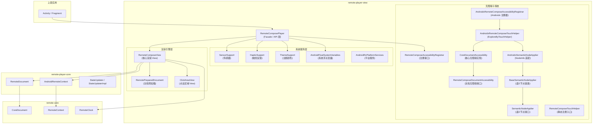
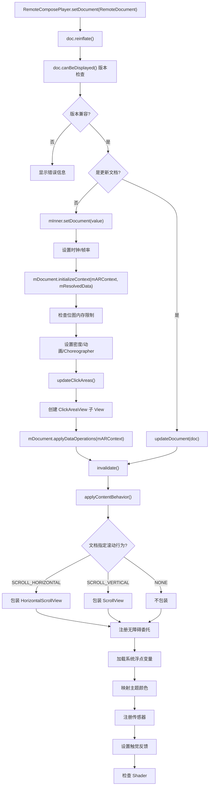
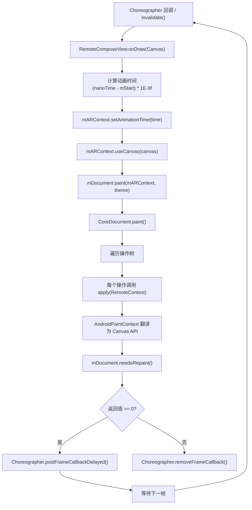
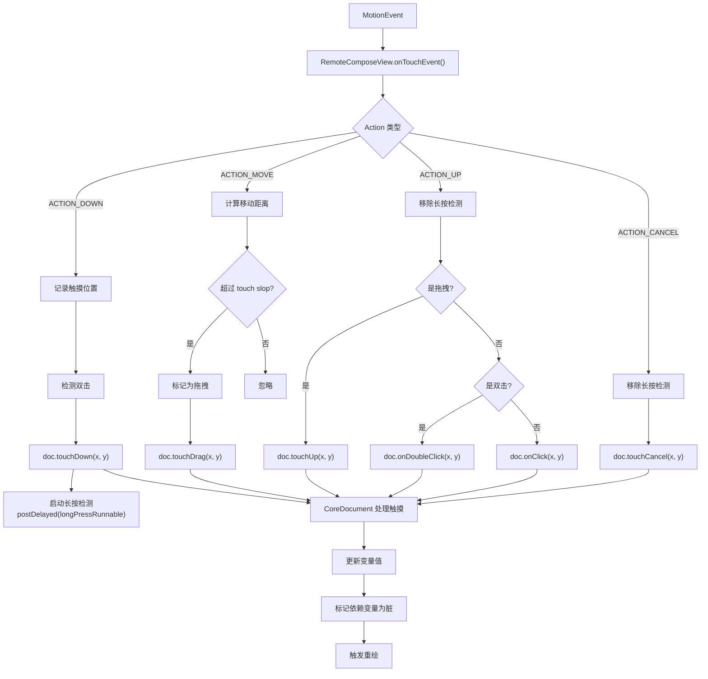
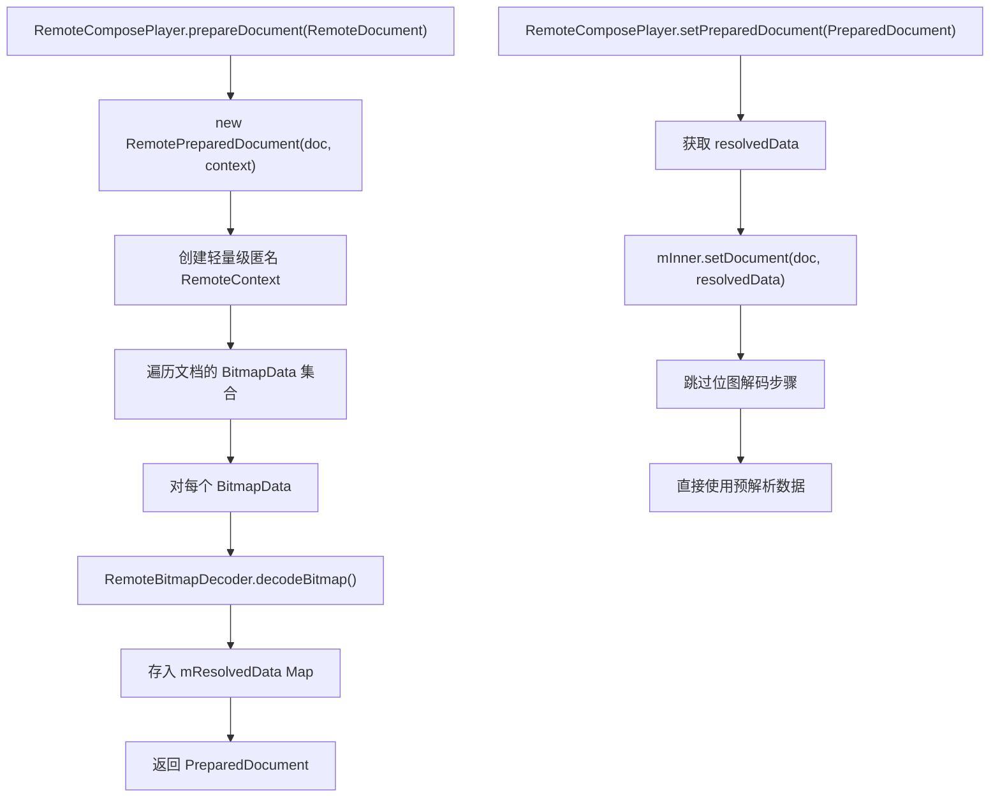
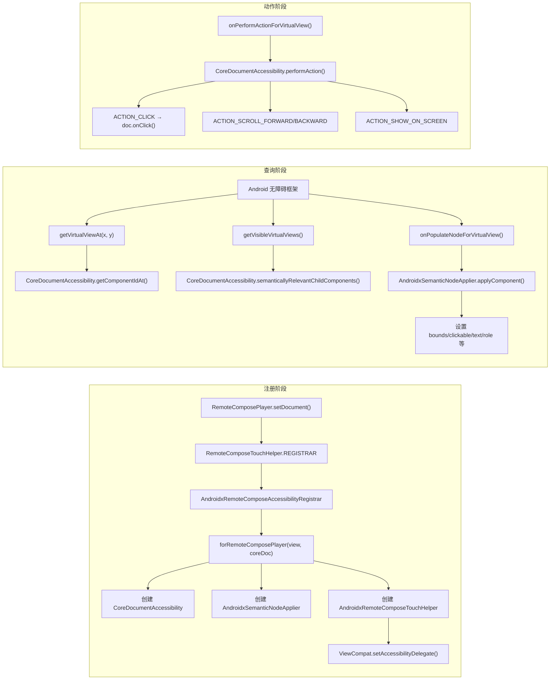
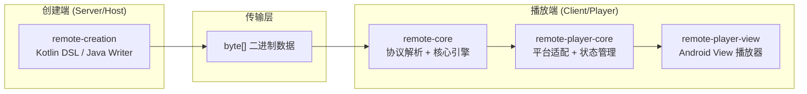

# remote-player-view 模块软件架构文档

## 1. 模块概览

### 1.1 定位

`remote-player-view` 是 Remote Compose 项目的 **Android View 层播放器模块**，负责将远程 Compose 文档渲染为 Android 原生 View，并集成 Android 系统服务（传感器、触觉反馈、主题、无障碍等）。

该模块是 `remote-player-core` 和 `remote-core` 之上的 **平台适配层**，为上层应用提供可直接使用的 `RemoteComposePlayer` View 组件。

### 1.2 模块依赖关系

```
remote-core (平台无关核心引擎)
    ↓ 依赖
remote-player-core (Android 平台适配 + 状态管理)
    ↓ 依赖
remote-player-view (Android View 播放器)
    ↓ 依赖
上层应用 (Activity / Fragment / Compose)
```

### 1.3 构建配置

| 配置项 | 值 |
|---|---|
| 命名空间 | `androidx.compose.remote.player.view` |
| 核心 API 依赖 | `androidx.annotation:annotation:1.9.1`、`org.jspecify:jspecify` |
| 实现依赖 | `remote-player-core`、`remote-core`、`androidx.customview:customview:1.2.0`、`androidx.core` |

---

## 2. 分层架构图



---

## 3. 包结构与职责

### 3.1 包总览

| 包 | 职责 | 文件数 |
|---|---|---|
| 根包 | `RemoteComposePlayer` — 对外主入口，Facade 层 | 1 |
| `platform` | Android 平台适配（View、传感器、触觉、主题、预加载等） | 7 |
| `accessibility` | 无障碍核心抽象（接口 + 基类） | 5 |
| `accessibility/platform` | Androidx 无障碍具体实现 | 3 |

### 3.2 文件清单

```
remote-player-view/src/main/java/androidx/compose/remote/player/view/
├── RemoteComposePlayer.java                    # 对外主入口 (Facade)
├── platform/
│   ├── RemoteComposeView.java                  # 核心渲染 View
│   ├── RemotePreparedDocument.java             # 文档预加载
│   ├── AndroidRcPlatformServices.java          # 平台服务适配
│   ├── AndroidFloatSystemVariables.java        # 系统浮点变量
│   ├── ClickAreaView.java                      # 点击区域 View
│   ├── SensorSupport.java                      # 传感器支持
│   ├── HapticSupport.java                      # 触觉反馈支持
│   └── ThemeSupport.java                       # 主题颜色映射
└── accessibility/
    ├── RemoteComposeAccessibilityRegistrar.java # 无障碍注册接口
    ├── RemoteComposeDocumentAccessibility.java  # 文档无障碍接口
    ├── CoreDocumentAccessibility.java           # 核心无障碍实现
    ├── BaseSemanticNodeApplier.java             # 语义节点应用基类
    ├── SemanticNodeApplier.java                 # 语义节点应用接口
    └── platform/
        ├── RemoteComposeTouchHelper.java        # 静态注册入口
        ├── AndroidxRemoteComposeAccessibilityRegistrar.java # Androidx 注册器
        ├── AndroidxRemoteComposeTouchHelper.java           # ExploreByTouchHelper 实现
        └── AndroidxSemanticNodeApplier.java                # AccessibilityNodeInfoCompat 适配
```

---

## 4. 核心类详解

### 4.1 RemoteComposePlayer（Facade 入口）

**文件**：`RemoteComposePlayer.java`
**设计模式**：Facade + Delegate

`RemoteComposePlayer` 是整个模块对外的主入口，继承 `FrameLayout`，实现 `RemoteContextActions`。它封装内部 `RemoteComposeView`，提供文档加载、主题设置、资源覆盖、传感器/触觉/主题集成、无障碍注册等统一 API。

**核心字段**：

| 字段 | 类型 | 说明 |
|---|---|---|
| `mInner` | `RemoteComposeView` | 实际渲染 View，受保护以便子类扩展 |
| `mStateUpdater` | `StateUpdater` | 状态更新器 |
| `mThemeSupport` | `ThemeSupport` | 主题颜色映射 |
| `mSensorsSupport` | `SensorSupport` | 传感器支持 |
| `mHapticSupport` | `HapticSupport` | 触觉反馈支持 |
| `mFloatSystemVariables` | `FloatSystemVariables` | 系统浮点变量加载器 |
| `mShaderControl` | `ShaderControl` | Shader 控制回调 |
| `mLoadedMacros` | `Map<String, Macro>` | 宏缓存 |

**关键方法**：

| 方法 | 说明 |
|---|---|
| `setDocument(RemoteDocument)` | 加载文档，检查版本，应用滚动行为，注册无障碍，加载系统变量/主题/传感器/触觉 |
| `updateDocument(RemoteDocument)` | 增量更新文档 |
| `prepareDocument(RemoteDocument)` | 文档预加载（后台解码位图） |
| `setPreparedDocument(PreparedDocument)` | 使用预加载文档 |
| `setTheme(int)` | 设置 Light/Dark/Unspecified 主题 |
| `setMaxOpCount(int)` | 设置最大操作数限制 |
| `setMaxImageDimension(int)` | 设置最大图片尺寸 |
| `setMaxBitmapMemory(long)` | 设置最大位图内存 |
| `setMaxFps(int)` | 设置最大帧率 |
| `setBitmapLoader(BitmapLoader)` | 设置位图加载策略 |
| `setUserLocalFloat/String/Int/Color/Bitmap()` | 覆盖文档中的命名资源 |
| `setSystemLocalFloat/String/Int/Color()` | 覆盖系统级命名资源 |

**内部接口**：
- `FloatSystemVariables` — 系统浮点变量加载接口
- `IdActionCallbacks` — 动作回调接口
- `PreparedDocument` — 预加载文档接口

---

### 4.2 RemoteComposeView（核心渲染引擎）

**文件**：`platform/RemoteComposeView.java`
**设计模式**：Template Method

`RemoteComposeView` 是文档的实际渲染和交互处理引擎，继承 `FrameLayout`，实现 `OnAttachStateChangeListener` 和 `LayoutCallback`。

**核心字段**：

| 字段 | 类型 | 说明 |
|---|---|---|
| `mDocument` | `RemoteDocument` | 当前渲染的文档 |
| `mARContext` | `AndroidRemoteContext` | Android 平台的 RemoteContext |
| `mClock` | `RemoteClock` | 时钟，用于动画时间计算 |
| `mChoreographer` | `Choreographer` | 帧回调调度 |
| `mMaxFrameRate` | `int` | 最大帧率 |
| `mMaxFrameDelay` | `float` | 最大帧延迟 |
| `mResolvedData` | `Map` | 预解析数据 |

**关键方法**：

| 方法 | 说明 |
|---|---|
| `setDocument(RemoteDocument)` | 设置文档，初始化上下文，更新点击区域，应用数据操作 |
| `onDraw(Canvas)` | **核心渲染循环** — 设置动画时间 → 绘制文档 → 帧调度 |
| `onTouchEvent(MotionEvent)` | 处理触摸事件（点击、双击、长按、拖拽） |
| `onMeasure(int, int)` | 测量文档尺寸 |
| `updateClickAreas()` | 将文档的 ClickArea 转为 ClickAreaView 子 View |
| `setClock(RemoteClock)` | 设置时钟并创建 AndroidRemoteContext |

**渲染循环核心逻辑**（`onDraw`）：
```
1. 计算动画时间 (nanoTime - mStart) * 1E-9f
2. mARContext.setAnimationTime(animationTime)
3. mARContext.useCanvas(canvas) — 绑定画布
4. mDocument.paint(mARContext, theme) — 执行文档绘制指令
5. 检查 mDocument.needsRepaint() — 是否需要下一帧
6. 如果需要: Choreographer.postFrameCallbackDelayed()
7. 如果不需要: Choreographer.removeFrameCallback()
```

---

### 4.3 RemotePreparedDocument（文档预加载）

**文件**：`platform/RemotePreparedDocument.java`
**设计模式**：Strategy

在后台预加载文档中的位图资源，避免主线程解码延迟。

**核心机制**：创建一个轻量级匿名 `RemoteContext`，仅实现 `loadBitmap` 方法，将解码后的 Bitmap 存入 `mResolvedData` Map。

**关键方法**：
- 构造函数：遍历文档的 `BitmapData` 集合，调用 `apply(mContext)` 解码位图
- `getOriginalDoc()`：返回原始文档
- `getResolvedData()`：返回预解析的数据 Map

---

### 4.4 AndroidRcPlatformServices（平台服务适配）

**文件**：`platform/AndroidRcPlatformServices.java`
**设计模式**：Adapter

将 Android 平台 API 适配为 `RcPlatformServices` 接口（来自 `remote-core`）。

**关键方法**：

| 方法 | 说明 |
|---|---|
| `imageToByteArray(Object)` | Bitmap → PNG 字节数组 |
| `pathToFloatArray(Object)` | Android Path → float[]（API 34+ 使用 PathIterator） |
| `parsePath(String)` | SVG Path 字符串 → Android Path 对象 |
| `log(LogCategory, String)` | 映射到 Android Log |
| `getBitmapWidth/Height(Object)` | 获取 Bitmap 尺寸 |

---

### 4.5 AndroidFloatSystemVariables（系统浮点变量）

**文件**：`platform/AndroidFloatSystemVariables.java`
**设计模式**：Strategy

将 Android 系统资源维度值加载为文档中的命名浮点变量。

**支持的变量**：

| 变量名 | 来源 | 说明 |
|---|---|---|
| `system.system_app_widget_background_radius` | 系统资源 | Widget 背景圆角 |
| `system.system_app_widget_inner_radius` | 系统资源 | Widget 内部圆角 |
| `system.font_weight` | 系统资源 + fontWeightAdjustment | 字体粗细 |

---

### 4.6 ClickAreaView（点击区域 View）

**文件**：`platform/ClickAreaView.java`

表示文档中定义的一个可点击区域，作为 `RemoteComposeView` 的子 View。Debug 模式下绘制红色边框和 id/metadata 文字。

**设计模式**：轻量级 View 代理 — 将文档的点击区域映射为 Android View 系统的点击处理。

---

### 4.7 SensorSupport（传感器支持）

**文件**：`platform/SensorSupport.java`
**设计模式**：Observer

管理加速度计、陀螺仪、磁力计、光线传感器，将传感器数据写入 `RemoteComposeView` 的外部浮点变量。

**数据流**：
```
SensorEvent → SensorEventListener.onSensorChanged()
    → mRemoteComposeView.setExternalFloat(id, value)
    → AndroidRemoteContext.loadFloat(id, value)
```

**关键方法**：
- `setupSensors(Context, RemoteComposeView)` — 检查文档需要哪些传感器，注册监听器
- `unregisterListener()` — 注销传感器监听

---

### 4.8 HapticSupport（触觉反馈支持）

**文件**：`platform/HapticSupport.java`
**设计模式**：Lookup Table

将文档的触觉反馈类型映射为 Android `HapticFeedbackConstants`，通过 `View.performHapticFeedback()` 执行。

**核心机制**：使用静态数组 `sHapticTable` 将文档触觉类型索引映射为 Android 常量。

**关键方法**：`setupHaptics(RemoteComposeView)` — 设置 `CoreDocument.HapticEngine` 回调。

---

### 4.9 ThemeSupport（主题颜色映射）

**文件**：`platform/ThemeSupport.java`
**设计模式**：Strategy + Registry

将 Android 系统主题颜色映射到文档的命名颜色。

**核心机制**：
- `mapColors(Context, RemoteComposeView)` — 遍历文档的 `ThemedColors` 和 `NamedColors`，匹配 `android.*` 前缀，从 Android 资源系统获取颜色值
- `ColorEngine` 接口 + `AndroidColorEngine` 实现 — 可扩展的颜色引擎策略
- `AndroidColors` 内部类 — 完整的 Android 系统颜色 ID/名称映射表（约 200 个颜色）

---

### 4.10 无障碍子系统

#### 4.10.1 RemoteComposeAccessibilityRegistrar（注册接口）

**文件**：`accessibility/RemoteComposeAccessibilityRegistrar.java`
**类型**：接口

定义无障碍委托的注册/注销和事件分发契约。

**方法**：
- `setAccessibilityDelegate(View, CoreDocument)` — 注册无障碍委托
- `clearAccessibilityDelegate(View)` — 注销无障碍委托
- `dispatchHoverEvent(MotionEvent)` — 分发悬停事件
- `dispatchKeyEvent(KeyEvent)` — 分发按键事件
- `onFocusChanged(boolean, boolean)` — 焦点变更通知

#### 4.10.2 RemoteComposeDocumentAccessibility（文档无障碍接口）

**文件**：`accessibility/RemoteComposeDocumentAccessibility.java`
**类型**：接口

定义文档无障碍树的查询和操作契约。

**方法**：
- `performAction(Component, int, Bundle)` — 执行无障碍动作
- `stringValue(Component)` — 获取组件文本值
- `semanticallyRelevantChildComponents(Component, boolean)` — 获取语义相关子组件
- `semanticModifiersForComponent(Component)` — 获取组件的语义修饰符
- `mergeMode(Component)` — 获取合并模式
- `findComponentById(int)` — 按 ID 查找组件
- `getComponentIdAt(PointF)` — 坐标命中测试

#### 4.10.3 CoreDocumentAccessibility（核心无障碍实现）

**文件**：`accessibility/CoreDocumentAccessibility.java`
**设计模式**：Composite + Interpreter

基于 `CoreDocument` 的组件树构建无障碍语义树。

**关键方法**：
- `performAction(Component, int, Bundle)` — 处理点击、滚动、showOnScreen 无障碍动作
- `semanticallyRelevantChildComponents(Component, boolean)` — 递归获取语义相关子组件，处理 MERGE/SET/CLEAR_AND_SET 模式
- `getComponentIdAt(PointF)` — 坐标命中测试，递归查找最深层组件
- `isInteresting(Component)` — 判断组件是否对无障碍有意义

#### 4.10.4 SemanticNodeApplier 与 BaseSemanticNodeApplier

**文件**：`accessibility/SemanticNodeApplier.java` / `accessibility/BaseSemanticNodeApplier.java`
**设计模式**：Template Method

`SemanticNodeApplier<N>` 是泛型接口，定义将语义信息应用到无障碍节点的契约。

`BaseSemanticNodeApplier<N>` 是抽象基类，提供通用逻辑：
- `applyComponent(...)` — 设置边界、唯一 ID、内容描述、文本、角色、语义修饰符、列表项属性
- `applySemantics(...)` — 遍历语义列表，分发到 `CoreSemantics`/`AccessibleComponent`/`ScrollableComponent` 处理

子类只需实现平台特定的 setter：`setBoundsInParentOrScreen`、`setClickable`、`setEnabled`、`setText`、`setContentDescription` 等。

#### 4.10.5 Androidx 无障碍实现

**RemoteComposeTouchHelper.java**：提供静态 `REGISTRAR` 单例（Singleton + Service Locator）。

**AndroidxRemoteComposeAccessibilityRegistrar.java**：
- 使用 `ViewCompat.setAccessibilityDelegate()` 注册/注销 `AndroidxRemoteComposeTouchHelper`
- `forRemoteComposePlayer(View, CoreDocument)` — 工厂方法，创建 `AndroidxRemoteComposeTouchHelper` 实例，组装 `CoreDocumentAccessibility` + `AndroidxSemanticNodeApplier`
- 设计模式：Factory + Delegate

**AndroidxRemoteComposeTouchHelper.java**：
- 继承 `ExploreByTouchHelper`（来自 `androidx.customview`）
- 将 Remote Compose 的组件树桥接到 Android 无障碍框架
- `getVirtualViewAt(float, float)` — 坐标 → 虚拟 View ID
- `getVisibleVirtualViews(List)` — 获取可见虚拟 View 列表
- `onPopulateNodeForVirtualView(int, AccessibilityNodeInfoCompat)` — 填充无障碍节点信息
- `onPerformActionForVirtualView(int, int, Bundle)` — 执行无障碍动作
- 设计模式：Adapter

**AndroidxSemanticNodeApplier.java**：
- 继承 `BaseSemanticNodeApplier<AccessibilityNodeInfoCompat>`
- 将语义信息具体应用到 `AccessibilityNodeInfoCompat` 对象
- 实现平台特定的 setter（`setBoundsInParent`、`applyScrollable`、`applyListItem` 等）
- 设计模式：Concrete Implementation of Template Method

---

## 5. 设计模式总结

| 模式 | 应用位置 | 说明 |
|---|---|---|
| **Facade** | `RemoteComposePlayer` | 统一封装内部复杂子系统（View、传感器、触觉、主题、无障碍） |
| **Delegate** | `RemoteComposePlayer` → `RemoteComposeView` | 大部分 API 委托给内部 View |
| **Template Method** | `BaseSemanticNodeApplier`、`RemoteComposeView.onDraw` | 定义算法骨架，子类/实现填充细节 |
| **Strategy** | `FloatSystemVariables`、`ColorEngine`、`ShaderControl`、`HapticEngine` | 可替换的算法/行为 |
| **Adapter** | `AndroidRcPlatformServices`、`AndroidxRemoteComposeTouchHelper` | 适配平台 API 到核心接口 |
| **Observer** | `SensorSupport`、`Choreographer.FrameCallback` | 监听系统事件 |
| **Composite** | `CoreDocumentAccessibility` | 递归遍历组件树 |
| **Factory** | `AndroidxRemoteComposeAccessibilityRegistrar.forRemoteComposePlayer()` | 创建无障碍帮助器实例 |
| **Singleton** | `RemoteComposeTouchHelper.REGISTRAR` | 全局唯一注册器 |
| **Lookup Table** | `HapticSupport.sHapticTable`、`ThemeSupport.AndroidColors` | 索引映射表 |

---

## 6. 接口与实现对应关系

| 接口（来源） | 实现（remote-player-view） | 说明 |
|---|---|---|
| `RemoteContextActions`（remote-core） | `RemoteComposePlayer` | 远程上下文动作 |
| `LayoutCallback`（remote-core） | `RemoteComposeView` | 布局回调 |
| `RcPlatformServices`（remote-core） | `AndroidRcPlatformServices` | 平台服务适配 |
| `RemoteComposePlayer.FloatSystemVariables` | `AndroidFloatSystemVariables` | 系统浮点变量 |
| `RemoteComposePlayer.PreparedDocument` | `RemotePreparedDocument` | 预加载文档 |
| `CoreDocument.HapticEngine`（remote-core） | `HapticSupport` 中的匿名类 | 触觉反馈引擎 |
| `RemoteComposeAccessibilityRegistrar` | `AndroidxRemoteComposeAccessibilityRegistrar` | 无障碍注册器 |
| `RemoteComposeDocumentAccessibility` | `CoreDocumentAccessibility` | 文档无障碍 |
| `SemanticNodeApplier<N>` | `BaseSemanticNodeApplier<N>` → `AndroidxSemanticNodeApplier` | 语义节点应用 |
| `ExploreByTouchHelper`（androidx.customview） | `AndroidxRemoteComposeTouchHelper` | 无障碍触摸帮助 |

---

## 7. 类关系图

```mermaid
classDiagram
    class RemoteComposePlayer {
        -RemoteComposeView mInner
        -StateUpdater mStateUpdater
        -ThemeSupport mThemeSupport
        -SensorSupport mSensorsSupport
        -HapticSupport mHapticSupport
        -FloatSystemVariables mFloatSystemVariables
        +setDocument(RemoteDocument)
        +updateDocument(RemoteDocument)
        +prepareDocument(RemoteDocument) PreparedDocument
        +setPreparedDocument(PreparedDocument)
        +setTheme(int)
        +setUserLocalFloat(String, Float)
        +setUserLocalString(String, String)
        +setMaxOpCount(int)
        +setMaxFps(int)
        +setBitmapLoader(BitmapLoader)
    }

    class RemoteComposeView {
        -RemoteDocument mDocument
        -AndroidRemoteContext mARContext
        -RemoteClock mClock
        -Choreographer mChoreographer
        -int mMaxFrameRate
        -Map mResolvedData
        +setDocument(RemoteDocument)
        +onDraw(Canvas)
        +onTouchEvent(MotionEvent) boolean
        +onMeasure(int, int)
        +updateClickAreas()
        +setClock(RemoteClock)
        +setExternalFloat(int, float)
    }

    class RemotePreparedDocument {
        -RemoteDocument mOriginalDoc
        -Map mResolvedData
        +getOriginalDoc() RemoteDocument
        +getResolvedData() Map
    }

    class AndroidRcPlatformServices {
        +imageToByteArray(Object) byte[]
        +pathToFloatArray(Object) float[]
        +parsePath(String) Object
        +log(LogCategory, String)
    }

    class AndroidFloatSystemVariables {
        +load(Context, RemoteComposeView)
    }

    class ClickAreaView {
        -int mId
        -String mMetadata
        +onDraw(Canvas)
    }

    class SensorSupport {
        -SensorManager mSensorManager
        -RemoteComposeView mRemoteComposeView
        +setupSensors(Context, RemoteComposeView)
        +unregisterListener()
    }

    class HapticSupport {
        -View mView
        +setupHaptics(RemoteComposeView)
    }

    class ThemeSupport {
        +mapColors(Context, RemoteComposeView)
    }

    class RemoteComposeAccessibilityRegistrar {
        <<interface>>
        +setAccessibilityDelegate(View, CoreDocument)
        +clearAccessibilityDelegate(View)
        +dispatchHoverEvent(MotionEvent) boolean
    }

    class RemoteComposeDocumentAccessibility {
        <<interface>>
        +performAction(Component, int, Bundle) boolean
        +stringValue(Component) String
        +semanticallyRelevantChildComponents(Component, boolean) List
        +getComponentIdAt(PointF) int
    }

    class CoreDocumentAccessibility {
        -CoreDocument mDocument
        -RemoteContextActions mActions
        +performAction(Component, int, Bundle) boolean
        +semanticallyRelevantChildComponents(Component, boolean) List
        +getComponentIdAt(PointF) int
    }

    class SemanticNodeApplier~N~ {
        <<interface>>
        +applyComponent(N, Component, RemoteComposeDocumentAccessibility)
        +addChildren(N, List)
    }

    class BaseSemanticNodeApplier~N~ {
        <<abstract>>
        +applyComponent(N, Component, RemoteComposeDocumentAccessibility)
        #setBoundsInParentOrScreen(N, Rect)*
        #setClickable(N, boolean)*
        #setEnabled(N, boolean)*
    }

    class AndroidxSemanticNodeApplier {
        +setBoundsInParentOrScreen(AccessibilityNodeInfoCompat, Rect)
        +setClickable(AccessibilityNodeInfoCompat, boolean)
        +applyScrollable(AccessibilityNodeInfoCompat, ScrollableComponent)
    }

    class AndroidxRemoteComposeAccessibilityRegistrar {
        -AndroidxRemoteComposeTouchHelper mHelper
        +forRemoteComposePlayer(View, CoreDocument)
        +setAccessibilityDelegate(View, CoreDocument)
    }

    class AndroidxRemoteComposeTouchHelper {
        -CoreDocumentAccessibility mDocAccessibility
        -AndroidxSemanticNodeApplier mNodeApplier
        +getVirtualViewAt(float, float) int
        +getVisibleVirtualViews(List)
        +onPopulateNodeForVirtualView(int, AccessibilityNodeInfoCompat)
        +onPerformActionForVirtualView(int, int, Bundle) boolean
    }

    RemoteComposePlayer --> RemoteComposeView : has-a (mInner)
    RemoteComposePlayer --> ThemeSupport : has-a
    RemoteComposePlayer --> SensorSupport : has-a
    RemoteComposePlayer --> HapticSupport : has-a
    RemoteComposePlayer --> AndroidFloatSystemVariables : has-a
    RemoteComposePlayer ..|> RemoteContextActions : implements

    RemoteComposeView --> RemoteDocument : has-a
    RemoteComposeView --> AndroidRemoteContext : has-a
    RemoteComposeView --> ClickAreaView : creates
    RemoteComposeView ..|> LayoutCallback : implements

    RemotePreparedDocument ..|> RemoteComposePlayer.PreparedDocument : implements
    AndroidRcPlatformServices ..|> RcPlatformServices : implements
    AndroidFloatSystemVariables ..|> RemoteComposePlayer.FloatSystemVariables : implements

    AndroidxRemoteComposeAccessibilityRegistrar ..|> RemoteComposeAccessibilityRegistrar : implements
    AndroidxRemoteComposeAccessibilityRegistrar --> AndroidxRemoteComposeTouchHelper : creates
    AndroidxRemoteComposeTouchHelper --> CoreDocumentAccessibility : has-a
    AndroidxRemoteComposeTouchHelper --> AndroidxSemanticNodeApplier : has-a
    AndroidxRemoteComposeTouchHelper --|> ExploreByTouchHelper : extends

    CoreDocumentAccessibility ..|> RemoteComposeDocumentAccessibility : implements
    AndroidxSemanticNodeApplier --|> BaseSemanticNodeApplier : extends
    BaseSemanticNodeApplier ..|> SemanticNodeApplier : implements
```



---

## 8. 数据流与生命周期

### 8.1 文档加载流程图



### 8.2 渲染循环流程图



### 8.3 触摸事件流程图



### 8.4 文档预加载流程图



### 8.5 无障碍子系统架构图



---

## 9. 与 remote-player-core 和 remote-core 的关系

### 9.1 对 remote-player-core 的依赖

| 本模块类 | 使用的 remote-player-core 类型 | 用途 |
|---|---|---|
| `RemoteComposePlayer` | `RemoteDocument`、`AndroidRemoteContext`、`BitmapLoader`、`SettingsRetriever`、`StateUpdater`、`StateUpdaterImpl` | 文档管理、上下文、状态更新 |
| `RemoteComposeView` | `RemoteDocument`、`AndroidRemoteContext` | 文档渲染、上下文 |
| `RemotePreparedDocument` | `RemoteDocument`、`BitmapLoader`、`RemoteBitmapDecoder` | 文档预加载、位图解码 |

### 9.2 对 remote-core 的依赖

| 本模块类 | 使用的 remote-core 类型 | 用途 |
|---|---|---|
| `RemoteComposePlayer` | `CoreDocument`、`RemoteComposeBuffer`、`RemoteContext`、`RemoteContextActions`、`Limits`、`NamedVariable`、`RootContentBehavior`、`Theme`、`Component`、`ShaderControl`、`PatternCallback` | 核心文档操作、变量管理、主题、组件交互 |
| `RemoteComposeView` | `CoreDocument`、`RemoteContext`、`RemoteClock`、`SystemClock`、`LayoutCallback`、`ColorTheme`、`Header` | 渲染、时钟、布局回调、主题 |
| `RemotePreparedDocument` | `RemoteContext`、`VariableSupport`、`BitmapData`、`ShaderData`、`FloatExpression`、`ArrayAccess`、`DataMap` | 预加载位图 |
| `AndroidRcPlatformServices` | `RcPlatformServices`、`PathData` | 平台服务适配 |
| `CoreDocumentAccessibility` | `CoreDocument`、`Operation`、`RemoteContextActions`、`Component`、`LayoutComponent`、`RootLayoutComponent`、`ComponentModifiers`、`ModifierOperation`、`AccessibilitySemantics`、`AccessibleComponent`、`CoreSemantics`、`ScrollableComponent` | 无障碍语义树 |
| `SensorSupport` | `RemoteContext`（传感器 ID 常量） | 传感器变量 ID |
| `HapticSupport` | `CoreDocument.HapticEngine` | 触觉反馈引擎 |

### 9.3 依赖方向

```
remote-player-view  -->  remote-player-core  -->  remote-core
     (View 层)            (播放器核心)           (协议/文档核心)
```

`remote-player-view` 通过 `RemoteDocument.getDocument()` 间接访问 `CoreDocument`，所有与 `remote-core` 的交互都经过 `remote-player-core` 的封装层，保持了清晰的分层边界。

---

## 10. 测试架构

### 10.1 测试方法分类

| 测试方法 | 代表文件 | 特点 |
|---|---|---|
| **字符串快照测试** | DisplayDocumentTest, DrawCommandsTest, ContentBehaviorTest | 用 DebugPlayerContext 记录绘制命令为文本，与期望值比对 |
| **布局黄金文件测试** | LayoutTest | 布局层级字符串与 raw 资源中的 gold 文件比对 |
| **截图黄金文件测试** | PlayerScreenshotTest | Espresso + AndroidX Screenshot Rule，与 golden 图片比对 |
| **像素级图像比对** | CtsTest, ImageDrawTest | 通过 RemoteComposeView 渲染到 Bitmap，逐像素比对 |
| **交互行为测试** | InteractionTest | 构造 MotionEvent 验证触摸/滚动/点击行为 |
| **API 单元测试** | RemoteComposePlayerLimitsTest | 直接调用 API 验证返回值/副作用 |

### 10.2 核心集成模式

**模式 A：序列化-反序列化-渲染链路**
```
RemoteComposeContextAndroid / RemoteComposeWriter
    → buffer() / bufferToByteArray()
    → ByteArrayInputStream
    → RemoteDocument
    → initializeContext(debugContext)
    → paint(debugContext, theme)
    → getTestResults() 比对
```

**模式 B：View 层集成**
```
RemoteComposeView / RemoteComposePlayer
    → setDocument(remoteDocument)
    → measure() / layout() / draw(canvas)
    → onTouchEvent(motionEvent)
    → getRemoteContext().getStringVariableName()
```

**模式 C：组件操作与 Invalidate 传播**
```
doc.getComponent(componentId)
    → 遍历 ComponentModifiers
    → 调用 ModifierOperation 的 onClick/onTouchDown/onTouchUp
    → 验证 component.mNeedsMeasure / mNeedsRepaint
```

**模式 D：Bitmap 加载器注入**
```
playerView.setBitmapLoader { url -> ... }
    → 或 playerView.prepareDocument(doc) / setPreparedDocument(preparedDoc)
```

### 10.3 关键测试工具

| 工具 | 说明 |
|---|---|
| `DebugPlayerContext` | `RemoteContext` 的调试实现，将绘制操作记录为文本而非真正执行 |
| `TestUtils` | 通用工具：序列化/反序列化、图像创建/比对、gold 文件管理 |
| `RemoteComposeTestContentProvider` | 测试用 ContentProvider，传递测试 Bitmap 数据 |

---

## 11. 使用方法

### 11.1 基本用法

```xml
<!-- 在布局 XML 中 -->
<androidx.compose.remote.player.view.RemoteComposePlayer
    android:id="@+id/remotePlayer"
    android:layout_width="match_parent"
    android:layout_height="match_parent" />
```

```java
// 在 Activity/Fragment 中
RemoteComposePlayer player = findViewById(R.id.remotePlayer);

// 从二进制数据创建文档
byte[] data = ...; // 从网络或文件获取
RemoteDocument document = new RemoteDocument(data);

// 设置文档
player.setDocument(document);
```

### 11.2 文档加载与更新

```java
// 加载新文档
player.setDocument(document);

// 增量更新文档（用于实时推送场景）
RemoteDocument updateDoc = new RemoteDocument(updateData);
player.updateDocument(updateDoc);
```

### 11.3 主题设置

```java
// 设置 Light 主题
player.setTheme(Theme.LIGHT);

// 设置 Dark 主题
player.setTheme(Theme.DARK);

// 设置未指定主题（文档自行决定）
player.setTheme(Theme.UNSPECIFIED);
```

### 11.4 资源覆盖

```java
// 覆盖用户级命名变量
player.setUserLocalFloat("speed", 0.5f);
player.setUserLocalString("title", "New Title");
player.setUserLocalInt("count", 42);
player.setUserLocalColor("bgColor", Color.BLUE);
player.setUserLocalBitmap("icon", bitmap);

// 覆盖系统级命名变量
player.setSystemLocalFloat("system.padding", 16f);
player.setSystemLocalString("system.label", "System");

// 清除覆盖（传入 null）
player.setUserLocalFloat("speed", null);
```

### 11.5 传感器/触觉/主题集成

```java
// 传感器支持在 setDocument() 时自动注册
// 文档中声明的传感器变量会自动映射到 Android SensorManager

// 触觉反馈在 setDocument() 时自动设置
// 文档中的触觉事件会自动映射到 Android HapticFeedbackConstants

// 主题颜色在 setDocument() 时自动映射
// 文档中的 android.* 前缀颜色会自动从 Android 资源系统获取
```

### 11.6 无障碍支持

```java
// 无障碍在 setDocument() 时自动注册
// RemoteComposePlayer 内部调用:
// RemoteComposeTouchHelper.REGISTRAR.setAccessibilityDelegate(view, coreDoc);

// 无障碍功能自动包括:
// - 组件树的虚拟 View 表示
// - 点击/滚动/显示等无障碍动作
// - 语义信息（内容描述、文本、角色等）
// - 悬停探索支持
```

### 11.7 文档预加载

```java
// 在后台线程预加载文档（解码位图等耗时操作）
RemoteDocument document = new RemoteDocument(data);
RemoteComposePlayer.PreparedDocument preparedDoc = player.prepareDocument(document);

// 在主线程使用预加载结果（跳过位图解码）
player.setPreparedDocument(preparedDoc);
```

### 11.8 安全限制配置

```java
// 设置最大操作数（防止恶意文档）
player.setMaxOpCount(10000);

// 设置最大图片尺寸
player.setMaxImageDimension(4096);

// 设置最大位图内存
player.setMaxBitmapMemory(100 * 1024 * 1024); // 100MB

// 设置最大帧率
player.setMaxFps(60);

// 设置自定义位图加载器
player.setBitmapLoader(url -> {
    // 自定义加载逻辑
    return new URL(url).openStream();
});
```

### 11.9 动作回调处理

```java
// 设置动作回调
player.setIdActionCallback(new RemoteComposePlayer.IdActionCallbacks() {
    @Override
    public void onAction(String name, Object value) {
        switch (name) {
            case "onButtonClick":
                player.setUserLocalFloat("progress", 1.0f);
                break;
            case "onToggle":
                player.setUserLocalInt("toggleState", (Integer) value);
                break;
        }
    }
});
```

---

## 12. 模块在整体架构中的位置



`remote-player-view` 在整体架构中是播放端的最终交付层：
- **承上**：为上层应用提供可直接嵌入的 `RemoteComposePlayer` View 组件
- **启下**：将 `remote-player-core` 的平台适配能力与 Android View 系统、系统服务、无障碍框架集成
- **核心价值**：将"协议解析 → 平台适配 → 渲染 → 交互 → 系统集成"的完整链路封装为一个可复用的 View 组件
