# AndroidX 项目架构图与流程图 (Mermaid)

本文档包含所有架构图和业务流程图的 Mermaid 源码，可在 GitHub、VS Code (Mermaid 插件)、Typora 等支持 Mermaid 的工具中直接渲染。

---

## 一、软件架构图

### 1.1 项目顶层架构图

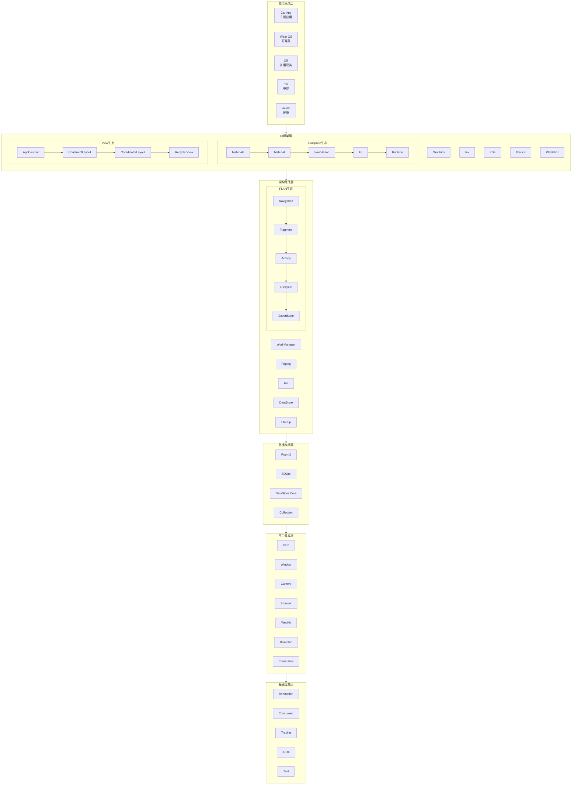

### 1.2 Compose 分层架构图

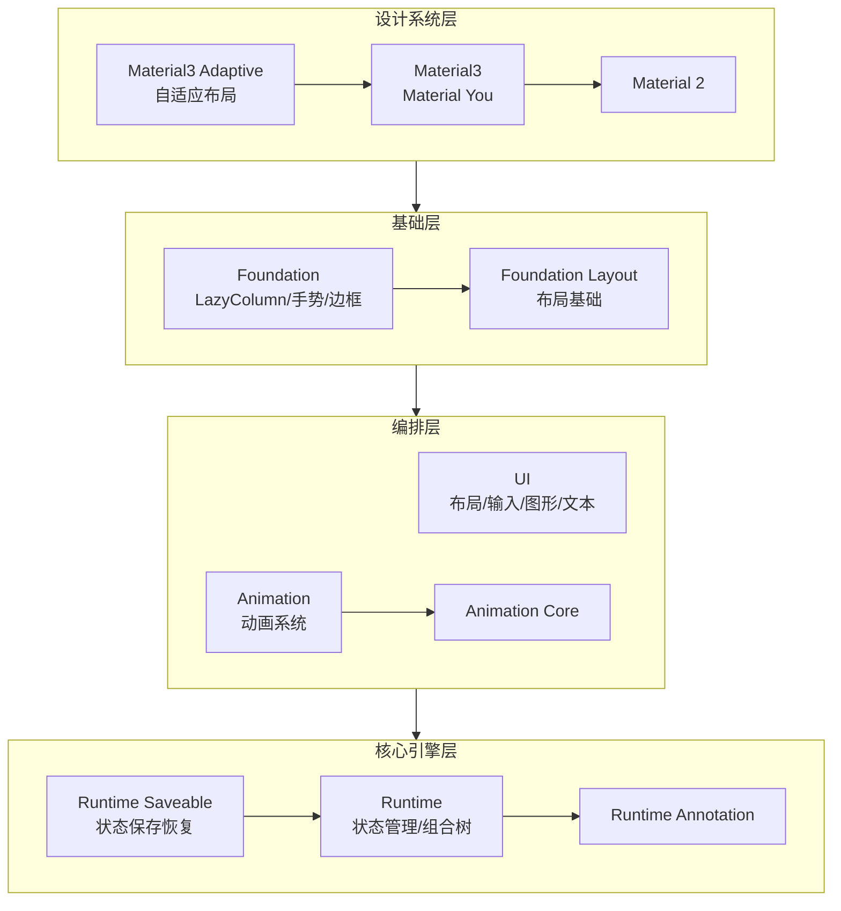

### 1.3 FLAN 架构图

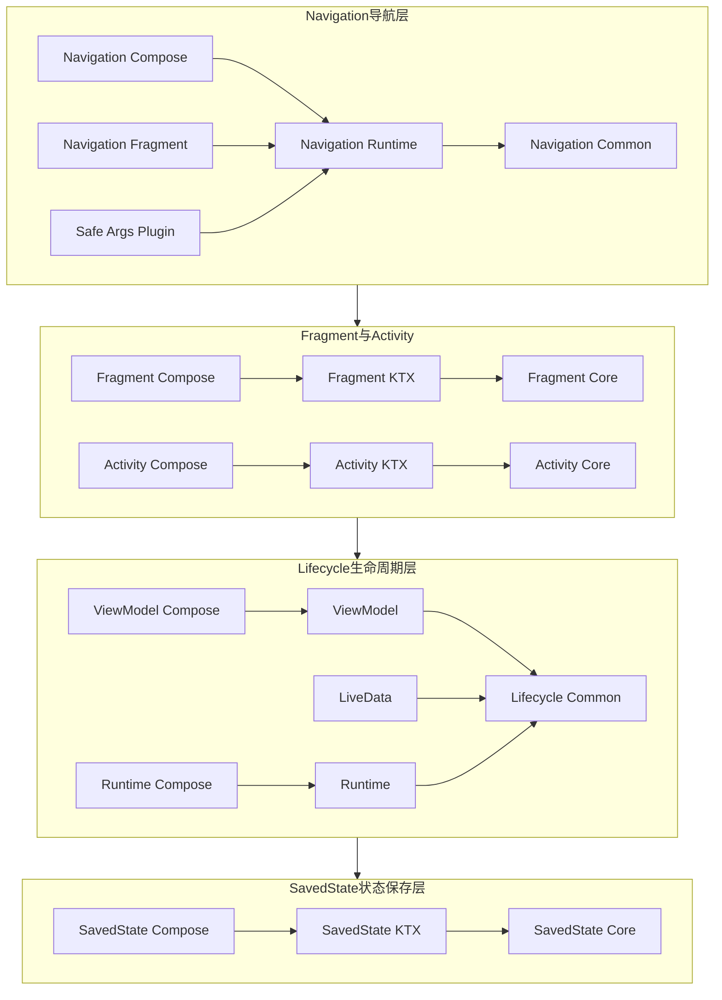

### 1.4 数据存储架构图

```mermaid
graph TB
    subgraph Room3 ORM层
        RoomPaging[Room Paging]
        RoomRuntime[Room Runtime]
        RoomTesting[Room Testing]
        RoomCommon[Room Common<br/>@Entity @Dao @Database]
        RoomCompiler[Room Compiler<br/>KSP代码生成]
        RoomXProc[Room Compiler Processing<br/>XProcessing]
        RoomMigration[Room Migration]
        RoomPaging --> RoomRuntime --> RoomCommon
        RoomCompiler --> RoomXProc
        RoomCompiler --> RoomCommon
    end

    subgraph SQLite驱动层
        Bundled[Bundled Driver<br/>内嵌SQLite]
        Framework[Framework Driver<br/>Android原生]
        WebDrv[Web Driver<br/>Web Worker]
        SQLiteIf[SQLite Driver 抽象<br/>KMP]
        Bundled --> SQLiteIf
        Framework --> SQLiteIf
        WebDrv --> SQLiteIf
    end

    subgraph DataStore KV存储
        PrefDS[Preferences DataStore]
        ProtoDS[Proto DataStore]
        Tink[Tink加密]
        DSCore[DataStore Core<br/>OkIO]
        PrefDS --> DSCore
        ProtoDS --> DSCore
        Tink --> DSCore
    end

    Room3 ORM层 --> SQLite驱动层
```

### 1.5 Camera 分层架构图

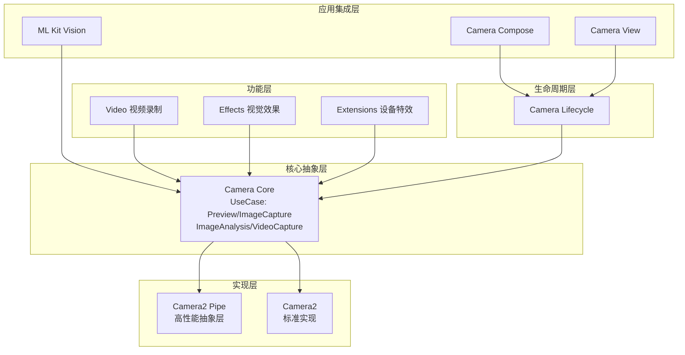

### 1.6 构建系统架构图

```mermaid
graph TB
    subgraph 顶层构建入口
        TopBuild[build.gradle<br/>AndroidXRootPlugin]
        Settings[settings.gradle<br/>450+子模块]
        GradleProps[gradle.properties<br/>JVM/SDK/缓存配置]
    end

    subgraph buildSrc构建基础设施
        subgraph 核心插件
            AXPlugin[AndroidXPlugin]
            AXRoot[AndroidXRootPlugin]
            AXImpl[AndroidXImplPlugin]
            AXKmp[AndroidXKmpPlugin]
            AXCompose[AndroidXComposePlugin]
        end
        subgraph 导入插件
            BCV[Binary Compatibility Validator]
            BenchPlugin[Benchmark Plugin]
            BPPlugin[Baseline Profile Plugin]
            RoomPlugin[Room Plugin]
            GlanceGen[Glance Layout Generator]
            StableAIDL[Stable AIDL Plugin]
        end
    end

    subgraph 版本管理
        LibVer[libraryversions.toml<br/>版本号+原子版本组]
        EnvOverride[环境变量覆盖<br/>AGP/Metalava/Lint]
    end

    subgraph 构建类型过滤
        BuildType[ANDROIDX_PROJECTS<br/>MAIN|COMPOSE|FLAN|WEAR|XR|...]
    end

    subgraph 依赖与缓存
        DepGraph[project-dependency-graph.groovy]
        GCPCache[GCP远程构建缓存]
        ConfigCache[Configuration Cache]
    end

    顶层构建入口 --> buildSrc构建基础设施
    buildSrc构建基础设施 --> 版本管理
    buildSrc构建基础设施 --> 构建类型过滤
    版本管理 --> 依赖与缓存
```

### 1.7 模块依赖关系图

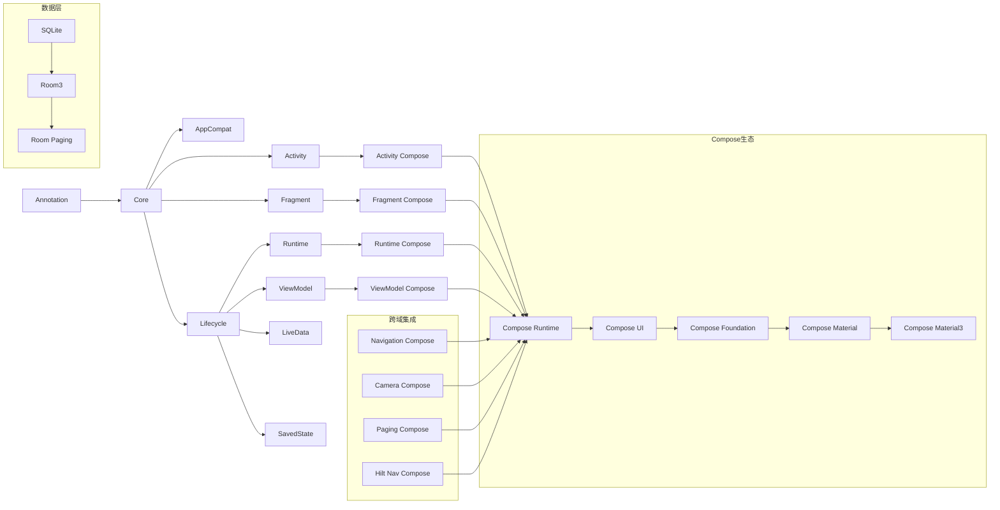

---

## 二、业务流程图

### 2.1 开发环境搭建流程

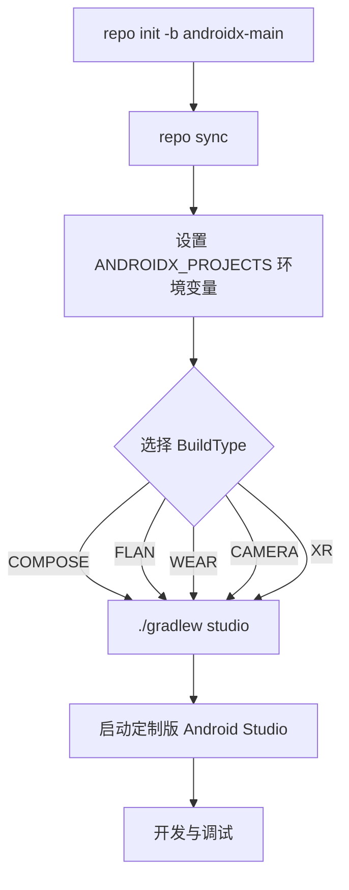

### 2.2 代码提交与审查流程

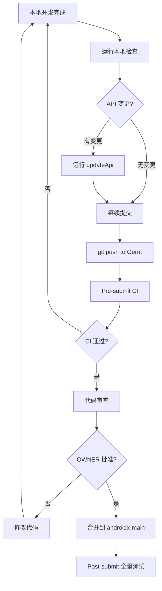

### 2.3 构建流程

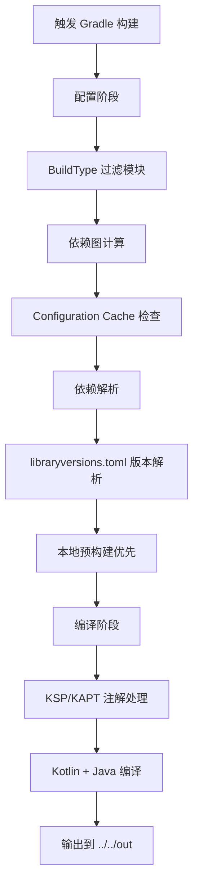

### 2.4 版本发布流程

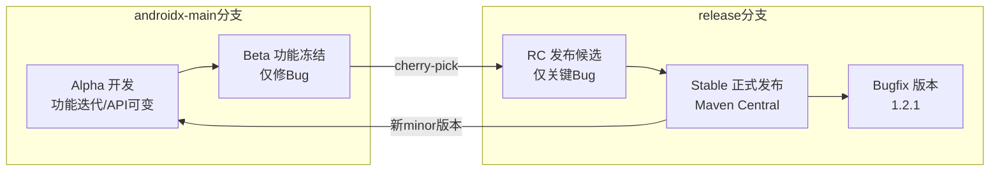

### 2.5 API 管理流程

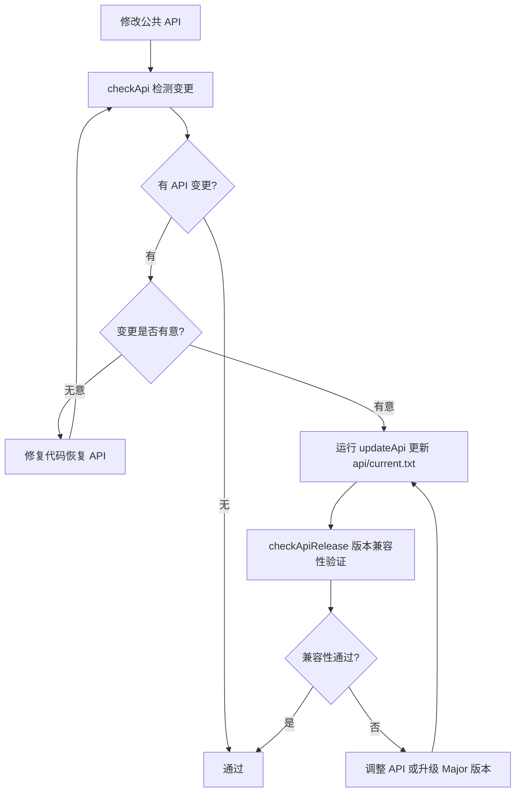

### 2.6 测试执行流程

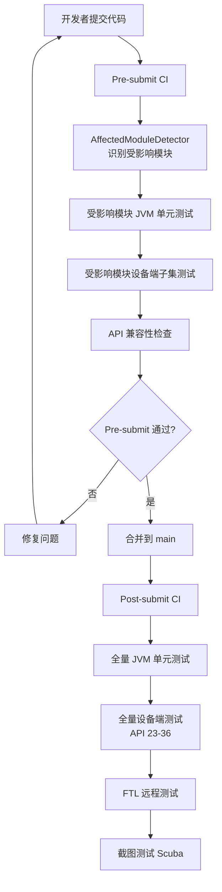

### 2.7 Compose 渲染流程

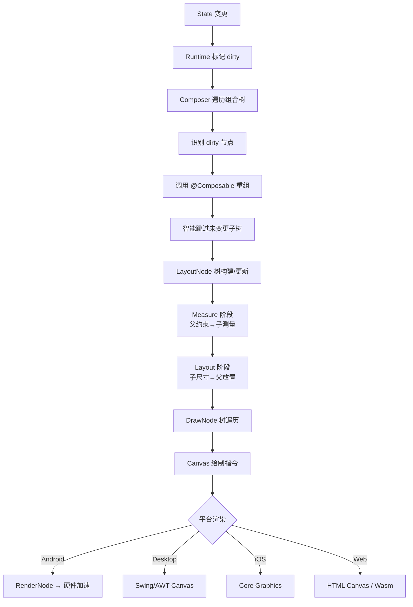

### 2.8 Lifecycle 生命周期流程

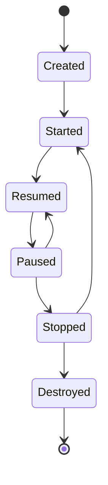

### 2.9 Navigation 导航流程

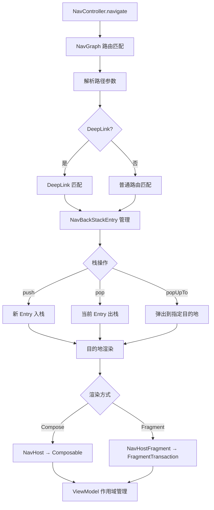

### 2.10 Room 数据访问流程

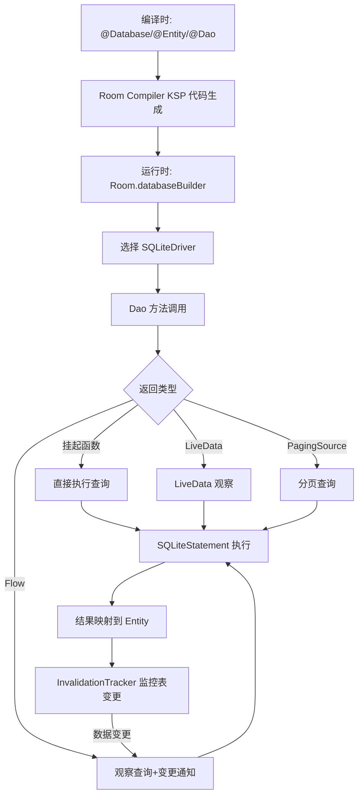

### 2.11 WorkManager 任务调度流程

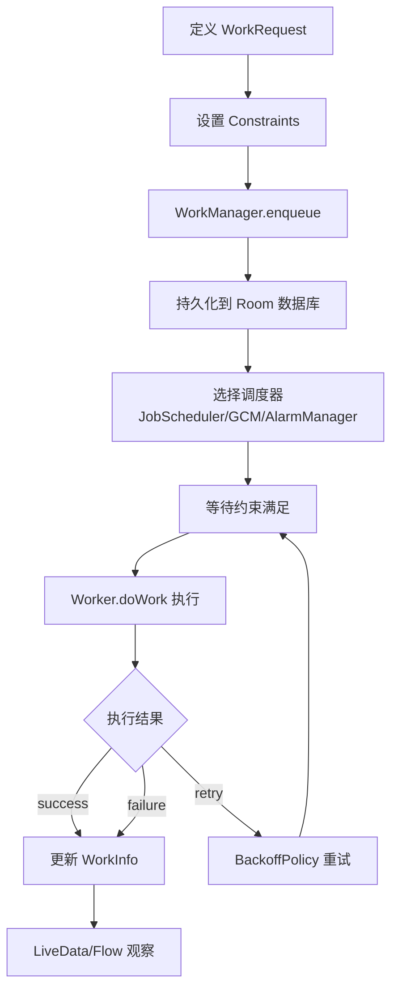

### 2.12 Paging 分页加载流程

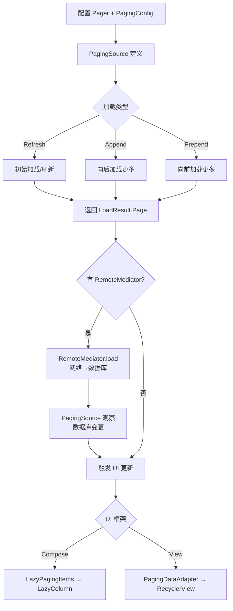

### 2.13 Camera 使用流程

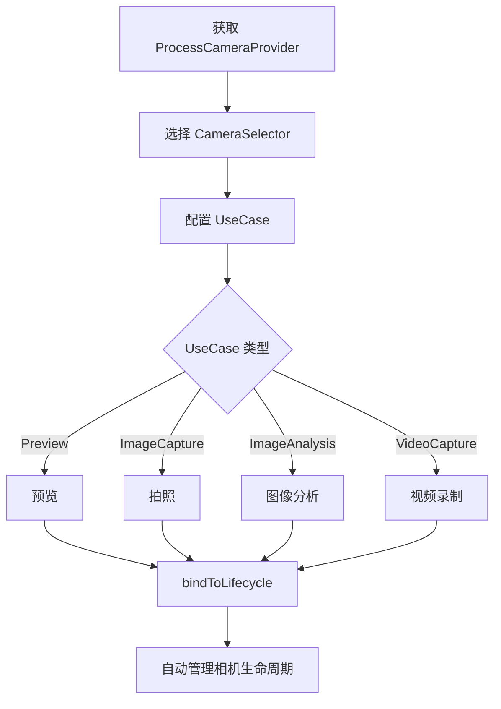

### 2.14 Hilt 依赖注入流程

```mermaid
flowchart TD
    A[编译时: 注解处理] --> B[@HiltAndroidApp 生成 Application 组件]
    A --> C[@AndroidEntryPoint 生成注入代码]
    A --> D[@HiltViewModel 生成 ViewModel 组件]
    A --> E[@HiltWorker 生成 Worker 组件]
    B --> F[Dagger 生成依赖图]
    C --> F
    D --> F
    E --> F
    F --> G[运行时: @Inject 注入]
    G --> H{作用域}
    H -->|@Singleton| I[Application 级别]
    H -->|@ActivityScoped| J[Activity 级别]
    H -->|@ViewModelScoped| K[ViewModel 级别]
    H -->|@WorkerScoped| L[Worker 级别]
```

### 2.15 DataStore 存储流程

```mermaid
flowchart TD
    A[创建 DataStore 实例] --> B{类型}
    B -->|Preferences| C[preferencesDataStore]
    B -->|Proto| D[dataStore + Serializer]
    C --> E[读取: dataStore.data Flow]
    D --> E
    E --> F[写入: dataStore.edit/updateData]
    F --> G[读取当前数据]
    G --> H[应用转换函数]
    H --> I[序列化到临时文件]
    I --> J[原子性重命名]
    J --> K[发射新数据到 Flow]
```

### 2.16 版本预发布周期流程

```mermaid
flowchart LR
    Alpha[Alpha<br/>功能开发中<br/>API可变] -->|功能冻结| Beta[Beta<br/>仅修Bug<br/>API冻结]
    Beta -->|cherry-pick| RC[RC<br/>发布候选<br/>仅关键Bug]
    RC --> Stable[Stable<br/>正式发布<br/>二进制兼容保证]
```

### 2.17 KMP 多平台发布流程

```mermaid
flowchart TD
    A[commonMain 共享逻辑] --> B[expect 声明平台差异]
    B --> C[平台 actual 实现]
    C --> D{平台}
    D -->|androidMain| E[Android 实现]
    D -->|jvmMain| F[JVM Desktop 实现]
    D -->|nativeMain| G[iOS/Native 实现]
    D -->|wasmJsMain| H[Web Wasm 实现]
    E --> I[API 兼容性验证]
    F --> I
    G --> I
    H --> I
    I --> J[api/current.txt JVM API]
    I --> K[bcv/ KMP ABI]
    I --> L[Native ABI .klib]
    J --> M[Maven 多平台发布]
    K --> M
    L --> M
```

---

## 三、综合架构关系图

### 3.1 现代 Compose 应用完整架构

```mermaid
graph TB
    subgraph UI层
        Comp[@Composable 函数]
        M3Comp[Material3 组件]
        NavComp[Navigation Compose]
        PagComp[Paging Compose]
        ActComp[Activity Compose]
    end

    subgraph ViewModel层
        HiltVM[@HiltViewModel]
        StateFlow[StateFlow UiState]
        SSH[SavedStateHandle]
        LCComp[lifecycleScope]
    end

    subgraph Repository层
        Repo[@Inject Repository]
        RoomDAO[Room3 DAO]
        Net[网络请求]
        DSPref[DataStore Preferences]
        RemoteMed[RemoteMediator]
    end

    subgraph 数据层
        RoomDB[Room3 SQLite]
        DSFile[DataStore OkIO]
        WMgr[WorkManager]
    end

    subgraph 横切关注点
        HiltDI[Hilt 依赖注入]
        Nav[Navigation 导航]
        LCycle[Lifecycle 生命周期]
        Startup[Startup 初始化]
        Bench[Benchmark + Baseline Profile]
        Tracing[Tracing 追踪]
    end

    Comp --> M3Comp
    Comp --> NavComp
    Comp --> PagComp
    Comp --> ActComp
    Comp --> HiltVM
    HiltVM --> StateFlow
    HiltVM --> SSH
    HiltVM --> LCComp
    HiltVM --> Repo
    Repo --> RoomDAO
    Repo --> Net
    Repo --> DSPref
    Repo --> RemoteMed
    RoomDAO --> RoomDB
    DSPref --> DSFile
    RemoteMed --> RoomDB
    RemoteMed --> Net
```

### 3.2 测试金字塔

```mermaid
graph TB
    FTL[FTL 远程集成测试<br/>多 API 级别覆盖] --> Device[设备端测试<br/>connectedAndroidTest]
    Device --> Screenshot[截图测试<br/>Scuba 渲染验证]
    Screenshot --> JVM[JVM 单元测试<br/>Robolectric]
    JVM --> Bench2[基准测试<br/>Micro/Macrobenchmark]
```
