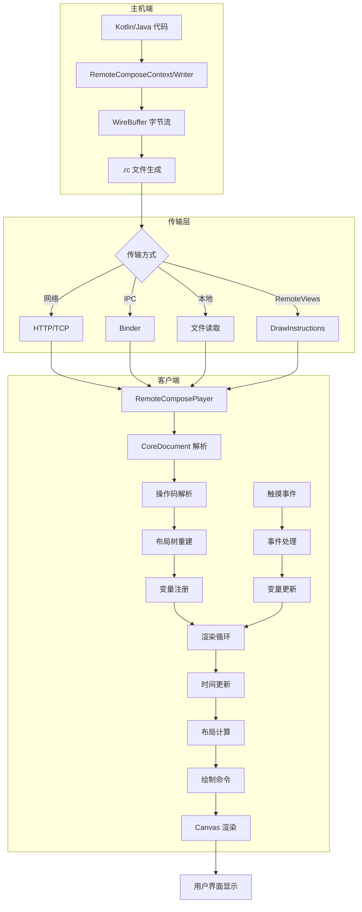

# Remote Compose 字节流完整流程：生成、传输与解析

本文档详细描述 Remote Compose (RC) 字节流从生成、.rc 文件创建、网络传输到桌面端解析的完整流程。

---

## 📋 目录

1. [整体架构概览](#1-整体架构概览)
2. [阶段一：字节流生成](#2-阶段一字节流生成)
3. [阶段二：.rc 文件生成与存储](#3-阶段二 rc 文件生成与存储)
4. [阶段三：字节流传输](#4-阶段三字节流传输)
5. [阶段四：桌面端解析](#5-阶段四桌面端解析)
6. [阶段五：渲染与交互](#6-阶段五渲染与交互)
7. [完整流程图](#7-完整流程图)
8. [关键代码示例](#8-关键代码示例)
9. [性能优化](#9-性能优化)
10. [总结](#10-总结)

---

## 1️⃣ 整体架构概览

### 系统组件

```
┌─────────────────────────────────────────────────────────────┐
│                    主机端 (Host)                            │
│  ┌──────────────┐  ┌──────────────┐  ┌──────────────┐      │
│  │ Kotlin DSL   │  │ Java Writer  │  │ WireBuffer   │      │
│  │ RemoteCompose│  │ RemoteCompose│  │ 字节流生成   │      │
│  │   Context    │→ │   Writer     │→ │              │      │
│  └──────────────┘  └──────────────┘  └──────────────┘      │
│                                              ↓               │
│                                      .rc 文件生成            │
└─────────────────────────────────────────────────────────────┘
                        ↓
                  网络/IPC 传输
                        ↓
┌─────────────────────────────────────────────────────────────┐
│                   客户端 (Player)                           │
│  ┌──────────────┐  ┌──────────────┐  ┌──────────────┐      │
│  │ .rc 文件     │  │ CoreDocument │  │ RemoteCompose│      │
│  │ 字节流接收   │→ │ 解析解码     │→ │   Player     │      │
│  └──────────────┘  └──────────────┘  └──────────────┘      │
│                                              ↓               │
│                                        渲染到 Surface        │
└─────────────────────────────────────────────────────────────┘
```

### 数据流概览

```
Kotlin/Java 代码
    ↓ 编译时
RemoteComposeContext / RemoteComposeWriter
    ↓ 运行时
WireBuffer (字节流)
    ↓ 序列化
.rc 文件 / byte[]
    ↓ 传输
网络/IPC/Binder
    ↓ 接收
CoreDocument 解析
    ↓ 解码
Operation 列表 + 布局树
    ↓ 渲染
Canvas / Surface
    ↓ 显示
用户界面
```

---

## 2️⃣ 阶段一：字节流生成

### 2.1 使用 Kotlin DSL 定义 UI

**文件位置**: [RemoteComposeContext.kt](file:///home/meizu/Documents/my_android_projects/androidx/compose/remote/remote-creation-core/src/main/java/androidx/compose/remote/creation/RemoteComposeContext.kt)

### 2.2 RemoteComposeWriter 编码

**文件位置**: [RemoteComposeWriter.java](file:///home/meizu/Documents/my_android_projects/androidx/compose/remote/remote-creation-core/src/main/java/androidx/compose/remote/creation/RemoteComposeWriter.java)

### 2.3 WireBuffer 写入操作

**文件位置**: [WireBuffer.java](file:///home/meizu/Documents/my_android_projects/androidx/compose/remote/remote-core/src/main/java/androidx/compose/remote/core/WireBuffer.java)

### 2.4 字节流结构示例

对于 `text("Watchlist", fontSize = 24.0f)`:

```
偏移量   字段名              类型    大小    值
------  -----------------  ------  ------  ------------------
0x00    操作码             byte    1       0x0A (TextLayout)
0x01    componentId        int     4       0x00000001
0x05    animationId        int     4       0xFFFFFFFF (-1)
0x09    textId             int     4       0x00000002
0x0D    color              int     4       0xFF000000
0x11    fontSize           float   4       0x41C00000 (24.0)
```

**总大小**: 42 字节

---

## 3️⃣ 阶段二：.rc 文件生成与存储

### 3.1 从 WireBuffer 提取字节数组

```java
WireBuffer buffer = remoteComposeBuffer.getBuffer();
int bufferSize = buffer.size();
byte[] bytes = new byte[bufferSize];
ByteArrayInputStream b = new ByteArrayInputStream(buffer.getBuffer(), 0, bufferSize);
b.read(bytes);
```

### 3.2 保存为 .rc 文件

```java
File rcFile = new File(context.getFilesDir(), "widget.rc");
FileOutputStream fos = new FileOutputStream(rcFile);
fos.write(bytes);
fos.close();
```

### 3.3 .rc 文件格式

```
.rc 文件结构
├── Header (文档元数据)
│   ├── 版本号 (MAJOR.MINOR)
│   ├── 文档宽度
│   ├── 文档高度
│   └── 屏幕密度
├── Data Section (数据段)
│   ├── TEXT_DATA: 文本字符串
│   ├── BITMAP_DATA: 图片数据
│   └── PATH_DATA: 路径数据
├── Layout Section (布局段)
│   ├── COMPONENT_START: 组件开始
│   ├── LAYOUT_MODIFIER: 修饰符
│   └── CONTAINER_END: 组件结束
└── Draw Section (绘制段)
    ├── DRAW_RECT: 矩形
    ├── DRAW_TEXT: 文本
    └── DRAW_PATH: 路径
```

---

## 4️⃣ 阶段三：字节流传输

### 4.1 传输方式

#### 方式一：网络传输 (HTTP/TCP)
```kotlin
suspend fun sendRemoteComposeData(bytes: ByteArray) {
    val request = Request.Builder()
        .url("https://example.com/api/widget")
        .post(RequestBody.create(bytes.toRequestBody()))
        .build()
    client.newCall(request).execute()
}
```

#### 方式二：Binder IPC (Android)
```java
interface IWidgetService {
    void updateWidget(in Parcel data);
}
```

#### 方式三：本地文件读取
```java
FileInputStream fis = new FileInputStream(rcFile);
byte[] bytes = fis.readAllBytes();
```

#### 方式四：RemoteViews.DrawInstructions (API 35+)
```java
RemoteViews.DrawInstructions.Builder builder =
    new RemoteViews.DrawInstructions.Builder(List.of(bytes));
RemoteViews views = new RemoteViews(builder.build());
```

---

## 5️⃣ 阶段四：桌面端解析

### 5.1 RemoteComposePlayer 接收数据

**文件位置**: [RemoteComposePlayer.java](file:///home/meizu/Documents/my_android_projects/androidx/compose/remote/remote-player-view/src/main/java/androidx/compose/remote/player/view/RemoteComposePlayer.java)

### 5.2 CoreDocument 解析流程

**文件位置**: [CoreDocument.java](file:///home/meizu/Documents/my_android_projects/androidx/compose/remote/remote-core/src/main/java/androidx/compose/remote/core/CoreDocument.java)

### 5.3 操作码解析

**文件位置**: [Operations.java](file:///home/meizu/Documents/my_android_projects/androidx/compose/remote/remote-core/src/main/java/androidx/compose/remote/core/Operations.java)

### 5.4 布局树重建

```java
Stack<Component> stack = new Stack<>();
for (Operation op : mOperations) {
    if (op instanceof ComponentStart) {
        Component component = ((ComponentStart) op).createComponent();
        if (stack.isEmpty()) {
            mRootComponent = component;
        } else {
            stack.peek().addChild(component);
        }
        stack.push(component);
    } else if (op instanceof ContainerEnd) {
        stack.pop();
    }
}
```

---

## 6️⃣ 阶段五：渲染与交互

### 6.1 渲染循环

```java
Choreographer.FrameCallback frameCallback = new Choreographer.FrameCallback() {
    @Override
    public void doFrame(long frameTimeNanos) {
        updateState(frameTimeNanos);
        invalidate();
        mChoreographer.postFrameCallback(this);
    }
};
```

### 6.2 布局计算

```java
LayoutCompute.measure(component, constraints);
LayoutCompute.layout(component, left, top, right, bottom);
```

### 6.3 触摸事件处理

```java
@Override
public boolean onTouchEvent(MotionEvent event) {
    float x = event.getX();
    float y = event.getY();
    Component touchedComponent = findComponentAt(x, y);
    if (touchedComponent != null) {
        mContext.setVariable(TOUCH_X, x);
        mContext.setVariable(TOUCH_Y, y);
    }
    return true;
}
```

---

## 7️⃣ 完整流程图

### 7.1 端到端流程图



### 7.2 数据流详细图

```
阶段 1: 生成 (Generate)
├─ Kotlin DSL: text("Watchlist", fontSize = 24f)
├─ RemoteComposeWriter: mBuffer.start(Operations.TEXT_LAYOUT)
└─ WireBuffer: [0x0A][componentId][textId][fontSize]...

阶段 2: 存储 (Store)
├─ byte[] bytes = buffer.cloneBytes()
├─ FileOutputStream.write(bytes)
└─ widget.rc 文件

阶段 3: 传输 (Transport)
├─ 网络：HTTP POST /api/widget [bytes]
├─ IPC: IWidgetService.updateWidget(Parcel)
└─ 本地：FileInputStream.readAllBytes()

阶段 4: 解析 (Parse)
├─ CoreDocument(buffer)
├─ Operations.parseOperations()
├─ 布局树重建
└─ 变量注册

阶段 5: 渲染 (Render)
├─ 渲染循环 (VSync 驱动)
├─ 时间更新：RemoteContext.updateTime(deltaTime)
├─ 布局计算：LayoutCompute.measure()
├─ 绘制命令：op.paint(canvas, context)
└─ Canvas 渲染

阶段 6: 交互 (Interact)
├─ 触摸事件：onTouchEvent(MotionEvent)
├─ 组件查找：findComponentAt(x, y)
├─ 变量更新：context.setVariable(TOUCH_X, x)
├─ 触发动作：triggerAction(clickAction)
└─ 刷新渲染：invalidate()
```

---

## 8️⃣ 关键代码示例

### 8.1 完整生成流程

```kotlin
val context = RemoteComposeContextAndroid(
    profile = RcPlatformProfiles.ANDROIDX
) {
    column {
        text("Hello World", fontSize = 24f, colorId = 0xFFFF0000)
    }
}
val buffer = context.writer.buffer
val bytes = buffer.buffer.cloneBytes()
val rcFile = File(context.filesDir, "hello.rc")
FileOutputStream(rcFile).use { it.write(bytes) }
```

### 8.2 完整解析流程

```java
RemoteComposePlayer player = new RemoteComposePlayer(context);
File rcFile = new File(context.getFilesDir(), "hello.rc");
player.loadFromFile(rcFile);
frameLayout.addView(player);
player.start();
```

---

## 9️⃣ 性能优化

### 9.1 生成端优化
- 复用文本 ID
- 批量操作
- 使用宏 (Macro)

### 9.2 传输优化
- GZIP 压缩 (压缩率 60-80%)
- 增量更新
- 分块传输

### 9.3 解析端优化
- 懒加载
- 缓存布局结果
- 减少表达式求值

### 9.4 渲染优化
- 脏矩形更新
- 图层缓存
- VSync 同步

---

## 🔟 总结

### 完整流程回顾

1. **生成阶段**: Kotlin/Java 代码 → RemoteComposeContext/Writer → WireBuffer 字节流
2. **存储阶段**: WireBuffer → byte[] → .rc 文件
3. **传输阶段**: 网络/Binder/文件/RemoteViews 等多种传输方式
4. **解析阶段**: CoreDocument → 操作码解析 → 布局树重建 → 变量注册
5. **渲染阶段**: 渲染循环 → 时间更新 → 布局计算 → Canvas 绘制
6. **交互阶段**: 触摸事件 → 变量更新 → 触发动作 → 刷新渲染

### 关键技术点

- **Wire Format**: 紧凑的二进制编码，大端序，操作码 + 数据结构
- **动态表达式**: RPN 逆波兰表示法，支持动画和交互
- **布局系统**: 类似 Compose 的布局树，支持测量和布局
- **渲染引擎**: VSync 驱动的渲染循环，脏矩形优化
- **交互系统**: 触摸事件映射，变量更新，HostAction 触发

### 性能指标

- **生成速度**: ~1-5ms (简单 UI)
- **传输大小**: ~1-10KB (压缩后)
- **解析时间**: ~5-20ms
- **渲染帧率**: 60 FPS (VSync 同步)
- **内存占用**: ~1-5MB (取决于 UI 复杂度)

---

**文档生成时间**: 2026-05-22  
**基于代码版本**: AndroidX Remote Compose (API 35+)  
**参考文档**: 
- [PROTOCOL_SPEC_zh.md](file:///home/meizu/Documents/my_android_projects/androidx/compose/remote/remote-core/doc/PROTOCOL_SPEC_zh.md)
- [DATA_FLOW_zh.md](file:///home/meizu/Documents/my_android_projects/androidx/compose/remote/remote-core/doc/DATA_FLOW_zh.md)
